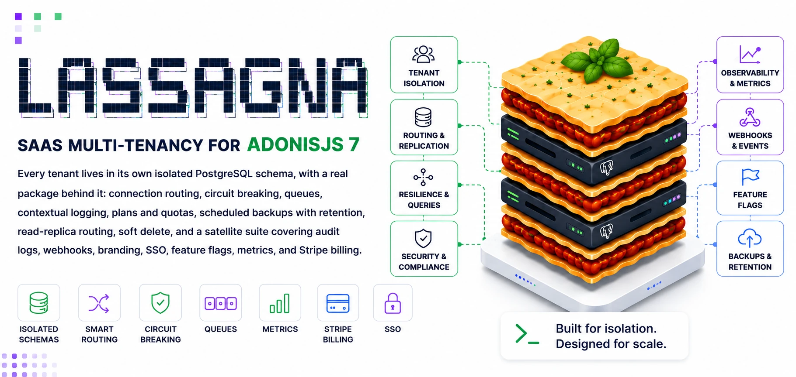

# @adonisjs-lasagna/saas-tenancy

<p align="center">
  
</p>

[](https://www.npmjs.com/package/@adonisjs-lasagna/saas-tenancy)
[](https://arcoders.github.io/Adonisjs-lasagna-saas-tenancy/reference/stability)
[](https://nodejs.org)
[](https://adonisjs.com)
[](https://www.postgresql.org)
[](https://redis.io)
[](./.github/workflows/ci.yml)
[](https://arcoders.github.io/Adonisjs-lasagna-saas-tenancy/)
[](./LICENSE)

📖 **[Full documentation →](https://arcoders.github.io/Adonisjs-lasagna-saas-tenancy/)** · [Quickstart](https://arcoders.github.io/Adonisjs-lasagna-saas-tenancy/start/quickstart) · [Why Lasagna](https://arcoders.github.io/Adonisjs-lasagna-saas-tenancy/start/why) · [Comparison vs stancl](https://arcoders.github.io/Adonisjs-lasagna-saas-tenancy/reference/comparison) · [Release notes](https://arcoders.github.io/Adonisjs-lasagna-saas-tenancy/reference/release-notes)

> **Stability: release candidate.** The isolation core is feature complete and green in CI against real Postgres and Redis, but the `stable` label and the `1.0.0` version are both withheld until an independent security review and production mileage close. It ships `0.3.0`, so semver promises nothing across a minor. The satellite **packages** (SSO, billing, backup, reporting, AI) ship `0.1.0` and are **experimental**, as are the opt-in in-core features (quotas, webhooks, metrics, audit logs, branding, feature flags, impersonation). Full breakdown in the [stability matrix](https://arcoders.github.io/Adonisjs-lasagna-saas-tenancy/reference/stability).

I built this because the AdonisJS ecosystem deserved a proper multi
tenancy foundation, and because every SaaS I touched eventually outgrew
the `tenant_id` column. If you've ever exported one customer's data
with a giant `WHERE tenant_id = ?` JOIN across forty tables and prayed
nothing leaked, you already know the problem this solves.

If you'd rather see it run than read about it, jump to
[examples/api/](examples/api/). It's a real AdonisJS 7 app that
exercises every feature, and one `npm run test:e2e` brings up the stack
and runs the full e2e suite against it.

🔒 Tested against the isolation failures that bite in production: cross-tenant access under concurrency, quota atomicity, SSO replay, audit immutability, header-vs-domain hijack. [See what we verified →](https://arcoders.github.io/Adonisjs-lasagna-saas-tenancy/start/why#hardened-against-the-failures-that-bite-you-in-production)

## Highlights

| Feature | What it gives you |
|---|---|
| **Schema isolation** | Each tenant gets its own `tenant_<uuid>` PostgreSQL schema, provisioned and routed automatically. |
| **Circuit breaker** | Opossum wraps every tenant DB call; OPEN state is restored from Redis on restart so a known-down tenant DB fails fast across deploys. One bad schema can't take down the others. |
| **Dependency resilience** | Per-dependency fail-open/fail-closed degradation policy via `ResilienceService`. Emits `DependencyDegraded` for alerting and returns a typed 503 (`DependencyUnavailableException`) when fail-closed. |
| **Lifecycle hooks + 30 typed events** | Declarative `before` / `after` hooks wired into commands and jobs. 20 core (tenant / quota / maintenance / resilience / metrics / data-change / guard-audit lifecycle) + 10 billing. |
| **Contextual logging** | `tenantId` rides along through HTTP and queue jobs via `AsyncLocalStorage`. |
| **`tenant:doctor`** | Thirteen built-in checks (plus `backup_recency` and `backup_encryption` when the backup satellite is installed), `--fix` for auto-recovery (heals unmigrated/behind/failed tenants), `--json` for CI, `--watch` for a live TUI. |
| **Plans and quotas** | Declarative plans, rolling counters, snapshot usage, an `enforceQuota()` middleware that returns 429 and emits `TenantQuotaExceeded`. |
| **Scheduled backups + retention** | Tier-based intervals and `keepLast`, S3 mirror with purge awareness, idempotent cron command. |
| **Health probes + Prometheus** | `/livez`, `/readyz`, `/healthz`, `/metrics`. No `prom-client` peer dep. |
| **Read replica routing** | Round-robin, random, or sticky-by-tenant-id with stable connection naming. |
| **REST admin API** | 39 endpoints + OpenAPI 3.1 spec + Swagger UI. You bring the auth middleware. |
| **Soft delete TTL** | Recycle bin pattern. `--keep-schema` on destroy, `tenant:purge-expired` on a cron. |
| **Ten satellites** | Audit logs (append-only at the SQL level), webhooks (HMAC-signed + retries + verifier helper), quotas, feature flags, branding, SSO/OIDC, real-time WebSockets (socket.io, tenant-isolated), metrics, impersonation, and multi-provider billing (Stripe / Paddle / Lemon Squeezy: idempotent webhook + dunning + metered + checkout/portal + lifecycle). All optional. |

Two questions to ask before adopting:

1. **Do you actually need true tenant isolation, or is a `tenant_id`
   column enough?** If you want both at-rest separation and per-tenant
   migrations, this is for you. If you don't, save yourself the
   operational complexity.
2. **Are you on PostgreSQL?** Schemas are a Postgres-native concept.
   Lasagna is PostgreSQL-only by design, not a temporary limit. If you
   need MySQL today, use another package such as `stancl/tenancy`.

## Install

```bash
npm install @adonisjs-lasagna/saas-tenancy
node ace configure @adonisjs-lasagna/saas-tenancy
```

The configure command registers the provider, publishes
`config/multitenancy.ts`, scaffolds `app/models/backoffice/tenant.ts`,
and (selectively) publishes satellite migration stubs.

```bash
# Selective satellites
node ace configure @adonisjs-lasagna/saas-tenancy --with=audit,webhooks

# CI (no prompt)
node ace configure @adonisjs-lasagna/saas-tenancy --no-interaction --with=audit,branding
```

The full [5-minute quickstart](https://arcoders.github.io/Adonisjs-lasagna-saas-tenancy/start/quickstart)
covers DB connections, the tenant repository binding, middleware
registration, and creating your first tenant.

## Documentation

The complete documentation lives at
**[arcoders.github.io/Adonisjs-lasagna-saas-tenancy](https://arcoders.github.io/Adonisjs-lasagna-saas-tenancy/)**.
Direct links:

- 🚀 [Quickstart](https://arcoders.github.io/Adonisjs-lasagna-saas-tenancy/start/quickstart)
- 🚢 [Deployment guide](https://arcoders.github.io/Adonisjs-lasagna-saas-tenancy/guides/deployment) (Dockerfile, docker-compose, Helm chart)
- 🛡️ [Security guide](https://arcoders.github.io/Adonisjs-lasagna-saas-tenancy/guides/security) (what the package guarantees vs what the host owns)
- ⚖️  [Comparison vs `stancl/tenancy`](https://arcoders.github.io/Adonisjs-lasagna-saas-tenancy/reference/comparison)

## Reference app

[`examples/api/`](examples/api/) is a real AdonisJS 7 app that wires
every feature end-to-end:

```bash
cd examples/api
npm install --legacy-peer-deps
docker compose up -d
npm run test:e2e
```

The e2e suite covers provisioning, schema isolation,
contextual logging across HTTP + queue, the doctor command, backups +
restore + clone, quotas → 429, lifecycle events, the admin REST API,
mail context propagation, replica routing, and the webhook delivery
state machine.

## Stack

- **Node.js 24+**, ESM-native (`module: NodeNext`)
- **AdonisJS 7** with `@adonisjs/lucid`, `@adonisjs/queue`, `@adonisjs/redis`
- **PostgreSQL 14+** (PostgreSQL-only by design)
- Optional peers: `@adonisjs/drive`, `@adonisjs/mail`, `@adonisjs/session`,
  `@aws-sdk/client-s3`, `jose` (only when SSO is used), `better-sqlite3`
  (in-memory testing driver)

## Contributing

```bash
npm install --legacy-peer-deps
npm run typecheck
npm test
docker compose -f examples/api/docker-compose.yml up -d
npm run test:integration
npm run docs:dev      # live preview of the docs site
```

PRs welcome. Please add tests for any behavior change and run the
typecheck + unit suite before pushing. CI gates: typecheck, unit
tests, integration tests against real Postgres + Redis, e2e demo app
suite, knip (informational), and `npm audit --audit-level=high`.

## License

MIT — see [LICENSE](./LICENSE).
