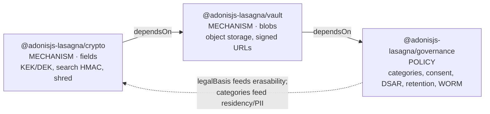
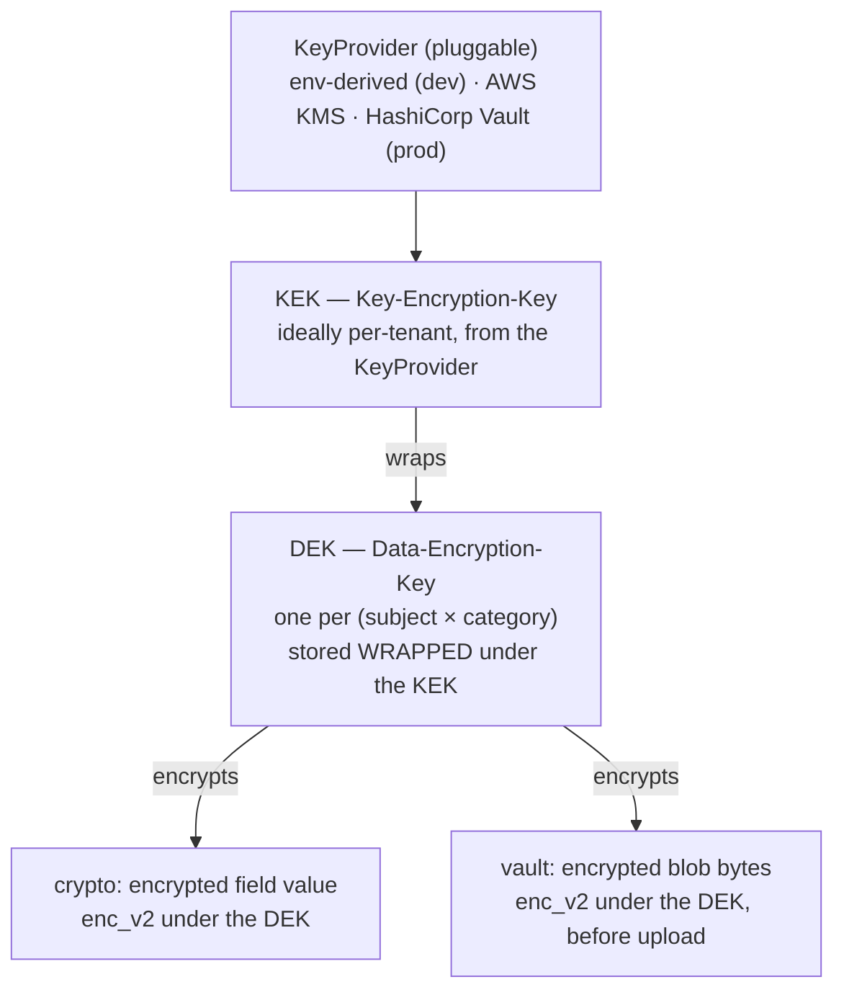
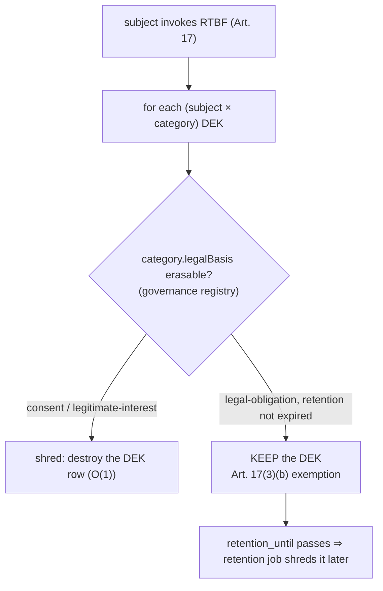

# The Data-Protection Satellites: Shared Foundation

This is the constitution for the last three officially-supported Lasagna satellites:
`@adonisjs-lasagna/crypto`, `@adonisjs-lasagna/vault`, and `@adonisjs-lasagna/governance`. Their
three `ARCHITECTURE.md` documents are drafted against this file. Where a satellite doc and this
foundation disagree, this foundation is right and the satellite doc is the bug, exactly as
`packages/ai/ARCHITECTURE.md` governs itself against its own code.

The three docs share one key hierarchy, one WORM ledger, one honesty bound, and one set of naming
conventions. They must reference those identically. This document specifies them once so the drafting
agents do not each invent a slightly different KEK/DEK story, a second crypto stack, or a second audit
chain.

It is written to be read, not just searched, in the same register as the AI architecture doc: the
problem, the tempting wrong answer, why that answer leaks or fails, then the design chosen. No
marketing. No em-dash separators.

## The framing principle (must appear in every doc)

Compliance is a property of the OPERATOR (the data controller), never of a library. Lasagna ships
MECHANISMS. No satellite doc claims "GDPR compliant", "SOC2 compliant", or "Ley 09-08 compliant". Each
claims it "provides the pieces to build compliance", and each closes with an explicit honesty bound
that states what the mechanism does NOT guarantee. This is not a disclaimer bolted on at the end. It
drives what these satellites are: crypto and vault are mechanisms with no policy, governance carries
the policy the operator declares, and none of them decides on the operator's behalf whether a given
processing activity is lawful.

The concrete SaaS this was built for stores real, sanction-bearing PII: a Moroccan car-rental
platform holding passport numbers and national-ID numbers as fields, and passport scans, car
registrations, insurance documents, SIGNED RENTAL CONTRACTS, and damage photos as blobs. Ley 09-08 /
CNDP carries sanctions around 3M MAD plus prison. The legal frame below drives the requirements; the
library still never "complies".

## 1. Overview: the mechanism <-> policy split and the dependency DAG

The three satellites are cut along one line: MECHANISM (how bytes are protected) versus POLICY (what
the operator declared must happen to those bytes). Mechanisms are boring, testable, and free of
judgment calls. Policy is where the operator's declarations live.

| Satellite | Kind | Protects | One-line job |
|---|---|---|---|
| `@adonisjs-lasagna/crypto` | MECHANISM | fields | field encryption, deterministic search HMAC, crypto-shredding, the key hierarchy |
| `@adonisjs-lasagna/vault` | MECHANISM | blobs | per-tenant object storage, at-rest encryption (reuses crypto), signed+expiring URLs, audited access |
| `@adonisjs-lasagna/governance` | POLICY | declarations | category registry, consent ledger, DSAR/ARCO orchestration, retention jobs, WORM ledger |

The dependency DAG is `crypto -> vault -> governance`, declared through each package's manifest
`dependsOn` (`packages/core/src/sdk/manifest.ts`), which already cycle-checks and dependency-orders so
crypto's provider boots before vault's, and vault's before governance's.



The arrows are the boot-order dependency (crypto first). The dotted back-edge is a runtime data flow,
not a package dependency: governance reads no crypto internals, it declares categories and legal bases
that crypto and vault CONSULT at erase time. The package dependency stays one-way (`crypto` never
imports `governance`), so the DAG has no cycle.

Why this split matters: it keeps the two mechanism satellites free of any compliance opinion. crypto
encrypts a field and can destroy its key. It does not know or care whether destroying that key is
lawful. governance owns that judgment (via `legalBasis`) and gates the destroy. A mechanism that
baked in a retention policy would be wrong for the next operator; a policy layer that re-implemented
AES would be a second crypto stack. The line is drawn precisely to avoid both.

## 2. The shared key hierarchy (KEK / DEK / KeyProvider)

This is the keystone. It applies to crypto and is consumed unchanged by vault (blob encryption) and by
governance (erasability gating). All three docs reference the names, the table shape, and the shred
operation defined here, identically. crypto OWNS this hierarchy; vault and governance USE it.

### 2.1 The three tiers



- **KeyProvider** is a pluggable abstraction that yields a KEK. It is env-derived for dev (a KEK
  derived deterministically, in the spirit of `packages/core/src/utils/crypto.ts`'s HKDF-from-APP_KEY),
  and backed by AWS KMS or HashiCorp Vault for prod. Ideally the KEK is per-tenant, so a tenant's key
  material is compromised or destroyed independently of every other tenant.
- **KEK (Key-Encryption-Key)** never encrypts data directly. It only WRAPS (encrypts) DEKs. It lives
  in the KeyProvider (a KMS/HSM in prod), so raw KEK bytes need never touch the application process
  under SSE-KMS-style providers.
- **DEK (Data-Encryption-Key)** is the key data is actually encrypted under. There is exactly one DEK
  per `(subject × category)` pair. It is stored WRAPPED (KEK-encrypted) in a per-tenant table. The
  wrapped DEK is the ONLY copy; there is no plaintext-DEK-at-rest.

The per-`(subject × category)` granularity is not incidental. It is the exact granularity crypto-shred
needs (§2.4) so a consent-basis category can be shredded for one subject while a legal-obligation
category for the same subject survives (§3). Coarser DEKs (per-tenant, or per-subject-only) cannot
express that, and would force the "erase everything or nothing" choice the law forbids.

### 2.2 The named types (all three docs use these names)

crypto's `ARCHITECTURE.md` §6 specifies these precisely; vault and governance reference them by name.

```ts
/** A stable subject (data-subject) identifier within a tenant, e.g. a renter's id. */
type SubjectId = string

/** A governance-declared processing category, e.g. 'identity-docs' | 'rental-contract' | 'marketing'. */
type CategoryKey = string

/** The pluggable root-of-trust: yields a KEK, wraps/unwraps DEKs. Never sees plaintext data. */
interface KeyProvider {
  readonly name: string                       // 'env' | 'aws-kms' | 'hashicorp-vault' | custom
  wrapDek(tenantId: string, dek: Buffer): Promise<WrappedDek>
  unwrapDek(tenantId: string, wrapped: WrappedDek): Promise<Buffer>
}

/** The KEK-encrypted DEK envelope persisted in the wrapped-DEK table. Opaque outside the KeyProvider. */
interface WrappedDek {
  readonly kekId: string                      // which KEK generation wrapped this DEK (rotation cursor)
  readonly ciphertext: string                 // the wrapped DEK bytes, provider-encoded
}
```

The DEK, once unwrapped, is fed to the SAME enc_v2 primitive core already ships
(`packages/core/src/utils/crypto.ts`): AES-256-GCM, HKDF, `keyId` in the envelope, header-as-AAD,
backward `enc_v1` read. crypto writes NO new low-level cipher code. But core has NO raw-key entry
point: every `crypto.ts` entry point derives the AES key internally via `v2Key = HKDF-SHA256(APP_KEY,
...)` and stamps `keyId = v2KeyId(APP_KEY)`, with no seam to inject a caller-supplied key. So
encrypting a field UNDER A DEK requires a NEW, narrow core seam. crypto adds exactly one,
`sealV2WithKey(plaintext, dek, keyId)` / `openV2WithKey(value, dek)`: it reuses the enc_v2 envelope,
the GCM primitive, and header-as-AAD, but takes the caller's 32-byte DEK as the AES key (`keyId` a
non-secret tag of the DEK, not of APP_KEY) and bypasses the `v2Key`/`v2KeyId` HKDF-from-APP_KEY
derivation. This is COMPOSITION of core's existing GCM primitive, NOT a new cipher; it is why the
`crypto.ts` verdict in §6 is **extend**, not reuse-as-is. The only other novel crypto surface is the
KEK-wrapping of DEKs, which is delegated to the KeyProvider (a KMS in prod). This is the single most
important reuse discipline in these three satellites: **there is one cipher (one AEAD primitive), and it
is core's**; crypto adds only the key-injection seam over it.

### 2.3 The wrapped-DEK table shape

The wrapped DEKs live in a PER-TENANT table, placed by `driver.tableLocation(tenant)`
(`packages/core/src/services/isolation/driver.ts`), NEVER a hardcoded `tenant_<id>` schema. It ships as
a per-tenant satellite migration (`perTenantMigrations`, SEAM-2 in the manifest), so it lands in
whatever placement the active driver reports (`schema` / `database` / `rowscope` / `connection`).

| Column | Type | Meaning |
|---|---|---|
| `id` | uuid PK | row id |
| `subject_id` | text | the data-subject (`SubjectId`); `assertSafeIdentifier` not required (it is a value, not a namespace) |
| `category` | text | the governance `CategoryKey` this DEK protects |
| `wrapped_dek` | text | the `WrappedDek` ciphertext (KEK-encrypted DEK) |
| `kek_id` | text | which KEK generation wrapped it (the rotation cursor) |
| `created_at` | timestamptz | provenance |
| `shredded_at` | timestamptz null | set at the instant the row's key material is destroyed (tombstone) |

A `UNIQUE (subject_id, category)` constraint makes the `(subject × category)` DEK singular, mirroring
the DB-UNIQUE dedup discipline the AI vector store uses. There is no plaintext DEK column and no
plaintext data key anywhere at rest.

### 2.4 The exact crypto-shred operation

Crypto-shredding a `(subject × category)` is one operation: **destroy the wrapped-DEK row**. Because
the wrapped DEK is the only copy of the key, and every field ciphertext and every blob for that
`(subject × category)` was encrypted under that DEK, destroying it makes all of that ciphertext
irrecoverable AT ONCE, everywhere Lasagna manages ciphertext:

- crypto's encrypted field values in the tenant's tables,
- vault's encrypted blob bytes in object storage,
- and any BACKUP of either, because backup does `pg_dump` and captures only ciphertext (see
  `packages/backup`), so a restored dump still cannot be decrypted.

The operation is O(1): one row delete, not a scan-and-overwrite of N ciphertexts. The canonical shred
is fail-closed two-phase, so the irreversible delete is never left unaudited: a PENDING WORM ledger
entry is written BEFORE the delete, then marked COMMITTED after, so a crash between them leaves a
DETECTABLE record and an erasure is never silently unaudited:

```
shred(tenant, subject, category):
  1. governance gate: assert the category's legalBasis permits erasure for this subject (§3).
     If legalBasis is 'legal-obligation' and not expired, REFUSE (fail-closed).
  2. under the per-tenant operation lock (packages/backup/.../tenant_operation_lock.ts pattern):
       2a. append a PENDING WORM ledger row (who, when, which subject×category, NOT the key)
           BEFORE the irreversible delete; if that append fails, ABORT the shred (nothing destroyed).
       2b. DELETE the wrapped-DEK row for (subject, category)   [IRREVERSIBLE]
           -- or set shredded_at + null the ciphertext.
       2c. mark the WORM ledger row COMMITTED. A crash between 2a and 2c leaves a detectable PENDING row.
  3. the DEK is now unrecoverable => all field + blob + backup ciphertext under it is dead.
```

Step 1 is the non-negotiable interlock with governance (§3). Step 2 is the whole erasure, with the
two-phase audit that keeps an irreversible erasure from ever running unaudited (§4): the PENDING row
before the delete, the COMMITTED mark after. The satellite that OWNS the shred is crypto (it owns the
table and the DEKs); governance ORCHESTRATES it per-subject (deciding which categories are erasable)
and crypto EXECUTES it.

## 3. legalBasis gates erasability: the RTBF <-> legal-retention reconciliation

This is the first of two non-negotiable rules, and the sharpest tension in the whole design. It is the
data-protection analogue of the AI doc's G1 (immutable audit vs GDPR erasure).

The tension: GDPR Art. 17 gives a data subject the Right To Be Forgotten (RTBF). But Art. 17(3)(b)
EXEMPTS from erasure data whose retention is required to comply with a legal obligation. A signed
rental contract is exactly that: it has `legalBasis = legal-obligation`, a statutory retention of
10 years, must be immutable (WORM, it is evidence), and is EXEMPT from erasure. So if a renter invokes
RTBF, the operator MUST erase their marketing profile and consent-basis data, and MUST NOT erase their
signed rental contract until its retention expires.

A naive "shred the subject" that destroyed every DEK for the subject would delete the rental contract's
DEK too, making the evidence unrecoverable. That is not a feature. It is a legal violation in the other
direction (destruction of records the law requires kept) and irreversible.

The reconciliation is structural, and it is WHY DEKs are per-`(subject × category)`:

- governance's category registry assigns each category a `legalBasis`
  (`consent | contract | legal-obligation | legitimate-interest | vital-interest | public-task`).
- crypto-shredding a subject destroys the DEKs ONLY of categories whose `legalBasis` permits erasure
  (consent-basis and the like). It MUST NOT destroy the DEK of a `legal-obligation` category whose
  retention has not expired.
- Because each category has its own DEK, shredding the consent categories leaves the legal-obligation
  category's DEK, and therefore its ciphertext, fully intact.



**Worked example (the signed rental contract).** A renter, subject `S`, has three categories in a
tenant: `marketing` (`legalBasis: consent`), `identity-docs` (`legalBasis: legal-obligation`, tied to
the contract), and `rental-contract` (`legalBasis: legal-obligation`, 10-year retention, WORM). `S`
invokes RTBF today.

1. governance resolves each category's `legalBasis` and current retention window.
2. crypto shreds the `marketing` DEK: `S`'s marketing field ciphertext is instantly dead. Done.
3. crypto REFUSES to shred `rental-contract` and `identity-docs`: both are `legal-obligation` and their
   10-year retention has not expired. The signed contract remains readable (it is evidence). The
   governance shred summary reports these as `retained: legal-obligation` with the `retention_until`
   date, honestly, not as "erased".
4. Ten years later, the retention job (governance) finds `rental-contract`'s `retention_until` has
   passed and now instructs crypto to shred it. At that point, and only then, the contract's DEK is
   destroyed and the ciphertext dies.

The rule stated once, for all three docs to cite: **governance's `legalBasis` GATES erasability; crypto
executes a shred only for categories governance says are erasable; a `legal-obligation` category within
retention is never shredded on an RTBF request. DEKs are per-`(subject × category)` precisely so
consent-basis categories can be shredded while legal-obligation ones survive.** The gate is fail-closed:
if governance cannot resolve a category's basis, the shred of that category is REFUSED, never
defaulted-to-erase.

## 4. WORM <-> shred reconciliation: the shared WORM ledger

The second tension is the mirror of the first. governance needs a WORM (write-once-read-many) audit
trail: consent grants and withdrawals, DSAR fulfilments, retention actions, and shred events must be
immutable evidence. But immutability collides with erasure the same way the AI audit did (G1): if the
WORM log stored PII, that PII would be un-erasable.

The reconciliation is the same shape crypto-shred already gives us for free:

- **WORM stores the CIPHERTEXT, the non-PII HASHES, and the audit chain, never plaintext PII.** A
  consent-ledger row records `subject_hash`, `category`, `action`, `legalBasis`, `occurred_at`, and a
  chain checksum. A shred-event row records which `(subject × category)` was shredded and when, NOT the
  destroyed key and NOT the erased content. Because the WORM log holds only ciphertext and one-way
  hashes, keeping it forever leaks nothing.
- **Erasure happens by shredding the KEY, not by mutating the WORM log.** After a shred, the WORM log
  still contains the ciphertext, but the DEK that could decrypt it is gone, so the ciphertext is inert.
  The immutable log is untouched (its integrity holds), and the data is unrecoverable. WORM the
  ciphertext, shred the key: both guarantees hold at once, with no contradiction.

This is exactly the AI audit doc's G1 resolution ("audit stores non-PII metadata only; the immutable
chain SURVIVES purge") generalized from AI ops to consent/DSAR/retention/shred events.

### 4.1 Generalize `ai_audit_writer` into a shared WORM ledger

`packages/ai/src/services/ai_audit_writer.ts` already implements a per-tenant, append-only,
hash-chained, fail-closed, advisory-locked WORM ledger with three DB triggers and a `verify()` re-walk.
governance's WORM ledger MUST reuse that machinery, not fork a fourth audit chain. The AI writer is the
proof-of-concept; the shared ledger is the productization.

**Physical placement (pinned, matches `ai_audit_writer` today).** The shared WORM ledger is a per-tenant
hash chain stored PHYSICALLY in the shared `backoffice` schema, keyed by a `tenant_id` column with
`UNIQUE(tenant_id, seq)`, exactly as `ai_audit_writer.ts` is (it deliberately does NOT route through
`tableLocation`, so the row survives `tenant:purge-expired` and the tenant request role cannot DROP it).
"Per-tenant" for the ledger means logically-per-tenant-via-a-`tenant_id`-column, NOT
physically-per-tenant-via-`tableLocation`. Only crypto's wrapped-DEK table (§2.3) and vault's
blob-metadata table use `tableLocation` / `perTenantMigrations`; the WORM ledger is explicitly NOT
placed via `tableLocation`.

What is generalized (from `ai_audit_writer.ts`), preserved exactly:

- the per-tenant `seq` + `checksum` hash chain (`canonicalAuditFields` + `auditChecksum`): a
  sha256-over-canonical-array linked to `prev_checksum`, so a rewrite/delete/reorder that slipped past
  the DB triggers breaks the chain;
- the transaction-scoped advisory lock (`pg_advisory_xact_lock(hashtext(...))`) serializing the
  tail-read + insert per tenant, with the bounded retry on a `23505` seq collision;
- the three append-only DB triggers (`BEFORE UPDATE`, `BEFORE DELETE`, statement-level `BEFORE
  TRUNCATE`, each `RAISE EXCEPTION` regardless of role), asserted by the structural guard the same way
  `check-ai-invariant-5` asserts them for the AI table;
- the FAIL-CLOSED write (a row that cannot land emits a guard event and throws, never a silent
  success), and the best-effort external anchoring through the kernel `AuditLogDestinationRegistry`
  (SIEM/WORM/S3);
- the `verify()` re-walk reporting the first break (`gap` | `prev_link` | `checksum`).

What changes: the row shape becomes the governance event union (consent grant/withdraw, DSAR
open/fulfil, retention action, shred) instead of the AI `chat|embedding|retrieval` union, and the
non-PII column allowlist is the governance set. The AI package then RE-CONSUMES the shared ledger for
its own `ai_audit_logs`, so there is exactly ONE hash-chain implementation in the platform, not two.
(Whether AI migrates onto the shared ledger in the 1.0 window or after is an open decision, §12; the
CONTRACT is that governance does not fork a parallel implementation.)

**Package location (pinned, DAG-safe).** The DAG is `crypto -> vault -> governance` with governance the
SINK (depended on by nobody), so crypto and vault CANNOT import the governance package. The generalized
`WormLedgerWriter` module therefore lives in a package AT OR BELOW crypto (core, or a shared low leaf)
that crypto and vault import and call DIRECTLY (a synchronous, fail-closed append on the shred / access
path), never inside governance. governance "owns" it as the maintainer and productizer (it defines the
row-shape, the event union, the column allowlist, `verify()`, and the ace command), NOT in the sense
that callers depend on the governance PACKAGE. An async "emit an event, let a governance listener append"
design could not be fail-closed on the erasure/access path, so the writer must be a directly-callable
module below crypto, not an event governance records after the fact.

The rule stated once: **there is one WORM ledger implementation, generalized from `ai_audit_writer`,
hosted in a package below crypto so crypto and vault import it directly without a cycle; governance owns
it as maintainer; no satellite ships a second hash-chain or a triggerless parallel audit table.**

## 5. The honesty bound: "shreds what Lasagna manages"

Crypto-shredding guarantees erasure ONLY for the surfaces Lasagna manages: crypto's encrypted fields
and vault's encrypted blobs (and their backups, which are ciphertext). It does NOT reach:

- host plaintext copies (a value the app cached, denormalized, or wrote to its own unencrypted column),
- application logs, request traces, error bodies, or metrics that captured the value,
- external search indexes, analytics warehouses, or third-party systems the host exported to,
- anything a provider (an AI embedding backend, a payment processor) already received.

Every satellite doc states this plainly and NEVER claims "shreds everywhere". The exact phrasing every
doc uses: **"crypto-shredding erases what Lasagna manages (encrypted fields, encrypted blobs, and their
backups). It cannot erase plaintext copies the host made, logs, or external indexes. Keeping those out
of scope is the host's responsibility."** This mirrors the AI doc's honest-limits discipline (leakage
is 0 by construction for the managed surface, the residual is out-of-scope copies), and it is what keeps
the framing principle honest: the mechanism is strong and bounded, the operator owns the boundary.

## 6. Reused core seams (the extract-and-generalize inventory)

Every satellite doc ships this table (its own relevant subset), with exact file paths and a
reuse-as-is | extend | generalize verdict. The rule across all three: NEVER build a second crypto
stack, a second audit chain, a second SSRF guard, or a second signed-URL flow. Reuse the rails.

| Seam (file) | Verdict | What it gives · what must NOT be duplicated |
|---|---|---|
| `packages/core/src/utils/crypto.ts` | extend | enc_v2 AES-256-GCM + HKDF, `keyId` in envelope, header-as-AAD, `enc_v1` backward read. crypto seals field/blob values under the DEK with THIS envelope/primitive, but core has NO raw-key entry point (every entry derives the key via `v2Key = HKDF-SHA256(APP_KEY, ...)`), so crypto ADDS the one narrow seam `sealV2WithKey(plaintext, dek, keyId)` / `openV2WithKey(value, dek)`: same GCM + envelope + AAD, DEK as the AES key, `keyId` a non-secret tag of the DEK, bypassing the `v2Key`/`v2KeyId` HKDF-from-APP_KEY derivation. Write NO new low-level cipher (this is composition of core's GCM primitive, not a new AEAD; the framed stream envelope is the same primitive per frame). |
| `packages/core/src/utils/secret_at_rest.ts` | extend | `writeSecret`/`readSecret`, `decryptStrict` (fail-closed), `SECRET_CLASS` registry + `SECRET_AT_REST_COLUMNS`. crypto OPENS this closed registry to host-declared field classes/categories (the way `aiConversationMemory` was added). Do not re-implement fail-closed strict read. |
| `packages/core/src/utils/secrets_rotation.ts` + `commands/tenant_secrets_reencrypt.ts` | reuse-as-is | the two-axis (`classifySecretRotation`) rotation pattern. crypto's KEK/`keyId` rotation reuses this shape. No parallel rotation walker. |
| `packages/core/src/services/bootstrappers/drive_bootstrapper.ts` | extend | `tenantDisk()` prefixes `tenants/{id}/`, path-traversal guarded via `assertSafeIdentifier`; `getSignedUrl` already works. vault BUILDS ON this for per-tenant object storage and signed URLs. Do not re-invent per-tenant prefixing or signed-URL issuance. |
| `packages/backup/src/services/backup_service.ts` + `tenant_operation_lock.ts` | extend | S3 tenant-prefixed storage patterns, the per-tenant operation lock, the `FILE_PATTERN` name guard. vault learns the prefix + lock discipline from here. shred uses the per-tenant lock. |
| `packages/core/src/utils/safe_fetch.ts` | reuse-as-is | SSRF/egress control (DNS pin, allow-list, no redirects). vault reuses it for ANY outbound (a KeyProvider HTTP backend, a remote object store). Registry id `guard.outbound_fetch`. No second SSRF guard. |
| `packages/ai/src/services/ai_audit_writer.ts` + `stubs/migrations/create_ai_audit_logs_table.stub` | generalize | per-tenant sha256 hash-chain, advisory lock, 3 append-only triggers, fail-closed writes, `verify()` re-walk, PHYSICALLY in the shared `backoffice` schema keyed by `tenant_id` (`UNIQUE(tenant_id, seq)`), NOT placed via `tableLocation`. GENERALIZE into the shared `WormLedgerWriter`, hosted in a package AT OR BELOW crypto (core / shared low leaf) so crypto and vault import it directly without a cycle; governance owns it as maintainer (§4.1). AI currently duplicates this; the shared version is the single implementation. |
| `packages/core/src/services/audit_log_service.ts` + `audit_log_destination_registry.ts` | reuse-as-is | append-only kernel audit + best-effort isolated sinks (SIEM/WORM/S3). The WORM ledger anchors OUT through this registry (as `ai_audit_writer` already does). |
| `packages/core/src/services/compliance/compliance_report_service.ts` + `controls/` | extend | the `register(control)` pattern (modelled on `DoctorService`). Existing controls: `tenantIsolation`, `accessAuthorization`, `secretEncryption`, `auditImmutability`, `dataRetention`. governance ADDS `consentCoverage`, `retentionEnforced`, `documentEncryption`. Do not fork the report service. |
| `packages/core/src/commands/tenant_gdpr_anonymize.ts` + `config.compliance.anonymize` hook + `events/tenant_anonymized.ts` + `commands/tenant_audit_export.ts` | extend | the anonymize hook + the DSAR export (Art. 15/20). core is per-TENANT; governance ORCHESTRATES these per-SUBJECT. Exactly ONE anonymization engine (open decision §12: graduate vs extend). |
| `packages/core/src/isthmus/registry.ts` + `packages/ai/src/isthmus/ai_guard_registry.ts` | reuse-pattern | MIRROR the registry to add per-satellite guards `guard.<pkg>_<name>` -> `isthmus:guard:<pkg>_<name>:<outcome>`, `failMode: 'closed'`, dispatched on the kernel's PUBLIC `IsthmusGuardTripped` event. Do not touch the kernel registry (closed to satellites). |
| `packages/core/src/services/isolation/driver.ts` | reuse-as-is | `tableLocation(tenant)` discriminated union `{schema|database|rowscope|connection}`. ASK it for the wrapped-DEK table and vault's metadata table. NEVER hardcode `tenant_<id>`. NOT used for the shared WORM ledger, which is shared-`backoffice`, keyed by `tenant_id` (§4.1). |
| `packages/core/src/services/hook_registry.ts` | reuse-as-is | `after:provision` to create the tenant bucket/prefix and initial key material at tenant creation. |
| `packages/core/src/sdk/manifest.ts` + `sdk/contract.ts` + `sdk/configure_kit.ts` + `packages/satellite-template/` | reuse-as-is | `lasagnaSatellite` manifest (`name`/`satelliteApi`/`migrations`/`perTenantMigrations`/`requires`/`dependsOn`/`provider`/`commands`/`configSnippet`) + `SatelliteProviderContract` (`register`/`boot`/`start`/`ready`/`shutdown`). Each satellite is one manifest + one provider. |
| `SatelliteConfigRegistry` module augmentation + `defineXConfig` + `MultitenancyConfigWithX` | reuse-pattern | the config wiring `check-satellite-config-wiring.mjs` enforces. Each satellite exports `defineCryptoConfig` / `defineVaultConfig` / `defineGovernanceConfig` and a `MultitenancyConfigWith<X>` type. |

## 7. Invariant / guard discipline and naming conventions

Every satellite mirrors `packages/ai/ARCHITECTURE.md`'s discipline: numbered invariants `I1..In`, each
enforced by a concrete structural guard, plus a per-satellite guard registry and a guarantee-tree test
layout.

### 7.1 Invariants and structural guards

- Each satellite gets numbered invariants `I1..In`, each with: a statement, a rationale, and how it is
  enforced (a structural guard name or a runtime seam), exactly like the AI doc's `I1..I8`.
- Each enforceable invariant gets a concrete `check-<pkg>-invariant-N.mjs` structural guard, following
  the shape of `scripts/check-ai-invariant-5.mjs`: a PURE `auditor(files)` function (a list of
  `{ path, source }` in, a list of problem strings out) that a focused unit test drives without a
  filesystem, plus a `run()` that reads the real files (via git-ls-files-style discovery) and
  `process.exit(1)` on any problem. Added to `scripts/check.mjs`.
- Guards are STRUCTURAL only (they scan source/stubs for a required trigger, a forbidden PII column, a
  hardcoded schema string, a missing encrypt call). No "detect a leak with a regex" theater, matching
  the AI doc's decision to drop regex-detection guards in favor of structural invariants.

### 7.2 Naming conventions (all three docs use these forms verbatim)

- **Guard ids:** `guard.<pkg>_<name>` (e.g. `guard.crypto_dek_unwrap_failed`,
  `guard.vault_blob_unencrypted`, `guard.governance_shred_legal_hold`). Registered in a satellite-local
  registry mirroring `ai_guard_registry.ts` (id type `` `guard.<pkg>_${string}` ``, `pillar: 'guard'`,
  `failMode`, `phase`, `event`, `severity`, `evidence`, `guardFile`, `reviewed`, `nextReview`).
- **Guard event names:** `isthmus:guard:<pkg>_<name>:rejected`, dispatched on the kernel's PUBLIC
  `IsthmusGuardTripped` event class (payload `id`/`event` are plain strings, so hosts subscribe once).
  The `<pkg>_` segment makes collision with kernel entries structurally impossible while staying inside
  the documented `isthmus:<pillar>:<class>:<outcome>` taxonomy. Never add entries to the kernel
  registry (`packages/core/src/isthmus/registry.ts`); it is closed to satellites by construction.
- **Structural guards:** `scripts/check-<pkg>-invariant-N.mjs`, one per enforceable invariant, wired
  into `scripts/check.mjs`.
- **Config identity helper:** `define<Pkg>Config(config): <Pkg>Config` (no runtime effect), plus a
  `SatelliteConfigRegistry` module augmentation and a `MultitenancyConfigWith<Pkg>` type, exactly as
  `defineAiConfig` / `MultitenancyConfigWithAi` do.
- **Secret classes:** any new at-rest secret adds a `SECRET_CLASS` entry (its HKDF context) in
  `secret_at_rest.ts` and, if it is a rotatable backoffice column, a `SECRET_AT_REST_COLUMNS` entry, so
  `tenant:secrets:reencrypt` covers it. Per-`(subject × category)` DEKs are NOT a `SECRET_AT_REST_COLUMNS`
  entry (they rotate via KEK re-wrap, not the column walker), the same way `aiConversationMemory` is
  deliberately excluded.

### 7.3 Guarantee-tree test layout

Every satellite ships the standard tree (per project `CLAUDE.md`):
`tests/@guarantees/{isolation|security|behavior|resilience|performance}/{unit|integration}/`,
`tests/@architecture/{boundaries,contracts,docs}/`, `tests/@integration/drivers/`, `helpers/`, plus the
3-line `@architecture/boundaries/<pkg>_guarantee_tree.spec.ts` calling `assertGuaranteeTree`. Every
invariant and every threat vector gets a red-first test.

## 8. Legal mapping table (requirement -> satellite / mechanism)

This is the shared crosswalk; each doc carries its own slice in its §10. It is a mapping to MECHANISMS,
not a compliance claim. The operator, as data controller, decides whether the mechanism, as configured,
satisfies the obligation.

| Legal requirement (Ley 09-08 / CNDP · GDPR) | Satellite | Mechanism |
|---|---|---|
| Technical security of processing (09-08 art. 23 · GDPR Art. 32) | crypto + vault | enc_v2 field + blob encryption under per-`(subject × category)` DEKs; KEK in a KMS/HSM |
| Explicit consent for ID documents (09-08 · GDPR Art. 6/7/9) | governance | consent ledger (grant/withdraw), category `legalBasis`, WORM-recorded |
| ARCO / access + portability (09-08 · GDPR Art. 15/20) | governance | DSAR orchestration over `tenant_audit_export`, per-subject, audited |
| Right to erasure / RTBF (GDPR Art. 17) | governance -> crypto/vault | per-subject crypto-shred of erasable categories (§3), O(1) key destruction |
| Erasure exemption for legal obligation (GDPR Art. 17(3)(b)) | governance | `legalBasis: legal-obligation` gates the shred; retention window respected (§3) |
| Retention limits / storage limitation (09-08 · GDPR Art. 5(1)(e)) | governance | `retention_until` per category; retention jobs shred on expiry |
| Immutable evidence / records of processing (09-08 · GDPR Art. 30) | governance | the shared WORM ledger (hash chain + DB triggers, §4) |
| Prior file notification to CNDP (09-08) | governance | the category registry is the machine-readable inventory the operator files; the LIBRARY does not file it |
| EU -> Morocco transfer (no adequacy; needs SCCs + TIA) | governance (+ AI residency seam) | residency posture / category-driven egress decision; SCCs and the TIA are the OPERATOR's legal instruments, NOT the library's |
| Data-processing security audit posture (SOC2-style) | governance | new `consentCoverage` / `retentionEnforced` / `documentEncryption` compliance controls |

The honesty bound on this table (every doc restates it): Morocco has NO GDPR adequacy decision.
Ratifying Convention 108 is NOT adequacy. EU -> Morocco transfers need Standard Contractual Clauses
plus a Transfer Impact Assessment, which are legal instruments the OPERATOR executes. Lasagna provides
the residency/category mechanism to ROUTE data per those decisions; it does not make, sign, or satisfy
them.

## 9. The AI-path gate (governance-integrated)

A passport number or an ID scan that reaches the RAG/embeddings text is a transfer to a third party,
and DeepSeek and Kimi are Chinese providers. This is listed today as future threat #15 in
`packages/ai/ARCHITECTURE.md`. governance's category registry is what makes the AI path decidable. The
controls, in reliability order (most reliable first):

1. **Residency gate, fail-closed (the real control).** The existing `config.ai.residency` seam
   (`ResidencyResolver` -> `ResidencyPosture`, guard `guard.ai_residency_denied`) blocks non-EU-legal
   providers for EU-flagged tenants BEFORE any cost, at both chat provider selection and embedding
   egress. governance's category registry feeds the residency and PII decision (which categories may
   egress to which providers).
2. **Invariant: the vector store NEVER stores end-user identity documents, only tenant knowledge.** A
   passport scan is a governed `identity-docs` blob in vault, never an embedding. This is a TWO-GUARD
   invariant, split by where the enforcing symbol actually lives, not a single runtime hope: (i)
   governance DECLARES it via the category registry's `embeddable: false` / `egressEligible: false`
   flags, and `check-governance-invariant-9` asserts an identity-document category cannot be constructed
   embeddable or egress-eligible; (ii) the AI PACKAGE ENFORCES it at its embedding ingestion entry point
   (`packages/ai/src/services/embedding_ingestion_service.ts`, fed by `residency_gate.ts`), which refuses
   any body flagged egress-ineligible, asserted by an AI-side structural guard. It is NOT enforced by a
   vault-src guard: vault does not depend on AI, so an "AI embedding entry point" is not a symbol
   reachable in vault src and a vault-src scan would pass vacuously. There is therefore no
   `check-vault-invariant-8`.
3. **PII-regex redaction before embed/send: best-effort defense-in-depth ONLY.** The optional
   `config.ai.redactOutput` seam already exists for output; an input-side redactor is the same class.
   It is NEVER oversold: a regex cannot guarantee a passport number is caught, so it is a second line,
   not the control. This mirrors the AI doc's I4/I8 "heuristics are defense-in-depth, never the
   isolation control".

The category registry (governance) is the single source that (1) tells residency which categories are
egress-eligible, and (2) tells the invariant which blobs are identity docs that must never be embedded.
governance does not reach into the AI package; it publishes categories that the AI residency seam and
the AI embedding-ingestion guard consult. Control 2 above is thus split cleanly: governance DECLARES the
no-embed flag (`check-governance-invariant-9`); the AI package ENFORCES it at
`embedding_ingestion_service.ts` / `residency_gate.ts`. Neither half is a vault-src guard.

## 10. The EXACT section template every ARCHITECTURE.md must follow

Every `ARCHITECTURE.md` (crypto, vault, governance) MUST follow this EXACT section order, mirroring
`packages/ai/ARCHITECTURE.md`'s rigor and terseness: prose, no marketing, no em-dash separators.

1. **Purpose & scope** — mechanism vs policy; an explicit "What this does NOT do" list.
2. **Position in the platform** — the `dependsOn` DAG, `satelliteApi`, which core seams it reuses vs
   what it adds.
3. **Threat model** — a numbered table of threat vectors (`T1..Tn`) with attacker capability + the
   invariant/guard that covers each.
4. **Invariants** — numbered `I1..In`, each with: statement, rationale, how enforced (structural guard
   name or runtime seam).
5. **Structural guards** — one `check-<pkg>-invariant-N.mjs` per enforceable invariant; what each
   scans; added to `scripts/check.mjs`.
6. **Key & data model** — crypto: KEK -> DEK-per-`(subject × category)` hierarchy, wrapped-DEK table,
   KeyProvider abstraction; vault: metadata table (per-tenant via `tableLocation`) + encrypted blob +
   signed-URL flow; governance: category registry schema + consent ledger + DSAR/retention/WORM model.
7. **Public surface** — config (`defineXConfig` + `MultitenancyConfigWithX`), ace commands, services,
   events, isthmus guards.
8. **Reused core seams** — an explicit table: seam file -> reuse-as-is | extend | generalize -> what
   must NOT be duplicated.
9. **Failure modes** — fail-closed behavior for every security-relevant path; what happens on
   KeyProvider down, storage down, audit-write failure.
10. **Legal mapping** — table: 09-08/GDPR requirement -> this satellite's mechanism; plus the honesty
    bounds (what it does NOT guarantee).
11. **Testing strategy** — guarantee-tree placement, unit vs integration (build-against-`./build`),
    real-dependency smokes (MinIO/S3, real KMS optional), coverage-floor note.
12. **Open decisions** — the ones still owned by the user.

### 10.1 Data-model specifics each doc must pin (§6 of each)

- **crypto §6:** the `KeyProvider` interface (§2.2), the `WrappedDek` envelope, the wrapped-DEK table
  (§2.3) placed by `tableLocation`, the shred operation (§2.4), the enc_v2-under-DEK field encryption
  via the `sealV2WithKey`/`openV2WithKey` seam, the deterministic search HMAC (§10.2), and the framed
  enc_v2 stream envelope for large blobs, which crypto OWNS as composition of core's GCM primitive per
  frame (a frame counter in the AAD to prevent reorder/truncation), NOT a new cipher; vault consumes it.
- **vault §6:** the metadata-only table (below), the encrypt-before-upload flow under the
  `(subject × category)` DEK (consuming crypto's framed stream envelope for large blobs), and the
  signed+expiring-URL flow over `tenantDisk()`.
- **governance §6:** the category registry schema (`CategoryKey`, `legalBasis`, `retention_until`), the
  consent ledger (WORM), the DSAR model, the retention-job model, and the WORM/timestamping model
  (§4).

### 10.2 Deterministic search HMAC (crypto §4 + §6, a documented invariant)

Equality search on a low-entropy identifier (a passport number) needs a deterministic index. Encrypting
the field with a random IV makes two equal passports produce different ciphertexts, so equality search
is impossible over the ciphertext. The tempting wrong answer is salted SHA-256, which is
brute-forceable: passport-number space is small, so if the salt ever leaks, an offline dictionary
recovers every value.

The correct answer is a keyed HMAC with a key held in the KeyProvider (never a bare salt in a column).
An attacker who dumps the DB cannot brute-force without the HMAC key, which lives in the KMS. The
residual leak is real and must be a DOCUMENTED invariant, never silent: **equality and frequency
patterns are visible to a DB reader** (equal plaintexts share an HMAC, so a reader sees which rows have
the same passport, and how often each value occurs). This is the standard searchable-encryption
trade-off. crypto states it as an invariant with an honest limit, the same way the AI doc states the
first-token streaming window as an honest residual.

### 10.3 vault: blobs never in Postgres (vault §6)

Postgres stores only METADATA, never blob bytes. The metadata table (per-tenant, via `tableLocation`):
`{ id, tenant_id, subject_id, category, storage_key, content_hash, size, created_at, retention_until }`.
The blob bytes go to S3-compatible object storage, encrypted under the `(subject × category)` DEK
BEFORE upload (so the object store never sees plaintext, and a shred kills the object too), and are
served via signed+expiring URLs issued through `tenantDisk().getSignedUrl(...)`. The bucket is NEVER
exposed directly. Any outbound (a remote object store, a KeyProvider HTTP backend) goes through
`safe_fetch.ts`.

## 11. Consolidated open decisions (owned by the user)

These are the choices this foundation deliberately leaves open. Each satellite doc's §12 restates the
ones it touches; the user resolves them.

1. **Satellite names.**
   - `vault` collides with HashiCorp Vault (a secrets/KMS product, and one of our own KeyProvider
     backends, which makes the collision especially confusing). Alternatives on the table:
     `documents`, `objects`, `locker`. Open.
   - `governance` vs keeping the name `compliance`. Open, and coupled to decision 2.
2. **Graduate vs extend core compliance.** Either GRADUATE the core compliance tooling
   (`tenant_gdpr_anonymize`, `compliance_report_service`, the `anonymize` hook, `tenant_audit_export`)
   INTO the governance satellite, or EXTEND it in-place and have governance build on top. Pick exactly
   ONE, to avoid two anonymization engines. This foundation assumes exactly one engine either way; it
   does not pick which.
3. **KeyProvider default backend.** The pluggable KeyProvider is settled; the DEFAULT for a fresh
   install is not. Options: env-derived (zero-config, dev-grade), or require an explicit KMS binding
   (safer default, higher friction). Prod is KMS/HashiCorp Vault regardless.
4. **One-bucket-per-tenant vs shared-bucket-with-tenant-prefix (vault).** `tenantDisk()` gives the
   shared-prefix model for free (`tenants/{id}/`). A bucket-per-tenant gives harder blast-radius
   isolation at higher operational cost. Open.
5. **App-side encryption vs SSE-KMS (vault).** NOTE: this is effectively forced. Per-`(subject ×
   category)` crypto-shred REQUIRES app-side encryption under the DEK before upload, because bucket-level
   SSE-KMS cannot express per-subject-per-category key destruction (it holds one bucket/object KMS key,
   not one per subject×category). So app-side is the design; SSE-KMS may be layered underneath as
   defense-in-depth, but it cannot be the shred mechanism. The user confirms this framing.
6. **Whether AI's `ai_audit_logs` migrates onto the shared WORM ledger in the 1.0 window or after.**
   The CONTRACT (governance owns one shared ledger; no forked hash-chains) is fixed; the migration
   TIMING for the existing AI table is open.

## 12. Governance and freeze (of this foundation)

This foundation is the source of truth the three satellite docs are measured against. The frozen core
is: the key hierarchy (§2), the legalBasis-gates-erasability rule (§3), the WORM/shred reconciliation
and the one-ledger rule (§4), the honesty bound (§5), the reused-seams verdicts (§6), the naming
conventions (§7), and the section template (§10). Changing any of these requires a pull request with
justification plus a changelog entry, and (for the invariant-grade items §2/§3/§4/§5) a version-bump
note, exactly as `packages/ai/ARCHITECTURE.md` governs its `I1..I8`. The threat tables, the legal
crosswalk (§8), and the open decisions (§11) are living and grow as vectors are found and decisions are
resolved; adding to them is a correction, not an invariant change. If this foundation and a satellite
doc disagree, this foundation is right and the satellite doc is the bug.
