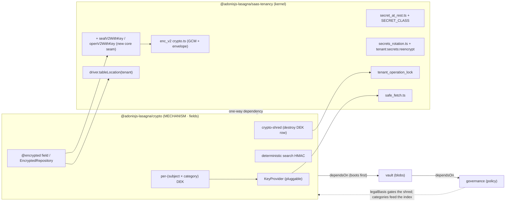
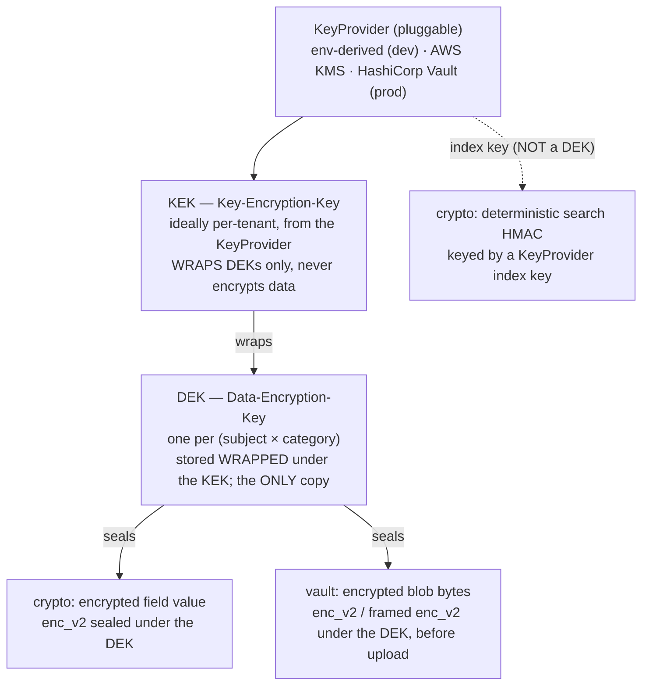

# @adonisjs-lasagna/crypto Architecture

> **Status: DESIGN document, not yet implemented.** No `@adonisjs-lasagna/crypto`
> package, migration, or scaffold exists yet. This is the "why" the implementation
> will be measured against, authored before the code. Names, signatures, and the
> open decisions in §12 may still change before the first line ships; where a name
> or a decision here is provisional it says so. What is NOT provisional is the
> frozen core the [foundation](00-foundation.md) pins: the key hierarchy, the shred
> operation, the invariants, and the honesty bounds. Where this document and the
> (future) code disagree, the document is right and the code is the bug.

This is the field-encryption mechanism satellite for Lasagna and the KEYSTONE the
other two data-protection satellites (`vault`, `governance`) depend on. It is
governed against the shared [data-protection foundation](00-foundation.md). Where
this doc and the foundation disagree, the foundation is right and this doc is the
bug. This satellite OWNS the shared KEK/DEK key hierarchy (foundation §2), the
crypto-shred operation (foundation §2.4), and executes the erasure that
governance's `legalBasis` gates (foundation §3); it CONSUMES no policy of its own.

It is written to be read, not just searched, in the same register as the
[AI architecture doc](../../packages/ai/ARCHITECTURE.md): the problem, the tempting
wrong answer, why that answer leaks or fails, then the design chosen. If you learn
one thing here, learn this: **crypto encrypts a field and can destroy its key, but
it never decides whether destroying that key is lawful.** It is a mechanism with no
compliance opinion. governance owns the judgment; crypto executes the bytes.

## 1. Purpose and scope

crypto is a MECHANISM. It protects FIELDS. Its four jobs, and nothing else:

1. **Field-level encryption at rest.** A model field marked encrypted is stored as
   an `enc_v2` ciphertext, encrypted under a per-`(subject × category)`
   Data-Encryption-Key (DEK), using core's existing GCM primitive and envelope
   format. crypto reuses core's cipher; it adds exactly one narrow core seam that
   lets the enc_v2 envelope be sealed under a caller-supplied DEK instead of the
   APP_KEY-derived key (§6.2, §8). It writes NO new AEAD construction.
2. **Deterministic search HMAC (a blind index).** A keyed HMAC index over a
   low-entropy field (a passport number, a national-ID) so equality search
   survives encryption, with a DOCUMENTED equality/frequency-leak invariant
   (§4, §6.5).
3. **Crypto-shredding.** Destroying the wrapped-DEK row for a `(subject ×
   category)` makes every field ciphertext and every vault blob under that DEK
   irrecoverable AT ONCE, O(1), everywhere Lasagna manages ciphertext (foundation
   §2.4).
4. **The KEK/DEK key hierarchy.** The pluggable `KeyProvider` (env-derived for dev,
   AWS KMS or HashiCorp Vault for prod), the per-tenant wrapped-DEK table, and the
   shred operation that vault reuses for blobs and governance gates for
   erasability.

### What this does NOT do

Stated up front, because a mechanism that overstates its reach is a footgun.

- **It does not decide erasability.** crypto shreds a `(subject × category)` only
  when governance's `legalBasis` says the category is erasable (foundation §3).
  crypto knows nothing about consent, retention windows, or legal holds. It has no
  `legalBasis` field of its own; it CONSULTS governance's at shred time. A
  `legal-obligation` category within retention is never shredded on crypto's
  initiative.
- **It does not store blobs.** Passport SCANS, signed rental contracts, damage
  photos are vault's job. crypto encrypts field VALUES (a passport NUMBER as text),
  not object bytes. vault reuses crypto's DEK to encrypt blobs before upload; crypto
  never touches object storage.
- **It does not carry policy.** No category registry, no consent ledger, no
  retention job, no DSAR orchestration. Those are governance. crypto is boring,
  testable, judgment-free.
- **It does not implement a new cipher.** enc_v2 (AES-256-GCM + HKDF, `keyId` in
  the envelope, header-as-AAD, backward `enc_v1` read) is core's
  [`packages/core/src/utils/crypto.ts`](../../packages/core/src/utils/crypto.ts),
  reused unchanged as the primitive. The only novel crypto surface is KEK-wrapping
  of DEKs, delegated to the `KeyProvider` (a KMS in prod), plus the one narrow core
  seam that seals the existing enc_v2 envelope under the DEK (§6.2, §8). A framed
  stream envelope for large blobs (§6.8) is composition of the same GCM primitive
  per frame, not a second AEAD.
- **It does not claim "GDPR compliant" / "Ley 09-08 compliant".** It provides the
  pieces to build compliance. Compliance is a property of the OPERATOR (the data
  controller), never a library. The honesty bounds are §10.
- **It does not reach outside what Lasagna manages.** Crypto-shredding erases
  encrypted fields, encrypted blobs, and their backups. It cannot erase plaintext
  copies the host made, application logs, error bodies, external indexes, or blind
  index columns the host did not null (the honesty bound, foundation §5, restated
  in §10).

## 2. Position in the platform

crypto is the ROOT of the data-protection DAG. It depends on nothing but core;
vault and governance depend on it.



The package dependency is one-way: crypto imports core, never governance. The
dotted back-edge from governance is a RUNTIME data flow, not a package dependency:
governance publishes categories and legal bases that crypto CONSULTS at erase time.
So the DAG has no cycle (foundation §1).

**`dependsOn` DAG.** crypto declares no `dependsOn` (it is the root). vault declares
`dependsOn: ['@adonisjs-lasagna/crypto']`; governance declares `dependsOn:
['@adonisjs-lasagna/vault']`. The `configure` orchestrator cycle-checks and
dependency-orders ([`packages/core/src/sdk/manifest.ts`](../../packages/core/src/sdk/manifest.ts)),
so crypto's provider boots before vault's, and vault's before governance's.

**`satelliteApi`.** crypto ships `satelliteApi: 1` and a `CRYPTO_CONTRACT_VERSION`,
checked at boot via `assertSatelliteApiCompatAtBoot` / `compareContractVersion`,
exactly as the AI and billing satellites do.

**What it reuses vs what it adds.** The full seam table is §8. In one line: crypto
reuses core's GCM primitive and enc_v2 envelope
([`crypto.ts`](../../packages/core/src/utils/crypto.ts)), the fail-closed strict
read + domain-separation registry
([`secret_at_rest.ts`](../../packages/core/src/utils/secret_at_rest.ts)), the
two-axis rotation *pattern*
([`secrets_rotation.ts`](../../packages/core/src/utils/secrets_rotation.ts) +
`tenant:secrets:reencrypt`), the driver placement (`tableLocation`), and the
per-tenant operation lock. It ADDS exactly three novel surfaces: the `KeyProvider`
KEK abstraction (KEK-wrapping of DEKs), the deterministic search HMAC, and one
narrow core seam that seals/opens the enc_v2 envelope under a caller-supplied DEK
(`sealV2WithKey` / `openV2WithKey`, §6.2). Everything else is composition.

## 3. Threat model

A numbered table of vectors, each with the attacker's capability and the invariant
or guard that covers it. `Tn` maps to `In` in §4. The concrete PII in scope is real,
sanction-bearing data: passport numbers and national-ID numbers as fields
(foundation preamble), so these are not academic.

| # | Vector | Attacker capability | Enforced by |
|---|---|---|---|
| T1 | Steal the DB at rest | reads every row of every tenant table | I1: field values are `enc_v2` ciphertext under a DEK; no plaintext PII column |
| T2 | Steal the DB AND the wrapped-DEK table | reads ciphertext + the wrapped DEKs | I2: DEKs are stored ONLY wrapped under the KEK; a real KMS/HSM KeyProvider holds the KEK outside the DB and the app process. Under the env-derived dev provider the KEK is APP_KEY-derived, so I2's separation degrades to APP_KEY (honest limit, §10) |
| T3 | Brute-force a search index | dumps the DB, tries an offline dictionary against the blind index | I5: the search index is a KEYED HMAC (key in the KeyProvider), not a bare salted hash; without the HMAC key the space is not brute-forceable |
| T4 | Read equality / frequency from the index | a DB reader correlates rows sharing an HMAC | I5 (honest limit): equality and frequency ARE visible to a DB reader; this is DOCUMENTED, never silent, and is the standard searchable-encryption trade-off |
| T5 | Write a field marked encrypted as cleartext | a code path bypasses the encryption seam and stores plaintext | I3 + `guard.crypto_plaintext_write`: a value written to an encrypted field that is not `enc_v2` ciphertext is refused fail-closed |
| T6 | Read a plaintext-era or corrupted value as a usable secret | relies on lenient decrypt passing a non-ciphertext through | I3: reads go through the strict open path (fail-closed); a non-`enc_v2`/`enc_v1` value throws, never returns as a usable value |
| T7 | Confused-deputy across field classes | decrypts a ciphertext written for class A under class B's DEK | I4: each `(subject × category)` has its own DEK (and each secret class its own HKDF `context`); a ciphertext sealed under one DEK cannot open under another |
| T8 | Recover shredded data | tries to read a field or blob after its DEK was destroyed | I6: crypto-shred destroys the ONLY copy of the DEK; the ciphertext (field, blob, and backup) is inert forever, O(1) |
| T9 | Erase records the law requires kept | drives an RTBF shred that would destroy a `legal-obligation` DEK | I7: the shred is gated by governance's `legalBasis`; a `legal-obligation` category in retention (or an unresolvable basis) is REFUSED (fail-closed) |
| T10 | KEK rotation bricks stored data | rotates the KEK and expects every DEK to survive | I8: a DEK is re-WRAPPED under the new KEK (the `kek_id` cursor), never re-encrypting the data; the two-axis pattern from `secrets_rotation.ts` |
| T11 | Leak the key through a log or error | reads the DEK/KEK/HMAC key from a log line, an error body, or a config dump | I9: raw DEK/KEK/index-key bytes never enter a log, error, or config literal; a `KeyProvider` under SSE-KMS never returns raw KEK bytes to the process |
| T12 | Race two writes to the same `(subject × category)` DEK | two concurrent provisions create two DEKs, splitting ciphertext | I10: `UNIQUE (subject_id, category)` (partial, on live rows) makes the DEK singular; the shred + provision run under the per-tenant operation lock |
| T13 | Point a KeyProvider HTTP backend at an internal URL | a BYO KeyProvider endpoint hits loopback / metadata | reuse [`safe_fetch.ts`](../../packages/core/src/utils/safe_fetch.ts) (`guard.outbound_fetch`): every KeyProvider outbound passes the SSRF pin; no second SSRF guard |
| T14 | Read shredded equality/frequency via a stale blind index | after a shred, correlates a subject's surviving HMAC index column against other rows | I5 honest limit + §6.5/§6.6: a shred kills the DEK (the data is inert) but does NOT null the host's blind-index column; erasing the index residue is the host's write path (or falls out when the owning row is deleted) |

## 4. Invariants

Each invariant is a property that cannot change without a major version bump and a
migration note (§12). Each has a statement, the rationale, and how it is enforced (a
structural guard name, a runtime seam, or a named behavioral test). These are
crypto's `I1..I10`, in the register of the AI doc's `I1..I8`.

**I1. A field marked encrypted is stored as `enc_v2` ciphertext under a
per-`(subject × category)` DEK, never plaintext.** There is no plaintext PII column
for an encrypted field. The value on disk is `enc_v2:<keyId>:<iv>:<tag>:<cipher>`
(core's format), sealed under the unwrapped DEK via the new `sealV2WithKey` core
seam (§6.2). Rationale: a stolen DB yields ciphertext, not PII (T1). Enforced by:
the encryption seam (`@encrypted` decorator / `EncryptedRepository`, §6.4) is the
only write path, plus `check-crypto-invariant-1` (no plaintext-typed column for a
declared encrypted field).

**I2. DEKs are stored ONLY wrapped under the KEK; the KEK never lives in the
database.** The wrapped-DEK table holds `wrapped_dek` (KEK-encrypted) and `kek_id`,
never a plaintext DEK column. The KEK lives in the `KeyProvider`; under a real
KMS/HSM provider raw KEK bytes never touch the app process. Rationale: stealing the
DB plus the DEK table still yields nothing without the KEK (T2). Honest limit: under
the env-derived dev provider the KEK is a pure function of `APP_KEY`, so I2 provides
key-DESTRUCTION granularity (crypto-shred still works) but NOT root-of-trust
SEPARATION; T2 mitigation requires a real KMS/HSM (§10). Enforced by: the wrapped-DEK
table schema (§6.3) + `check-crypto-invariant-2` (no plaintext-DEK column, no KEK
material in a config literal).

**I3. Reads fail closed; writes reject cleartext for an encrypted field.** Reads
route through the strict open path (`openV2WithKey`, whose miss/tamper throws like
core's `decryptStrict`), so a value that is not `enc_v1`/`enc_v2` ciphertext throws
rather than passing through as a usable value (T6). Writes to an encrypted field that
are not ciphertext are refused before the INSERT/UPDATE (T5). Rationale: a
corruption, a tamper, or a bypass must be a loud failure, never a silent plaintext
leak. Enforced by: the strict-read seam + `guard.crypto_plaintext_write` +
`check-crypto-invariant-3` (§5). Note there is NO lenient-decrypt carve-out anywhere
in crypto src: KEK rotation re-wraps DEKs and never decrypts a field value (I8), and
the enc_v1→enc_v2 APP_KEY migration is core's `tenant:secrets:reencrypt` (core src,
not crypto src).

**I4. Each `(subject × category)` derives its own DEK, and each secret class its own
HKDF `context`; keys never overlap.** A ciphertext sealed under the `identity-docs`
DEK for subject `S` cannot open under any other DEK, and a value written for one
secret class cannot decrypt as another (the reused per-class `context` = HKDF `info`
from `secret_at_rest.ts`). This is confused-deputy resistance (T7). Rationale: a
category's DEK must be independently derivable AND independently destroyable (this is
what makes per-`(subject × category)` crypto-shred work, §6.6). Enforced by: the
per-`(subject × category)` DEK keying (§6.2) + the `SECRET_CLASS` / category-context
registry (§8) + `check-crypto-invariant-4` (every category maps to a distinct HKDF
context; the seal path keys by the row's DEK, not a shared key).

**I5. The search index is a keyed HMAC with a key in the KeyProvider, and its
equality/frequency leak is a DOCUMENTED invariant.** Equality search on a
low-entropy field uses a keyed HMAC (a blind index), NOT a bare salted hash (which
is brute-forceable, T3). The HMAC key lives in the `KeyProvider`, so a DB dump
cannot brute-force it. The residual leak is real and stated openly: **a DB reader
sees which rows share a value and how often each value occurs** (T4), and this leak
PERSISTS across a shred unless the host nulls the index column (T14, §6.5). Rationale:
the standard searchable-encryption trade-off; hiding it would be dishonest. Enforced
by: the blind-index seam (§6.5) + `check-crypto-invariant-5` (the index uses a keyed
HMAC via `createHmac`, not `createHash`/a bare salt column) + the documented honest
limit in §10.

**I6. Crypto-shred destroys the ONLY copy of a DEK, making all ciphertext under it
irrecoverable at once, O(1).** The wrapped DEK is the sole copy of the key.
Destroying its row kills every field ciphertext, every vault blob, and every backup
under that `(subject × category)` DEK simultaneously (T8), because backups capture
only ciphertext ([`packages/backup`](../../packages/backup)). Rationale: erasure is
one row delete, not a scan-and-overwrite of N ciphertexts. Enforced by: the shred
operation (§6.6) runs under the per-tenant operation lock, deletes the wrapped-DEK
row, and NEVER binds an unwrapped DEK on the shred path; the structural scaffold
`check-crypto-invariant-6` asserts the shred module never binds an `unwrapDek(...)`
result to a variable (so no plaintext DEK can outlive the delete) and holds exactly
one delete of the DEK row, and the RED behavioral test
`resilience_shred_makes_ciphertext_inert.spec.ts` proves a field and blob are
undecryptable after the shred (the guard is the anti-regression scaffold, the test is
the proof).

**I7. A shred is gated by governance's `legalBasis`; a `legal-obligation` category in
retention, or an unresolvable basis, is REFUSED.** crypto EXECUTES a shred only for
categories governance says are erasable. If governance cannot resolve a category's
basis, or governance is absent, the shred of that category is REFUSED, never
defaulted-to-erase (fail-closed, T9). Rationale: destroying a signed rental
contract's DEK on an RTBF request is a legal violation in the other direction
(foundation §3); under-erasing is recoverable, over-erasing is not. Enforced by: the
shred's step-1 gate (§6.6) whose FIRST awaited call is the governance erasability
resolver; `guard.crypto_shred_legal_hold` trips on a refused shred; the structural
scaffold `check-crypto-invariant-7` asserts the shred function's first awaited call
is the resolver and there is exactly one DEK-delete statement reachable only after
it (no default-to-erase branch); and the RED behavioral tests
`security_shred_legal_hold_refused.spec.ts` and
`security_shred_governance_absent_refused.spec.ts` prove the interlock (the guard is
the scaffold, the tests are the proof that every path is gated).

**I8. KEK rotation re-WRAPS DEKs; it never re-encrypts the data.** Rotating the KEK
unwraps each DEK under the old KEK and re-wraps it under the new one, updating
`kek_id`. The data ciphertext is untouched. This reuses the two-axis rotation
*pattern* from `secrets_rotation.ts` (T10). Rationale: re-encrypting N field values
on every KEK rotation would be O(N) and error-prone; re-wrapping the DEK is O(1) per
subject×category. Enforced by: the KEK-rotation walker (§6.7) +
`check-crypto-invariant-8` (rotation calls `KeyProvider.unwrapDek`/`wrapDek` and
never `decrypt`/`openV2WithKey`-then-seal on a field value).

**I9. Raw DEK/KEK/index-key bytes never enter a log, an error, a config literal, or a
prompt.** Provider keys, DEKs, KEKs, and the HMAC index key are never logged, never
placed in an error body, never hardcoded (T11). Rationale: the whole hierarchy is
worthless if a key leaks through a log line. Enforced by: `check-crypto-invariant-9`
(no key material in config literals or `logger.*` calls, mirroring
`check-ai-invariant-6`'s no-provider-key-in-logs scan).

**I10. A live DEK is singular per `(subject × category)` and mutated only under the
per-tenant lock.** `UNIQUE (subject_id, category) WHERE shredded_at IS NULL` (a
partial index) makes the LIVE DEK singular while a shred tombstone can remain as
evidence and a later legitimate re-provision inserts a fresh live row (T12, §6.3).
Provision and shred serialize on the per-tenant operation lock. Rationale: two live
DEKs for one `(subject × category)` would split its ciphertext, so a shred of one
leaves the other readable. Enforced by: the DB partial-`UNIQUE` constraint (§6.3) +
the lock discipline (§6.6) + `check-crypto-invariant-10` (the DEK table declares the
partial unique constraint; the shred/provision path takes the lock).

## 5. Structural guards

One `check-crypto-invariant-N.mjs` per enforceable invariant, each a PURE
`auditor(files)` function (a list of `{ path, source }` in, a list of problem
strings out) that a focused unit test drives without a filesystem, plus a `run()`
that reads the real files and `process.exit(1)` on any problem. All are STRUCTURAL
(they scan source/stubs for a required trigger, a forbidden PII column, a hardcoded
schema string, a missing seal call, a forbidden variable binding). No "detect a leak
with a regex" theater, matching the AI doc's decision to drop regex-detection guards.
Each is wired into [`scripts/check.mjs`](../../scripts/check.mjs). The shape follows
[`scripts/check-ai-invariant-5.mjs`](../../scripts/check-ai-invariant-5.mjs) exactly.

Two of these guards (invariant-6 and invariant-7) enforce a SCAFFOLD only, because
the property they protect is a control-flow / lifetime property a source scan cannot
decide. For those two, the structural guard is the anti-regression scaffold and a
named RED behavioral test is the real enforcement; the split is called out in the
table and in §4/§11.

| Guard | Invariant | What it scans (structural) | Behavioral proof |
|---|---|---|---|
| `check-crypto-invariant-1` | I1 | the encrypted-model surface + migration stubs: a field declared `@encrypted` (or in the repository's encrypted-column set) has NO sibling plaintext-typed column, and the value type is a ciphertext string column | — |
| `check-crypto-invariant-2` | I2 | the wrapped-DEK migration stub: columns are EXACTLY the reviewed non-plaintext allowlist (`id`, `subject_id`, `category`, `wrapped_dek`, `kek_id`, `created_at`, `shredded_at`), no `dek`/`plaintext_key`/`raw_key` column; no KEK material in any config literal | — |
| `check-crypto-invariant-3` | I3 | every field read routes through the strict open path (`openV2WithKey`); NO lenient `decrypt`/`openV2WithKey`-without-throw anywhere in crypto src; every encrypted-field write path emits `guard.crypto_plaintext_write` or writes ciphertext | — |
| `check-crypto-invariant-4` | I4 | the category/class → HKDF-context map is injective (no two categories share a `context`), mirroring `secret_at_rest.ts`'s per-class discipline; the seal path keys by the row's DEK, not a shared key | — |
| `check-crypto-invariant-5` | I5 | the blind index is built with a keyed HMAC (`createHmac`), NOT `createHash` over a bare salt column, and no plaintext salt column exists on the indexed table | — |
| `check-crypto-invariant-6` (scaffold) | I6 | the shred module deletes the wrapped-DEK row (exactly one DEK-row delete) and NEVER binds an `unwrapDek(...)` result to a variable, so no decrypted DEK can outlive the delete | `resilience_shred_makes_ciphertext_inert.spec.ts` |
| `check-crypto-invariant-7` (scaffold) | I7 | the shred function's FIRST awaited call is the erasability resolver; there is exactly one DEK-delete statement, reachable only after it; no default-to-erase branch; emits `guard.crypto_shred_legal_hold` on refusal | `security_shred_legal_hold_refused.spec.ts`, `security_shred_governance_absent_refused.spec.ts` |
| `check-crypto-invariant-8` | I8 | the KEK-rotation walker re-wraps the DEK (calls `KeyProvider.unwrapDek`/`wrapDek`), never `openV2WithKey`-then-`sealV2WithKey` on a field value | — |
| `check-crypto-invariant-9` | I9 | no DEK/KEK/HMAC-index-key material in config literals or `logger.*` arguments (the `check-ai-invariant-6` scan generalized) | — |
| `check-crypto-invariant-10` | I10 | the wrapped-DEK stub declares `UNIQUE (subject_id, category) WHERE shredded_at IS NULL`; the provision/shred path takes the per-tenant operation lock | — |

The `no_silent_crypto_guard` architectural spec (the satellite mirror of the
kernel's no-silent-guard scan) asserts that every refusal throw in `src` emits a
registered `guard.crypto_*` event or carries an allow-listed written reason, and the
registry-driven emission matrix asserts a new guard cannot ship without a behavioral
test.

## 6. Key and data model

This is crypto's core. It PINS the shared key hierarchy (foundation §2), the
wrapped-DEK table (foundation §2.3), the shred operation (foundation §2.4), the
enc_v2-under-DEK field encryption, the deterministic search HMAC (foundation §10.2),
and the framed stream envelope vault composes for large blobs (§6.8). vault and
governance reference these names unchanged.

### 6.1 The three tiers



- **KeyProvider** yields a KEK. Env-derived for dev (a KEK derived deterministically,
  in the spirit of `crypto.ts`'s HKDF-from-`APP_KEY`), AWS KMS or HashiCorp Vault for
  prod. Ideally the KEK is per-tenant, so a tenant's key material is compromised or
  destroyed independently of every other tenant.
- **KEK** never encrypts data directly; it only WRAPS DEKs. It lives in the
  KeyProvider (a KMS/HSM in prod), so raw KEK bytes need never touch the app process
  under SSE-KMS-style providers (I2). Under the env-derived dev provider the KEK is
  APP_KEY-derived, which weakens the root-of-trust separation to APP_KEY (honest
  limit, §10) while keeping destruction granularity.
- **DEK** is the key data is actually encrypted under. Exactly one LIVE DEK per
  `(subject × category)`. Stored WRAPPED (KEK-encrypted) in the per-tenant table; the
  wrapped DEK is the ONLY copy. No plaintext-DEK-at-rest (I2).

The per-`(subject × category)` granularity is not incidental. It is the exact
granularity crypto-shred needs (§6.6) so a consent-basis category can be shredded for
one subject while a legal-obligation category for the same subject survives (§6.6,
foundation §3). Coarser DEKs (per-tenant, per-subject-only) cannot express that and
would force the "erase everything or nothing" choice the law forbids.

### 6.2 The named types and the enc_v2-under-DEK keying

These are the frozen names vault and governance reference (foundation §2.2).

```ts
/** A stable subject (data-subject) identifier within a tenant, e.g. a renter's id. */
export type SubjectId = string

/** A governance-declared processing category, e.g. 'identity-docs' | 'rental-contract' | 'marketing'. */
export type CategoryKey = string

/** The pluggable root-of-trust: yields a KEK, wraps/unwraps DEKs. Never sees plaintext data. */
export interface KeyProvider {
  readonly name: string                       // 'env' | 'aws-kms' | 'hashicorp-vault' | custom
  wrapDek(tenantId: string, dek: Buffer): Promise<WrappedDek>
  unwrapDek(tenantId: string, wrapped: WrappedDek): Promise<Buffer>
}

/** The KEK-encrypted DEK envelope persisted in the wrapped-DEK table. Opaque outside the KeyProvider. */
export interface WrappedDek {
  readonly kekId: string                      // which KEK generation wrapped this DEK (rotation cursor)
  readonly ciphertext: string                 // the wrapped DEK bytes, provider-encoded
}
```

**How the DEK becomes the AES key (the load-bearing reconciliation).** core's
[`crypto.ts`](../../packages/core/src/utils/crypto.ts) has NO entry point that
accepts a caller-supplied raw AES key: `encrypt`, `encryptV2`, and even
`decryptWithAppKey` all derive the key internally with `v2Key(appKey, context) =
HKDF-SHA256(APP_KEY, KEY_SALT, info=context)` and stamp `keyId = v2KeyId(APP_KEY)`.
Feeding the DEK through that HKDF would derive a key FROM the DEK and defeat
per-subject destruction, and there is no seam to inject the DEK as the key directly.
So encrypting a field UNDER A DEK requires a NEW, narrow core seam. crypto adds
exactly one, reusing the enc_v2 GCM primitive, the `enc_v2:<keyId>:<iv>:<tag>:<cipher>`
framing, and the header-as-AAD, but bypassing the `v2Key`/`v2KeyId` HKDF-from-APP_KEY
derivation:

```ts
// New in packages/core/src/utils/crypto.ts (the ONE crypto.ts change crypto needs).
// Reuses AES-256-GCM + the enc_v2 envelope + header-as-AAD; the AES key is the
// caller's 32-byte DEK, NOT an APP_KEY-HKDF key. `keyId` is a NON-SECRET tag of the
// DEK (or the wrapped-DEK row id), so a rotation/read can tell which DEK sealed a
// value; it is never a tag of APP_KEY on this path.
export function sealV2WithKey(plaintext: string, dek: Buffer, keyId: string): string
export function openV2WithKey(value: string, dek: Buffer): string   // strict: throws on non-enc_v2 / wrong key / tamper
```

This is why the [`crypto.ts`](../../packages/core/src/utils/crypto.ts) verdict in §8
is **extend**, not reuse-as-is: crypto does not write a new AEAD (the primitive,
envelope, and AAD discipline are core's, unchanged) but it DOES add these two
entry points. The `context` / HKDF-`info` layer remains the domain-separation
mechanism for the APP_KEY-keyed secret classes (I4); on the DEK path, domain
separation comes from the per-`(subject × category)` DEK itself. This keying
discipline is a frozen invariant; it is what makes destroying one row (the wrapped
DEK) destroy exactly one category's data and nothing else. **There is one AEAD
primitive, and it is core's** (foundation §2.2); crypto adds only the key-injection
seam over it.

### 6.3 The wrapped-DEK table

Per-tenant, placed by `driver.tableLocation(tenant)`
([`packages/core/src/services/isolation/driver.ts`](../../packages/core/src/services/isolation/driver.ts)),
NEVER a hardcoded `tenant_<id>` schema. It ships as a per-tenant satellite migration
(`perTenantMigrations`, foundation SEAM-2 in the manifest), so it lands in whatever
placement the active driver reports (`schema` / `database` / `rowscope` /
`connection`). (This is the ONE crypto table that uses `tableLocation`; the shared
WORM ledger crypto's shred appends to is NOT placed by `tableLocation`, see §6.6.)

| Column | Type | Meaning |
|---|---|---|
| `id` | uuid PK | row id |
| `subject_id` | text | the data-subject (`SubjectId`); a VALUE, not a namespace, so `assertSafeIdentifier` is not required |
| `category` | text | the governance `CategoryKey` this DEK protects |
| `wrapped_dek` | text | the `WrappedDek` ciphertext (KEK-encrypted DEK) |
| `kek_id` | text | which KEK generation wrapped it (the rotation cursor, I8) |
| `created_at` | timestamptz | provenance |
| `shredded_at` | timestamptz null | set at the instant the row's key material is destroyed (tombstone) |

A partial `UNIQUE (subject_id, category) WHERE shredded_at IS NULL` constraint makes
the LIVE `(subject × category)` DEK singular (I10) while letting a shred tombstone
remain as evidence AND letting a legitimate re-provision after a shred insert a fresh
live row (a renter who withdraws consent, then later re-grants it and supplies new
data). A plain `UNIQUE (subject_id, category)` would block that re-provision, so the
partial index is the pinned choice; `check-crypto-invariant-10` asserts the partial
form. There is no plaintext DEK column and no plaintext data key anywhere at rest
(I2). `check-crypto-invariant-2` pins this column set as the reviewed allowlist,
exactly as `check-ai-invariant-5` pins the AI audit table's.

### 6.4 The public field surface: `@encrypted` decorator vs `EncryptedRepository` (both, with a recommendation)

crypto exposes two ways to encrypt a field. Both are backed by the SAME seam (§6.2's
key hierarchy + `sealV2WithKey` over core's primitive); the difference is ergonomics
vs explicitness.

**Option A: the `@encrypted` model decorator (ergonomic).** A Lucid column decorated
`@encrypted({ category, subject })` transparently encrypts on write and decrypts on
read, resolving the DEK for the row's `(subject, category)`. The decorator sits on
top of Lucid's `prepare`/`consume` column hooks, so the model author writes
`renter.passportNumber = '...'` and the ciphertext round-trips invisibly.

```ts
class Renter extends TenantBaseModel {
  @encrypted({ category: 'identity-docs', subject: (row) => row.id })
  declare passportNumber: string

  @searchable({ category: 'identity-docs', subject: (row) => row.id })
  declare passportNumberIndex: string   // deterministic HMAC blind index (§6.5)
}
```

**Option B: the explicit `EncryptedRepository` (auditable).** A repository whose
`encrypt(subject, category, value)` / `decrypt(subject, category, ciphertext)` /
`search(category, value)` methods are called explicitly at the call site. No
decorator magic; the encryption boundary is visible in the code path.

```ts
const repo = await app.container.make('crypto.repository')
const ciphertext = await repo.encrypt(renter.id, 'identity-docs', passportNumber)
const hits = await repo.search('identity-docs', passportNumber)   // blind-index equality
```

**The honest trade-off.** The decorator is easier and harder to forget (every
read/write of that column is encrypted by construction), but it hides the `(subject,
category)` resolution in a hook, and a `subject` resolver that returns the wrong id
silently mis-scopes the DEK. The repository is explicit and auditable (the encryption
boundary is a visible call), but a call site can forget to route a write through it,
which is exactly the T5 plaintext-write vector.

**Recommendation.** Prefer the **`@encrypted` decorator for model-attached fields**
(the common case: a passport number on a `Renter`), because forgetting to encrypt is
the dominant real-world failure and the decorator makes it impossible for that
column. Use the **`EncryptedRepository` for detached or cross-model values** where no
single model owns the field, or where an audit reviewer needs the encryption boundary
visible in the diff. BOTH are backstopped by `guard.crypto_plaintext_write` + I3, so
neither can silently store cleartext: the decorator's `prepare` hook and the
repository's `encrypt` both refuse a non-ciphertext write to an encrypted column. The
choice is ergonomics, not safety; safety is the invariant, not the surface.

### 6.5 The deterministic search HMAC (blind index)

Equality search on a low-entropy identifier (a passport number) needs a deterministic
index. Encrypting the field with a random IV (which enc_v2 does, correctly) makes two
equal passports produce different ciphertexts, so equality search over the ciphertext
is impossible.

The tempting wrong answer is a salted SHA-256
(`createHash('sha256').update(salt + value)`). It is brute-forceable: the
passport-number space is small (a few million candidates), so if the salt ever leaks
with the DB, an offline dictionary recovers every value (T3).

The correct answer is a **keyed HMAC** with a key held in the `KeyProvider` (never a
bare salt in a column): `index = HMAC-SHA256(indexKey, normalize(value))`. An
attacker who dumps the DB cannot brute-force without the HMAC key, which lives in the
KMS. The `indexKey` is a distinct KeyProvider-held key (per-tenant, ideally
per-category), NOT a DEK: it must survive a data shred (the value's DEK is destroyed,
but equality must still be computable for surviving rows), and it must be constant
across rows for equality to hold. Normalization is fixed so two spellings of one
value collide correctly: NFKC (which folds compatibility encodings) plus a
surrounding-whitespace trim, then an opt-in locale-independent case-fold where the
field semantics allow (a passport number folds case, a case-sensitive token does
not). This exact sequence is frozen: changing it re-derives every host index column,
an `enc_v3`-grade break.

**The documented residual leak (I5, an honest invariant, never silent).** Equality
and frequency patterns are visible to a DB reader: equal plaintexts share an HMAC, so
a reader sees which rows have the same passport, and how often each value occurs. This
is the standard searchable-encryption trade-off. crypto states it as an invariant with
an honest limit (§10), the same way the AI doc states the first-token streaming window
as an honest residual. The mitigations are honest too: the index is opt-in per field
(only fields that NEED equality search get one), and a host that cannot accept the
frequency leak must not index that field. `check-crypto-invariant-5` asserts the index
uses `createHmac`, not `createHash` over a bare salt.

**The blind index and shred (T14, the completeness gap made explicit).** The blind
index is keyed by the SURVIVING index key, not by the destroyed DEK, and it lives on
the subject's own data rows, not on the wrapped-DEK row. So a crypto-shred (which
destroys the DEK row) makes the field CIPHERTEXT inert but does NOT by itself null the
HMAC index column. After a shred, the value is unrecoverable, yet the HMAC still
reveals equality/frequency of the erased value against any surviving rows. Closing
this is the host's write path: erasing the searchable index is either (a) the host
nulling the indexed column for the shredded `(subject × category)`, or (b) automatic
when the owning data row is deleted. §10 restates this as an honest limit so the
"DEK destroyed" guarantee is never mistaken for "searchable index neutralized".

### 6.6 The exact crypto-shred operation

Crypto-shredding a `(subject × category)` is one operation: **destroy the wrapped-DEK
row.** Because the wrapped DEK is the only copy of the key, and every field ciphertext
and every blob for that `(subject × category)` was encrypted under that DEK,
destroying it makes all of that ciphertext irrecoverable AT ONCE, everywhere Lasagna
manages ciphertext (I6, foundation §2.4):

- crypto's encrypted field values in the tenant's tables,
- vault's encrypted blob bytes in object storage,
- and any BACKUP of either, because backup does `pg_dump` and captures only
  ciphertext ([`packages/backup`](../../packages/backup)), so a restored dump still
  cannot be decrypted.

It does NOT neutralize the host's blind-index column (§6.5, T14) or any out-of-scope
copy (§10). The operation is O(1): one row delete, not a scan-and-overwrite of N
ciphertexts. The canonical shred, with the audit made fail-closed (a two-phase ledger
entry, so an irreversible erasure is never left unaudited):

```
shred(tenant, subject, category):
  1. governance gate (I7, fail-closed): the FIRST awaited call asserts the category's
     legalBasis permits erasure for this subject.
     If legalBasis is 'legal-obligation' and retention not expired, REFUSE (guard.crypto_shred_legal_hold).
     If governance cannot resolve the basis, or governance is absent, REFUSE (never default-to-erase).
  2. under the per-tenant operation lock (packages/backup/.../tenant_operation_lock.ts pattern):
       2a. emit a PENDING shred event -> governance's WORM ledger appends a PENDING row
           (who, when, which subject × category, NOT the key) BEFORE the irreversible delete.
       2b. DELETE the wrapped-DEK row for (subject, category)   [IRREVERSIBLE].
       2c. emit a COMMITTED shred event -> governance marks the ledger row COMMITTED.
  3. the DEK is now unrecoverable => all field + blob + backup ciphertext under it is dead.
     (The blind-index column, if any, is neutralized by the host's write path, §6.5.)
```

Step 1 is the non-negotiable interlock with governance (I7, foundation §3): crypto
OWNS the shred (it owns the table and the DEKs), governance ORCHESTRATES it
per-subject (deciding which categories are erasable), and crypto EXECUTES it. The
resolver is a config seam (§7); when governance is not installed the resolver is
absent, which is treated as "not erasable", so the shred fails closed.

Step 2 is the whole erasure, serialized under the per-tenant lock (I10), with a
two-phase audit that fixes the "shred succeeded, audit failed" gap. The foundation's
§2.4 lists a 2-then-3 order (delete, then append the ledger row); taken literally, a
failure of the append AFTER the delete would leave an irreversible erasure with no
audit record, inverting the AI audit writer's audit-before-commit discipline. crypto
resolves this by writing a PENDING ledger row BEFORE the delete (2a) and marking it
COMMITTED after (2c). A crash between 2a and 2c leaves a detectable PENDING row that
the operator (or a reconciliation pass) resolves, so an erasure is never silently
unaudited. crypto does NOT own the ledger (governance does, foundation §4); crypto
emits the PENDING/COMMITTED shred EVENTS that governance's ledger records. See §9 for
the matching failure-mode row.

**Where the WORM ledger physically lives (pinned, matches governance).** The shared
WORM ledger crypto appends to is a per-tenant hash chain stored PHYSICALLY in the
shared `backoffice` schema, keyed by a `tenant_id` column with `UNIQUE(tenant_id,
seq)`, exactly as
[`packages/ai/src/services/ai_audit_writer.ts`](../../packages/ai/src/services/ai_audit_writer.ts)
does today (its own comment: "The row lives in the shared `backoffice` schema ... so
this never routes through `tableLocation`"). It is deliberately NOT placed via
`tableLocation`, so it survives `tenant:purge-expired` and the tenant request role
cannot DROP it. "Per-tenant" for the ledger means logically-per-tenant-via-a-`tenant_id`-column,
NOT physically-per-tenant-via-`tableLocation`. Only crypto's wrapped-DEK table (§6.3)
uses `tableLocation`. This matches governance's §6.5 framing verbatim.

**Where the shared ledger writer physically lives (pinned, no dependency cycle).**
The DAG is `crypto -> vault -> governance` with governance the SINK (depended on by
nobody), so crypto and vault CANNOT import the governance package. The shared
`WormLedgerWriter` (generalized from `ai_audit_writer.ts`, foundation §4.1) therefore
lives in a package AT OR BELOW crypto that crypto and vault can import without a cycle
(core, or a shared low leaf), NOT inside governance. governance "owns" it as the
productizing home and maintainer of the row-shape and the compliance controls, not in
the sense that callers depend on the governance PACKAGE. crypto imports and calls the
shared writer directly (a synchronous, fail-closed append on the shred path), it does
NOT emit an event that only a governance listener records (an async listener could not
be fail-closed on the erasure path). This is the resolution the foundation's one-ledger
rule requires; without it crypto would be forced to hand-roll a second hash chain, the
exact thing the foundation forbids.

**Worked example (the signed rental contract, foundation §3).** A renter, subject
`S`, has three categories: `marketing` (`legalBasis: consent`), `identity-docs`
(`legalBasis: legal-obligation`), `rental-contract` (`legalBasis: legal-obligation`,
10-year retention, WORM). `S` invokes RTBF today. governance resolves each
`legalBasis`. crypto shreds the `marketing` DEK: `S`'s marketing field ciphertext is
instantly dead. crypto REFUSES to shred `rental-contract` and `identity-docs` (both
`legal-obligation`, retention not expired): the signed contract remains readable (it
is evidence), and governance's shred summary reports them as `retained:
legal-obligation` with the `retention_until` date, honestly, not as "erased". Ten
years later the retention job (governance) instructs crypto to shred
`rental-contract`; only then is its DEK destroyed. DEKs are per-`(subject ×
category)` PRECISELY so consent categories shred while legal-obligation ones survive.

### 6.7 KEK rotation (I8) reuses the two-axis pattern

Rotating the KEK does NOT re-encrypt field values. It re-WRAPS each DEK: for every
wrapped-DEK row whose `kek_id` is the old generation, unwrap under the old KEK,
re-wrap under the new KEK, and update `kek_id`. The data ciphertext is untouched, so
this is O(number of DEKs), not O(number of field values).

This reuses the SHAPE of `secrets_rotation.ts`'s `classifySecretRotation` and the
`tenant:secrets:reencrypt` command's idempotent, resumable pass (foundation §6): a row
already at the current `kek_id` is skipped (`current`); a row at the old `kek_id` is
re-wrapped (`rotate`); a row that unwraps under no known KEK is `failed` and reported
for operator attention. But it is NOT a reuse of the function: `classifySecretRotation`
classifies enc_v2 VALUE STRINGS across the APP_KEY+context axes (it calls
`decryptWithAppKey` on a stored secret string), whereas the KEK re-wrap classifies
WRAPPED-DEK ENVELOPES via `KeyProvider.unwrapDek`/`wrapDek`, a different data type
against a different key store. The re-wrap walker is NEW code that borrows the
current/rotate/failed classification pattern. The `kek_id` column IS the rotation
cursor, exactly as enc_v2's `keyId` is the cursor for `APP_KEY` rotation. The ace
command is `tenant:crypto:rekek` (§7), a KEK-axis sibling of `tenant:secrets:reencrypt`.
`check-crypto-invariant-8` asserts the walker re-wraps the DEK and never
decrypts-then-re-encrypts the field value.

A SEPARATE axis, orthogonal to KEK rotation, is `APP_KEY` rotation for the
env-derived dev KeyProvider (whose KEK is APP_KEY-derived): that reuses
`tenant:secrets:reencrypt` unchanged, in CORE src, and is the ONLY place a lenient /
dual-key decrypt window exists (never in crypto src, I3). The two axes compose (a KEK
generation and an `APP_KEY` generation are independent cursors), exactly as the AI
doc's memory/BYOK rotation split composes. Because the field ciphertext on the DEK
path is sealed under the DEK, not APP_KEY, an APP_KEY rotation only touches the
env-derived KeyProvider's KEK derivation and any APP_KEY-keyed secret classes, never
the DEK-sealed field values themselves.

### 6.8 The framed enc_v2 stream envelope (composition, not a new cipher)

vault must encrypt large blobs before upload, and a single GCM tag over the whole
payload cannot stream: the tag is unverifiable until the last byte, so a multi-GB blob
cannot be encrypted or decrypted incrementally. The tempting wrong answer is for vault
to invent its own chunked AEAD stream cipher, which would be a SECOND crypto
construction, exactly the thing the foundation forbids.

crypto owns the cipher, so crypto owns the exact frame format, and it is COMPOSITION of
core's existing GCM primitive, not a new AEAD: a **framed enc_v2 stream envelope** where
the payload is split into fixed-size frames, each frame sealed as an independent enc_v2
GCM seal under the SAME DEK, with a monotonic **frame counter in the AAD** (alongside the
enc_v2 header) so a reordered, dropped, duplicated, or truncated frame fails
authentication, and a final zero-length terminator frame so a truncated stream is
detected rather than silently accepted as complete. Because every frame is core's
AES-256-GCM under the DEK, this is not a new low-level cipher (I1 holds); it is the same
primitive applied per frame with reorder/truncation binding. vault §6.5 / §12 decision 5
CONSUME this section rather than scoping their own envelope. `sealV2WithKey` /
`openV2WithKey` (§6.2) are the single-shot form; the framed form is the same seal called
per frame with the counter mixed into the AAD.

## 7. Public surface

**Config.** `defineCryptoConfig(config): CryptoConfig` (no runtime effect), a
`SatelliteConfigRegistry` module augmentation adding `crypto?: CryptoConfig`, and a
`MultitenancyConfigWithCrypto` type, exactly as `defineAiConfig` /
`MultitenancyConfigWithAi` do. The config block declares:

- `keyProvider`: the `KeyProvider` binding (`env` default for dev; an explicit
  KMS/Vault binding for prod). See §11 open decision on the default.
- `fields`: the encrypted-field/category registry (which `CategoryKey` each encrypted
  field belongs to, and which categories carry a blind index).
- `erasabilityResolver`: the governance gate crypto CONSULTS at shred time (present
  when governance is installed; ABSENT means every category is treated as
  non-erasable, so the shred fails closed, I7).

**Ace commands.**

- `tenant:crypto:rekek` — re-wrap every DEK under the current KEK generation (I8,
  §6.7); idempotent, resumable, `--dry-run`.
- `tenant:crypto:shred --subject=<id> --category=<key>` — execute a crypto-shred (I6,
  §6.6), gated by the erasability resolver (I7). Operator-privileged, audited (the
  two-phase PENDING/COMMITTED ledger), refuses a `legal-obligation` category in
  retention or an unresolvable basis.
- `tenant:secrets:reencrypt` — reused from core unchanged for the `APP_KEY` axis
  (§6.7); lives in core src, not crypto src.

**Services.** `CryptoService` (resolve/provision a DEK for `(subject, category)`,
seal/open a value, build a blind index), `EncryptedRepository` (§6.4),
`KeyProviderRegistry` (register `env` / `aws-kms` / `hashicorp-vault` / custom, each
declaring a `contractVersion`). Stateful services are registered as container
singletons in the provider's `register()` and resolved via `container.make`, never
`new`-ed ad hoc.

**Events.** `SubjectShredded` (fired after a COMMITTED shred, carrying `tenantId`,
`subjectId`, `category`, `occurredAt`, NOT the key) so any host listener can react to
the erasure. The WORM ledger append itself is the direct fail-closed writer call on
the shred path (§6.6), not this event; the event is a host-facing notification, not
the audit mechanism.

**Isthmus guards** (satellite-local registry mirroring
[`ai_guard_registry.ts`](../../packages/ai/src/isthmus/ai_guard_registry.ts), id type
`` `guard.crypto_${string}` ``, dispatched on the kernel's PUBLIC
`IsthmusGuardTripped` event):

| Guard id | Event | failMode | phase | Fires when |
|---|---|---|---|---|
| `guard.crypto_plaintext_write` | `isthmus:guard:crypto_plaintext_write:rejected` | closed | runtime | a non-ciphertext value is written to a field marked encrypted (I3, T5) |
| `guard.crypto_dek_unwrap_failed` | `isthmus:guard:crypto_dek_unwrap:rejected` | closed | runtime | the KeyProvider cannot unwrap a DEK (KMS down, wrong KEK, tamper) — the read fails closed, never returns plaintext |
| `guard.crypto_shred_legal_hold` | `isthmus:guard:crypto_shred_legal_hold:rejected` | closed | runtime | a shred is refused because the category's `legalBasis` is `legal-obligation` in retention, or governance cannot resolve it or is absent (I7, T9) |
| `guard.crypto_shred_unaudited` | `isthmus:guard:crypto_shred_unaudited:rejected` | closed | runtime | the WORM ledger PENDING append fails before the delete, so the irreversible erasure is aborted rather than run unaudited (§6.6, §9) |
| `guard.crypto_keyprovider_unavailable` | `isthmus:guard:crypto_keyprovider:rejected` | closed | config/runtime | the configured KeyProvider is unreachable at boot or on a wrap/unwrap call |
| `guard.crypto_config_invalid` | `isthmus:guard:crypto_config:rejected` | closed | config | a malformed `config.crypto` block aborts the deploy (the `assertConfigBounds` pattern) |

## 8. Reused core seams

The extract-and-generalize inventory. crypto's rule, like the AI doc's: NEVER build a
second crypto stack, a second rotation walker, a second audit chain, or a second SSRF
guard. Reuse the rails.

| Seam (file) | Verdict | What it gives · what must NOT be duplicated |
|---|---|---|
| [`packages/core/src/utils/crypto.ts`](../../packages/core/src/utils/crypto.ts) | **extend** | enc_v2 AES-256-GCM + HKDF, `keyId` in envelope, header-as-AAD, `enc_v1` backward read. crypto seals field values under the DEK with THIS envelope/primitive, but core has NO raw-key entry point, so crypto ADDS `sealV2WithKey(plaintext, dek, keyId)` / `openV2WithKey(value, dek)` (§6.2): same GCM + envelope + AAD, DEK as the key, `keyId` a non-secret tag of the DEK. Write NO new AEAD construction (the framed stream envelope §6.8 is composition of this primitive per-frame, not a new cipher). |
| [`packages/core/src/utils/secret_at_rest.ts`](../../packages/core/src/utils/secret_at_rest.ts) | extend | `writeSecret`/`readSecret`, `decryptStrict` (fail-closed), the `SECRET_CLASS` registry + `SECRET_AT_REST_COLUMNS`. crypto OPENS this closed registry to host-declared field classes / categories (the way `aiConversationMemory` was added), each with its own HKDF `context` (I4). Do not re-implement the fail-closed strict read (I3). Per-`(subject × category)` DEKs are NOT a `SECRET_AT_REST_COLUMNS` entry (they rotate via KEK re-wrap, not the column walker). |
| [`packages/core/src/utils/secrets_rotation.ts`](../../packages/core/src/utils/secrets_rotation.ts) + `commands/tenant_secrets_reencrypt.ts` | reuse-as-is (APP_KEY axis) / **reuse-pattern** (KEK axis) | the two-axis `classifySecretRotation` pattern + the idempotent, resumable command. The APP_KEY axis reuses the command UNCHANGED (core src). The KEK re-wrap (`tenant:crypto:rekek`, I8) is NEW code that reuses only the current/rotate/failed classification PATTERN: `classifySecretRotation` classifies enc_v2 value strings via `decryptWithAppKey`; the KEK walker classifies wrapped-DEK envelopes via `KeyProvider.unwrapDek`/`wrapDek` (a different data type + key store), so it borrows the shape, not the function. No parallel rotation walker beyond this one (`check-crypto-invariant-8`). |
| [`packages/backup/src/services/tenant_operation_lock.ts`](../../packages/backup/src/services/tenant_operation_lock.ts) | extend | the per-tenant operation lock. The shred and the DEK provision serialize on it (I10, §6.6), so two concurrent RTBF requests for one subject cannot race. Learn the lock discipline here; do not reinvent it. |
| the shared `WormLedgerWriter` (generalized from [`packages/ai/src/services/ai_audit_writer.ts`](../../packages/ai/src/services/ai_audit_writer.ts), foundation §4.1) | reuse-as-is | per-tenant sha256 hash chain + advisory lock + 3 append-only triggers + fail-closed write + `verify()` re-walk, in the shared `backoffice` schema keyed by `tenant_id` (NOT `tableLocation`). crypto imports and calls it DIRECTLY for the PENDING/COMMITTED shred rows (§6.6). It lives in a package AT OR BELOW crypto (core/shared leaf), NOT in governance, so crypto imports it without a cycle. governance owns the row-shape/controls, not the callers' package dependency. NO second hash chain. |
| [`packages/core/src/utils/safe_fetch.ts`](../../packages/core/src/utils/safe_fetch.ts) | reuse-as-is | SSRF/egress control (DNS pin, allow-list, no redirects), registry id `guard.outbound_fetch`. Any KeyProvider HTTP backend (a self-hosted Vault, a remote KMS proxy) routes its outbound through this (T13). No second SSRF guard. |
| [`packages/core/src/services/isolation/driver.ts`](../../packages/core/src/services/isolation/driver.ts) | reuse-as-is | `tableLocation(tenant)` discriminated union `{schema\|database\|rowscope\|connection}`. ASK it for the wrapped-DEK table placement (§6.3). NEVER hardcode `tenant_<id>`. NOT used for the WORM ledger (that is backoffice-keyed-by-tenant_id, §6.6). |
| [`packages/core/src/services/hook_registry.ts`](../../packages/core/src/services/hook_registry.ts) | reuse-as-is | `after:provision` to create the tenant's initial key material (the per-tenant KEK reference) at tenant creation, so the first encrypted write never races provisioning. |
| [`packages/core/src/sdk/manifest.ts`](../../packages/core/src/sdk/manifest.ts) + `sdk/contract.ts` + `sdk/configure_kit.ts` + `packages/satellite-template/` | reuse-as-is | the `lasagnaSatellite` manifest (`name`/`satelliteApi`/`perTenantMigrations`/`dependsOn`/`provider`/`commands`/`configSnippet`) + `SatelliteProviderContract`. crypto is one manifest + one provider; its `perTenantMigrations` ships the wrapped-DEK table (foundation SEAM-2). |
| `SatelliteConfigRegistry` augmentation + `defineXConfig` + `MultitenancyConfigWithX` | reuse-pattern | the config wiring `check-satellite-config-wiring.mjs` enforces. crypto exports `defineCryptoConfig` and `MultitenancyConfigWithCrypto` (§7). |
| [`packages/core/src/isthmus/registry.ts`](../../packages/core/src/isthmus/registry.ts) + [`packages/ai/src/isthmus/ai_guard_registry.ts`](../../packages/ai/src/isthmus/ai_guard_registry.ts) | reuse-pattern | MIRROR the AI registry to add `guard.crypto_<name>` entries on the kernel's PUBLIC `IsthmusGuardTripped` event, `failMode: 'closed'`. Do NOT touch the kernel registry (closed to satellites). |

## 9. Failure modes

Fail-closed for every security-relevant path. Each domain chooses its failure mode by
what the wrong answer costs, the same reasoning as the kernel's matrix.

| Domain | Policy | Why |
|---|---|---|
| Encrypted-field read | Fail-closed | `openV2WithKey` (strict): a value that is not `enc_v1`/`enc_v2` ciphertext, or one that fails the DEK/GCM check, throws, never returns as a usable plaintext (I3, T6). A corruption or a tamper is a loud failure. |
| Encrypted-field write | Fail-closed | A non-ciphertext write to an encrypted field is refused before the INSERT/UPDATE (`guard.crypto_plaintext_write`, I3, T5). Never silently store cleartext. |
| KeyProvider down (KMS/Vault unreachable) | Fail-closed | A DEK that cannot be unwrapped means the read fails (`guard.crypto_dek_unwrap_failed`); it NEVER falls back to a shared/plaintext key. A DEK that cannot be wrapped means the write fails; a new encrypted value is never written unencrypted. Availability of a decryptable read depends on the KMS being up; this is the accepted cost of a real root-of-trust, stated as an honest limit (§10). |
| Shred, category basis unresolvable or governance absent | Fail-closed (refuse) | If governance cannot resolve `legalBasis`, or the erasability resolver is not wired, the shred is REFUSED, never defaulted-to-erase (I7, T9). Under-erasing is recoverable (retry later); over-erasing a `legal-obligation` record is irreversible. |
| Shred, `legal-obligation` in retention | Fail-closed (refuse) | Destroying evidence the law requires kept is a violation in the other direction (§6.6). `guard.crypto_shred_legal_hold`. |
| Shred, WORM PENDING append fails before the delete | Fail-closed (abort the shred) | The two-phase ledger writes a PENDING row BEFORE the irreversible delete (§6.6 step 2a). If that append fails, the shred ABORTS before deleting anything (`guard.crypto_shred_unaudited`), so an irreversible erasure is never run unaudited. Nothing is destroyed; the operator retries. |
| Shred, COMMITTED mark fails after the delete | Reported, not silent | The DEK is already gone (correct), but the ledger row is still PENDING. A crash between delete and COMMITTED leaves a detectable PENDING row that a reconciliation pass / the operator resolves; the erasure IS auditable (the PENDING row records it), it is just not yet finalized. Never a silent success. |
| Blind-index build, no index key | Fail-closed | A blind index cannot be built without the KeyProvider index key; the write fails rather than storing an unkeyed (brute-forceable) hash. |
| KEK rotation, a DEK unwraps under no known KEK | Reported, not silent | The row is `failed` and surfaced to the operator (the value's data is unrecoverable and must be restored from backup or re-entered), mirroring `tenant:secrets:reencrypt`'s failed-row reporting. |
| Two writes race one `(subject × category)` DEK | Serialized | The per-tenant operation lock + partial `UNIQUE (subject_id, category) WHERE shredded_at IS NULL` collapse the race to one live DEK (I10, T12); the loser retries and finds the winner's DEK. |
| KeyProvider HTTP backend outbound | Fail-closed | Every outbound passes `safe_fetch.ts`; loopback / RFC-1918 / CGN / metadata / IPv6-transition are blocked with no exception (T13). |

The invariant-grade rule worth stating on its own: **a read that cannot be decrypted,
and a write that would store cleartext, both FAIL. crypto never degrades to plaintext,
ever, on any path. And an irreversible erasure is never run without an audit record.**

## 10. Legal mapping

A mapping to MECHANISMS, not a compliance claim. The operator, as data controller,
decides whether the mechanism, as configured, satisfies the obligation. This is
crypto's slice of the shared crosswalk (foundation §8).

| Legal requirement (Ley 09-08 / CNDP · GDPR) | crypto's mechanism |
|---|---|
| Technical security of processing (09-08 art. 23 · GDPR Art. 32) | `enc_v2` AES-256-GCM field encryption under per-`(subject × category)` DEKs; the KEK in a KMS/HSM (I1, I2) |
| Right to erasure / RTBF (GDPR Art. 17) | per-subject crypto-shred of erasable categories: O(1) destruction of the wrapped DEK (I6, §6.6) |
| Erasure exemption for legal obligation (GDPR Art. 17(3)(b)) | the shred is gated by governance's `legalBasis`; a `legal-obligation` category in retention is never shredded (I7, §6.6) |
| Data-minimization of searchable identifiers (09-08 · GDPR Art. 5(1)(c)) | the keyed-HMAC blind index enables equality search without storing a searchable plaintext, at the DOCUMENTED cost of an equality/frequency leak (I5, §6.5) |

**Honesty bounds (what crypto does NOT guarantee), restated from the foundation:**

- **Crypto-shredding erases what Lasagna manages** (encrypted fields, encrypted
  blobs, and their backups). **It cannot erase plaintext copies the host made, logs,
  or external indexes. Keeping those out of scope is the host's responsibility**
  (foundation §5). The mechanism is strong and BOUNDED; the operator owns the
  boundary. Specifically, a shred does not reach: a value the host cached,
  denormalized, or wrote to its own unencrypted column; application logs, request
  traces, error bodies, or metrics that captured the value; external search indexes,
  analytics warehouses, or third-party systems the host exported to; anything a
  provider already received; **and the blind-index column, which is keyed by a
  surviving index key on the subject's own rows, so a shred makes the ciphertext inert
  but does not by itself null the index (T14) — nulling the indexed column, or
  deleting the owning row, is the host's write path (§6.5).**
- **The blind index leaks equality and frequency** (I5, §6.5). A DB reader sees which
  rows share a value and how often each value occurs, and this persists across a shred
  until the index column is nulled. This is the standard searchable-encryption
  trade-off, not a bug. A host that cannot accept it must not index that field.
- **Decryptable reads depend on the KeyProvider being available.** A real
  root-of-trust (a KMS) means a KMS outage makes encrypted reads fail (fail-closed,
  §9). This is the accepted cost of not holding the KEK in the app process (I2); it is
  not a fallback to plaintext.
- **Under the env-derived dev KeyProvider, T2 is not mitigated.** The dev default
  derives the KEK from `APP_KEY`, so a DB-plus-app compromise (which already has
  `APP_KEY`) can unwrap DEKs. The KEK/DEK split still gives key-DESTRUCTION
  granularity (crypto-shred works), but root-of-trust SEPARATION (I2's T2 mitigation)
  requires a real KMS/HSM. Prod must use a KMS/Vault provider.
- **crypto does not decide lawfulness.** It provides the pieces to build compliance.
  It never claims "GDPR compliant" or "Ley 09-08 compliant". Whether destroying a
  given DEK, or retaining a given category, is lawful is the operator's judgment,
  carried by governance's `legalBasis`, not by this library.

## 11. Testing strategy

Red-first, one demonstrable exploit per vector; every invariant and every threat
vector `T1..T14` gets a RED test (the exploit succeeding), then a fix, then GREEN.
Mapped to the real harness. Every satellite ships the standard guarantee tree (project
`CLAUDE.md`): `tests/@guarantees/{isolation|security|behavior|resilience|performance}/{unit|integration}/`,
`tests/@architecture/{boundaries,contracts,docs}/`, `tests/@integration/drivers/`,
`helpers/`, plus the 3-line `@architecture/boundaries/crypto_guarantee_tree.spec.ts`
calling `assertGuaranteeTree`.

- **Unit** (`tsx bin/test.ts`, against source): the `sealV2WithKey`/`openV2WithKey`
  round-trip under a DEK (and its strict-throw on a wrong DEK / tampered header); the
  blind-index keyed-HMAC (equal inputs collide, the frequency leak is asserted as a
  documented property, a bare-salt-hash variant is rejected by
  `check-crypto-invariant-5`); the KEK re-wrap current/rotate/failed classification;
  the framed enc_v2 stream envelope (a reordered/dropped/truncated frame fails auth);
  `SubjectShredded` event shape carries no key; the per-class HKDF context injectivity
  and the per-`(subject × category)` DEK non-overlap (I4).
- **Architectural** (static guards under `tests/@architecture/`, run with the unit
  tier): the guarantee-tree pin; `no_silent_crypto_guard`; the registry-driven
  emission matrix; and a focused unit test per `check-crypto-invariant-N` auditor
  (pure `auditor(files)` fed synthetic sources, no filesystem), mirroring the AI
  invariant-guard tests. For invariant-6 and invariant-7 the guard test proves only
  the SCAFFOLD (no unwrapped-DEK binding on the shred path; the resolver is the first
  awaited call, one delete after it); the interlock itself is proved by the behavioral
  tests below.
- **Integration** (against `./build`, real PostgreSQL, via the shared
  `satellite-test-kit` `runIntegrationSuite`): a field encrypted under the decorator
  round-trips through Lucid; a blind-index equality query returns the right rows across
  `schema-pg` / `database-pg` / `rowscope-pg` via `tableLocation`; a plaintext write to
  an encrypted field is refused (`guard.crypto_plaintext_write`);
  `resilience_shred_makes_ciphertext_inert.spec.ts` (I6, the enforcement for the
  invariant-6 scaffold): a shred of a consent category makes its field ciphertext AND a
  vault blob undecryptable while a legal-obligation category's survives (the worked
  example, §6.6); `security_shred_legal_hold_refused.spec.ts` and
  `security_shred_governance_absent_refused.spec.ts` (I7, the enforcement for the
  invariant-7 scaffold): a `legal-obligation`-in-retention shred and a
  governance-absent shred are both refused (`guard.crypto_shred_legal_hold`); a
  re-provision after a shred inserts a fresh live DEK without violating the partial
  unique constraint (I10, §6.3); the two-phase ledger writes a PENDING row before the
  delete and a COMMITTED mark after, and a failed PENDING append aborts the shred
  (`guard.crypto_shred_unaudited`); `tenant:crypto:rekek` re-wraps every DEK and the
  data still decrypts; a backup/restore of a shredded subject cannot be decrypted (I6).
- **Resilience / chaos** (integration specs, `*_chaos`): KeyProvider (KMS) down →
  reads and writes fail closed, never plaintext; two concurrent shreds of one subject
  serialize under the lock; a torn KEK rotation (crash mid-walk) is resumable and
  idempotent; a crash between the PENDING append and the COMMITTED mark leaves a
  detectable PENDING ledger row; a KeyProvider HTTP backend pointed at a metadata IP is
  blocked by `safe_fetch.ts`.
- **Real-dependency smokes** (optional, gated on an env key like the billing Stripe
  smoke): a real AWS KMS or HashiCorp Vault `KeyProvider` wrap/unwrap round-trip
  (`*_real.spec.ts`), skipped when the key is unset. The env-derived provider is the
  in-process double for the default run.

Standard satellite plumbing that already applies: `npm run lint`, `npm run knip:deps`,
`npx publint`, `npm run typecheck` (after `build:all`), the per-satellite MERGED
coverage gate (`scripts/check-satellite-coverage.mjs` + `minMergedCoverage`),
`scripts/check-satellite-graduation.mjs`, `scripts/check-satellite-config-wiring.mjs`,
and ABI/contract compat (`assertSatelliteApiCompatAtBoot`, `compareContractVersion`).
Ratchet coverage floors up off the unit baseline, not the integration number
(`CLAUDE.md`). The crypto invariant guards keep only STRUCTURAL checks; no
regex-detection theater.

## 12. Open decisions

The choices this foundation deliberately leaves to the user; crypto restates the ones
it touches (foundation §11).

1. **KeyProvider default backend (foundation §11.3).** The pluggable `KeyProvider` is
   settled; the DEFAULT for a fresh install is not. Options: env-derived (zero-config,
   dev-grade, KEK deterministically derived from `APP_KEY` in the spirit of
   `crypto.ts`), or require an explicit KMS binding (safer default, higher friction,
   boot refuses without it). Prod is KMS / HashiCorp Vault regardless. This doc assumes
   the env-derived provider is the in-process test double either way, and §10 pins the
   honest limit that the env-derived default does NOT mitigate T2.
2. **App-side encryption is forced for the shred to work (foundation §11.5).**
   Per-`(subject × category)` crypto-shred REQUIRES app-side encryption under the DEK
   before the value (or, for vault, the blob) is written, because bucket/column-level
   SSE-KMS cannot express per-subject-per-category key destruction (it holds one key,
   not one per subject × category). So app-side is the design; SSE-KMS may be layered
   underneath as defense-in-depth but cannot be the shred mechanism. The user confirms
   this framing; crypto's I6 depends on it.
3. **DEK granularity confirmation.** Per-`(subject × category)` is fixed BY this doc as
   the invariant granularity (it is what makes I7's selective RTBF possible). It is
   recorded here as a resolved decision, not an open one, but flagged because a coarser
   choice would break §3's reconciliation and must never be reintroduced.
4. **Whether the blind index is enabled per-field by default.** The equality/frequency
   leak (I5) means a host should opt a field into indexing deliberately. Whether the
   `@encrypted` decorator makes indexing opt-in (default off) or requires a separate
   `@searchable` decorator (the shape shown in §6.4) is a DX decision; both preserve
   I5. Leaning opt-in-via-`@searchable` so the leak is never accidental.
5. **KEK-per-tenant vs KEK-per-operator.** The foundation says the KEK is "ideally
   per-tenant" so a tenant's key material is destroyable independently. Whether the
   default install provisions a per-tenant KEK (harder blast-radius isolation, more KMS
   keys) or a per-operator KEK with per-tenant DEK namespacing (fewer KMS keys, weaker
   isolation) is an operational cost/isolation trade-off left to the user. Per-tenant is
   the recommended posture.
6. **Shred DELETE vs tombstone (resolved to support re-provision).** The wrapped-DEK
   row can be hard-DELETEd or tombstoned (`shredded_at` set + `wrapped_dek` nulled).
   Either way the KEY material is destroyed, so I6 holds. This doc pins the partial
   `UNIQUE (subject_id, category) WHERE shredded_at IS NULL` (§6.3) so a tombstone can
   remain as evidence AND a later legitimate re-provision inserts a fresh live row; a
   plain full unique constraint would forbid re-provision, so it is rejected. The
   choice of DELETE vs tombstone per deployment is operational; the partial constraint
   is fixed.

---

**Governance and freeze.** This document is the source of truth for
`@adonisjs-lasagna/crypto`, governed against the [shared foundation](00-foundation.md)
and hard-frozen at the 1.0.0 tag. The frozen core is the key hierarchy (§6.1–6.3), the
enc_v2-under-DEK keying and the `sealV2WithKey`/`openV2WithKey` seam (§6.2), the shred
operation and its two-phase audit (§6.6), the WORM ledger placement and package
location (§6.6), the framed stream envelope ownership (§6.8), the invariants
(`I1..I10`), and the honesty bounds (§10). Changing an invariant additionally requires
a minor/major version bump and a migration note, plus a `packages/crypto/CHANGELOG.md`
entry, exactly as the AI doc governs its `I1..I8`. The threat table (§3) and the legal
crosswalk (§10) are living and grow as vectors are found; adding to them is a
correction, not an invariant change. If the foundation and this doc disagree, the
foundation is right and this doc is the bug.
