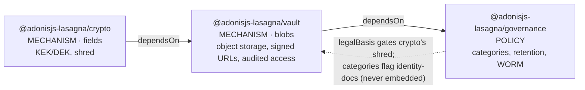
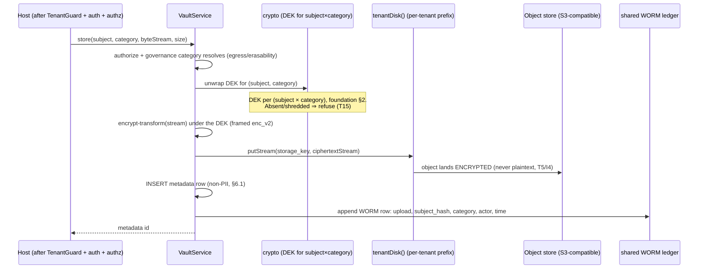
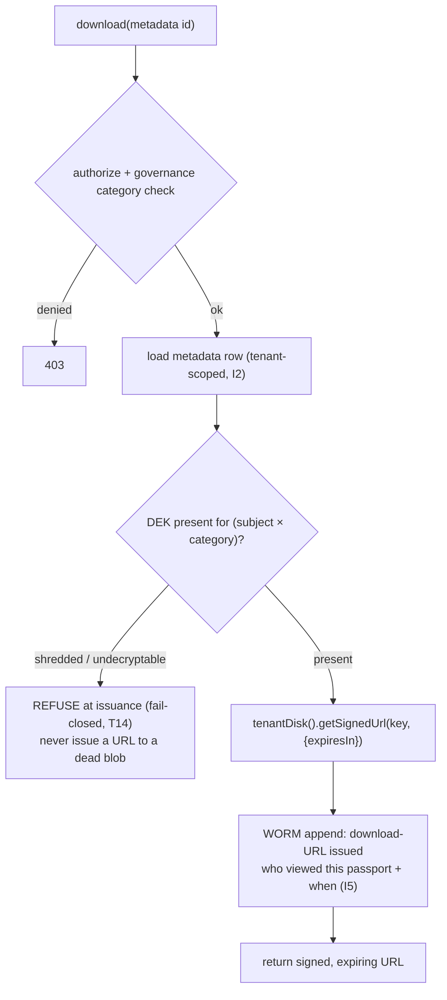

# lasagna-vault Architecture

This is the "why" behind `@adonisjs-lasagna/vault`, the blob-storage MECHANISM satellite for Lasagna.
It is drafted against the shared foundation at
[`00-foundation.md`](./00-foundation.md), and where this document and that
foundation disagree, the foundation is right and this document is the bug, exactly as
`packages/ai/ARCHITECTURE.md` governs itself against the AI code.

It is written to be read, not just searched, in the same register as the AI architecture doc: the
problem, the tempting wrong answer, why that answer leaks or fails, then the design chosen. No
marketing. No em-dash separators.

> **Status.** This is a DESIGN document, authored before the code. No `@adonisjs-lasagna/vault`
> package exists yet (`packages/vault/` is not created); the sibling `crypto` and `governance` packages
> are also design-only. Every file path this doc points AT that lives under `packages/vault/` is a
> planned artifact; the paths it reuses (core, backup, ai) are real and verified. The satellite NAME and
> several open decisions (§12) are still the user's to resolve, so `vault`, `documents`, `objects`, and
> `locker` are all still on the table. The governance and freeze rules are at the bottom.

If you learn one thing here, learn that **vault is almost entirely COMPOSITION.** It stores no blob
bytes in Postgres, ships no new cipher, ships no new object-store client, and ships no new SSRF guard.
It is `tenantDisk()` for per-tenant prefixing and signed URLs, crypto's per-`(subject × category)` DEK
for encrypt-before-upload, the backup package's per-tenant operation lock and name guard for the
mutating paths, `safe_fetch.ts` for the outbound it actually owns, the shared WORM ledger for the
access trail, and a per-tenant metadata table placed by `tableLocation`. The only genuinely new surface
is the metadata row and the encrypt-then-stream-to-object-store flow that stitches those rails
together. Every place vault would duplicate backup or drive is called out explicitly, because
duplicating a rail is the design mistake this document exists to prevent.

> **Naming.** The name `vault` collides with HashiCorp Vault, which is also one of crypto's own
> `KeyProvider` backends, so this doc uses `vault` as a placeholder and treats the final name
> (`documents` / `objects` / `locker` / `vault`) as an open decision (§12, foundation §11 decision 1).

## 1. Purpose and scope

vault is a MECHANISM. It protects BLOBS the way crypto protects fields: per-tenant object storage,
at-rest encryption under crypto's key hierarchy, signed and expiring download URLs, and an audited
access trail. It carries no compliance opinion. It does not decide whether storing a passport scan is
lawful, whether a blob may be erased, or how long it must be kept. Those are POLICY, owned by
governance, which vault CONSULTS at erase and retention time. vault stores bytes; the destruction of a
blob is crypto's single gated shred (§3), which vault's storage layer reclaims after the fact.

The concrete driver: the Moroccan car-rental SaaS stores passport scans, car registrations, insurance
documents, SIGNED RENTAL CONTRACTS, and damage photos as blobs. Some of those are `legal-obligation`
evidence with a 10-year retention (the signed contract); some are `consent`-basis and erasable on an
RTBF request (a marketing photo). vault must serve and encrypt each one, and let each one be destroyed
under the policy governance declares, without ever putting the blob bytes in a place a crypto-shred
cannot reach.

### What this does NOT do

- **It does not store blob bytes in Postgres.** Postgres holds only metadata (§6). Blob bytes live in
  S3-compatible object storage.
- **It does not ship a cipher.** Encryption is crypto's enc_v2 under the `(subject × category)` DEK.
  vault writes no low-level crypto (foundation §2.2, §6). The framed-stream envelope for large files is
  crypto's to define (§6.5); vault consumes it.
- **It does not decide erasability or retention, and it does not own the erasure.** Cryptographic
  erasure IS crypto's single gated shred of the DEK row (foundation §2.4). governance owns `legalBasis`
  and `retention_until`. vault's object-delete is best-effort reclamation of now-inert ciphertext that
  runs UNDER crypto's shred, never a second erasure authority (§3).
- **It does not ship a second object-store client, SSRF guard, per-tenant prefixer, operation lock, or
  audit chain.** It reuses `tenantDisk()`, `safe_fetch.ts`, backup's `withTenantOperationLock`, and the
  shared WORM ledger (§8).
- **It does not guarantee erasure of copies Lasagna does not manage.** The host's plaintext caches,
  thumbnails it generated itself, CDN edge caches it configured, logs, and downstream systems are out of
  scope (§10 honesty bound).
- **It is not "compliant".** Compliance is a property of the operator, never of a library. vault
  provides the pieces (foundation framing principle).

## 2. Position in the platform

vault sits in the middle of the data-protection DAG.



- **`dependsOn: ['@adonisjs-lasagna/crypto']`**, declared in vault's `lasagnaSatellite` manifest
  (`packages/core/src/sdk/manifest.ts` parses `dependsOn`). The manifest's cycle-check and
  dependency-order boot crypto's provider (and its KeyProvider + wrapped-DEK table) before vault's, so a
  DEK is available whenever vault encrypts a blob.
- **`satelliteApi: 1`**, one manifest and one `SatelliteProviderContract`
  (`register` / `boot` / `start` / `ready` / `shutdown`), like every other satellite. `boot()` registers
  the `VaultService`; `after:provision` (via the `HookRegistry`) creates the tenant bucket/prefix
  (§6.4); `ready()` wires the retention and lifecycle listeners governance drives.
- governance depends on vault (not the reverse), so vault never imports the governance package. The
  dotted back-edge is a runtime data flow: governance's `legalBasis` gates crypto's shred (§3), and its
  category registry flags which blobs are `identity-docs` that the AI path must never embed (§9). vault
  reads no governance internals; it consults the category basis through the gate crypto exposes.

**Which core seams vault reuses vs what it adds.** vault adds exactly two things: the metadata table
(§6.1) and the encrypt-then-stream flow (§6.2). Everything else is reuse: `tenantDisk()` for prefixing
and signed URLs, crypto's DEK and enc_v2 for encryption, backup's lock and name guard for the mutating
paths, `safe_fetch.ts` for the outbound it owns, the shared WORM ledger for the access trail, and
`tableLocation` for the metadata table's placement. The full seam inventory with reuse verdicts is §8.

## 3. Threat model

The attack surface for a per-tenant blob store. Each vector maps to the invariant or guard that covers
it. Mitigations in **bold** reuse a rail that exists today.

| # | Vector | Attacker capability | Enforced by |
|---|---|---|---|
| T1 | Cross-tenant blob read: fetch tenant B's passport scan while acting as tenant A | authenticated user of A, forges a storage key or a metadata id | I1 (per-tenant prefix via **`tenantDisk()`**), I2 (metadata placed by **`tableLocation`**, tenant-scoped query), `guard.vault_scope_mismatch` |
| T2 | Path traversal in the storage key: `../` out of the tenant prefix to another tenant's or the host's objects | supplies a crafted key/filename | **`assertSafeIdentifier`** on the tenant id in the prefix (drive_bootstrapper `tenantPrefix()`) + a `FILE_PATTERN`-style key guard mirroring backup, I1 |
| T3 | Direct object-store access: read the blob straight from the bucket, bypassing vault's audit and expiry | knows or guesses the bucket + key | I3 (bucket never public; served ONLY via signed+expiring URLs), I4 (bytes are ciphertext, useless without the DEK) |
| T4 | Signed-URL abuse: replay a leaked URL, or widen its scope | intercepts a signed URL | short expiry on every issued URL (I3); each issuance is audited (I5), so a leaked-URL blast radius is bounded and attributable |
| T5 | Plaintext-at-rest in the object store: read the raw object after a bucket compromise | compromises the S3 credentials / bucket | I4 (encrypt-under-DEK BEFORE upload; the object store never sees plaintext) |
| T6 | Shred-incomplete: erase the DEK but the blob survives decryptable somewhere | relies on a copy vault forgot | I4 makes the blob ciphertext-only, so crypto destroying the `(subject × category)` DEK (its O(1) shred, foundation §2.4) kills the blob AND its backup at once; §10 honesty bound states what is out of scope |
| T7 | Unaudited access: view a passport scan with no record of who or when | any authorized viewer | I5 (per-download Isthmus + WORM audit event; "who viewed this passport and when") |
| T8 | Legal-hold erasure: destroy a `legal-obligation` blob (a signed contract in retention) on an RTBF request | a subject invokes RTBF | I6 (crypto's shred is gated by governance `legalBasis`; refuses under hold; vault's delete never runs because the DEK was never shredded), `guard.vault_blob_legal_hold` as a backstop, foundation §3 |
| T9 | OOM / resource exhaustion via large-file buffering: upload a multi-GB damage-video to blow the app's heap | uploads a huge file | I7 (streaming encrypt + `putStream`, never a full-buffer read), quota bound |
| T10 | Identity-doc exfiltration into the AI path: a passport scan becomes a RAG embedding | drives the AI ingestion path | I8 (identity-docs is an egress-ineligible governance category enforced at the AI embedding entry point; governance declares, the AI-side guard enforces), foundation §9 |
| T11 | SSRF via a KeyProvider HTTP backend or a remote object store not fronted by Drive | influences an outbound host | **`safe_fetch.ts`** pinned mode for the vault outbound it owns, `guard.outbound_fetch`, no second SSRF guard (§9 scopes what this does and does not cover) |
| T12 | Concurrent mutate corruption: a delete and a retention-driven reclaim race on the same blob | triggers two ops at once | **`withTenantOperationLock`** (backup's per-tenant lock) around every mutate, `guard.vault_operation_locked` |
| T13 | Metadata as a PII store: put the plaintext filename / passport number in the metadata row, making it un-erasable | writes rich metadata | I2 metadata column allowlist is non-PII (`content_hash`, not content); `check-vault-invariant-2` scans the stub. `subject_id` is a deliberate pseudonymous tombstone-link, not PII (§6.1) |
| T14 | Undecryptable blob served as if intact: the DEK is gone (shredded/rotated) but vault streams the ciphertext to a client on the proxied path | requests a shredded blob | fail-closed decrypt (crypto's `decryptStrict`): a missing/undecryptable DEK REFUSES the proxied download, never serves plaintext (§9) |
| T15 | Shred-then-write reintroduction: after a subject's category DEK is shredded, race a late upload in to resurrect the category under a fresh DEK | drives an upload right after erasure | fail-closed upload: an upload whose `(subject × category)` DEK is absent/shredded is REFUSED (§9), so a post-erasure write cannot re-consent a subject without an explicit re-consent path |

## 4. Invariants

Each invariant is a property that cannot change without a version bump and a migration note (§12). Each
has a statement, the reason, and how it is enforced (a structural guard name or a runtime seam),
mirroring the AI doc's `I1..I8`.

**I1. Blobs are per-tenant, scoped by the active driver and the tenant prefix, never global.** Object
keys are prefixed `tenants/{tenant.id}/` by `tenantDisk()` (`TENANT_DRIVE_PREFIX = 'tenants/'`), and the
tenant id is `assertSafeIdentifier`-checked before it lands in a path component (drive_bootstrapper
`tenantPrefix()`), so a malformed id can never escape the tenant folder. There is never a shared,
unprefixed blob namespace. Enforced by: reuse of `tenantDisk()` (never a raw `drive.use()` in vault src)
plus `check-vault-invariant-1` (no raw `drive.use(`, no direct `@aws-sdk/client-s3` import, and no
hardcoded `tenant_` schema/prefix literal in vault src).

**I2. Blob bytes never live in Postgres; the metadata table is per-tenant via `tableLocation` and
non-PII.** Postgres stores only `{ id, tenant_id, subject_id, category, storage_key, content_hash,
size, created_at, retention_until }` (§6.1), placed by `driver.tableLocation(tenant)` (SEAM-1), never a
hardcoded `tenant_<id>` schema. No column carries plaintext content or a plaintext filename. `subject_id`
and `category` are stored plaintext deliberately: they are pseudonymous linking VALUES (not namespaces),
exactly as the wrapped-DEK table keeps them (foundation §2.3), and they survive a shred as a tombstone
link. "non-PII" here means no directly-identifying content, not that `subject_id` is anonymous. Enforced
by: `check-vault-invariant-2` (the migration stub has no `bytea`/`blob`/large-object column and its
column set is the reviewed allowlist, the same shape `check-ai-invariant-5` uses for `ai_audit_logs`).

**I3. Blobs are served only via signed, expiring URLs; the bucket is never public.** Every download
issuance is a `tenantDisk().getSignedUrl(...)` with a bounded expiry (§6.3). vault never returns a
public URL (`getUrl`) and never leaves the bucket world-readable. Enforced by: `check-vault-invariant-3`
(vault src issues downloads only through `getSignedUrl`, never `getUrl`/public visibility) and a runtime
assertion that every issued URL carries an expiry.

**I4. Blob bytes are encrypted under the `(subject × category)` DEK BEFORE upload.** The object store
never sees plaintext. The same enc_v2 primitive crypto uses for fields
(`packages/core/src/utils/crypto.ts`) encrypts the byte stream under the DEK crypto yields for that
`(subject × category)`. Because the object is ciphertext, crypto destroying the DEK (its O(1) shred)
makes the blob AND every backup of it irrecoverable at once (foundation §2.4). This is WHY app-side
encryption, not bucket SSE-KMS, is the design (foundation §11 decision 5): SSE-KMS holds one
bucket/object key, so it cannot express per-`(subject × category)` key destruction. Enforced by:
`check-vault-invariant-4` (every upload path in vault src passes through the encrypt-under-DEK helper
before `put`/`putStream`; no raw plaintext `put`).

**I5. Every blob access (upload, download-URL issuance, delete) is audited in the shared WORM ledger
with attribution.** "Who viewed this passport and when" is an audited, immutable fact. The audit row is
the shared, hash-chained, append-only, trigger-protected WORM ledger, which lives PHYSICALLY in the
shared `backoffice` schema keyed by a `tenant_id` column with `UNIQUE(tenant_id, seq)`, NOT placed by
`tableLocation` (it must survive tenant purge and resist DROP by the tenant role, exactly as
`ai_audit_logs` already is: see `ai_audit_writer.ts` lines 16-18). vault imports and calls the shared
`WormLedgerWriter` directly and synchronously on the access path (so the append is fail-closed), storing
`subject_hash`, `category`, `action`, actor, and time, never the blob content. Enforced by: the WORM
ledger's own DB triggers + hash chain (the shared implementation, not a fork) and `check-vault-invariant-5`
(every mutate/serve path emits a WORM append; the ledger column set stays non-PII).

**I6. Cryptographic erasure is crypto's single gated shred; vault's object-delete is reclamation under
it, never a second erasure authority.** Erasure of a blob IS crypto destroying the `(subject × category)`
DEK row, gated at step 1 of that shred by governance `legalBasis` (foundation §2.4 step 1, §3). Once the
DEK is gone the object bytes are inert. vault's object-store delete is best-effort reclamation of that
now-inert ciphertext, invoked AFTER crypto's shred authorizes; it does NOT re-adjudicate `legalBasis`. A
`legal-obligation` category within retention is never shredded, so vault's delete never runs for it.
Enforced by: the single legal-hold gate lives in crypto's shred (foundation §3), and
`check-vault-invariant-6` (no `delete`/destroy of an object in vault src runs except as reclamation
invoked by the shred/retention path, never on an independent vault-side legalBasis check).
`guard.vault_blob_legal_hold` is a defense-in-depth BACKSTOP that mirrors, never overrides, crypto's
authoritative gate (§9).

**I7. Large blobs stream; vault never fully buffers a blob in memory.** Upload and download are streamed
(encrypt-in-a-transform + `putStream` / `getStream`), so a multi-GB file never lands whole on the heap
(§6.5). Enforced by: `check-vault-invariant-7` (vault src uses `putStream`/`getStream` for the blob body,
never `getArrayBuffer`/`get` that returns the whole buffer on the large-file path; both are real
`KEYED_METHODS`, so the guard distinguishes them structurally).

**I8. An identity-document blob is never an embedding, enforced where the embedding entry point lives.**
A passport scan is a governed `identity-docs` category blob in vault, never text handed to the AI
ingestion path. This is a TWO-guard invariant, split by where the enforcing symbol actually exists
(foundation §9 control 2). governance owns the DECLARATION: its category registry marks `identity-docs`
as egress-ineligible (`embeddable: false`), and `check-governance-invariant-9` asserts the exported
category contract cannot default an identity document to embeddable. The AI package owns the
ENFORCEMENT: the embedding entry point (`packages/ai/src/services/embedding_ingestion_service.ts`, fed by
`residency_gate.ts`) refuses any body flagged egress-ineligible, and an AI-side structural guard asserts
it. vault's honest contribution is the category MARK plus a runtime fail-closed refusal, NOT a vault-src
static scan: vault does not depend on AI, so an "AI embedding entry point" is not a symbol reachable in
vault src, and a scan for a call vault can never contain would pass vacuously. There is therefore no
`check-vault-invariant-8`; I8 is enforced by governance's declaration guard plus the AI-side ingestion
guard.

## 5. Structural guards

One `check-vault-invariant-N.mjs` per vault-enforceable invariant, each following the shape of
`scripts/check-ai-invariant-5.mjs`: a PURE `auditor(files)` function (a list of `{ path, source }` in, a
list of problem strings out) that a focused unit test drives without a filesystem, plus a `run()` that
reads the real files and `process.exit(1)` on any problem. All are STRUCTURAL (scan source/stubs for a
required call, a forbidden column, a hardcoded namespace), never regex leak-detection theater. All are
wired into `scripts/check.mjs`. I8 has no vault-src guard by design (see I4 above); its guards live in
governance and AI.

| Guard | Scans | Fails when |
|---|---|---|
| `check-vault-invariant-1` | vault `src/**` | a raw `drive.use(` (bypassing `tenantDisk()`), a direct `@aws-sdk/client-s3` import (a parallel object-store client), or a hardcoded `tenant_` schema/prefix literal (I1) |
| `check-vault-invariant-2` | the metadata migration stub | a `bytea`/`blob`/large-object column is present (blob-in-PG), or a column falls outside the reviewed allowlist (I2, T13) |
| `check-vault-invariant-3` | vault `src/**` | a download path uses `getUrl`/public visibility instead of `getSignedUrl`, or issues a signed URL with no expiry (I3) |
| `check-vault-invariant-4` | vault `src/**` | an upload calls `put`/`putStream` on a body that did not pass the encrypt-under-DEK helper (I4) |
| `check-vault-invariant-5` | vault `src/**` + the shared WORM ledger stub | a mutate/serve path has no WORM append, or the ledger column set is not the reviewed non-PII allowlist (I5) |
| `check-vault-invariant-6` | vault `src/**` | an object delete runs on an independent vault-side legalBasis check instead of as reclamation invoked by crypto's shred / the retention pass (I6, T8) |
| `check-vault-invariant-7` | vault `src/**` | a blob body is read via `getArrayBuffer`/`get` (full buffer) on the large-file path instead of `getStream`/`putStream` (I7, T9) |

The identity-doc no-embed invariant (I8) is enforced by `check-governance-invariant-9` (declaration:
identity-docs is egress-ineligible) plus the AI-side ingestion guard (enforcement), NOT a vault-src
scan, because the embedding entry point is not a symbol reachable in vault src.

## 6. Key and data model

vault's data model is deliberately thin: a metadata table, an encrypt-then-stream upload flow, a
signed-URL download flow, and a bucket/prefix created at provision. It reuses crypto's key hierarchy
verbatim (foundation §2) and adds no key material of its own.

### 6.1 The metadata-only table (blobs never in Postgres)

The tempting wrong answer is a `bytea` column: put the blob in Postgres so it is transactional and
backed up with the schema. That is wrong on three counts. It bloats the tenant schema and every
`pg_dump` (backup's `pg_dump` would now carry gigabytes of scan images), it defeats streaming (a `bytea`
is read whole, T9/I7), and it puts plaintext bytes in a place crypto-shred cannot neutralize per
`(subject × category)`. The correct answer is metadata in Postgres, ciphertext bytes in object storage.

The metadata table is per-tenant, placed by `driver.tableLocation(tenant)` (SEAM-1,
`packages/core/src/services/isolation/driver.ts`), NEVER a hardcoded `tenant_<id>` schema. It ships as a
per-tenant satellite migration (`perTenantMigrations`, SEAM-2), so it lands in whatever placement the
active driver reports (`schema` / `database` / `rowscope` / `connection`), the same discipline crypto's
wrapped-DEK table uses. (This is distinct from the WORM ledger, which is a shared-backoffice table keyed
by `tenant_id` and is NOT placed by `tableLocation`, §6.6.)

| Column | Type | Meaning |
|---|---|---|
| `id` | uuid PK | the blob's metadata id (what the app references, not the storage key) |
| `tenant_id` | text | the owning tenant (the discriminator under `rowscope`, `assertSafeIdentifier`-checked at write) |
| `subject_id` | text | the data-subject (`SubjectId`); selects the DEK's subject axis. A pseudonymous linking value, plaintext, survives a shred as a tombstone link |
| `category` | text | the governance `CategoryKey`; selects the DEK's category axis and drives retention/erasability |
| `storage_key` | text | the object key under the tenant prefix (`tenants/{id}/...`); server-derived, never client-supplied verbatim |
| `content_hash` | text | a sha256 of the PLAINTEXT bytes, for integrity/dedup; a one-way digest, not the content (documented residual below) |
| `size` | bigint | plaintext byte length, for quota and range accounting |
| `created_at` | timestamptz | provenance |
| `retention_until` | timestamptz null | the governance-declared retention floor for this blob's category; the retention pass (governance) reads it |

There is no `bytea`, no `filename`, no `content` column. The plaintext filename is host-facing display
text; if the host wants it, it lives in the host's own model, not in vault's metadata (T13). A
`UNIQUE (tenant_id, storage_key)` constraint makes the key singular per tenant, mirroring the DB-UNIQUE
discipline the AI vector store uses.

**Documented residual on `content_hash`.** `content_hash` is a sha256 of the PLAINTEXT bytes. For a
low-entropy blob class (a standardized single-page ID form, a fixed contract template) that is a
correlation and known-plaintext oracle: equal plaintexts share a hash, so a DB reader sees which blobs
are byte-identical across subjects or tenants, and it survives a shred. This is the same class of
residual the foundation flags for the deterministic search HMAC (foundation §10.2), stated honestly, not
silently. An operator who does not need cross-blob dedup can drop or key the hash; vault does not oversell
it as opaque.

### 6.2 Encrypt under the `(subject × category)` DEK before upload

The byte stream is encrypted under the DEK crypto yields for `(subject, category)` BEFORE it reaches the
object store, using the SAME enc_v2 primitive core ships (`packages/core/src/utils/crypto.ts`:
AES-256-GCM, HKDF, `keyId` in the envelope, header-as-AAD). vault writes NO new cipher (foundation §6).
The DEK is unwrapped by crypto's `KeyProvider` on demand and never persisted in vault.



Because the object is ciphertext under a `(subject × category)` DEK, a crypto-shred of that DEK
(foundation §2.4) makes the object AND its `pg_dump`-captured metadata-only backup unrecoverable at once.
The object store keeps inert bytes; there is no key to read them. This is the whole reason app-side
encryption is forced over SSE-KMS (foundation §11 decision 5): only a per-`(subject × category)` DEK can
be destroyed for one subject-category while another survives.

If the `(subject × category)` DEK is absent because it was deliberately shredded, the upload is refused
fail-closed (T15, §9): a post-erasure write must not resurrect a subject's category under a fresh DEK
without an explicit re-consent path the host drives, so the erasure cannot be silently undone by a racing
write.

### 6.3 The signed and expiring URL download flow

Downloads are served ONLY through `tenantDisk().getSignedUrl(storage_key, { expiresIn })`
(drive_bootstrapper wraps `getSignedUrl` as a `KEYED_METHOD`, so the tenant prefix is applied
automatically). The bucket is never public and vault never returns a bare `getUrl`. Every issuance is a
bounded-expiry URL and is audited (§6.6), so a leaked URL expires and its issuance is attributable (T4).



**The two download modes, and why proxied-decrypt is the default.** A signed URL streams the OBJECT
bytes, which are enc_v2 ciphertext, from the store. For the client to use the blob, decryption must
happen somewhere. vault supports two modes.

- **Proxied-decrypt (the default).** vault streams the object through the app (`getStream` +
  decrypt-transform), so the client gets plaintext over the app connection and the signed URL, if used
  at all, is internal-only. This preserves I4 (the store only ever holds ciphertext), I7 (it streams),
  and T14 (the fail-closed DEK-presence check runs on the app path before any byte reaches the client),
  at the cost of egress through the app. This is the recommended mode and holds all the invariants
  without caveat.
- **Direct-signed ciphertext (an explicit per-category opt-in).** vault hands the client a signed URL to
  the raw enc_v2 object. This is cheaper (no app egress) but the client fetches ciphertext the app never
  touches at stream time, so it is only viable when a SEPARATE client-facing protection (a distinct SSE
  layer, not the app DEK) makes the bytes usable to the client. It does NOT relocate the app DEK to the
  client: doing so would break the KEK/DEK model (the DEK is unwrapped only inside the app via crypto's
  KeyProvider, foundation §2.1) and undercut the O(1)-shred guarantee (a client holding the DEK keeps
  decrypting after a shred). So direct mode serves only INERT-or-authorized ciphertext: the T14 check
  runs at URL ISSUANCE (the flow diagram, before `getSignedUrl`), the URL carries a short expiry, and
  after a crypto-shred the bytes a still-valid URL fetches are inert (the DEK is gone). Blobs under the
  crypto-shred guarantee should use proxied-decrypt; direct mode is gated behind an explicit
  per-category opt-in and its blobs are outside the app-DEK shred guarantee (their protection is the
  separate SSE layer the operator configured).

Whichever mode, the bucket is never public (I3) and the DEK-absent case is fail-closed at issuance (T14).

### 6.4 Bucket and prefix creation on `after:provision`

At tenant creation, the `HookRegistry`'s `after:provision` hook
(`packages/core/src/services/hook_registry.ts`) creates the tenant's storage prefix (and, under
one-bucket-per-tenant, its bucket). The per-tenant prefix `tenants/{id}/` is already the free, default
model `tenantDisk()` gives (drive_bootstrapper `TENANT_DRIVE_PREFIX`); a dedicated bucket per tenant is
the harder-blast-radius, higher-cost alternative (open decision §12, foundation §11 decision 4). vault
does not re-invent per-tenant prefixing; it hooks provision to stake out the prefix and, if needed,
create the bucket.

### 6.5 The streaming path for large files (avoid OOM)

Damage videos and high-resolution scans can be large. The tempting wrong answer is `getArrayBuffer` on
read and a whole-`Buffer` on write: encrypt the full buffer, then `put`. That OOMs the app on a multi-GB
upload (T9) and violates I7. The correct answer is a streamed pipeline.

- **Upload:** the incoming byte stream is piped through an encrypt transform (framed enc_v2 under the
  DEK) into `tenantDisk().putStream(storage_key, cipherStream)`. The plaintext never fully materializes;
  the heap holds one cipher frame at a time. This mirrors backup's own streaming discipline: its
  `#uploadToS3` uses `createReadStream(filePath)` as the `PutObjectCommand` body, and its
  `#downloadFromS3` uses `pipeline(Readable.from(res.Body), createWriteStream(destPath))`, never a
  whole-file buffer.
- **Download (proxied-decrypt mode):** `tenantDisk().getStream(storage_key)` is piped through a decrypt
  transform to the response, again one frame at a time.

vault does not re-implement streaming; it composes `putStream`/`getStream` (already in
drive_bootstrapper's `KEYED_METHODS`) with an enc_v2 transform. The one subtlety is that GCM
authenticates the whole payload, so a single GCM tag over an unbounded stream cannot be verified until
the last byte, which defeats streaming and buffers implicitly. The streamed scheme must therefore be a
FRAMED enc_v2 envelope: each frame is an independent GCM seal with a frame counter in the AAD (so
reorder or truncation is detected). A framed AEAD over core's AES-256-GCM primitive is COMPOSITION of the
existing cipher, not a new cipher, so it does not violate foundation §6's "one cipher, and it is core's"
rule. crypto owns the cipher, so crypto owns the exact frame format and documents it in its own §6;
vault consumes that envelope and does not define its own (whether it lands in the crypto 1.0 window or
vault waits on it is an open decision, §12).

### 6.6 The access audit ("who viewed this passport and when")

Every upload, every download-URL issuance, and every delete appends one row to the shared WORM ledger.
vault does NOT fork a second hash-chain. The ledger is the generalization of `ai_audit_writer.ts`: a
per-tenant sha256 hash chain (`seq` + `checksum` linked to `prev_checksum`), a transaction-scoped
advisory lock serializing tail-read + insert per tenant, three append-only DB triggers (`BEFORE UPDATE`,
`BEFORE DELETE`, statement-level `BEFORE TRUNCATE`, each `RAISE EXCEPTION` regardless of role),
fail-closed writes, a `verify()` re-walk, and best-effort external anchoring via the kernel
`AuditLogDestinationRegistry`.

Two placement facts matter, both taken from how `ai_audit_writer.ts` actually works (lines 16-18):

- **Physical placement is shared-backoffice, keyed by `tenant_id`, NOT `tableLocation`.** The ledger is
  "per-tenant" in the LOGICAL sense (a per-tenant hash chain via a `tenant_id` column and
  `UNIQUE(tenant_id, seq)`), not the physical sense. It lives in the shared `backoffice` schema so it
  survives `tenant:purge-expired` and the tenant request role cannot DROP it. Only vault's blob-metadata
  table (§6.1) uses `tableLocation`; the ledger does not.
- **vault imports and calls the shared writer directly, without importing the governance package.** The
  shared `WormLedgerWriter` is a GENERALIZED module that lives in a package BELOW crypto in the DAG (core,
  or a shared low leaf), so crypto and vault can import it without a cycle (governance is the DAG SINK,
  depended on by nobody, so importing the governance package would be a cycle). governance "owns" the
  ledger as its maintainer and productizing home, NOT in the sense that callers depend on the governance
  package. This is what keeps the access append SYNCHRONOUS and FAIL-CLOSED on the request path: an async
  event listener in governance could not fail-closed the access, so the writer must be a directly-callable
  module, not an event governance records after the fact.

The row is non-PII: `subject_hash`, `category`, `action`
(`blob_uploaded` | `blob_url_issued` | `blob_deleted`), actor, `occurred_at`, and the chain checksum,
never the blob content and never the plaintext filename. Because the ledger holds only hashes and the
audit chain, keeping it forever leaks nothing (foundation §4), and it survives a shred: after the DEK is
destroyed the ledger still records that the blob existed and who touched it, but the bytes are inert.
This is the generalization of the AI audit's G1 resolution from AI ops to blob access.

## 7. Public surface

### Config

```ts
export function defineVaultConfig(config: VaultConfig): VaultConfig
export type MultitenancyConfigWithVault = MultitenancyConfigWithX<'vault', VaultConfig>
```

`defineVaultConfig` is the identity helper (no runtime effect) that `check-satellite-config-wiring.mjs`
enforces, with a `SatelliteConfigRegistry` module augmentation and a `MultitenancyConfigWithVault` type,
exactly as `defineAiConfig` / `MultitenancyConfigWithAi`. `VaultConfig` carries: the disk name (which
`@adonisjs/drive` disk backs the blobs), the default signed-URL `expiresIn`, the download mode
(proxied-decrypt default vs the direct-signed per-category opt-in, §6.3), the bucket model (shared-prefix
vs bucket-per-tenant, §6.4), and per-plan quota on blob count and total bytes.

### Ace commands

- `tenant:vault:orphans` — list metadata rows with no backing object, and objects with no metadata row
  (a reconciliation/doctor pass, tenant-scoped, read-only).
- `tenant:vault:retention:sweep` — a DISCOVERY and DELEGATION pass, not a vault-owned destroy: it finds
  blobs whose `retention_until` has passed and, for erasable categories, hands the `(subject × category)`
  list to crypto's gated shred (foundation §2.4, §3); vault then reclaims the now-inert objects.
  Consistent with I6, the erasure authority is crypto's shred, not this command. Runs under the
  per-tenant operation lock.

### Services

- `VaultService` (registered in `boot()`, resolved via `container.make`, never `new`-ed ad hoc):
  `store(subject, category, stream, size)`, `issueDownloadUrl(id)`, `delete(id)`, and
  `reclaimForSubjectCategory(subject, category)` — the storage-reclamation half invoked by crypto's shred
  / governance's per-subject orchestration AFTER the DEK is shredded, which deletes the now-inert objects
  and does NOT re-adjudicate `legalBasis` (I6).

### Events / isthmus guards

vault mirrors the kernel registry to add a satellite-local `vault_guard_registry.ts` (id type
`` `guard.vault_${string}` ``, `pillar: 'guard'`, event `isthmus:guard:vault_<name>:rejected`, dispatched
on the kernel's PUBLIC `IsthmusGuardTripped` event), exactly as `ai_guard_registry.ts` does. The guards:

| Guard id | Event | Fail mode | Trips when |
|---|---|---|---|
| `guard.vault_scope_mismatch` | `isthmus:guard:vault_scope:rejected` | closed | a metadata query or storage key resolves to a tenant other than the active scope (T1) |
| `guard.vault_blob_unencrypted` | `isthmus:guard:vault_unencrypted:rejected` | closed | an upload reached `put`/`putStream` without passing the encrypt-under-DEK helper (I4, defense against a mis-wire) |
| `guard.vault_blob_legal_hold` | `isthmus:guard:vault_legal_hold:rejected` | closed | a reclaim/delete is requested for a `legal-obligation` category whose DEK was NOT shredded; a BACKSTOP that mirrors crypto's authoritative gate, never a second authority (T8, I6) |
| `guard.vault_dek_unavailable` | `isthmus:guard:vault_dek_unavailable:rejected` | closed | a download issuance or an upload finds the `(subject × category)` DEK shredded/undecryptable; refuse rather than serve/write (T14, T15) |
| `guard.vault_operation_locked` | `isthmus:guard:vault_operation_locked:rejected` | closed | a concurrent mutate is rejected by the per-tenant operation lock (T12) |
| `guard.vault_quota_exhausted` | `isthmus:guard:vault_quota:rejected` | closed | a plan's blob-count or byte cap is hit before the write (T9 storage half) |

`guard.outbound_fetch` (a KeyProvider HTTP backend or a remote object store blocked by the SSRF pin) is
deliberately NOT a vault registry entry: the refusal happens and emits inside `safe_fetch.ts`, and a
satellite entry would double-count one rejection, the same thinness discipline `ai_guard_registry.ts`
applies to `byok_endpoint_blocked`.

## 8. Reused core seams

The rule across all three data-protection satellites: NEVER build a second crypto stack, a second audit
chain, a second SSRF guard, a second per-tenant prefixer, or a second signed-URL flow. vault is almost
entirely this table.

| Seam (file) | Verdict | What it gives · what must NOT be duplicated |
|---|---|---|
| `packages/core/src/services/bootstrappers/drive_bootstrapper.ts` | extend | `tenantDisk()` prefixes every key `tenants/{id}/` (`TENANT_DRIVE_PREFIX`) and validates the id with `assertSafeIdentifier`; `getSignedUrl`, `putStream`, `getStream`, `getArrayBuffer`, `getUrl` are already wrapped `KEYED_METHODS`. vault BUILDS ON this for per-tenant storage, signed URLs, and streaming. **Do not re-invent per-tenant prefixing, signed-URL issuance, or the streaming disk methods.** |
| `packages/core/src/utils/crypto.ts` | reuse-as-is | enc_v2 AES-256-GCM + HKDF, `keyId` in envelope, header-as-AAD. vault encrypts blob bytes under the DEK with THIS. **Write NO new low-level cipher.** The framed-stream envelope for large files is crypto's to define and own (§6.5); vault consumes it. |
| crypto's `KeyProvider` + wrapped-DEK table (foundation §2) | reuse-as-is | the DEK per `(subject × category)`, unwrapped on demand, destroyed by crypto's O(1) gated shred. vault asks crypto for the DEK; **it holds no key material and ships no shred of its own** (erasure is crypto's shred; vault reclaims after it, §3). |
| `packages/backup/src/services/tenant_operation_lock.ts` | reuse-as-is | `withTenantOperationLock(tenantId, op, fn, { failClosed })`: Redis `SET key token NX PX ttl` per-tenant mutex, `TenantOperationLockedException`, fail-closed on Redis-down for destructive ops. vault wraps every mutate (upload/delete/retention reclaim) with THIS. **Do not ship a second lock.** Reclaim/delete are destructive, so they pass `failClosed: true`. |
| `packages/backup/src/services/backup_service.ts` | reuse-pattern | the `FILE_PATTERN` name guard (`/^[A-Za-z0-9._-]+\.dump$/`, which rejects `..`/`/`/`\` by character class) and the streamed upload/download (`createReadStream` body, `pipeline` to `createWriteStream`). vault learns the name-guard and streaming DISCIPLINE from here. **Do not fork the backup S3 client; vault's object store is `tenantDisk()` (Drive) EXCLUSIVELY, never a copied raw `@aws-sdk/client-s3` `PutObjectCommand` path** (that would sidestep both `tenantDisk()` prefixing and I1; `check-vault-invariant-1` forbids the direct `@aws-sdk/client-s3` import). The blob store and the backup store are DISTINCT concerns (backup dumps ciphertext schemas; vault stores individual encrypted objects), so vault does not route blobs through `BackupService`. |
| `packages/core/src/utils/safe_fetch.ts` | reuse-as-is | SSRF/egress control (pinned DNS, HTTPS assert, no redirects, streaming on the pinned path). vault reuses it for the outbound it OWNS: a KeyProvider HTTP backend, or a remote object store NOT fronted by the Drive S3 client (§9 scopes this). Registry id `guard.outbound_fetch`. **No second SSRF guard.** |
| the shared `WormLedgerWriter` (generalized from `packages/ai/src/services/ai_audit_writer.ts`, foundation §4.1), living in a package BELOW crypto (core or a shared low leaf) | reuse-as-is | per-tenant sha256 hash chain, advisory lock, three append-only DB triggers, fail-closed writes, `verify()` re-walk, external anchoring via `AuditLogDestinationRegistry`; PHYSICALLY a shared-backoffice table keyed by `tenant_id` (`UNIQUE(tenant_id, seq)`), NOT placed by `tableLocation`. vault IMPORTS and calls it directly (governance owns it as maintainer, not as an import dependency). **Do not fork a second hash-chain, do not import the governance package for it, and do not place the ledger via `tableLocation`.** |
| `packages/core/src/services/isolation/driver.ts` | reuse-as-is | `tableLocation(tenant)` closed union `{schema\|database\|rowscope\|connection}`. ASK it for the blob-METADATA table's placement (NOT the WORM ledger, which is shared-backoffice). **NEVER hardcode `tenant_<id>`.** |
| `packages/core/src/services/hook_registry.ts` | reuse-as-is | `after:provision` to create the tenant bucket/prefix at tenant creation (§6.4). |
| `packages/core/src/services/quota_service.ts` (`QuotaService`) | reuse-as-is | per-plan atomic quota (`consume` atomic Lua, `check`). vault caps blob count and total bytes per plan (T9 storage half), the same way the AI vector store caps embedding count. |
| `packages/core/src/sdk/manifest.ts` + `contract.ts` + `configure_kit.ts` | reuse-as-is | `lasagnaSatellite` manifest (`name`/`satelliteApi`/`perTenantMigrations`/`dependsOn: ['@adonisjs-lasagna/crypto']`/`provider`/`commands`/`configSnippet`) + `SatelliteProviderContract`. One manifest, one provider. |
| `packages/core/src/isthmus/registry.ts` + `packages/ai/src/isthmus/ai_guard_registry.ts` | reuse-pattern | MIRROR the registry to add `guard.vault_*` entries dispatched on the PUBLIC `IsthmusGuardTripped` event. **Do not touch the kernel registry** (closed to satellites). |
| `SatelliteConfigRegistry` augmentation + `defineVaultConfig` + `MultitenancyConfigWithVault` | reuse-pattern | the config wiring `check-satellite-config-wiring.mjs` enforces. |

The single most important reuse note for vault: **it does not lay one meter of parallel track.** The
object store is Drive's, the cipher is crypto's, the lock is backup's, the SSRF guard is core's, the
audit chain is the shared WORM ledger (imported, not forked, from below crypto), and the metadata
placement is the driver's. The two new pieces are the metadata row and the encrypt-then-stream stitch.

## 9. Failure modes

vault is fail-closed on every security-relevant path, choosing the failure mode by what the wrong answer
costs, the same reasoning as the kernel matrix.

| Domain | Policy | Why |
|---|---|---|
| DEK unavailable (shredded / KeyProvider down / undecryptable) on download | Fail-closed at issuance | A download whose `(subject × category)` DEK cannot be unwrapped REFUSES at URL issuance (`guard.vault_dek_unavailable`), never proxies plaintext and never issues a URL to a dead blob. crypto's `decryptStrict` is the primitive: a missing key is a refusal, never a silent fallback (T14). |
| KeyProvider down on upload | Fail-closed | No DEK, no encryption, no upload. vault never writes a plaintext object because the KEK/DEK path is unavailable (I4). |
| DEK deliberately shredded, a late upload races in | Fail-closed | An upload whose `(subject × category)` DEK is absent/shredded is REFUSED (T15). A post-erasure write cannot resurrect a subject's category under a fresh DEK without an explicit host-driven re-consent path, so an erasure cannot be silently undone. |
| Object store down | 503, not 500 | A dead store is a dependency outage (retryable), not an internal error, the same class as backup's S3 failure and the AI provider-outage 503. |
| Legal-hold erasure | Fail-closed, gated in crypto | Erasure is crypto's shred, gated at step 1 by governance `legalBasis` (foundation §3): a `legal-obligation` category within retention is REFUSED there, so its DEK is never destroyed and vault's reclaim never runs. `guard.vault_blob_legal_hold` is a BACKSTOP that refuses a reclaim/delete for a category whose DEK is still present; it mirrors, never overrides, crypto's authoritative gate (I6). If governance cannot resolve the basis, crypto's shred refuses, not vault. |
| Concurrent mutate (lock unavailable) | Fail-closed for destructive ops | Delete and retention reclaim pass `failClosed: true` to `withTenantOperationLock`, so an unserialised reclaim that could race a read is refused (409/503) rather than run. A plain read-only URL issuance does not take the destructive lock. |
| Audit-write failure | Fail-closed | A blob access whose WORM row cannot be written is a failure, not a silent success; the action must be attributable ("who viewed this passport"). The shared ledger emits its guard and rethrows, exactly as `ai_audit_writer` does (foundation §4.1). This is why the append is a synchronous direct call, not an async event (§6.6). |
| SSRF on the vault-owned outbound | Fail-closed | A KeyProvider HTTP backend, or a remote object store host NOT fronted by the Drive S3 client, that resolves to loopback / RFC-1918 / CGN / metadata is blocked by `safe_fetch.ts` pinned mode with no exception. The Drive/S3 client's OWN endpoint is operator-configured and trusted (not attacker-influenced), so it is not routed through `safe_fetch.ts`; §11's SSRF test targets only the vault-owned outbound, not the main Drive blob egress. |
| Quota exhausted | Fail-closed | A plan's blob-count or byte cap trips before the write (`guard.vault_quota_exhausted`). |

The invariant-grade rule worth stating on its own: **a blob is never served without its DEK, never
written after its DEK is shredded, and never reclaimed against a legal hold.** The first keeps a
shredded blob dead (T6/T14), the second keeps an erasure from being silently undone (T15), and the third
(gated in crypto, backstopped in vault) keeps the signed rental contract alive through its retention
(T8, foundation §3).

## 10. Legal mapping

This is a mapping to MECHANISMS, not a compliance claim. The operator, as data controller, decides
whether the mechanism as configured satisfies the obligation.

| Legal requirement (Ley 09-08 / CNDP · GDPR) | vault mechanism |
|---|---|
| Technical security of processing (09-08 art. 23 · GDPR Art. 32) | enc_v2 blob encryption under the per-`(subject × category)` DEK before upload; KEK in a KMS/HSM; object store never holds plaintext |
| Right to erasure / RTBF for a document (GDPR Art. 17) | crypto destroying the `(subject × category)` DEK (its O(1) shred) kills the blob AND its backup at once; vault reclaims the now-inert objects afterward for governance-erasable categories |
| Erasure exemption for legal obligation (GDPR Art. 17(3)(b)) | crypto's shred consults governance `legalBasis`; a `legal-obligation` blob (the signed rental contract) within retention is never shredded, so it survives (I6, §3) |
| Retention limits / storage limitation (09-08 · GDPR Art. 5(1)(e)) | `retention_until` per blob; the retention sweep discovers expiry and hands the list to crypto's shred |
| Access controls on sensitive documents (09-08 · GDPR Art. 32) | signed, expiring URLs only; bucket never public; per-tenant prefix + tenant-scoped metadata (I1, I3) |
| Records of access / accountability (09-08 · GDPR Art. 5(2), Art. 30) | the per-download WORM audit ("who viewed this passport and when"), immutable hash chain (I5) |
| ID-document processing (09-08 · GDPR Art. 9) | identity-doc blobs are a governed egress-ineligible category, encrypted and access-audited, and NEVER embedded into the AI path (I8, §9 below) |

**Honesty bounds (restated).** vault does NOT make the operator compliant. Two bounds in particular:

- **The shred reaches only what Lasagna manages.** Restating the foundation §5 bound verbatim:
  **crypto-shredding erases what Lasagna manages (encrypted fields, encrypted blobs, and their backups).
  It cannot erase plaintext copies the host made, logs, or external indexes. Keeping those out of scope
  is the host's responsibility.** For vault specifically, this means: a thumbnail the host generated and
  stored itself, a copy a client downloaded and kept, a CDN edge cache the host configured in front of a
  signed URL, and anything the host exported downstream are all out of scope. crypto's shred destroys the
  DEK and vault reclaims the object it manages; neither can reach copies vault never held. The
  `content_hash` correlation residual (§6.1) survives a shred and is documented, not hidden.
- **Signed-URL expiry bounds but does not eliminate exposure.** A URL that leaks before it expires is
  usable until expiry, and a client that downloaded the blob has it. The expiry bounds the window and the
  audit attributes the issuance; neither un-downloads a file.

**Morocco has NO GDPR adequacy decision.** Ratifying Convention 108 is not adequacy. EU to Morocco
transfers of documents need Standard Contractual Clauses plus a Transfer Impact Assessment, which are
legal instruments the OPERATOR executes. vault stores blobs where the operator's residency posture
(governance) routes them; it does not make, sign, or satisfy those instruments.

## 11. Testing strategy

vault ships the standard guarantee tree (per project `CLAUDE.md`):
`tests/@guarantees/{isolation|security|behavior|resilience|performance}/{unit|integration}/`,
`tests/@architecture/{boundaries,contracts,docs}/`, `tests/@integration/drivers/`, `helpers/`, plus the
3-line `@architecture/boundaries/vault_guarantee_tree.spec.ts` calling `assertGuaranteeTree`. Every
invariant and every threat vector gets a red-first test.

- **Unit** (`tsx bin/test.ts`, against source): the metadata column allowlist, identifier safety on the
  storage key, the encrypt-transform round-trip under a DEK double, the framed-stream envelope (encrypt
  N frames, decrypt, byte-identical; a reordered/truncated frame is rejected), the signed-URL expiry
  assertion, and the `check-vault-invariant-*` pure auditors driven with in-memory `{ path, source }`
  fixtures (no filesystem), the same way `check-ai-invariant-5`'s `auditAppendOnlyAudit` is unit-tested.
- **Architectural** (static guards under `tests/@architecture/`, run with the unit tier): the
  guarantee-tree pin; `no_silent_vault_guard` (every refusal throw in `src` emits a registered
  `guard.vault_*` event or carries an allowlisted reason, the mirror of the AI `no_silent_ai_guard`);
  and the registry-driven emission matrix so a new vault guard cannot ship without a behavioral test.
- **Integration** (against `./build`, real PostgreSQL + Redis + **MinIO/S3**, via the shared
  `satellite-test-kit` `runIntegrationSuite`): cross-tenant blob isolation (A cannot read B's object or
  metadata, T1); path-traversal rejection (T2); bucket-not-public and signed-URL-only serving (T3);
  encrypt-before-upload verified by reading the raw object and asserting it is ciphertext (T5/I4); shred
  kills the blob (crypto shreds the DEK, assert the proxied download refuses at issuance and the reclaim
  runs, T6/T14); the per-download WORM row is written and non-PII (T7/I5); legal-hold refuses the shred
  in crypto so vault's reclaim never runs (T8/I6); a post-shred upload is refused (T15); the operation
  lock serialises concurrent mutates (T12); the SSRF guard blocks a KeyProvider / non-Drive object-store
  host that resolves private (T11, vault-owned outbound only).
- **Resilience / chaos** (integration specs, `*_chaos`): KeyProvider down on upload and download
  (fail-closed, not plaintext, not URL-issued); object store down (503); Redis down (lock fail-closed for
  reclaim/delete); WORM audit-write failure (blob access fails-closed); the WORM DB triggers reject
  UPDATE/DELETE/TRUNCATE on the access log.
- **Performance** (`tests/@guarantees/performance/`): the large-file streaming path never buffers the
  whole blob (a multi-hundred-MB upload/download under a bounded RSS ceiling, T9/I7), asserting
  `putStream`/`getStream` and not a whole-buffer read.
- **Real-dependency smokes:** MinIO/S3 is a required integration dependency (like pgvector for AI); a
  real KMS (`aws-kms`) KeyProvider smoke is optional and self-skips when no KMS binding is present, the
  convention `*_real.spec.ts` follows for the billing Stripe smoke.

Coverage floors are enforced by the **unit** run (`test:coverage`) and ratcheted off the unit baseline,
not the report-only integration number (per `CLAUDE.md`). Standard plumbing applies: `npm run lint`,
`npm run knip:deps`, `npx publint`, `npm run typecheck` (after `build:all`), the per-satellite merged
coverage gate, `check-satellite-graduation.mjs`, and `check-satellite-config-wiring.mjs`.

## 12. Open decisions

The choices this document leaves to the user (foundation §11 restates the shared ones; these are the
vault slice).

1. **Satellite name.** `vault` collides with HashiCorp Vault, which is also one of crypto's
   `KeyProvider` backends, so the collision is especially confusing. Alternatives on the table:
   `documents`, `objects`, `locker`. Open (foundation §11 decision 1).
2. **One-bucket-per-tenant vs shared-bucket-with-tenant-prefix.** `tenantDisk()` gives the shared-prefix
   model (`tenants/{id}/`) for free. A bucket-per-tenant gives harder blast-radius isolation at higher
   operational cost. Open (foundation §11 decision 4).
3. **App-side encryption vs SSE-KMS.** RESOLVED by the foundation: per-`(subject × category)`
   crypto-shred REQUIRES app-side encryption under the DEK before upload, because bucket-level SSE-KMS
   holds one bucket/object key and cannot express per-subject-per-category key destruction. So app-side
   is the design; SSE-KMS may be layered underneath as defense-in-depth but cannot be the shred mechanism
   (foundation §11 decision 5). vault states this framing; the user confirmed it.
4. **Download mode: proxied-decrypt (default) vs the direct-signed per-category opt-in (§6.3).**
   Proxied-decrypt keeps the store ciphertext-only (I4), streams (I7), and runs the T14 check on the app
   path, at the cost of egress through the app; it is the recommended default and holds all invariants.
   Direct-signed is cheaper but serves ciphertext the app never touches at stream time, so it is only for
   blobs with a separate client-facing SSE layer and is OUTSIDE the app-DEK shred guarantee. Open per
   category, default proxied-decrypt.
5. **The framed-stream enc_v2 envelope for large files, owned by crypto (§6.5).** A single GCM tag over
   an unbounded stream cannot be verified until the last byte, so a framed/chunked authenticated envelope
   (each frame an independent GCM seal, frame counter in the AAD) is required. It is COMPOSITION of core's
   AES-256-GCM primitive, not a new cipher, so it does not violate foundation §6; crypto owns and
   documents the exact frame format in its own §6, and vault consumes it. The open item is whether it
   lands in the crypto 1.0 window or vault waits on it.

## Governance and freeze

This document is drafted against the shared foundation and is measured against it. The frozen core vault
inherits from the foundation is: the key hierarchy (foundation §2), the legalBasis-gates-erasability rule
executed by crypto's single gated shred (§3), the WORM/shred reconciliation and the one-ledger rule (§4,
including the ledger's shared-backoffice placement and its below-crypto module location), the honesty
bound (§5), and the naming conventions (§7). vault's own frozen contract is its invariants (I1..I8) and
the metadata-model and encrypt-then-stream contracts (§6). Changing any of those requires a pull request
with justification plus a changelog entry in `packages/vault/CHANGELOG.md`, and (for the invariant-grade
items) a version-bump note, exactly as `packages/ai/ARCHITECTURE.md` governs its `I1..I8`. The threat
table (§3), the legal crosswalk (§10), and the open decisions (§12) are living and grow as vectors are
found and decisions are resolved; adding to them is a correction, not an invariant change. If the
foundation and this document disagree, the foundation is right and this document is the bug.
