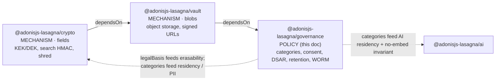
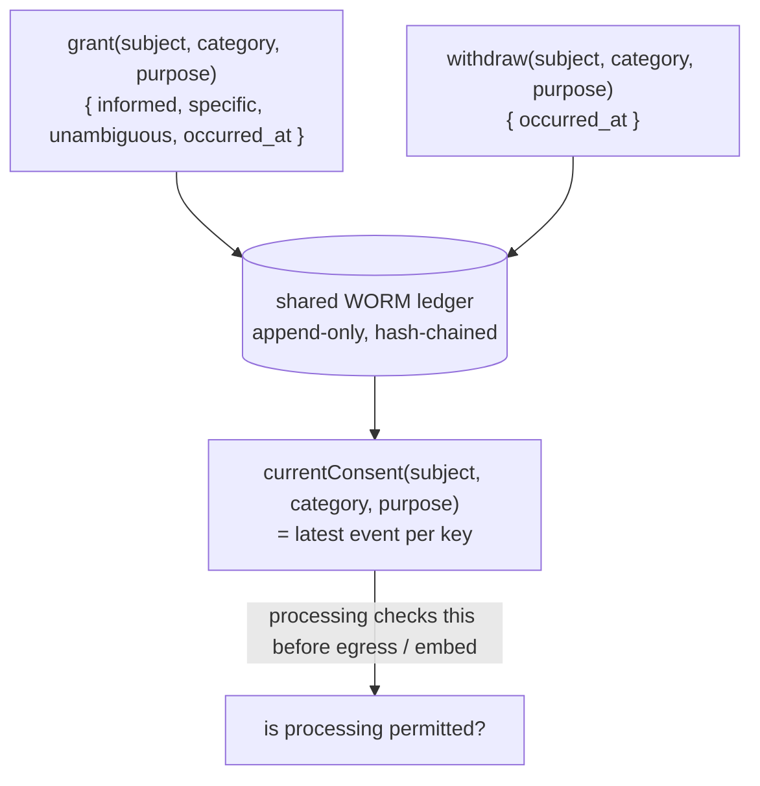

# `@adonisjs-lasagna/governance` Architecture

This is the "why" behind `@adonisjs-lasagna/governance`, the POLICY satellite in the data-protection trio (`crypto`, `vault`, `governance`). It is drafted against, and governed by, the shared foundation at [`design/data-protection-satellites/00-foundation.md`](./00-foundation.md). Where this document and that foundation disagree, the foundation is right and this document is the bug, exactly as `packages/ai/ARCHITECTURE.md` governs the AI package against its own code.

It is written to be read, not just searched, in the same register as the AI doc: the problem, the tempting wrong answer, why that answer leaks or fails, then the design chosen. No marketing. No em-dash separators.

Compliance is a property of the OPERATOR (the data controller), never of a library. This satellite ships MECHANISMS and CARRIES the operator's declarations. It never claims "GDPR compliant", "SOC2 compliant", or "Ley 09-08 / CNDP compliant". It provides the pieces to build compliance and closes with an explicit honesty bound (§10). The concrete SaaS this was built for is a Moroccan car-rental platform holding passport and national-ID numbers as fields and passport scans, car registrations, insurance documents, SIGNED RENTAL CONTRACTS, and damage photos as blobs, under Ley 09-08 / CNDP (sanctions around 3M MAD plus prison). The legal frame drives the requirements. The library still never "complies".

## 1. Purpose & scope

`governance` is the POLICY layer. `crypto` and `vault` are MECHANISMS: they protect bytes and know nothing about why. `governance` carries what the operator declared must happen to those bytes: which processing categories exist, which legal basis each rests on, whether consent was given, how long a category is retained, and when a subject's data must be erased. It decides WHICH categories are erasable and ORCHESTRATES the erasure; `crypto` OWNS the key hierarchy and EXECUTES the shred, `vault` deletes the blob.

The mechanism-vs-policy line is drawn precisely so neither side bakes in the other's judgment. `crypto` can destroy a DEK; it does not know whether destroying it is lawful. `governance` owns that judgment via `legalBasis` (§3) and gates the destroy. A mechanism that baked in a retention policy would be wrong for the next operator; a policy layer that re-implemented AES would be a second crypto stack. The foundation forbids both.

`governance` composes, in ONE consistent per-subject operation (§6.4), what core already ships per-TENANT: `tenant:audit:export` (the streaming engine behind Art. 15/20 access + portability), `tenant:gdpr:anonymize` (Art. 17 erasure-by-anonymization, the host's `config.compliance.anonymize` hook), plus `crypto`'s crypto-shred and `vault`'s blob delete. The per-SUBJECT scoping is a NEW capability, not a reuse of the kernel export's filter (§6.3 states why the kernel audit stream cannot be filtered by subject).

### What this does NOT do

- **It does not decide whether a processing activity is lawful.** The operator, as controller, declares categories and legal bases; `governance` records and enforces those declarations. It does not opine on whether a declared basis is legally sound for a given purpose.
- **It does not file with CNDP or any DPA.** The category registry is the machine-readable inventory the operator files (a "records of processing", Art. 30). The library produces the inventory; the operator files it.
- **It does not sign SCCs, run a Transfer Impact Assessment, or grant EU->Morocco adequacy.** Morocco has NO adequacy decision. `governance` provides a residency/category mechanism to ROUTE data per the operator's legal decisions (§9); it does not make or satisfy them.
- **It does not encrypt data or store blobs.** That is `crypto` and `vault`. `governance` reads no crypto internals; it declares categories and bases that `crypto` and `vault` CONSULT at erase time.
- **It does not reach into the AI package.** It PUBLISHES a category registry that a NEW residency integration (§9) must teach the existing `config.ai.residency` seam to consult. The package dependency stays one-way.
- **It does not guarantee erasure of copies Lasagna does not manage.** See the honesty bound (§10): crypto-shred erases encrypted fields, encrypted blobs, and their backups. It cannot reach host plaintext copies, logs, external indexes, or data a provider already received.
- **It does not fork a second audit chain.** There is ONE WORM ledger implementation, generalized from `ai_audit_writer` and hosted in a package BELOW `crypto` so `crypto` and `vault` can import it without a cycle (§6.5). `governance` OWNS it as the productizing maintainer, not as a package the others depend on.

## 2. Position in the platform

`governance` is the sink of the dependency DAG `crypto -> vault -> governance`, declared through each package's `lasagnaSatellite.dependsOn` manifest key ([`packages/core/src/sdk/manifest.ts`](../../packages/core/src/sdk/manifest.ts)), which cycle-checks and dependency-orders providers so `crypto`'s provider boots first, then `vault`'s, then `governance`'s.



The solid arrows are the boot-order dependency (`crypto` first). The dotted back-edges are runtime data flows, not package dependencies: `governance` declares categories and legal bases that `crypto`, `vault`, and a NEW AI-residency integration CONSULT. `governance` never imports `crypto` internals and never imports `ai`, so the DAG has no cycle. The shared WORM ledger is NOT a back-edge dependency either: it lives BELOW `crypto` (§6.5), so `crypto` and `vault` import it directly and `governance` does not export it to them.

- **`satelliteApi`**: built against the current `SATELLITE_API_VERSION`; `configure` refuses a core older than the ABI it needs.
- **`dependsOn`**: `[@adonisjs-lasagna/crypto, @adonisjs-lasagna/vault]` so both mechanism providers boot before this policy provider (an orchestrated shred through `crypto` cannot happen before `crypto` registered its shred service).
- **What it REUSES vs ADDS** is the §8 table. In one line: it REUSES core compliance (`ComplianceReportService`, the anonymize hook, the streaming `exportStream` engine), the driver `tableLocation`, the isthmus guard pattern, and CONSUMES the shared WORM ledger `ai_audit_writer` is being generalized into. It ADDS the category registry, the consent ledger (core has none), per-subject DSAR/ARCO orchestration keyed by `subject_hash` (a NEW subject dimension the kernel audit table lacks), and category-keyed retention jobs.

## 3. Threat model

Numbered vectors `T1..T12`. Each names an attacker capability and the invariant or guard that covers it. "Attacker" includes a hostile tenant user, a curious operator employee, a DB-dump thief, and an honest-but-buggy host integration.

| # | Vector | Attacker capability | Covered by |
|---|---|---|---|
| T1 | Over-erasure: an RTBF request destroys a signed rental contract still under statutory retention | any subject can invoke RTBF | I1 (`legalBasis` gates erasability); `guard.governance_shred_legal_hold` |
| T2 | Under-erasure: an RTBF request silently skips a consent-basis category, leaving PII recoverable | a buggy or partial orchestration | I2 (DSAR is ONE consistent operation; fail-closed on unresolved category) |
| T3 | Erasure gap: fields shredded but the blob under the same DEK survives (or vice versa) | inconsistent multi-store delete | I2 (one operation composes crypto-shred + vault-delete under one lock); I3 |
| T4 | Consent forgery / silent withdrawal loss: a withdrawal is dropped, so processing continues on withdrawn consent | a race on the mutable "current consent" | I4 (consent is an append-only WORM ledger; withdrawal is a new row, never an update) |
| T5 | Audit tampering: a consent grant, DSAR fulfilment, retention action, or shred event is rewritten or deleted to hide it | a privileged DB writer | I5 (shared WORM ledger: hash chain + 3 append-only DB triggers + `verify()`); `guard.governance_worm_write_failed` |
| T6 | PII in the immutable log: the WORM ledger stores a subject id / passport / contract text, which is then un-erasable | a well-meaning "log everything" | I6 (WORM stores hashes + ciphertext only, never plaintext PII); `check-governance-invariant-6` |
| T7 | Retention bypass: a category past `retention_until` is never shredded, so data outlives its lawful window | a missing / crashed cron | I7 (retention job keyed by category on the Adonis queue; fail-closed, observable) |
| T8 | Legal-basis spoofing: a category is re-declared `consent` to make a legal-obligation contract erasable | a config change to the registry | I1 + I8 (registry is host-declared but changes are auditable; the shred re-resolves basis at shred time, never trusts a cached "erasable") |
| T9 | Identity document reaches the AI provider (a passport number embedded / sent to DeepSeek/Kimi) | a host that embeds a governed blob | I9 declaration (`check-governance-invariant-9`) + the AI package's ingestion enforcement (`embedding_ingestion_service.ts` / `residency_gate.ts`, §9) + the AI residency gate (§9) |
| T10 | Cross-tenant leak: subject S of tenant A is erased using tenant B's key material / registry | a mis-wired background job | the satellite ContextSeal re-assertion the shared WORM writer already enforces (`guard.governance_scope_mismatch`) |
| T11 | Residency egress: an EU-flagged tenant's egress-eligible category is sent to a non-EU-legal provider | a provider selection outside the allow-list | the AI residency gate (`crypto`/`ai`'s), which a NEW integration teaches to consult `governance` categories (§9) |
| T12 | DSAR export leaks another subject's rows | a broad export filter, or a naive tenant-wide reuse of `exportStream` | I2 + §6.3: DSAR export composes ONLY subject-keyed sources (the governance WORM ledger by `subject_hash`, plus crypto/vault subject-scoped values); it NEVER streams the tenant-wide kernel audit log to the subject |

## 4. Invariants

Numbered `I1..I9`. Each has a statement, a rationale, and how it is enforced (a structural guard name or a runtime seam). These mirror the AI doc's `I1..I8` discipline. The invariant-grade items I1, I2, I5, I6 are the frozen core (§12); changing them needs a version-bump note.

**I1 — `legalBasis` gates erasability; a `legal-obligation` category within retention is never shredded on an RTBF request.**
Rationale. GDPR Art. 17 gives the RTBF; Art. 17(3)(b) EXEMPTS data whose retention is legally required. A signed rental contract is `legalBasis: legal-obligation`, 10-year retention, WORM evidence, and MUST NOT be erased until retention expires. A naive "shred the subject" that destroyed every DEK would delete the contract's DEK too, which is a legal violation in the other direction and irreversible. Because DEKs are per-`(subject × category)` (crypto §2.1), shredding the consent categories leaves the legal-obligation category's DEK, and its ciphertext, intact.
Enforced by. The runtime shred orchestrator resolves each category's `legalBasis` and current retention window from the registry BEFORE instructing `crypto` to shred, and REFUSES a `legal-obligation` category whose `retention_until` has not passed, emitting `guard.governance_shred_legal_hold`. The gate is FAIL-CLOSED: if a category's basis cannot be resolved, that category's shred is REFUSED, never defaulted-to-erase. Structural guard: `check-governance-invariant-1` asserts the orchestrator calls `resolveLegalBasis` before any shred call and has no path that shreds without the gate.

**I2 — a DSAR erasure is ONE consistent operation across every store `governance` orchestrates, or it fails as a whole.**
Rationale. A subject's erasable data spans crypto's fields, vault's blobs, and the audit surface. If the operation shredded fields but a crash left the blob, the subject is "half-erased": PII survives in one store while the ledger records "erased". T2/T3. The operation must be atomic at the granularity that matters (per erasable `(subject × category)`) and honestly report per-category outcomes.
Enforced by. `DsarService.erase(subject)` iterates the subject's `(subject × category)` DEKs under ONE per-tenant operation lock (the [`packages/backup/src/services/tenant_operation_lock.ts`](../../packages/backup/src/services/tenant_operation_lock.ts) pattern), and for each erasable category performs the crypto-shred (which kills the field ciphertext AND the vault blob bytes at once, because both were encrypted under that DEK) then records a WORM shred-event row. A category that cannot be resolved fails that category CLOSED and the summary reports it as `refused`, never `erased`. Structural guard: `check-governance-invariant-2` asserts the orchestrator holds the lock across the whole iteration and that each branch ends in either a recorded shred or a recorded refusal.

**I3 — shredding the DEK, not deleting rows, is the erasure; the blob delete is a courtesy, not the guarantee.**
Rationale. The erasure guarantee is O(1) key destruction: once the `(subject × category)` DEK is gone, every field ciphertext, every vault blob, and every backup of either is inert, because backup captures ciphertext only. `vault` still issues a best-effort object delete to reclaim storage, but the SECURITY guarantee is the dead key, so a failed object delete does not leave recoverable plaintext.
Enforced by. Runtime seam: `DsarService` calls `crypto.shred(subject, category)` (the guarantee) and then `vault.delete(subject, category)` (storage reclaim, best-effort, logged). Documented as an honest bound (§10): a surviving encrypted object whose DEK is gone is inert, not a leak, though it IS a storage-reclamation debt the operator should reconcile.

**I4 — consent is an append-only WORM ledger; a withdrawal is a NEW row, never a mutation of a "current consent" record.**
Rationale. Core has no consent ledger. A mutable "current consent" boolean is un-auditable (you cannot prove consent was validly obtained at time T once it is overwritten) and races on withdrawal (T4). The lawful record is the full history: grant with its `informed`/`specific`/`unambiguous` evidence and timestamp, then withdrawal with its timestamp. "Current" consent is DERIVED by reading the latest row per `(subject × category × purpose)`.
Enforced by. The consent ledger IS the shared WORM ledger (§6.5): grant and withdraw are two event types on the hash-chained, trigger-protected append-only table. There is no UPDATE path. Structural guard: `check-governance-invariant-4` asserts the consent writer emits only append events and that no code issues an UPDATE/DELETE against the consent event type.

**I5 — every consent grant/withdraw, DSAR open/fulfil, retention action, and shred event is append-only audited with attribution, on the shared WORM ledger.**
Rationale. These are the evidence a controller must produce (Art. 30 records of processing). They must be immutable: a rewrite/delete/reorder to hide a mishandled DSAR or a premature shred must be detectable. This is the AI doc's I5 generalized from AI ops to governance events.
Enforced by. The shared WORM ledger generalized from `ai_audit_writer` (§6.5): per-tenant `seq`+`checksum` hash chain, transaction-scoped `pg_advisory_xact_lock`, three `RAISE EXCEPTION` triggers (BEFORE UPDATE/DELETE/TRUNCATE), fail-closed writes (`guard.governance_worm_write_failed`), best-effort external anchoring through the kernel `AuditLogDestinationRegistry`, and a `verify()` re-walk reporting `gap | prev_link | checksum`. Structural guard: `check-governance-invariant-5` (the shape of `check-ai-invariant-5`) asserts the four triggers on the governance ledger stub and the fixed non-PII column allowlist.

**I6 — the WORM ledger stores ciphertext and non-PII hashes only, never plaintext PII; erasure happens by shredding the key, never by mutating the log.**
Rationale. Immutability collides with erasure (the AI doc's G1). If the ledger stored a passport number or contract text, that PII would be un-erasable. The reconciliation: WORM the ciphertext (or a `subject_hash`), shred the key. After a shred the ledger still holds ciphertext, but the DEK is gone, so the ciphertext is inert; the immutable chain is untouched and its integrity holds. Both guarantees hold at once. T6.
Enforced by. The non-PII column allowlist on the governance ledger (a `subject_hash`, `category`, `action`, `legal_basis`, `purpose`, `occurred_at`, chain columns; NO `subject_id` in cleartext, NO document text). Structural guard: `check-governance-invariant-6` (the shape of `check-ai-invariant-5`'s PII-stem scan) rejects any column or mapped sink key matching the PII stems (`passport`, `national_id`, `contract`, `name`, `email`, `content`, `text`, and the like) outside `*_hash` form.

**I7 — retention is enforced by category-keyed jobs on the Adonis queue; expiry-driven erasure is fail-closed and observable, never a silent skip.**
Rationale. Storage limitation (Art. 5(1)(e)) requires data to die when its window closes. A missing cron or a crashed job that silently leaves a past-window category is a violation (T7). The job must be idempotent, keyed by category so one category's retention change does not disturb another, and it must surface a failure.
Enforced by. Runtime seam: `RetentionService` enqueues one job per category (keyed `governance:retention:<category>`) on the Adonis queue (`TenantQueueService`); the job scans `(subject × category)` DEKs whose `retention_until` has passed and instructs `crypto.shred` for each, recording a WORM row per shred. A job that cannot run emits `guard.governance_retention_stalled` and a metric so an operator alert fires. A category with no `retention_until` is INFO (unbounded retention is a declared, auditable choice), not a silent pass.

**I8 — the shred re-resolves `legalBasis` at shred time from the registry; it never trusts a cached "erasable" flag.**
Rationale. The registry is host-declared and can change (a category re-classified). If the orchestrator cached "erasable" at DSAR-open time and shredded later, a mid-flight re-classification of a contract to a shorter basis could destroy evidence (T8), or a stale cache could refuse a now-erasable category forever. The basis must be read at the instant of destruction.
Enforced by. Runtime seam: `DsarService` and `RetentionService` both call `resolveLegalBasis(category)` immediately before each `crypto.shred`, inside the operation lock. Structural guard: `check-governance-invariant-1` (shared with I1) asserts no shred call is reachable from a cached-basis path.

**I9 — an end-user identity document is a governed `vault` blob, never an AI embedding; the vector store never stores identity docs.**
Rationale. A passport number or ID scan that reaches the RAG/embeddings text is a transfer to a third party, and DeepSeek/Kimi are Chinese providers (AI doc future threat #15). A passport scan is a governed `identity-docs` blob in `vault`, not an embedding. This is an invariant with a structural guard, not a runtime hope. T9.
Enforced by. This is a TWO-guard invariant (foundation §9, control 2), split by responsibility. `governance` owns the DECLARATION: the category registry marks `identity-docs` (and any category the host declares `pii: 'identity-document'`) as NOT egress-eligible and NOT embeddable, and `check-governance-invariant-9` asserts the exported category contract type cannot construct an identity-document category as embeddable or egress-eligible (the eligibility flags are required, not optional-defaulting-to-true). The AI PACKAGE owns the ENFORCEMENT at its embedding ingestion entry point (`packages/ai/src/services/embedding_ingestion_service.ts`, fed by `residency_gate.ts`): it refuses any body flagged egress-ineligible, asserted by an AI-side structural guard. This is NOT a `vault`-src guard: `vault` does not depend on `ai`, so an "AI embedding entry point" is not a symbol reachable in `vault` src and a vault-src scan would pass vacuously (there is no `check-vault-invariant-8`). The AI residency gate and the no-embed enforcement consult the declaration (§9). Each half names the other so neither doc claims sole ownership.

## 5. Structural guards

One `scripts/check-governance-invariant-N.mjs` per enforceable invariant, each a PURE `auditor(files)` (a list of `{ path, source }` in, a list of problem strings out) driven by a focused unit test without a filesystem, plus a `run()` that reads the real files and `process.exit(1)` on any problem. All are wired into `scripts/check.mjs`. They are STRUCTURAL only: they scan source/stubs for a required trigger, a forbidden PII column, a hardcoded schema, or a missing gate. No regex "leak detection" theater, matching the foundation's §7.1 decision.

| Guard | Enforces | What it scans |
|---|---|---|
| `check-governance-invariant-1` | I1 + I8 | the shred orchestrator (`dsar_service.ts`, `retention_service.ts`): every `crypto.shred(` call site is dominated by a `resolveLegalBasis(` call, and a `legal-obligation` branch reaches a `guard.governance_shred_legal_hold` refusal, not a shred |
| `check-governance-invariant-2` | I2 | `dsar_service.ts`: the erase loop is wrapped in the per-tenant operation lock, and every category branch terminates in a recorded shred OR a recorded refusal (no silent `continue`) |
| `check-governance-invariant-4` | I4 | the consent writer (`consent_service.ts`): only append-event calls; no UPDATE/DELETE raw SQL against the consent event type |
| `check-governance-invariant-5` | I5 | the governance WORM migration stub: the four triggers (`no_mutate` function + BEFORE UPDATE/DELETE + statement-level BEFORE TRUNCATE) and the fixed non-PII column allowlist (the shape of `check-ai-invariant-5`) |
| `check-governance-invariant-6` | I6 | the WORM stub columns AND the audit-sink mapper: no column or mapped key matches a PII stem (`subject_id` cleartext, `passport`, `national_id`, `contract`, `name`, `email`, `content`, `text`) outside `*_hash` form |
| `check-governance-invariant-9` | I9 (declaration half) | the exported category contract type (`types.ts`): an `identity-document` category cannot be constructed egress-eligible or embeddable; the eligibility flags are required, not optional-defaulting-to-true. The ENFORCEMENT half lives in the AI package's ingestion guard (`embedding_ingestion_service.ts` / `residency_gate.ts`), NOT a `vault`-src guard |

Each guard follows `scripts/check-ai-invariant-5.mjs` exactly: an exported pure auditor for the unit test, a `run()` that discovers the real files via git-ls-style paths, `console.error` + `process.exit(1)` on any problem, and a one-line OK summary.

The three compliance controls in §8 (`consent-coverage`, `retention-enforced`, `document-encryption`) are deliberately NOT in this table. They are RUNTIME posture detectors run by `ComplianceReportService` (they need runtime facts: does a consent ledger table exist, does the `governance:retention:<category>` queue key resolve, is a category vault- or crypto-managed), NOT compile-time structural guards. They belong to the posture-control class (like core's `data-retention` control), not to the enforceable `I1..I9` set. A reader must not conflate them with the invariants above.

## 6. Key & data model

`governance` owns three data structures of its own: the category registry (declarative, host-authored), the consent ledger (physically the shared WORM ledger), and the DSAR/retention orchestration model. It also DRIVES the shared WORM ledger (which lives BELOW `crypto`, §6.5) as its productizing maintainer. It owns NO key material and NO blob bytes; those are crypto's wrapped-DEK table and vault's object store.

### 6.1 The declarative category registry (host-declared)

A `CategoryKey` is a governance-declared processing category (crypto §2.2: `'identity-docs' | 'rental-contract' | 'marketing'`). The registry is the machine-readable inventory of processing activities the operator declares. It is HOST-AUTHORED in `config.governance.categories` (the operator is the controller; the library does not invent categories), validated eagerly at boot (the `assertConfigBounds` pattern), and it is the single source that feeds erasability (§3), retention (I7), residency, and the no-embed invariant (I9).

Each category declares:

| Field | Type | Meaning |
|---|---|---|
| `key` | `CategoryKey` | stable id, e.g. `rental-contract` |
| `pii` | `'none' \| 'personal' \| 'sensitive' \| 'identity-document'` | the data-protection class; `identity-document` is never egress-eligible or embeddable (I9) |
| `legalBasis` | `'consent' \| 'contract' \| 'legal-obligation' \| 'legitimate-interest' \| 'vital-interest' \| 'public-task'` | the Art. 6 basis; gates erasability (I1) |
| `storage` | `'field' \| 'blob'` | routes to crypto (field) or vault (blob) for the DEK |
| `searchable` | `boolean` | if true, crypto maintains a deterministic search HMAC for equality lookup (crypto §10.2); the frequency-leak bound applies |
| `retention` | `{ years?: number; days?: number } \| 'until-withdrawn' \| 'unbounded'` | the storage-limitation window; drives `retention_until` (I7) |
| `immutable` | `boolean` | if true (a signed contract), the blob/field is WORM evidence and its shred is retention-gated even beyond `legalBasis` |
| `egressEligible` | `boolean` | may this category's content leave to an external provider (AI, analytics)? Published for the AI residency integration (§9) |
| `embeddable` | `boolean` | may this category be turned into an AI embedding? `identity-document` forces `false` (I9) |

Worked config example (the car-rental controller's declaration):

```ts
// config/multitenancy.ts
import { defineGovernanceConfig } from '@adonisjs-lasagna/governance'

export const governance = defineGovernanceConfig({
  categories: [
    {
      key: 'marketing',
      pii: 'personal',
      legalBasis: 'consent',            // erasable on RTBF (I1)
      storage: 'field',
      searchable: false,
      retention: 'until-withdrawn',
      immutable: false,
      egressEligible: true,             // may feed a marketing model
      embeddable: true,
    },
    {
      key: 'identity-docs',             // passport / national-ID SCANS
      pii: 'identity-document',
      legalBasis: 'legal-obligation',   // exempt from RTBF while retained (I1)
      storage: 'blob',                  // -> vault
      searchable: false,
      retention: { years: 10 },
      immutable: true,
      egressEligible: false,            // NEVER leaves to a provider (I9)
      embeddable: false,                // NEVER embedded (I9)
    },
    {
      key: 'identity-numbers',          // passport / national-ID NUMBERS as fields
      pii: 'sensitive',
      legalBasis: 'legal-obligation',
      storage: 'field',                 // -> crypto, enc_v2 under the DEK
      searchable: true,                 // deterministic HMAC lookup (crypto §10.2)
      retention: { years: 10 },
      immutable: false,
      egressEligible: false,
      embeddable: false,
    },
    {
      key: 'rental-contract',           // SIGNED contract (evidence)
      pii: 'personal',
      legalBasis: 'legal-obligation',
      storage: 'blob',                  // -> vault
      searchable: false,
      retention: { years: 10 },
      immutable: true,                  // WORM + RFC-3161 timestamp option (§6.6)
      egressEligible: false,
      embeddable: false,
    },
  ],
})
```

The registry is DECLARATIVE and inert: declaring a category does not encrypt or store anything. It is consulted at write time (which DEK / storage a value uses), at erase time (is this category erasable?), at retention time (has `retention_until` passed?), and at egress time (may this leave?).

### 6.2 The consent ledger (NEW; core has none)

Core ships `tenant:gdpr:anonymize` and the streaming audit export but NO consent record. `governance` adds one. Consent under GDPR Art. 7 (and Ley 09-08's explicit-consent requirement for ID documents) must be INFORMED, SPECIFIC, and UNAMBIGUOUS, must record WHEN it was given, and must be as easy to WITHDRAW as to give.

The consent ledger is not a table of "current consent" booleans. It is an append-only WORM event log (I4), physically the shared WORM ledger (§6.5) with the governance consent event types. A grant records the evidence that it was informed/specific/unambiguous; a withdrawal is a new append. "Current" consent for a `(subject × category × purpose)` is DERIVED as the latest event.



The consent record for a grant carries `subject_hash`, `category`, `purpose`, `action: 'consent.grant'`, and three booleans (`informed`, `specific`, `unambiguous`) that the host asserts at capture time (a checkbox is not "unambiguous"; the host is responsible for the UX that makes it so, and `governance` records what the host asserts). It carries NO cleartext subject id and NO free-text (I6). A withdrawal carries the same key with `action: 'consent.withdraw'`. There is no UPDATE and no DELETE: the log is the evidence.

### 6.3 The DSAR / ARCO model (per-subject orchestration)

Core's audit export and `tenant:gdpr:anonymize` are per-TENANT. A DSAR (Data Subject Access Request) / ARCO (Access, Rectification, Cancellation, Opposition) request is per-SUBJECT. `governance` orchestrates the per-tenant core tools scoped to one subject, and adds the subject dimension that the kernel does not have.

**The kernel audit stream is not filterable by subject, so per-subject export is a NEW capability, not a reuse.** `AuditLogService.exportStream` ([`packages/core/src/services/audit_log_service.ts`](../../packages/core/src/services/audit_log_service.ts)) accepts only `{ tenantId, from, to, batchSize }` and filters solely on `tenant_id`/`created_at`. The kernel rows (`TenantAuditLog`) carry an `actorId`, NOT a data-subject id or hash, and there is no subject/actor predicate anywhere in the service. Naively reusing `exportStream(tenantId=...)` for a DSAR would hand the requester a TENANT-WIDE dump of every subject's audit rows, which is exactly T12. So per-subject DSAR export is a NEW governance capability, not a filtered reuse of the kernel export.

- **Access / portability (Art. 15/20)** — `DsarService.export(subject)` composes ONLY subject-keyed sources: the governance WORM ledger rows matching the subject's `subject_hash` (the governance ledger has that column; the kernel `TenantAuditLog` does not), plus the subject's decryptable field values and vault blob references (via signed URLs, never raw bytes in the export). It does NOT stream the tenant-wide kernel audit log to the subject. Every source it aggregates is scoped by subject before any byte reaches the requester (T12). If the operator later wants the kernel audit rows in a DSAR, the correct fix is a real change in core (add an `actorId`/subject predicate to `exportStream`, named as such), NOT a governance-side filter over a stream that has no subject dimension.
- **Rectification (Art. 16)** — records a WORM rectification event; the actual field update is the host's write path (`governance` does not own the host's models). It captures that a rectification occurred, for the Art. 30 record.
- **Erasure / cancellation (Art. 17)** — `DsarService.erase(subject)`, the ONE consistent operation (I2, §6.4).
- **Opposition (Art. 21)** — an opposition is recorded as a consent-style WORM event and, where the basis was `legitimate-interest`, flips the derived "may process" for that `(subject × category × purpose)` off.

### 6.4 The erasure operation: crypto-shred + vault-delete + core-anonymize in ONE operation

This is I2 made concrete. `DsarService.erase(subject)` runs the canonical shred (foundation §2.4) per erasable category, composing four things in one consistent, per-tenant-locked operation:

```
erase(subject):
  under the per-tenant operation lock (packages/backup/.../tenant_operation_lock.ts):
    for each (subject × category) DEK of the subject:
      basis := resolveLegalBasis(category)                 # re-read now (I8), fail-closed
      if basis is unresolved:
        record WORM refusal 'refused: unresolved-basis'    # (I2 fail-closed)
        continue
      if basis == 'legal-obligation' and retention_until not passed:
        record WORM refusal 'retained: legal-obligation' + retention_until   # (I1)
        emit guard.governance_shred_legal_hold
        continue
      crypto.shred(subject, category)                      # THE guarantee: O(1) DEK destroy (I3)
      vault.delete(subject, category)                      # storage reclaim, best-effort (I3)
      record WORM shred-event { subject_hash, category, occurred_at, actor_hash }  # (I5), NOT the key
    optionally: run config.compliance.anonymize for host-owned plaintext columns  # (see §8, T2 residual)
    return an honest per-category summary { erased[], retained[], refused[] }
```

Two subtleties. First, the operation composes core's `config.compliance.anonymize` hook LAST, for host-owned PLAINTEXT columns the host never routed through crypto (a denormalized cache, a display name). crypto-shred cannot reach those (they are not ciphertext under a managed DEK), so the host's anonymizer is the only tool for them. This is why the honesty bound (§10) exists: `governance` composes both, but only the crypto-shred is a hard guarantee; the anonymize hook is as good as the host's implementation. Second, the summary is HONEST: a `legal-obligation` contract is reported `retained: legal-obligation` with its `retention_until`, never as "erased".

### 6.5 The shared WORM ledger (generalize `ai_audit_writer`, do not fork)

There is ONE WORM ledger implementation in the platform, generalized from [`packages/ai/src/services/ai_audit_writer.ts`](../../packages/ai/src/services/ai_audit_writer.ts), not a fourth audit chain. Two properties must both hold, and they pull in different directions, so they are stated precisely.

**Package location: BELOW `crypto`, not inside `governance`.** The DAG is `crypto -> vault -> governance`, with `governance` as the SINK (depended on by nobody). So neither `crypto` nor `vault` can import a `WormLedgerWriter` that lives in the `governance` PACKAGE without creating a cycle. But `crypto`'s shred and `vault`'s access must audit SYNCHRONOUSLY and FAIL-CLOSED on the access path (an async "emit an event, let a listener append" design cannot be fail-closed on that path). Therefore the generalized `WormLedgerWriter` module lives in a package BELOW `crypto` (core, or a shared low leaf) that `crypto` and `vault` import directly and call. `governance` OWNS it in the productizing sense (it is the maintainer, it defines the event union and the column allowlist, it ships `verify()` and the ace command), NOT in the sense that callers depend on the `governance` package. This is what makes "one audit chain" implementable at all; anything else invites `crypto`/`vault` to hand-roll a second and third local hash-chain, which is exactly what the foundation forbids.

**Physical placement: the shared `backoffice` schema, keyed by a `tenant_id` column, NOT `tableLocation`.** "Per-tenant" for this ledger means logically-per-tenant-via-a-`tenant_id`-column, with `UNIQUE(tenant_id, seq)` for the chain, physically in the shared `backoffice` schema exactly as `ai_audit_logs` is today (`ai_audit_writer` deliberately does NOT route through `tableLocation`, so the row survives `tenant:purge-expired` and the tenant request role cannot DROP it). This is distinct from crypto's wrapped-DEK table and vault's blob-metadata table, which ARE per-tenant via `driver.tableLocation(tenant)` / `perTenantMigrations`. The WORM ledger is NOT placed by `tableLocation`.

Preserved exactly from `ai_audit_writer` (all verified against the current file):

- the per-tenant `seq`+`checksum` hash chain (`canonicalAuditFields` + `auditChecksum`: sha256 over a canonical ARRAY, not an object, so there is no key-order ambiguity, linked to `prev_checksum`), so a rewrite/delete/reorder that slipped past the DB triggers still breaks the chain;
- the transaction-scoped `pg_advisory_xact_lock(hashtext(...))` serializing the tail-read + insert per tenant, with the bounded retry on a `23505` seq collision (`MAX_APPEND_ATTEMPTS`);
- the three append-only triggers (BEFORE UPDATE, BEFORE DELETE, statement-level BEFORE TRUNCATE, each `RAISE EXCEPTION` regardless of role), asserted by `check-governance-invariant-5` exactly as `check-ai-invariant-5` asserts them for the AI table;
- the FAIL-CLOSED write (a row that cannot land emits `guard.governance_worm_write_failed` and throws) and the best-effort external anchoring through the kernel `AuditLogDestinationRegistry` (SIEM/WORM/S3), mapped onto the kernel `AuditLogEntry`;
- the `verify()` re-walk reporting the first break (`gap | prev_link | checksum`) via `tenant:governance:audit:verify`.

What changes is the row shape: the event union becomes the governance set instead of the AI `chat|embedding|retrieval` union.

| Column | Meaning |
|---|---|
| `id`, `tenant_id`, `seq`, `checksum`, `prev_checksum` | the chain (identical to AI) |
| `event` | `consent.grant \| consent.withdraw \| dsar.open \| dsar.fulfil \| rectification \| retention.shred \| dsar.shred \| dsar.refusal` |
| `subject_hash` | one-way digest of the subject id (I6; never cleartext) |
| `category`, `purpose`, `legal_basis` | the non-PII classification of the event |
| `actor_hash` | one-way digest of who performed it |
| `outcome`, `reason` | e.g. `retained: legal-obligation`, `refused: unresolved-basis` |
| `retention_until` | for a shred/retention event, the window that governed it |
| `occurred_at` | ISO time, normalized into the checksum for the timestamptz round-trip (as `ai_audit_writer` does) |

There is NO cleartext `subject_id`, NO document text, NO free-form note (I6). The AI package RE-CONSUMES this shared ledger for its own `ai_audit_logs` so there is exactly ONE hash-chain implementation in the platform; whether that migration lands in the 1.0 window or after is an open decision (§12). The CONTRACT is fixed: no satellite forks a parallel implementation.

The writer re-asserts that the row tenant equals the active tenancy scope (`guard.governance_scope_mismatch`, T10), exactly as `ai_audit_writer` re-asserts the ContextSeal because raw SQL bypasses the kernel seal.

### 6.6 WORM + timestamping for contracts (hash-chain vs external RFC-3161 TSA)

A signed rental contract is legal evidence. Two levels of tamper-evidence:

1. **Default: the internal hash chain.** The `content_hash` of the contract blob (vault §6) is recorded in a WORM ledger row. Any later alteration of the blob breaks the recorded hash; any tampering with the ledger row breaks the chain. This is self-contained (no external dependency) but the trust anchor is the operator's own database.
2. **Option: external RFC-3161 timestamping.** For contracts where the operator needs a THIRD-PARTY trust anchor (to prove existence-at-time to a court without trusting the operator's own clock), `config.governance.timestamping` binds an RFC-3161 Time-Stamping Authority. On contract seal, `governance` sends the `content_hash` (NOT the content) to the TSA and stores the returned timestamp token alongside the WORM row. Any outbound to the TSA goes through core's [`safe_fetch.ts`](../../packages/core/src/utils/safe_fetch.ts) (SSRF pin, registry id `guard.outbound_fetch`), never a bare fetch. This is OPTIONAL and OFF by default: it adds an external dependency and a per-seal latency, and most operators do not need it. The honest bound: the internal chain proves integrity relative to the operator; the RFC-3161 token proves existence-at-time relative to a trusted third party. `governance` provides the mechanism; whether a court accepts it is the operator's legal question.

## 7. Public surface

- **Config**: `defineGovernanceConfig(config): GovernanceConfig` (no runtime effect, the identity helper), a `SatelliteConfigRegistry` module augmentation, and a `MultitenancyConfigWithGovernance` type, exactly as `defineAiConfig` / `MultitenancyConfigWithAi`. Fields: `categories` (§6.1), `timestamping?` (§6.6), `residencyDefault?` (§9). Enforced by `check-satellite-config-wiring.mjs`.
- **Ace commands**:
  - `tenant:dsar:export --subject=<id>` — per-subject Art. 15/20 export (the NEW subject-scoped capability, §6.3).
  - `tenant:dsar:erase --subject=<id> [--dry-run]` — the ONE consistent erasure (I2); `--dry-run` reports the per-category `erased/retained/refused` plan without destroying a key (like `tenant:gdpr:anonymize --dry-run`).
  - `tenant:consent:grant` / `tenant:consent:withdraw` — CLI entry points for the ledger (the host normally calls the service from its consent UX).
  - `tenant:retention:run [--category=<key>]` — run the retention sweep now (also enqueued on the queue, I7).
  - `tenant:governance:audit:verify [--tenant=<id>]` — the `verify()` re-walk over the shared WORM ledger.
  - `tenant:governance:report [--framework=gdpr|soc2|iso|hipaa]` — runs the new compliance controls (§8) via `ComplianceReportService`.
- **Services** (container singletons, resolved via `container.make`, never `new`-ed per request, per the provider-lifecycle rule): `CategoryRegistryService`, `ConsentService`, `DsarService`, `RetentionService`. The shared `WormLedgerWriter` is imported from its below-`crypto` home (§6.5), not exported from this package.
- **Events**: `SubjectErased` (per-subject, the analogue of core's per-tenant `TenantAnonymized`), `ConsentWithdrawn`, `RetentionShredExecuted`. Listeners already exist in the ecosystem: the AI package's `ai_compliance_service` auto-purge listens on `TenantDeleted`/`TenantAnonymized`; `SubjectErased` gives satellites a per-subject hook.
- **Isthmus guards**: registered in a satellite-local `governance_guard_registry.ts` mirroring `ai_guard_registry.ts` (id type `` `guard.governance_${string}` ``, `pillar: 'guard'`, `failMode: 'closed'`, dispatched on the kernel's PUBLIC `IsthmusGuardTripped`): `guard.governance_shred_legal_hold`, `guard.governance_worm_write_failed`, `guard.governance_scope_mismatch`, `guard.governance_retention_stalled`, `guard.governance_consent_invalid`, `guard.governance_category_undeclared`. Never added to the kernel registry ([`packages/core/src/isthmus/registry.ts`](../../packages/core/src/isthmus/registry.ts)), which is closed to satellites.

## 8. Reused core seams

The rule across the trio: NEVER build a second crypto stack, a second audit chain, a second SSRF guard, or a second anonymization engine. `governance`'s subset:

| Seam (file) | Verdict | What it gives · what must NOT be duplicated |
|---|---|---|
| the shared `WormLedgerWriter` (generalized from `packages/ai/src/services/ai_audit_writer.ts`, hosted BELOW `crypto` per §6.5) + its migration stub | generalize + consume | per-tenant sha256 hash chain, advisory lock, 3 append-only triggers, fail-closed writes, `verify()` re-walk, kernel anchoring. `governance` OWNS it as maintainer and defines the governance event union; it lives below `crypto` so `crypto`/`vault` import it without a cycle. Do NOT fork a fourth audit chain, and do NOT export it from the `governance` package. |
| `packages/core/src/commands/tenant_gdpr_anonymize.ts` + `config.compliance.anonymize` hook + `events/tenant_anonymized.ts` | extend | the anonymize hook + the `TenantAnonymized` event. core is per-TENANT; `governance` ORCHESTRATES the hook per-SUBJECT inside `DsarService.erase` for host-owned plaintext columns crypto cannot reach. Exactly ONE anonymization engine (open decision, §12). |
| `packages/core/src/services/audit_log_service.ts` (`AuditLogService.exportStream`) + `utils/audit_export.ts` | reuse-the-engine, NOT the filter | the streaming, backpressure-honoring, batched export MECHANISM (page-sized `AsyncGenerator`). But `exportStream` filters ONLY on `tenant_id`/`created_at`; the kernel rows carry no subject dimension. So `DsarService.export` reuses the streaming DISCIPLINE for subject-keyed governance sources; it does NOT reuse `exportStream` as a per-subject filter, and it does NOT stream the tenant-wide kernel audit to the subject (§6.3, T12). A real per-subject filter on `exportStream` would be a NAMED change in core, not a governance-side workaround. |
| `packages/core/src/services/compliance/compliance_report_service.ts` + `controls/` + `types.ts` | extend | the `register(control)` pattern (modelled on `DoctorService`). `governance` ADDS three RUNTIME posture controls (below). Do NOT fork `ComplianceReportService`, and do NOT confuse these controls with the compile-time `I1..I9` guards (§5). |
| `packages/core/src/services/isolation/driver.ts` (`tableLocation`) | reuse-as-is | the WORM ledger is a shared-`backoffice` table (like `ai_audit_logs`), so it does NOT route through `tableLocation` (§6.5). Any per-tenant governance table (none required today) would ASK the driver, NEVER hardcode `tenant_<id>`. |
| `packages/backup/src/services/tenant_operation_lock.ts` | reuse-as-is | the per-tenant operation lock. `DsarService.erase` holds it across the whole per-subject iteration (I2) so a concurrent write or a second DSAR cannot interleave a half-erase. |
| `packages/core/src/utils/safe_fetch.ts` | reuse-as-is | SSRF/egress pin. The RFC-3161 TSA call (§6.6) and any future external destination go through it. Registry id `guard.outbound_fetch`. No second SSRF guard. |
| `packages/core/src/services/audit_log_service.ts` + `audit_log_destination_registry.ts` | reuse-as-is | append-only kernel audit + best-effort isolated SIEM/WORM/S3 sinks. The WORM ledger anchors OUT through this registry, as `ai_audit_writer` already does. |
| `packages/core/src/sdk/manifest.ts` + `sdk/contract.ts` + `sdk/configure_kit.ts` | reuse-as-is | one `lasagnaSatellite` manifest + one `SatelliteProviderContract` provider (`register`/`boot`/`start`/`ready`/`shutdown`). `dependsOn: [crypto, vault]`. |
| `packages/core/src/isthmus/registry.ts` + `packages/ai/src/isthmus/ai_guard_registry.ts` | reuse-pattern | MIRROR the AI registry into `governance_guard_registry.ts`. Never touch the kernel registry (closed to satellites). |

**New compliance controls** `governance` registers into `ComplianceReportService` at `boot()`. These are RUNTIME posture detectors (not compile-time guards, §5): each is a `ComplianceControl` whose `detect(ctx)` returns `{ status, evidence, hostResponsibility, remediation? }` and maps to namespaced `frameworks` tokens (the shape of `data_retention_control.ts` and `audit_immutability_control.ts`):

- **`consent-coverage`** (`gdpr:art6`, `gdpr:art7`, `soc2:CC6.1`) — every category whose `legalBasis` is `consent` has a consent ledger reachable and its triggers installed; a `consent`-basis category with no ledger table is `action-needed`. Evidence names which categories rest on consent.
- **`retention-enforced`** (`gdpr:art5`, `soc2:CC8.1`, `iso:A.8.10`) — every category with a bounded `retention` has its retention job schedulable (the `governance:retention:<category>` queue key resolves); a bounded category with no schedulable job is `action-needed`. This is the runtime posture behind I7, complementing core's `data-retention` control (which covers only the tenant soft-delete window).
- **`document-encryption`** (`gdpr:art32`, `soc2:CC6.7`, `iso:A.8.24`) — every `storage: 'blob'` category is vault-managed (encrypted-before-upload under a DEK), and every `storage: 'field'` PII category is crypto-managed. A category declared PII but routed to neither mechanism is `action-needed`. Evidence is deliberately scoped like core's `secret-encryption` control so nobody reads "satisfied" as "every byte the host holds is encrypted".

## 9. Failure modes

Every security-relevant path is fail-closed. What happens when a dependency is down:

- **`crypto` KeyProvider down (cannot resolve/wrap a DEK).** `DsarService.erase` for a `crypto`-managed category REFUSES rather than proceeds: it cannot prove the DEK was destroyed, so it records `refused: keyprovider-unavailable` on the WORM ledger and the summary reports the category as NOT erased. Never reports success on an unproven destroy. A retention job in the same state re-enqueues; it never marks the category shredded.
- **`vault`/object storage down.** The crypto-shred (the guarantee, I3) still succeeds because it is a DEK-row delete independent of the object store; the blob's bytes are already inert (their DEK is gone). The best-effort `vault.delete` (storage reclaim) is retried later; a surviving encrypted object is not a leak (§10), though it is a storage-reclamation debt. The erase still reports the category `erased`.
- **WORM audit-write failure.** FAIL-CLOSED. The consent grant / DSAR fulfilment / shred event that cannot record its immutable row emits `guard.governance_worm_write_failed` and throws, exactly as `ai_audit_writer.append` does. An attributable governance action whose audit row cannot land is a failure, not a silent success. (The one nuance, inherited from the AI writer: if the DEK-destroy already happened irreversibly and only the audit row failed, that leaves a detectable state, not a silent one; the guard fires and the operator investigates.)
- **Category unresolved (a value written under a category no longer in the registry).** The shred of that category is REFUSED (`guard.governance_category_undeclared`), never defaulted-to-erase and never defaulted-to-retain-forever without a record. The refusal is recorded so the operator reconciles the registry.
- **`legalBasis` unresolvable at shred time.** Fail-closed refusal (I1/I8): the category is NOT shredded, recorded as `refused: unresolved-basis`.
- **Retention cron missing / job crashed.** The category simply is not shredded on time, which is the silent-skip risk (T7); the schedulable-job check (`retention-enforced` control) surfaces it as posture, and a running-but-failing job emits `guard.governance_retention_stalled` + a metric so an operator alert fires.
- **Consent check on egress fails to resolve.** Processing that depends on consent is REFUSED (`guard.governance_consent_invalid`), never allowed on an unverifiable consent.

## 10. Legal mapping

A mapping to MECHANISMS, not a compliance claim. The operator, as controller, decides whether the mechanism as configured satisfies the obligation.

| Legal requirement (Ley 09-08 / CNDP · GDPR) | This satellite's mechanism |
|---|---|
| Explicit consent for ID documents (09-08 · GDPR Art. 6/7/9) | the consent ledger (grant/withdraw, informed/specific/unambiguous, WORM-recorded); category `legalBasis` |
| ARCO / access + portability (09-08 · GDPR Art. 15/20) | `DsarService.export`: a NEW subject-scoped aggregation over subject-keyed governance sources + crypto/vault subject-scoped values, reusing the streaming DISCIPLINE but NOT the kernel export's tenant-only filter (§6.3), audited |
| Right to erasure / RTBF (GDPR Art. 17) | `DsarService.erase`: per-subject crypto-shred of erasable categories, O(1) key destruction (I2/I3), composed with vault-delete + anonymize hook |
| Erasure exemption for legal obligation (GDPR Art. 17(3)(b)) | `legalBasis: legal-obligation` gates the shred; retention window respected; contract reported `retained`, not erased (I1) |
| Retention limits / storage limitation (09-08 · GDPR Art. 5(1)(e)) | `retention_until` per category; category-keyed retention jobs shred on expiry (I7) |
| Immutable evidence / records of processing (09-08 · GDPR Art. 30) | the shared WORM ledger (hash chain + DB triggers + `verify()`, I5); the category registry IS the machine-readable inventory the operator files |
| Prior file notification to CNDP (09-08) | the category registry is the inventory the operator files; the LIBRARY does not file it |
| Signed-contract evidence / non-repudiation | WORM content-hash chain (default) + optional RFC-3161 external timestamp (§6.6) |
| EU -> Morocco transfer (no adequacy; needs SCCs + TIA) | `egressEligible` per category + a NEW AI-residency integration route the decision; SCCs and the TIA are the OPERATOR's legal instruments, NOT the library's |
| Data-processing security audit posture (SOC2-style) | the new `consent-coverage` / `retention-enforced` / `document-encryption` runtime controls (§8) |

**The AI-path gate (§9 of the foundation), governance-integrated.** A passport number or ID scan reaching the RAG/embeddings text is a transfer to a third party, and DeepSeek and Kimi are Chinese providers. `governance`'s category registry makes this path DECIDABLE. In reliability order (most reliable first):

1. **Residency gate, fail-closed (the real control).** The existing `config.ai.residency` seam ([`packages/ai/src/services/residency_gate.ts`](../../packages/ai/src/services/residency_gate.ts): `ResidencyResolver -> ResidencyPosture`, `guard.ai_residency_denied`) blocks non-EU-legal providers for EU-flagged tenants BEFORE any cost, at chat provider selection and (for `local-only`) embedding egress. IMPORTANT, stated honestly: today the gate decides on PROVIDER IDENTITY (name + loopback), and `enforceEmbeddingResidency` explicitly does NOT narrow embeddings by an allow-list ("the embedding backend is deploy-global in 1.0, so only the local-only posture constrains it"). There is currently NO code path where a per-category `egressEligible` flag is consulted. So feeding `governance`'s categories into the residency decision is a NEW integration `governance` must add (the residency seam would need to consume categories), not an existing feed the seam already honors. `governance` PUBLISHES `egressEligible`; wiring it into the gate is future work, not reuse.
2. **Invariant I9: the vector store NEVER stores identity documents.** A passport scan is a governed `identity-docs` blob in `vault` (`embeddable: false`), never an embedding. This is a TWO-guard invariant (§4, I9): `governance` DECLARES it (`check-governance-invariant-9`); the AI package ENFORCES it at its embedding ingestion entry point (`embedding_ingestion_service.ts` / `residency_gate.ts`), NOT a `vault`-src guard. Structural, not a runtime hope.
3. **PII-regex redaction before embed/send: best-effort defense-in-depth ONLY.** The optional `config.ai.redactOutput` seam exists for output; an input-side redactor is the same class. NEVER oversold: a regex cannot guarantee a passport number is caught, so it is a second line, not the control. This mirrors the AI doc's I4/I8 "heuristics are defense-in-depth, never the isolation control".

`governance` does not reach into the AI package; it PUBLISHES categories that a NEW residency integration and the no-embed invariant CONSULT.

**Honesty bounds (restated, non-negotiable).**

- **"crypto-shredding erases what Lasagna manages (encrypted fields, encrypted blobs, and their backups). It cannot erase plaintext copies the host made, logs, or external indexes. Keeping those out of scope is the host's responsibility."** The DSAR erase composes the `config.compliance.anonymize` hook for host-owned plaintext columns, but that hook is only as good as the host's implementation; it is NOT a hard guarantee the way the DEK-destroy is.
- **A surviving-but-inert encrypted object is NOT a leak, but it IS a storage-reclamation debt.** When `vault`/object storage is down during an erase (§9), the crypto-shred still makes the object's bytes inert (its DEK is gone), so the category is honestly reported `erased`. The ciphertext bytes may physically persist until the best-effort `vault.delete` later succeeds. An auditor reading `erased` should understand this: the value is unrecoverable, but the reclamation of those inert bytes is a debt the operator should reconcile, not a residual leak.
- **Morocco has NO GDPR adequacy decision.** Ratifying Convention 108 is NOT adequacy. EU -> Morocco transfers need SCCs plus a Transfer Impact Assessment, which the OPERATOR executes. `governance` provides the residency/category mechanism to ROUTE data per those decisions; it does not make, sign, or satisfy them.
- **The library never "complies".** Every control the report emits carries a `hostResponsibility` that survives even a `satisfied` verdict. `governance` provides the pieces to build compliance; the operator, as controller, builds it.

## 11. Testing strategy

The standard guarantee tree (project `CLAUDE.md`): `tests/@guarantees/{isolation|security|behavior|resilience|performance}/{unit|integration}/`, `tests/@architecture/{boundaries,contracts,docs}/`, `tests/@integration/drivers/`, `helpers/`, plus the 3-line `@architecture/boundaries/governance_guarantee_tree.spec.ts` calling `assertGuaranteeTree`. Every invariant and every threat vector gets a red-first test.

- **Unit** (import `src` directly, no build): the pure `check-governance-invariant-N` auditors driven with `{ path, source }` doubles (no filesystem); the WORM `canonicalAuditFields`/`auditChecksum`/`verify()` chain math (reused from the AI writer's unit suite); the DSAR `erase` plan (which categories `erased/retained/refused`) against a doubled registry + doubled crypto/vault; the consent "latest event wins" derivation; the retention-window `retention_until` computation; the per-subject `export` includes ONLY subject-keyed rows and never a tenant-wide dump (T12).
- **Integration** (build first, run against `./build`, real Postgres): the three append-only triggers actually reject UPDATE/DELETE/TRUNCATE on the governance ledger (the shape of the AI audit real-PG spec); `DsarService.erase` under the per-tenant operation lock does not interleave a concurrent write (I2); a `legal-obligation` contract survives an RTBF erase while a `consent` category's ciphertext dies (I1, end-to-end with real crypto DEKs); the compliance controls' `detect()` against a real backoffice schema.
- **Real-dependency smokes** (opt-in, CI-only, `*_real.spec.ts` convention): the RFC-3161 TSA path against a real TSA when `GOVERNANCE_TSA_URL` is set (else skipped, like the Stripe smoke); MinIO/S3 for the vault-delete leg of a DSAR erase. Real KMS is exercised via crypto's suite, not duplicated here.
- **Coverage floor**: measured by the unit run (`test:coverage`, which imports `src` and attributes reliably); the integration run is report-only (`--check-coverage=false`) because it executes `./build`. Ratchet floors off the unit baseline, per `CLAUDE.md`.

## 12. Open decisions (owned by the user)

The foundation's §11 decisions this satellite touches, restated for the user to resolve:

1. **Satellite name: `governance` vs keeping `compliance`.** Open, and coupled to decision 2. The trade: `compliance` is the name the ecosystem already knows (core has `compliance/`, `ComplianceReportService`, `config.compliance.anonymize`), so keeping it minimizes rename churn and reads naturally to a controller. `governance` is more honest about scope (this layer carries POLICY beyond just "compliance reporting": consent, DSAR, retention, WORM) and avoids implying the library itself "is compliance". **Recommendation: `governance`.** The satellite does more than the existing `compliance` reporting engine, and the honesty-bound framing (the library never "complies") is undercut by a package literally named `compliance`. The existing core `compliance/` surface stays where it is (see decision 2); the SATELLITE is `governance`.

2. **Graduate vs extend core compliance.** GRADUATE the core compliance tooling (`tenant_gdpr_anonymize`, `ComplianceReportService`, the `anonymize` hook, the audit export) INTO `governance`, OR EXTEND it in-place and have `governance` build on top. Exactly ONE anonymization engine either way. **Recommendation: EXTEND, do not graduate, for the 1.0 window.** Reasons: (a) those tools are per-TENANT and already shipped and depended on by hosts and by the AI package's auto-purge listener (`ai_compliance_service` on `TenantDeleted`/`TenantAnonymized`); moving them is a breaking change to a stable surface for no functional gain. (b) `governance` composes them cleanly per-SUBJECT via `DsarService` (§6.4) without owning them, keeping the mechanism/policy line intact (the anonymize hook is a MECHANISM seam; `governance` orchestrates it as POLICY). (c) `ComplianceReportService.register(control)` is explicitly built for satellites to add controls without editing core, so `governance` adds its three controls (§8) with zero core churn. If governance ever re-implements per-subject anonymization instead of composing `config.compliance.anonymize`, that would be a SECOND anonymization engine (foundation §11-2 forbids two): this recommendation is binding for exactly that reason. Graduation can be revisited post-1.0; the CONTRACT (one anonymization engine, one report registry) holds under either choice.

3. **Whether AI's `ai_audit_logs` migrates onto the shared WORM ledger in the 1.0 window or after.** The CONTRACT is fixed (§6.5): there is ONE shared ledger, hosted BELOW `crypto`; no forked hash-chains. The migration TIMING for the existing AI table is open. **Recommendation: extract the shared `WormLedgerWriter` into its below-`crypto` home now (so `crypto`/`vault` can import it and `governance` can drive it), and migrate the physical `ai_audit_logs` table onto it AFTER 1.0**, so the AI package's already-green audit surface is not destabilized inside the 1.0 window. Until then the AI writer IS the generalized writer (same implementation), which already satisfies the "one implementation" contract even before the physical-table consolidation.

4. **RFC-3161 timestamping default (§6.6).** Internal hash chain by default (zero external dependency); external TSA is opt-in via `config.governance.timestamping`. **Recommendation: keep internal-by-default; the external TSA is a per-operator legal choice with real latency/dependency cost.** Confirmed as the foundation's framing (mechanism provided, court acceptance is the operator's question).

---

**Governance and freeze.** This document is measured against the shared foundation. The frozen invariant-grade items are I1 (`legalBasis` gates erasability), I2 (one consistent DSAR operation), I5 (append-only WORM audit), and I6 (WORM stores no plaintext PII); changing any requires a pull request with justification, a changelog entry, and a version-bump note, exactly as `packages/ai/ARCHITECTURE.md` governs its `I1..I8`. The threat table (§3), the legal crosswalk (§10), and the open decisions (§12) are living and grow as vectors are found and decisions resolved. This is a DESIGN document: nothing here is implemented yet, and names, seam locations, guard ids, and config keys may still change. If this document and the foundation disagree, the foundation is right and this document is the bug.
