# Architecture

This is the "why" behind Lasagna. The [guides](/guides/tenant-identification) teach you how to
build with it; the [reference](/reference/configuration) tells you what every knob does. This page
explains the decisions underneath: the properties that cannot change without a major version, the
seams you can extend, and the reasoning a contributor needs before touching the isolation core.

It is written to be read, not just searched. Every concept arrives the same way: the problem, the
tempting wrong answer, why that answer leaks tenants, then the design Lasagna chose. If you learn
one thing here, learn that **isolation is the product**, and when isolation is uncertain the system
fails closed, never open.

<Callout type="info" title="This document is a source of truth, the code is the proof">
Where this page and the code disagree, treat it as a bug in one of them and open an issue. Every
claim below links to the source or a test so you can verify it yourself. The exact commit history
is in <code>git log</code>; this page names the design, not the SHA.
</Callout>

## Reading paths

You do not have to read top to bottom. Pick the trail that matches why you are here.

<Callout type="tip" title="Three trails">
<strong>Operator</strong> (debugging production): <a href="#the-request-lifecycle-end-to-end">Request lifecycle</a>
→ <a href="#the-connection-budget">Connection budget</a> → <a href="#resilience-breakers-and-fail-closed-errors">Resilience</a>
→ <a href="#the-3-am-debugging-guide">3 AM debugging guide</a> → <a href="#operational-signals">Operational signals</a>.
<br/><br/>
<strong>Extension author</strong> (building a satellite): <a href="#the-satellite-contract">Satellite contract</a>
→ <a href="#extension-timeout-is-a-deadline-not-a-cancellation">Timeout as a deadline</a>
→ <a href="#fail-closed-vs-fail-open-the-policy-matrix">Fail-closed policy</a>
→ <a href="#the-testing-and-build-architecture">Testing and build architecture</a>.
<br/><br/>
<strong>Contributor</strong> (changing the core): <a href="#isolation-is-a-pluggable-seam">Isolation seam</a>
→ <a href="#how-a-query-finds-its-tenant">How a query finds its tenant</a>
→ <a href="#provider-lifecycle-and-the-config-singleton">Provider lifecycle</a>
→ <a href="#the-ioc-seam-tenant_repository">IoC seam</a> → <a href="#the-decision-log">Decision log</a>.
</Callout>

## The problem Lasagna solves

Lasagna is not a web framework. It is a tenant isolation engine for AdonisJS with a satellite
ecosystem around it. Everything in the codebase exists to answer one question.

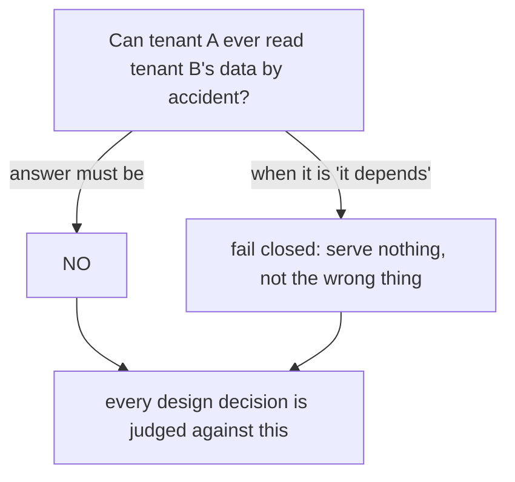

Multi-tenant SaaS has a tempting wrong answer: put a `tenant_id` column on every table and add
`WHERE tenant_id = ?` everywhere. It works until the one query that forgets the clause, or groups an
`OR` wrong, and then one customer sees another customer's invoices. That failure is silent,
expensive, and unforgivable. Lasagna's response is to make the database enforce the boundary, so a
forgotten clause returns nothing instead of everything.

## The map: four layers, one cluster

A Lasagna app partitions one PostgreSQL cluster into four layers. Which layer a model belongs to
decides which schema (or database) its queries hit. There is a **data plane** (per-tenant data) and
a **control plane** (the shared backoffice that coordinates tenants).

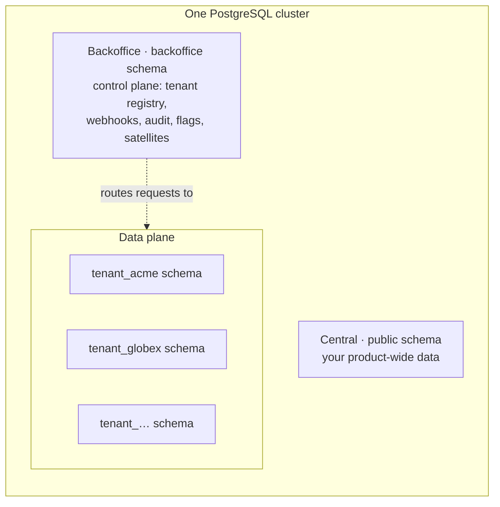

The [Concepts](/start/concepts) page teaches this four-layer model hands-on and is the right
starting point if it is new to you. The rest of this document assumes it and goes underneath.

<Callout type="tip" title="Mental model">
Tenant data lives in tenant schemas (the data plane). Everything that coordinates tenants lives in
the shared <code>backoffice</code> schema (the control plane). The two never mix.
</Callout>

## The request lifecycle, end to end

A request is resolved to a tenant once, on the way in. From there the active isolation driver
decides which connection serves each query, so controllers only ever call
`TenantBaseModel.query()` with no manual tenant filter.

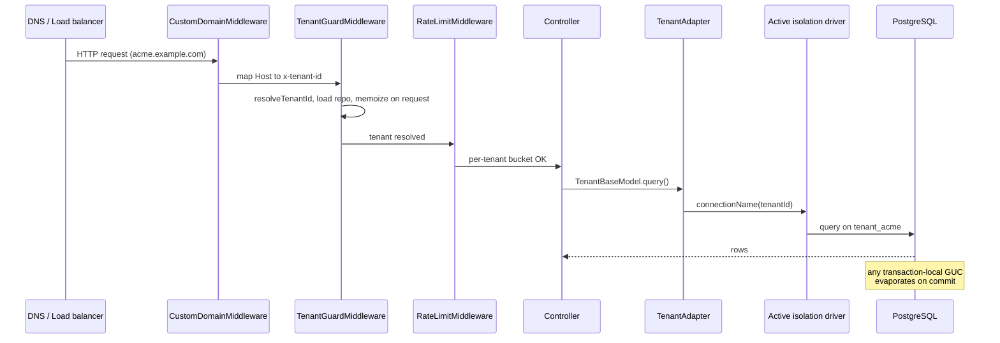

The seams worth naming: `TenantGuardMiddleware` resolves the tenant and memoizes it on the request
(so repeated `request.tenant()` calls do not re-fetch), the **adapter** turns a model query into a
connection, and the **active driver** owns the storage shape. The next sections open each seam.

## Isolation is a pluggable seam

Here is the most important correction to make if you arrive with the wrong mental model:
**schema-per-tenant is the default, not the only mode.** Isolation is chosen at config time and
implemented behind a single interface, [`IsolationDriver`](https://github.com/Arcoders/Adonisjs-lasagna-saas-tenancy/blob/master/packages/core/src/services/isolation/driver.ts).
Lasagna ships four drivers and lets a host register its own.

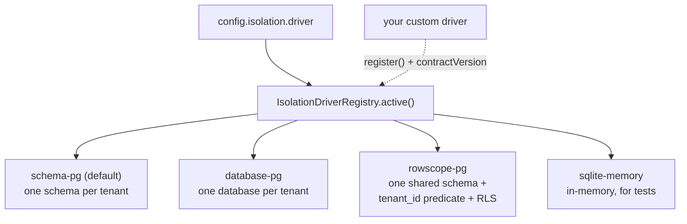

This is why a contributor cannot state "a tenant always lives in its own schema" as an absolute. It
is true for the default `schema-pg`, but `rowscope-pg` keeps many tenants in one shared schema, and
`database-pg` gives each tenant its own database. The honest invariant is narrower.

<Callout type="warning" title="Invariant: physical isolation is the default, and the choice is explicit">
The default driver gives each tenant its own PostgreSQL schema, which is the strongest at-rest
boundary on shared infrastructure. The other drivers trade that boundary for scale or convenience.
The fix when you need a different shape is to set <code>isolation.driver</code> deliberately and
read <a href="/guides/data-isolation/">Data isolation</a> for the trade-offs, not to assume the
default everywhere.
</Callout>

Each driver declares an `ISOLATION_CONTRACT_VERSION`; the registry rejects a driver built for a
newer core and warns on an older one (the same asymmetry described in
[the satellite contract](#the-satellite-contract)). Pick a driver by scale:

| Driver | Isolation | Best for | Main ceiling |
|---|---|---|---|
| `schema-pg` (default) | High (per-schema) | Tens to a few thousand tenants | Catalog growth, O(N) migrate/backup, connection fan-out |
| `database-pg` | Highest (per-database) | Fewer, higher-value tenants | Heavier per-tenant overhead, `CREATEDB` privilege |
| `rowscope-pg` | Lower (query predicate) | Very many small tenants | Isolation depends on `tenancy.run()` and the scope mixin |
| `sqlite-memory` | Test-only | Unit and integration tests | Not for production |

## Two isolation models: physical and logical

The four drivers fall into two camps, and the camp decides where the boundary lives. This is the
single distinction a contributor must internalize, because the rest of the safety story differs
between them.

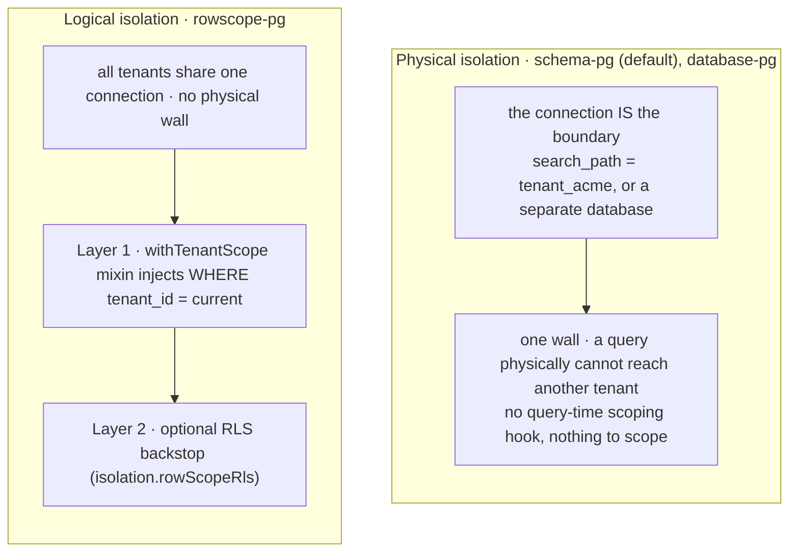

With a **physical** driver there is nothing to defend in depth: the connection's `search_path` (or a
separate database) means a query simply cannot name another tenant's table. There is no query-time
scoping hook to apply (`enforce` is an optional driver hook these drivers omit) because the boundary
is the connection itself.

With the **logical** driver (`rowscope-pg`) every tenant shares one connection, so isolation has to
be built in software, and that is where defense in depth matters. The `withTenantScope` mixin injects
the `tenant_id` predicate, and PostgreSQL Row-Level Security is the database-level backstop you turn
on with `isolation.rowScopeRls`. Here is what escapes if each logical layer alone fails:

| Layer (rowscope-pg) | If it alone fails | Can a tenant escape? | What the user sees |
|---|---|---|---|
| Physical driver (if you used one instead) | Not applicable, the connection is the wall | No | 404 or 503 |
| Mixin (`WHERE tenant_id`) | A top-level `orWhere` in a 3+ way OR leaves a branch unscoped | Potentially, yes | Another tenant's rows |
| RLS (the GUC policy) | The GUC is unset | No | Zero rows (fail-closed) |

The mixin is the weakest control because it trusts the developer not to write a query that escapes
it. RLS is the safety net that turns a developer mistake into zero rows instead of a leak. The
provider logs a boot warning when you run bare `rowscope-pg` without `rowScopeRls`: isolation is then
convention-only.

<Callout type="warning" title="Top-level orWhere can escape the rowscope-pg mixin">
The mixin injects the tenant predicate as flat top-level conditions, and SQL binds <code>AND</code>
tighter than <code>OR</code>, so a query like
<code>Post.query().where('a', 1).orWhere('featured', true)</code> leaves the
<code>featured</code> branch unscoped and leaks other tenants' featured rows. The fix: group OR
branches inside a callback (<code>.where(q => q.where(...).orWhere(...))</code>) so the tenant
predicate stays outside the OR, and enable RLS (<code>isolation.rowScopeRls</code>) so the database
refuses the leak even if a query slips through. This only applies to <code>rowscope-pg</code>; the
physical drivers have no such footgun. Enforced in
<a href="https://github.com/Arcoders/Adonisjs-lasagna-saas-tenancy/blob/master/packages/core/src/models/scoping.ts">scoping.ts</a>.
</Callout>

## RLS done right: the transaction-local GUC

Row-Level Security is the database-level backstop for the logical (`rowscope-pg`) model, turned on
with `isolation.rowScopeRls`. It only earns its keep if the tenant variable behaves correctly on a
pooled connection. The naive approach sets a session variable and breaks the moment the pool hands
that connection to the next tenant. Lasagna sets it **transaction-local** and writes the policy to
**fail closed** when it is unset.

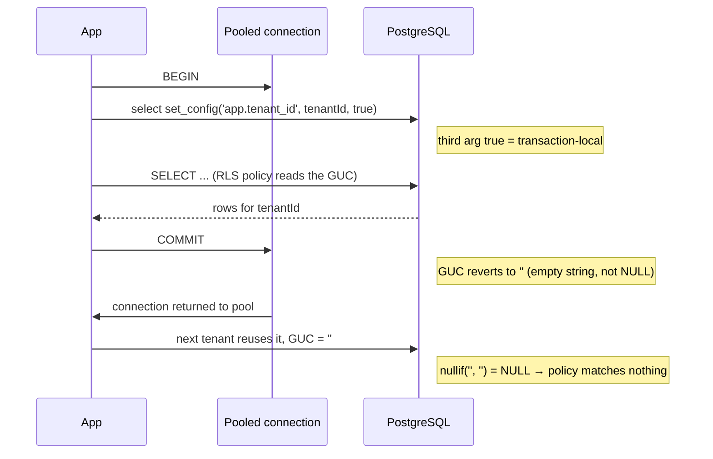

The policy in the migration stub is deliberate:

```sql
CREATE POLICY tenant_isolation ON your_table
  USING ("tenant_id"::text = nullif(current_setting('app.tenant_id', true), ''))
  WITH CHECK ("tenant_id"::text = nullif(current_setting('app.tenant_id', true), ''));
```

Why `nullif`? After a transaction commits, a pooled connection reverts a custom GUC to `''`, not
`NULL`. In SQL, `tenant_id = ''` is false for any real id, but the safer construction is explicit:
`nullif('', '')` returns `NULL`, and `tenant_id = NULL` matches no rows. So a query that runs
without ever setting the GUC returns zero rows rather than a connection's leftover value. The set
call uses the third argument `true` (transaction-local) so the value never outlives its transaction.
The helper is [`withTenantRls`](https://github.com/Arcoders/Adonisjs-lasagna-saas-tenancy/blob/master/packages/core/src/services/isolation/rls.ts);
the GUC key is `app.tenant_id`.

<Callout type="note" title="Lesson learned">
The public <code>transactionLocal</code> option was removed from the API on purpose: a fail-open
mode has no place in a fail-closed isolation primitive. The GUC is always transaction-local now,
with no switch to make it otherwise.
</Callout>

### RLS migration checklist

For every table that belongs to a tenant:

1. Add `tenant_id uuid NOT NULL` (or `tenant_id integer`, your choice).
2. Create an index on `tenant_id`.
3. Add the table to the `enable_rls_tenant_isolation` migration:
   ```sql
   ALTER TABLE your_table ENABLE ROW LEVEL SECURITY;
   ALTER TABLE your_table FORCE ROW LEVEL SECURITY;
   CREATE POLICY tenant_isolation ON your_table
     USING (tenant_id = nullif(current_setting('app.tenant_id', true), ''));
   ```
4. Verify the fail-closed behavior:
   ```bash
   # with app.tenant_id unset, this returns 0 rows
   psql -c "SELECT count(*) FROM your_table;"
   ```

## How a query finds its tenant

A model never says which schema it lives in. It declares a kind, and one unified
[`TenantAdapter`](https://github.com/Arcoders/Adonisjs-lasagna-saas-tenancy/blob/master/packages/core/src/models/adapters/tenant_adapter.ts)
routes every query by reading that kind. The choice is a marker (`static isolation`), not the
inheritance chain.

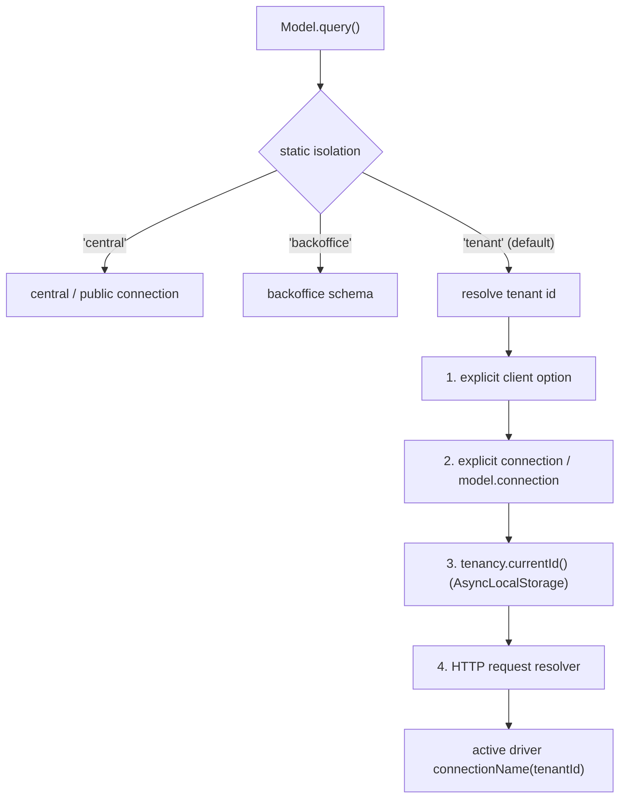

The three base classes ([`TenantBaseModel`](https://github.com/Arcoders/Adonisjs-lasagna-saas-tenancy/blob/master/packages/core/src/models/base/tenant_base_model.ts),
`BackofficeBaseModel`, `CentralBaseModel`) are thin markers over this one adapter. The resolution
chain is what lets the same model work in an HTTP request and in a background job without changing
any code, because step 3 reads the tenant from `AsyncLocalStorage`.

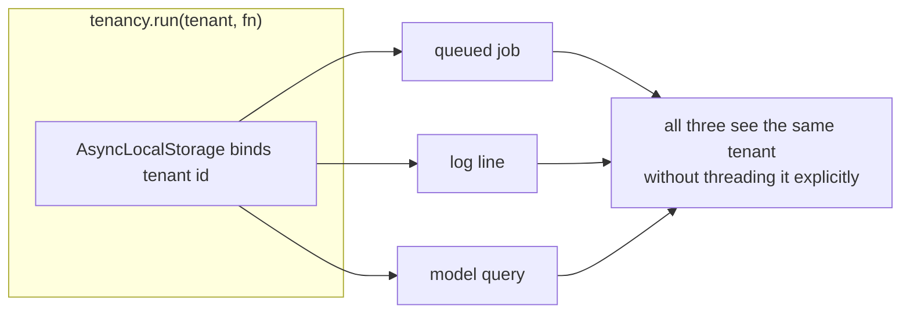

`tenancy.run(tenant, fn)` is how you establish tenant context outside an HTTP request (a job, a
command, a scheduled task). It is the same mechanism that isolates [background jobs](/guides/jobs):
the queue worker wraps each job in `tenancy.run()`, so the job's model queries route to the right
tenant with no extra plumbing. Inside it, `tenancy.currentId()` returns the active tenant, and the
adapter finds it automatically. For the rare legitimate cross-tenant query, `unscoped(fn)` bypasses
the mixin; in strict mode (the default), a tenant-scoped model used with no context and no
`unscoped()` throws rather than silently running unscoped. See
[`tenancy.ts`](https://github.com/Arcoders/Adonisjs-lasagna-saas-tenancy/blob/master/packages/core/src/tenancy.ts)
and [`scoping.ts`](https://github.com/Arcoders/Adonisjs-lasagna-saas-tenancy/blob/master/packages/core/src/models/scoping.ts).

## The connection budget

You cannot hold an open pool to every tenant at once, so `schema-pg` and `database-pg` bound the
open connections with an **in-use-aware LRU**. The subtle decision: under a burst, the pool exceeds
its cap rather than sever an in-flight request.

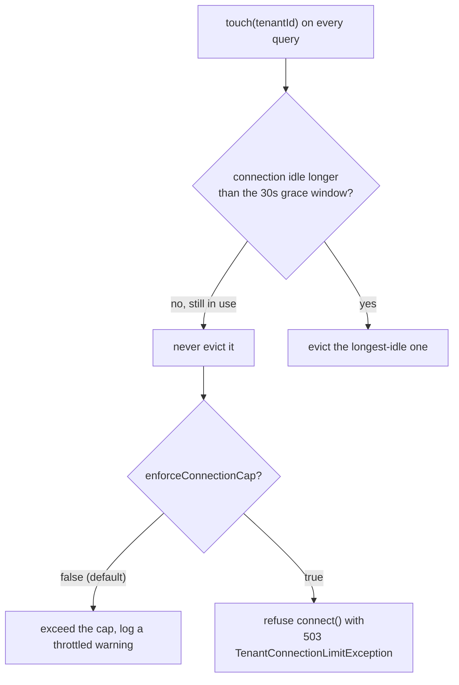

The single most important sizing fact, taken straight from [Scaling limits](/guides/scaling-limits):
open connections scale with concurrently **active** tenants, not with `maxTenantConnections`. The
default soft cap never severs a connection inside the 30 second grace window, so a burst of N active
tenants opens roughly N pools, bounded only by PostgreSQL `max_connections`. Size `max_connections`
for your peak concurrent-tenant count, front Postgres with PgBouncer at higher counts, and turn on
`enforceConnectionCap` only when a firm budget matters more than absorbing every burst. The
exception class is [`TenantConnectionLimitException`](https://github.com/Arcoders/Adonisjs-lasagna-saas-tenancy/blob/master/packages/core/src/exceptions/tenant_connection_limit_exception.ts)
(503).

<Callout type="note" title="Two guards keep an active connection alive">
Eviction is protected twice. The grace window is the cheap first pass: <code>touch(tenantId)</code>
stamps a connection on every query, and anything touched within <code>evictionGracePeriodMs</code>
(default 30s) is never a victim. The authoritative guard runs right before a stale victim is actually
closed: the driver reads the knex pool's checked-out count, and if a query is still in flight (even a
single long query that outlived the grace window) it declines the close and the connection goes back
into the registry with a fresh heartbeat. So eviction only ever closes a genuinely idle pool. If the
pool introspection ever can't read the count it falls back to the grace-window behaviour, which is
why sizing <code>evictionGracePeriodMs</code> above your p99 query duration is still good practice.
The check is <a href="https://github.com/Arcoders/Adonisjs-lasagna-saas-tenancy/blob/master/packages/core/src/services/isolation/pool_in_use.ts">pool_in_use.ts</a>.
</Callout>

## Resilience: breakers and fail-closed errors

Two mechanisms keep one tenant's trouble from becoming everyone's. A per-tenant **circuit breaker**
stops hammering a dead tenant database, and a deliberate **error mapping** decides which failures are
retryable.

The breaker (built on `opossum`, state persisted to Redis so it survives a restart) opens after the
error rate crosses the threshold over a minimum volume, fast-fails for the reset window, then probes:

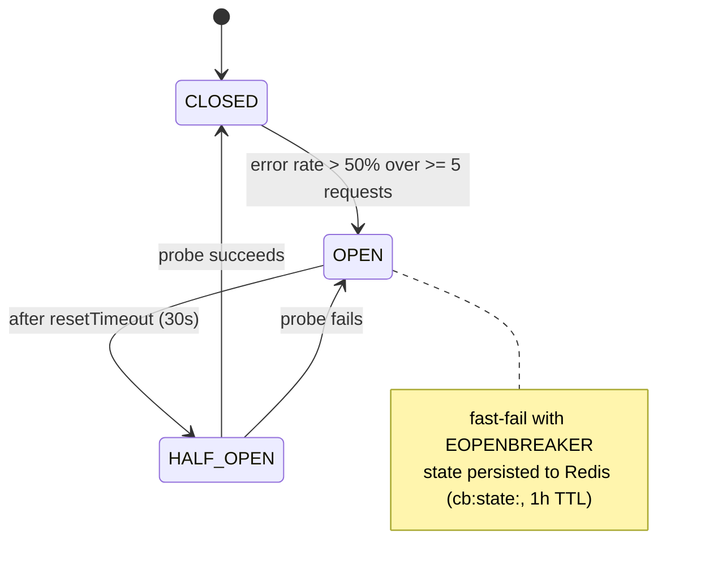

When the breaker is OPEN, `run(tenantId)` rejects with opossum's `EOPENBREAKER` code, which the
request path maps to a 503 instead of blocking on a 5 second probe. See
[`circuit_breaker_service.ts`](https://github.com/Arcoders/Adonisjs-lasagna-saas-tenancy/blob/master/packages/core/src/services/circuit_breaker_service.ts).

The error mapping is where fail-closed becomes concrete. The rule distinguishes a transient
dependency outage (retry me) from a decided answer (this is final):

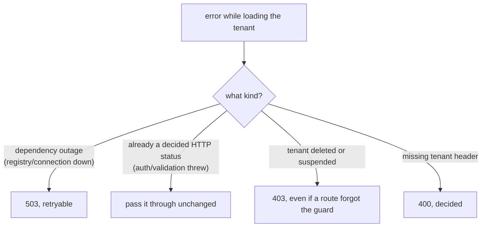

A deleted or suspended tenant returns 403 even when a route forgot to mount the guard middleware,
because `assertTenantActive` runs on the load path, not only in the guard. See
[`extensions/request.ts`](https://github.com/Arcoders/Adonisjs-lasagna-saas-tenancy/blob/master/packages/core/src/extensions/request.ts).

## The satellite contract

Optional features (reporting, billing, admin, SSO, websockets) are **satellites**: npm packages
that plug into a versioned **surface** in the host. The vocabulary matters, so it is worth fixing:

- **Surface**: a versioned extension point the host exposes.
- **Satellite**: an npm package that implements a surface.
- **Host**: the AdonisJS app that consumes Lasagna and registers satellites.
- **Scope**: the active tenant context inside `tenancy.run()`.

Compatibility between a satellite and its host is **asymmetric** on purpose, and the same rule
governs three different contract surfaces (extensions, isolation drivers, and resolvers):

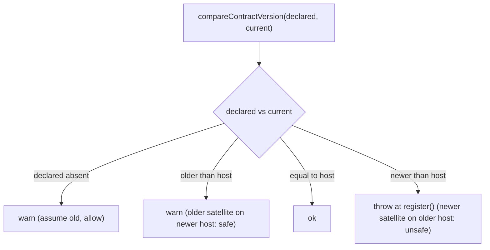

An older satellite can run on a newer host because backward compatibility is the host's
responsibility. A newer satellite cannot run on an older host, because it would assume an API the
host does not implement, so it is rejected at registration. The consequence: the core cannot make a
breaking change to a surface without bumping its major version, and the contract is frozen by test.
The check is [`checkContractCompat` / `compareContractVersion`](https://github.com/Arcoders/Adonisjs-lasagna-saas-tenancy/blob/master/packages/core/src/sdk/contract_version.ts).
The five surfaces each declare their own `CONTRACT_VERSION` constant (audit, feature flags, and
webhooks ship in core rather than as satellites).

## Extension timeout is a deadline, not a cancellation

When the host runs host-supplied extension code, the timeout is a **response deadline**, not a
guarantee that the code stopped. JavaScript cannot forcibly cancel a running promise, so the host
guarantees the caller gets an answer and offers the extension a chance to unwind.

```mermaid
sequenceDiagram
  participant Host
  participant Ext as Extension
  Host->>Ext: fn(abortSignal)
  Host->>Host: Promise.race([run, deadline])
  Note over Host: timer fires at timeoutMs
  Host->>Host: reject with ExtensionTimeoutError (504) FIRST
  Host->>Ext: controller.abort() (best-effort)
  Host-->>Host: 504 wins the race deterministically
  Note over Ext: cooperative fn unwinds on the signal;<br/>a non-cooperative fn keeps running in the background
```

The deadline rejects before the abort fires, so the 504 is the authoritative reason the caller sees.
The `AbortSignal` is a courtesy for cooperative extensions; a non-cooperative one keeps running and
keeps holding any tenant connection it took, which is why this interacts with the connection budget.
See [`execute_extension.ts`](https://github.com/Arcoders/Adonisjs-lasagna-saas-tenancy/blob/master/packages/core/src/services/extensions/execute_extension.ts);
the behavior is asserted by the "slow extension trips the configured timeout (504)" test in
[`report_extension.spec.ts`](https://github.com/Arcoders/Adonisjs-lasagna-saas-tenancy/blob/master/packages/reporting/tests/@guarantees/behavior/integration/behavior_report_extension.spec.ts).
The default is "no timeout"; you opt in via `reporting.extensions.timeoutMs`.

## The IoC seam: TENANT_REPOSITORY

The package never imports your `Tenant` model. It cannot: the model lives in the host app and the
package ships before the host exists. Instead the host binds an implementation of
`TenantRepositoryContract` to a container symbol, and the package resolves it.

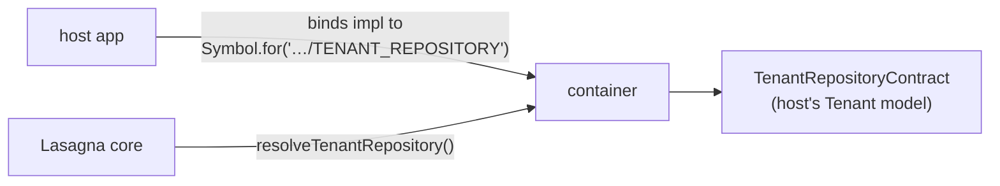

This is the central inversion of control in the codebase. It is why the package can be a dependency
of thousands of different apps without knowing anything about their tenant table. The symbol is a
`Symbol.for(...)` key (the same cross-realm trick described in
[the build architecture](#the-testing-and-build-architecture)), and the helper is
`resolveTenantRepository()` in [`types/contracts.ts`](https://github.com/Arcoders/Adonisjs-lasagna-saas-tenancy/blob/master/packages/core/src/types/contracts.ts).

## Provider lifecycle and the config singleton

The [`MultitenancyProvider`](https://github.com/Arcoders/Adonisjs-lasagna-saas-tenancy/blob/master/packages/core/src/providers/multitenancy_provider.ts)
wires everything in three phases, and the phase a thing happens in is load-bearing.

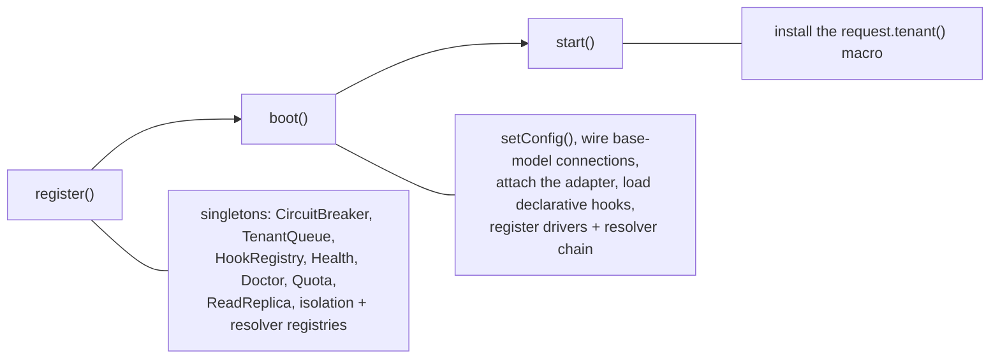

The rule a contributor must internalize: **stateful cross-request services are registered in
`register()` and resolved with `container.make`, never `new`-ed ad hoc.** A `new` would create a
second instance with its own Map, and the two would disagree about which tenants are open or which
breakers are tripped. An architectural test enforces this for the Map-backed services.

Config is a module-level singleton in [`config.ts`](https://github.com/Arcoders/Adonisjs-lasagna-saas-tenancy/blob/master/packages/core/src/config.ts):
`setConfig()` is called once in `boot()`, the tree is deep-frozen so nothing can mutate it
mid-request, and `getConfig()` **throws if the provider has not booted**. That throw is a feature:
it turns "service used before initialization" into a loud failure instead of a silent
`undefined`-shaped bug. `assertConfigBounds()` validates the numeric ranges at boot.

## Tenant lifecycle and hooks

A tenant moves through a small state machine, and deletion is deliberately two steps so an
accidental destroy is recoverable.

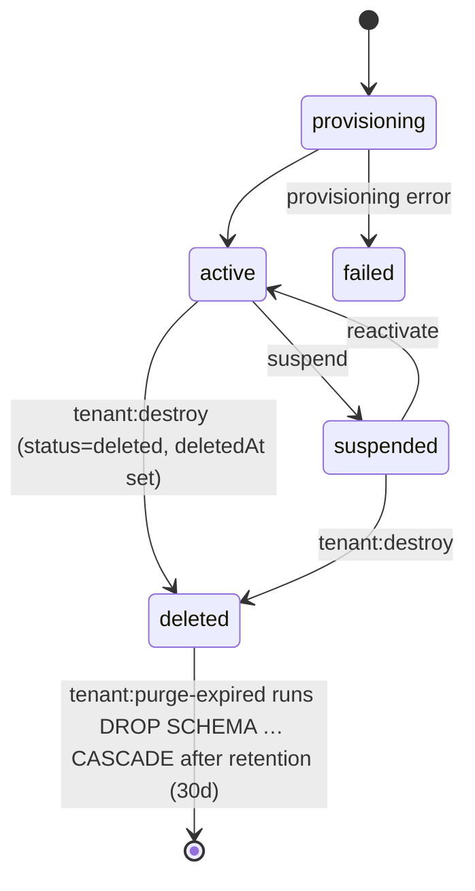

The status enum is `provisioning | active | suspended | failed | deleted`. This is the nuance behind
"schema-per-tenant makes deletion a clean `DROP SCHEMA`": the drop is real, but it is not instant.
`tenant:destroy` sets the status to `deleted` (with `deletedAt`), which makes the tenant immediately
unreachable, and `tenant:purge-expired` runs `DROP SCHEMA "tenant_<uuid>" CASCADE` only after the
retention window elapses (default 30 days). If the drop fails after the soft-delete, the tenant is
already unreachable and the orphan schema is reclaimable. When legal retention forbids deletion,
`tenant:gdpr:anonymize` masks the tenant's PII in place instead of dropping the schema; see
[Compliance](/guides/compliance). See also [Schema-pg isolation](/guides/data-isolation/schema-pg).

The status space is single-sourced from the `TENANT_STATUSES` tuple, and the request-path floor
routes through one exhaustive classifier (`tenantLifecycleDisposition`), so adding a status is a
compile error until every guard handles it. A tenant's full observable state is the product of
`status`, the `deletedAt` soft-delete axis, and its storage/ledger reality; the reachable composites,
their expected diagnosis, and their floor disposition are enumerated as data in `TENANT_STATE_MATRIX`
and pinned by a completeness spec, so "diagnose every reachable state" is a build gate.

### The doctor never harms the patient

Every `tenant:doctor --fix` may only move a tenant toward health, and must never touch physical data
destructively. This is machine-enforced, not aspirational: each fixable issue declares a do-no-harm
effect class (`physical-identity` · `additive-only` · `status-only` · `operational-only`) in a
`SafeFix` registry, a coverage guard asserts every issue code is either fixable-with-a-descriptor or
explicitly surface-only, and a property harness drives each fix's worst pre-state on real Postgres and
asserts health rises while the data fingerprint is preserved.

A **relocated migration** is the load-bearing example. When an app inlined a satellite's per-tenant
migration under a legacy ledger name, the object already exists, so re-running the DDL collides. The
healer treats such a duplicate-object collision as benign and never quarantines the (healthy) tenant;
the drift check recognises the relocation from the satellite's declared `migrationAliases` and routes
it to `tenant:doctor --reconcile-ledger`, which rewrites the single `adonis_schema.name` row `from → to`
with **zero DDL** through a VERIFY-THEN-COMMIT envelope that asserts the affected tables' row counts and
columns are byte-identical before and after. Any precondition miss refuses and leaves the tenant
untouched.

Two registries fire around this lifecycle. The
[`HookRegistry`](https://github.com/Arcoders/Adonisjs-lasagna-saas-tenancy/blob/master/packages/core/src/services/hook_registry.ts)
runs declarative before/after hooks on provision, destroy, backup, restore, clone, and migrate. The
[bootstrapper registry](https://github.com/Arcoders/Adonisjs-lasagna-saas-tenancy/blob/master/packages/core/src/services/bootstrapper_registry.ts)
enters and leaves per-tenant context for cache, drive, mail, session, queue, and broadcasts, in LIFO
order, and guarantees `leave()` runs even if the handler throws.

## Resolution: chain vs legacy switch

There are two ways the package turns a request into a tenant id, and a contributor should know which
is canonical. The modern path is an async **resolver chain**: `config.resolverChain` is seeded into
a `TenantResolverRegistry` at boot, each resolver is tried in order, and the first hit wins.
Resolvers declare a `RESOLVER_CONTRACT_VERSION` and follow the same compatibility asymmetry as
satellites. The legacy path is the synchronous `resolveTenantId()` switch with five strategies
(`subdomain`, `domain-or-subdomain`, `path`, `request-data`, `header`), kept as a fallback for
backward compatibility.

Always go through `resolveTenantId()` or the registry rather than reading the header directly: the
strategy can be any of the five, and a bypass is a subtle source of cross-tenant bugs. The result is
memoized on the request via a `Symbol` so repeated `request.tenant()` calls in one request do not
re-resolve. See [`extensions/request.ts`](https://github.com/Arcoders/Adonisjs-lasagna-saas-tenancy/blob/master/packages/core/src/extensions/request.ts).

## Fail-closed vs fail-open: the policy matrix

A 100% fail-closed system collapses under any partial degradation; a 100% fail-open system is
insecure. Each domain chooses based on what the wrong answer costs.

| Feature | Policy | Why |
|---|---|---|
| RLS | Fail-closed | Unset GUC returns zero rows. No data beats wrong data. |
| Webhook SSRF | Fail-closed | A malicious URL is blocked, and a 3xx redirect is never followed. Never trust user input. |
| Outbound redirects | Fail-closed | Every server-side fetch to a caller-influenced URL (webhook, OIDC discovery/token) pins `redirect: 'manual'` and rejects any 3xx. A redirect chosen by the receiver would slip past the URL guard. |
| Attribution identity | Fail-closed | A tenant id that is not a `SAFE_IDENT` (e.g. carries the `:` Redis-key delimiter) never reaches a metric key or rate-limit bucket: it is dropped, or degrades to a per-IP `global` bucket, never an attacker-chosen tenant. |
| ContextSeal (tenant-context mismatch) | Fail-closed | When an active `tenancy.run()` scope and the HTTP request resolve DIFFERENT tenants for the same model query, the adapter answers a typed 500 (`E_ISTHMUS_TENANT_MISMATCH`) and emits the critical `isthmus:seal:tenant:mismatch` event instead of routing under the scope's tenant. Jobs have no HTTP context, so the seam is inert there. See [Isthmus guard registry](/reference/isthmus). |
| Health probe surface | Fail-closed | The unauthenticated `/readyz` and `/healthz` expose only `{ status }` per check, never the per-check `meta`/`message` that carry OPEN-circuit tenant ids or raw DB/Redis errors. Detail stays behind the admin Doctor report. |
| Impersonation token | Fail-closed | Invalid HMAC returns 403. Never fall back to anonymous. See [Impersonation](/guides/satellites/impersonation). |
| Admin routes | Fail-closed | `multitenancyAdminRoutes` throws at startup without auth middleware; the host supplies the 401. Never mount admin APIs without middleware. |
| Rate limiting | Fail-closed | A Redis outage returns 503; opt into `failOpen` per surface where availability beats abuse protection. See [Rate limiting](/guides/rate-limiting). |
| Billing event ledger | Fail-closed | The webhook worker claims a row atomically (`pending`/`failed` → `processing`) before processing, so concurrent re-deliveries can't both fire the host-facing application event. |
| Quota notification dedupe | Fail-open | On a Redis outage, send without dedupe. Spam beats silence. |
| Read replica | Error (not fail-open) | A dead replica is an explicit 503. A masked outage stampedes the primary. |

The read-replica row is the one people expect to be fail-open and is not. There is no automatic
failover to the primary on purpose: a silent fallback masks a replica outage and stampedes the
primary exactly when it is least able to take it. An unreachable replica surfaces as an error at
query time. See [Read replicas](/guides/read-replicas).

## Webhooks and SSRF, a worked fail-closed example

Outbound webhooks are the clearest place to watch fail-closed in action, because the target URL is
attacker-influenced. The guard validates the URL at registration and again at delivery.

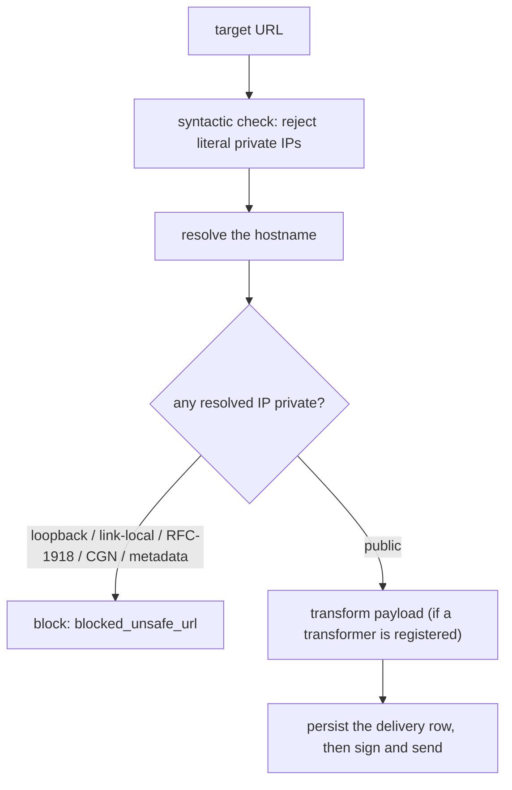

[`validateResolvedHostIsPublic`](https://github.com/Arcoders/Adonisjs-lasagna-saas-tenancy/blob/master/packages/core/src/utils/url.ts)
resolves the hostname and rejects loopback (127.0.0.0/8, ::1), link-local and cloud metadata
(169.254.0.0/16), RFC-1918 private ranges, carrier-grade NAT (100.64.0.0/10), and IPv6 ULA. It also
rejects the **IPv6 transition prefixes** (NAT64 `64:ff9b::/96`, 6to4 `2002::/16`, Teredo
`2001:0000::/32`) outright. Those tunnel an IPv4 destination the host's gateway routes to (including
cloud metadata via `64:ff9b::a9fe:a9fe` on an IPv6-only egress), so the embedded address must not be
trusted. The dev-only env flag `WEBHOOKS_ALLOW_LOOPBACK_TARGETS` relaxes loopback only; private and
metadata ranges stay blocked even with it on. The payload transformer (if registered) runs **before**
the delivery row is persisted, so what you store is what you send.

The guard validates the URL, but the **next hop** is not under its control: a conformant receiver
answers `2xx`, but a 3xx `Location` is chosen by the (attacker-influenced) receiver and the guard
never sees it. So every server-side fetch to a caller-influenced URL (webhook delivery and OIDC
discovery/token exchange) pins `redirect: 'manual'` and treats any 3xx as a permanent, non-retryable
failure rather than chasing it to an internal or metadata host. For OIDC the token POST carries the
decrypted `client_secret`, so refusing the redirect is also what keeps that secret from being
exfiltrated. The OIDC `issuerUrl` is validated at **write** time too (not just at fetch), so a
private/metadata issuer can never be stored in the first place.

<Callout type="warning" title="Residual risk: DNS rebinding (TOCTOU)">
The guard resolves the hostname to classify it, but does not pin that IP for the subsequent fetch,
so a name that rebinds between the check and the connection can still slip through. The fix is to
pair the application guard with network-level egress controls; the application cannot close this gap
alone. This is documented in the source comment on <code>validateResolvedHostIsPublic</code>.
</Callout>

## Limits and trade-offs

This separates product decisions (the scope, not bugs) from technical limitations (real, mitigated,
and may change).

### Product decisions, on purpose

- **PostgreSQL only.** PostgreSQL has schemas, RLS, and GUCs, which are the primitives the whole
  isolation model is built on. MySQL is out of scope by design, not a deferral. If you need MySQL
  multitenancy today, use `stancl/tenancy`.
- **AdonisJS only.** Lasagna assumes the AdonisJS IoC container, provider system, and `ace`
  commands. Supporting another framework would mean rewriting the core, so it is out of scope by
  design. We prefer depth on one framework over breadth across many.
- **No automatic failover for read replicas.** A dead replica is an explicit error, by the reasoning
  in the policy matrix above.
- **No hard cancellation of extensions.** The timeout is a deadline; a cooperative extension may
  ignore the `AbortSignal`. This prevents inconsistent state from a forced kill.
- **RLS is opt-in.** It requires `tenant_id` on every protected table and a published migration. The
  package cannot assume your schema, so it cannot enable RLS for you.

### Technical limitations, real but mitigated

- **Catalog growth at high schema counts.** The practical sweet spot for `schema-pg` is tens to a
  few thousand tenants per database instance; past that, catalog size, O(N) migrate/backup, and
  connection fan-out grow. Mitigation: PgBouncer, sharding across instances, or `database-pg`. The
  curves are measured by the `connection_budget` and `catalog_bloat` benchmarks in
  [benchmarks/src/memory](https://github.com/Arcoders/Adonisjs-lasagna-saas-tenancy/tree/master/benchmarks/src/memory);
  see [Scaling limits](/guides/scaling-limits) for the published numbers.
- **The soft cap does not bound open connections under burst.** With the default 30 second grace,
  the LRU exceeds the configured cap rather than sever an active request, so open connections trend
  toward the active-tenant count. Mitigation: `enforceConnectionCap` or PgBouncer.
- **RLS requires `tenant_id` on every protected table.** There is no automatic column injection; you
  edit the migration stub for your own tables.
- **The SQL importer refuses, rather than corrupts, ambiguous dumps.** Rewriting a schema name that
  appears inside a SQL string literal (not just an identifier) could silently change stored data, so
  the importer **refuses** such a dump by default and surfaces every suspect line, proceeding only
  with an explicit `force` option. See
  [`sql_import_service.ts`](https://github.com/Arcoders/Adonisjs-lasagna-saas-tenancy/blob/master/packages/backup/src/services/sql_import_service.ts).
- **SSRF validation has a residual TOCTOU window**, described above.

## The testing and build architecture

This is the one piece of build plumbing every contributor trips over once. The package
**self-references its own compiled output**: the `exports` map routes public subpaths like
`@adonisjs-lasagna/saas-tenancy/services` to `./build/src/...`.

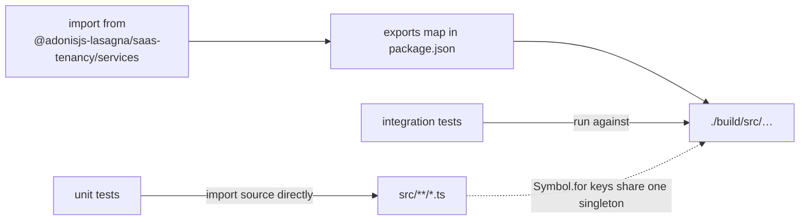

Two consequences. First, integration tests run against `./build`, so `npm run test:integration`
always builds first; editing source and re-running without a rebuild silently tests stale code.
Unit tests import source directly and need no build. Second, module-level singletons (the config
store, the `TENANT_REPOSITORY` binding) use `Symbol.for(...)` registry keys so that the `src/` copy
and the `build/` copy resolve to the **same** singleton on `globalThis`, instead of each module
realm getting its own state. Without that, config set in `build/` would read back `null` in `src/`.

### Integration test isolation

That shared-singleton design has a corollary the test harness has to defend. The integration suite
boots one app, so every spec shares the process-level singletons (the config store, the tenant
resolver registry, the resolution caches). A spec that mutates one and forgets to restore it would
poison every later spec. The shared harness (`@adonisjs-lasagna/satellite-test-kit`) snapshots a set
of named baselines at the first group and, after every group, restores any a spec left drifted,
naming the offending group in a warning. The multitenancy config and the resolver chain are guarded
today, so a leaked `setConfig` or a re-boot with a different resolver strategy cannot reach the next
spec. Spec files also run in a deterministic sorted order, so a leak is reproducible rather than an
intermittent failure that depends on the filesystem readdir order. A new baseline is added only for a
demonstrated leak, never as a speculative snapshot of every singleton.

## The decision log

These are the choices that would require a version bump or a rewrite to reverse. Commit SHAs are not
listed here because they drift; verify any decision against the history with
`git log --grep="..."`.

| Date | Decision | Motivation | Reversibility |
|---|---|---|---|
| 2026-06 | RLS opt-in, not default | Requires per-table migration editing; cannot assume the host schema. | Hard: would break apps without RLS migrations. |
| 2026-06 | `CONTRACT_VERSION` asymmetric | A newer satellite on an older host is unsafe; the reverse is safe. | Hard: would break existing satellites. |
| 2026-06 | Extension timeout as a deadline | Cooperative cancellation is not atomic in JavaScript. | Hard: changes the contract for all extensions. |
| 2026-06 | `WEBHOOKS_ALLOW_LOOPBACK_TARGETS` (loopback only) | The old broad flag opened metadata and RFC-1918; only loopback is safe for dev. | Soft: an alias could be added but deprecated. |
| 2026-06 | Connection cap soft by default | Rejecting under burst (503) is an operator decision to opt into. | Soft: `enforceConnectionCap` already exists. |
| 2026-06 | Monorepo split: core under `packages/core/` | Changesets cannot version a root package uniformly with workspace members. | Hard: would revert the release workflow. |
| 2026-06 | `nullif(current_setting(...), '')` in the RLS policy | A pooled connection reverts the GUC to `''`, not `NULL`, after commit. | Hard: would break the fail-closed guarantee. |
| 2026-06 | A resolved tenant id must be `SAFE_IDENT` before it keys a metric/bucket | An unvalidated id carrying `:` injects Redis-key structure and forges another tenant's metrics; an arbitrary id pollutes rate-limit buckets. | Soft: a stricter validator only narrows what is accepted. |
| 2026-06 | `actor_id` is `text`, not `uuid`, in the audit log | Operator identity (from `resolveAdminActor` / `--admin`) may be a uuid, an int-as-string, or an email; a uuid column silently dropped the audit row for the most privileged actions. | Soft: widening is backward-compatible; the migration is shipped. |
| 2026-06 | Server-side fetches pin `redirect: 'manual'` | A 3xx is chosen by the receiver and bypasses the URL guard; for the OIDC token POST it would also exfiltrate the `client_secret`. | Hard: changes outbound-fetch behavior for webhooks and OIDC. |
| 2026-06 | The webhook event ledger uses an atomic claim (`processing` status) | A read-then-check let two concurrent re-deliveries both fire the host-facing application event and double-grant. | Soft: the new status value is additive; the migration is shipped. |
| 2026-06 | Usage idempotency key sealed per-flush at dispatch, not from wall-clock | A minute-bucket key collapsed same-minute flushes (under-reporting) and a retry across a minute boundary minted a new key (double-billing). | Soft: the job falls back to the legacy key only for in-flight payloads during a deploy. |
| 2026-06 | Integration specs run in a deterministic order, guarded by state baselines | One booted app shares singletons, so an unordered run turned a cross-spec state leak into an intermittent, scattered failure. | Soft: the sort and the baseline list are additive. |

## The 3 AM debugging guide

### Queries unexpectedly return zero rows

- Are you inside `tenancy.run()`? If not, the mixin does not inject `tenant_id`.
- Using RLS? Check `SELECT current_setting('app.tenant_id', true);` in the same transaction.
- Is the GUC `''`? The pooled connection was not set this transaction; verify `withTenantRls()` usage.

### Every tenant request returns 400 in the integration test suite

- A spec re-booted the provider or rewired the tenant resolver registry without restoring it, so
  header resolution stopped extracting the tenant id and every request fell to a 400
  `MissingTenantHeaderException`. The harness restores the resolver chain between groups and logs a
  warning; search the run output for `[testkit] integration isolation:` naming the leaking group, and
  fix that group's teardown. The order is deterministic, so the failure reproduces on a re-run.

### A user sees another tenant's data

- Is domain/subdomain resolution cached and stale after a domain change? That is the most common
  cause. Check the resolution cache TTL.
- A raw query bypassing the mixin? `db.rawQuery()` does not inject `tenant_id`; only `Model.query()`
  and `db.from()` inside `tenancy.run()` are scoped.
- RLS enabled but the policy missing on this table? Every application table needs the policy.
- A top-level `orWhere` escaping the scope? See the warning under
  [the rowscope-pg isolation model](#two-isolation-models-physical-and-logical).

### Connection pool exhausted

- How many unique tenants did you touch in the last 30 seconds? Each holds a connection in the grace
  window.
- Is `enforceConnectionCap` off? Then the LRU grows toward PostgreSQL `max_connections`.
- Using PgBouncer in transaction pooling? Without it, every Lasagna connection is a real backend.

### The admin API returns 501 for SSO endpoints

- The admin package returns **501 with `{ error: 'sso_not_installed' }`** when
  `@adonisjs-lasagna/sso` is not installed. Admin provides the HTTP layer; SSO provides the logic.
  Install and register the SSO satellite to enable those endpoints.

### A webhook is blocked with `blocked_unsafe_url`

- Is the target a private, loopback, or metadata IP, or resolving to one? Production blocks these by
  design.
- In development, set `WEBHOOKS_ALLOW_LOOPBACK_TARGETS=true` to allow `localhost` only. Private and
  metadata ranges stay blocked.

## Operational signals

Lasagna emits a small, real set of signals. These are the ones that exist today (do not alert on
metric names you have not seen the package write).

**Metrics** (`requests`, `errors`, `bandwidth` per tenant, plus any host-defined `emitMetric` series)
flush from Redis to the `backoffice.tenant_metrics` and `tenant_custom_metrics` tables. See
[Reporting](/guides/satellites/reporting).

**Log keys to watch:**

| Signal | Where it comes from | What to do |
|---|---|---|
| `blocked_unsafe_url` | Webhook SSRF guard | Always investigate. Malicious target or misconfiguration. |
| `ExtensionTimeoutError` (`E_EXTENSION_TIMEOUT`) | An extension overran its deadline | Identify the extension by its `label`, notify the author. |
| `TenantConnectionLimitException` | `enforceConnectionCap` refused a connect | Indicates burst; raise the cap or add PgBouncer. |
| "...within the in-use grace window; exceeding the cap..." | Connection LRU over the soft cap | Expected under burst; raise `maxTenantConnections` or scale out if sustained. |
| "some destinations failed" (audit fan-out) | An audit sink errored or timed out | The canonical DB row is unaffected; check the slow sink. |
| `Circuit OPEN — tenant DB unavailable` | Circuit breaker tripped for a tenant | That tenant's database is failing; the breaker is shielding it. |
| `admin.audit.write_failed` | A privileged admin action could not be recorded | The action ran but left no audit row. Investigate the backoffice DB; attribution is missing. |
| `billing.event.claim_lost` | Two workers raced the same billing event; the loser skipped | Expected under concurrent re-delivery; the atomic claim prevented a double-grant. |
| `blocked_redirect:<status>` (webhook delivery) | A delivery target returned a 3xx | The receiver tried to redirect; delivery failed permanently by design. Check the endpoint. |

## Glossary

| Term | Meaning |
|---|---|
| **Surface** | A versioned extension point in the host (reporting, billing, admin, sso, websockets). |
| **Satellite** | An npm package that implements a surface. |
| **Host** | The AdonisJS app that consumes Lasagna and registers satellites. |
| **Driver** | The `IsolationDriver` implementation that decides where a tenant's data lives. |
| **Adapter** | The Lucid adapter that routes a model query to a connection by isolation kind. |
| **Isolation kind** | The `static isolation` marker on a model: `tenant`, `backoffice`, or `central`. |
| **Scope** | The active tenant context inside `tenancy.run()`, carried by `AsyncLocalStorage`. |
| **Bootstrapper** | A per-tenant enter/leave hook for cache, drive, mail, session, queue, broadcasts. |
| **Resolver chain** | The ordered async resolvers that turn a request into a tenant id. |
| **RLS** | PostgreSQL Row-Level Security, configured via the `app.tenant_id` GUC. |
| **GUC** | A PostgreSQL session/transaction variable; here, transaction-local. |
| **Grace window** | The 30 second window in which an idle LRU connection is not evicted. |
| **Control plane / data plane** | The shared `backoffice` schema vs the per-tenant schemas. |
| **Contract version** | The integer that gates satellite/driver/resolver compatibility (asymmetric). |
| **Circuit breaker** | A per-tenant failure detector that opens to stop hammering a dead database. |

## Quick reference

| I need to... | Command / check |
|---|---|
| Verify the tenant GUC | `SELECT current_setting('app.tenant_id', true);` |
| Check the connection pool | `SELECT count(*) FROM pg_stat_activity WHERE application_name LIKE 'lasagna%';` |
| Force a connection drain | Restart the Node.js process (the LRU is in-memory) |
| See RLS policies on a table | `\d+ your_table` in `psql` |
| Verify a schema exists | `SELECT schema_name FROM information_schema.schemata WHERE schema_name = 'tenant_acme';` |
| Verify admin audit attribution | `SELECT * FROM backoffice.tenant_audit_logs WHERE action LIKE 'admin:%' ORDER BY created_at DESC LIMIT 10;` |
| Check the active isolation driver | `config/multitenancy.ts` → `isolation.driver` (default `schema-pg`) |

## Read next

- [Concepts](/start/concepts); the four-layer mental model, hands-on.
- [Data isolation](/guides/data-isolation/); the four drivers and the trade-offs between them.
- [Scaling limits](/guides/scaling-limits); the honest ceiling and the connection budget.
- [Security](/guides/security); what the package owns and what the host owns.
- [Configuration](/reference/configuration); every option named here, with defaults.
