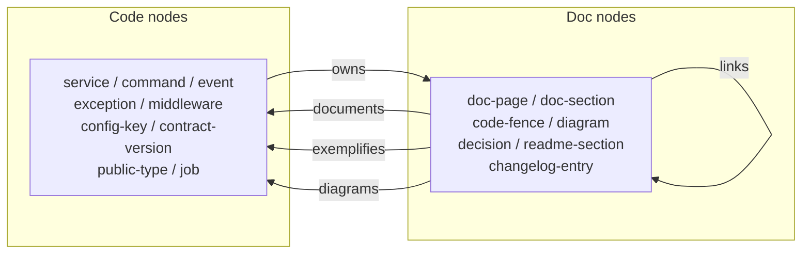

# RFC: Documentation Coverage (Documentation CI)

> **Status:** design contract for `packages/doc-coverage` and the `docs:doctor` CLI. This is a
> dev/contributor document, excluded from the published site (`srcExclude`) and from the dead-link
> gate. It is the seed of the future OSS project's `DESIGN.md`. Where this RFC and the tool disagree,
> the RFC is the spec and the tool is the bug, unless the RFC says otherwise.

This RFC describes a permanent answer to a problem Lasagna has outgrown. After every fix, feature, or
refactor, some slice of a large hand-written documentation surface goes stale, and there is no
mechanical way to know *which* slice. The answer is a **bidirectional code-to-docs graph**, a
**documentation impact analysis** on every diff, and a **documentation coverage** metric, built on
four **deterministic** signals, with no LLM, no API key, no network, no hallucination, and it runs in
any fork.

It is written the way [/architecture](https://github.com/Arcoders/Adonisjs-lasagna-saas-tenancy/blob/master/docs/architecture.md)
is written: the problem, the tempting wrong answer, why that answer leaks, then the design. If you read
one thing, read this: **only the deterministic gate blocks; everything else informs.** A documentation
tool that cries wolf gets muted, and a muted tool is worse than none.

## 1. The problem: the un-generatable surface drifts silently

Documentation has three layers, and they do not drift the same way.

- **Code examples** drift loudly the moment a signature changes, *if* something compiles them. That is
  solved by Rust doctests, Go `Example` funcs, TS **twoslash**, and Lasagna's own
  [`scripts/check-docs-code.mjs`](https://github.com/Arcoders/Adonisjs-lasagna-saas-tenancy/blob/master/scripts/check-docs-code.mjs),
  which extracts every ` ```ts ` fence and type-checks it against the real built types.
- **API reference** drifts mechanically and is solved mechanically by generating it. `@microsoft/api-extractor`
  commits an `.api.md` rollup and fails CI on an undocumented public-API change; TypeDoc renders the
  same from source. Reference that is generated cannot drift, because it is never hand-written.
- **The hand-written narrative** is the "why", the mental model, the security reasoning, the
  tempting-wrong-answer pedagogy that is Lasagna's actual value. It **cannot be generated**, and that
  is exactly the layer no mature tool watches. It drifts silently: a method gains a parameter, an
  exception is renamed, a call path now reaches the SSRF guard, and the prose that explains it is now
  subtly wrong with nothing to catch it.

So the honest research conclusion is this: the problem is solved in pieces and never integrated. Code
freshness, reference generation, and docstring-coverage percentages each exist in isolation. The
**bidirectional graph plus diff-impact plus coverage metric over the hand-written narrative** is a
genuine gap. This RFC fills it.

<Callout type="info" title="Lasagna is already ~40% there">
This system <strong>extends</strong> an existing deterministic substrate, it does not replace it.
<code>npm run test:integrity</code> (architectural specs that enumerate commands/config/packages and
assert each is documented), <code>check-docs-code.mjs</code> (the fence type-checker), 23
<code>scripts/check-*.mjs</code> gates behind <code>scripts/check.mjs</code>, the TS compiler API as a
present dependency, and the CI <code>coverage-report</code> job's unused PR-comment slot. Today those
are point-checks, not a graph; there is no diff-impact and no coverage metric. We add the graph, the
impact pass, and the metric on top.
</Callout>

## 2. Prior art, and why nothing is enough alone

| Ecosystem / tool | What it solves | Why it is not enough here |
|---|---|---|
| Rust doctests, intra-doc links | Example freshness; dead links in **generated** docs fail the build | Only generated reference; the hand-written book is unchecked |
| Go `Example` functions | Compiled, run, output-asserted examples | Examples only; no prose-to-symbol or coverage notion |
| TS **twoslash** | Type-checks fenced TS in docs | Same as our `check-docs-code.mjs`, fences only |
| `@microsoft/api-extractor` | `.api.md` golden-diff blocks undocumented API changes | Reference rollup, not narrative; no coverage of *prose* |
| TypeDoc `{@link}` | Resolves doc-to-symbol links in generated output | Generated docs only; the book is out of scope |
| Python `interrogate`, Sphinx coverage | Docstring-coverage **percentage** | Counts docstrings, not whether prose matches the contract |
| Stripe / K8s / Terraform spec-first | Generate *everything* from one source, so nothing drifts | Sidesteps drift by deleting the hand-written layer, the layer that is our value |

Every cell solves one layer. None draws the **edge** from a paragraph of narrative to the symbol it
explains, and none reports a **coverage metric** over that narrative. That edge and that metric are the
whole design.

## 3. The bidirectional code-to-docs graph

The core object is a directed, typed, monorepo-wide graph. Code and docs are both nodes; an edge means
"this doc node explains, references, or exemplifies this code node." Because the graph is
bidirectional, two questions become symmetric lookups.

- **code to docs (impact):** "I changed `QuotaService.consume`; which pages must I review?"
- **docs to code (coverage / dead refs):** "this page names a `@param` that no longer exists", or "this
  public symbol has no page at all."



**Node** `{ id, kind, package, publicPath, internalPath, signatureHash, jsdoc, sourceRange, generated }`.
`publicPath` is the **barrel identity** for a public symbol
(`@adonisjs-lasagna/saas-tenancy/services#QuotaService`), the name docs actually cite; `internalPath#name`
is the file the freshness signal watches. `kind` is one of {service, command, event, exception,
middleware, config-key, contract-version, public-type, job, doc-page, doc-section, code-fence, diagram,
decision, readme-section, changelog-entry, example}. `jsdoc` is `{ params:[{name,typeStr}], throws:[…],
returnsTypeStr, descriptionWordCount }`. `generated:true` marks build output or excluded files, which
need no docs.

**Edge** `{ from, to, type, provenance, confidence, at }`. `type` is one of {documents, references,
exemplifies, diagrams, owns, links}. `provenance` is one of {`declared:manual`, `derived:auto`,
`inferred`}. `at` is `file:line` for **both** ends, so every finding and every `--explain` can cite its
sources. Edges cross package boundaries (a core page may document a satellite symbol). `doc-graph.json`
carries a `schemaVersion` that invalidates the cache when the shape changes.

## 4. Anchor conventions, by confidence

An edge is only as trustworthy as how it was established. Provenance encodes that directly in the data
model, and **the gate trusts only the high-confidence tiers.**

- **`declared:manual` (trusted, gates):** front-matter `code:`, JSDoc `@doc docs/…#section`, or an
  inline `<!-- doc:ref pkg#Symbol -->`. The author asserted this edge on purpose.
- **`derived:auto` (high, gates the structural half):** a fence `import`, a resolved GitHub blob URL, an
  integrity-spec entry, or an api-extractor symbol. Mechanically extracted, high confidence.
- **`inferred` (low, never gates):** a backtick mention of a symbol name in prose, disambiguated by the
  nearest import in the same file. Surfaced in the advisory report and by `--init-anchors`, never a
  failure.

```
edge resolution rules
─────────────────────
fence import  -> symbol   derived:high   (reuse check-docs-code's extractor; map name -> publicPath)
GitHub blob URL -> symbol derived:high   (parse /packages/<pkg>/src/<path>#Ln -> exported symbol)
front-matter code: / @doc / <!-- doc:ref -->  declared:high  (explicit, trusted; gate uses these)
backtick mention -> symbol inferred:low  (match exported-symbol table; ambiguous -> never gates)
heading body -> symbol    derived:medium (symbols named in a section attach to that doc-section)
markdown link -> doc       links          (feeds impact + the existing dead-link/redirect gates)
```

## 5. The gate / report split (the blocking policy)

There are exactly two enforcement tiers, and the boundary is the whole point.

- **Tier 1, the gate (blocks merge), fully deterministic and fail-closed.** A fence stopped compiling;
  a `@param`/method named in *linked* prose no longer exists on the symbol; a public symbol of a
  documentable kind has no page; the committed `.api.md` is out of sync. These are facts, not opinions,
  so they block.
- **Tier 2, the report (informs, never blocks).** The impact analysis: changed symbols mapped to
  impacted pages; JSDoc-to-prose token mismatches; freshness candidates; new call-graph reachability.
  Every item is a review prompt with an Action and an escape valve, posted as a PR comment.

The one-line law: **only the deterministic gate blocks; everything else informs.** This is what keeps
the tool trusted rather than muted.

## 6. Coverage and freshness metrics

**Coverage** is `documented public symbols / total documentable public symbols`, but with a quality
floor so checkbox docs are not counted as done.

- **explained:** at least one edge to prose of 50+ words, or a JSDoc description of 20+ words.
- **exemplified-only:** the only edge is a fence; shown in examples, never explained in prose.
- **uncovered:** neither. This is the backstop. A symbol with no JSDoc *and* no doc edge surfaces here,
  so a thin-JSDoc gap is surfaced by coverage, never hidden.

```
Coverage: explained 88%, exemplified-only 6%, uncovered 6%
```

**Freshness** is the drift-risk signal: a symbol whose **contract hash** (see §8, D3) changed since its
linked doc was last edited, where the doc was not touched in the same change. It is gameable in the
obvious way (touch the file to reset the clock), and stated as such in the report. It is a prompt, not
a proof.

## 7. The `docs:doctor` CLI and CI

One command, mirroring `tenant:doctor` and `billing:doctor`. It builds the graph, runs the gate,
computes coverage and freshness, and, given a git ref range, emits the impact report.

```
docs:doctor [--since <ref>] [--package <name>] [--json]
            [--init-anchors] [--update-baseline] [--no-cache]
            [--explain <symbol>] [--why <doc#section>]
```

The deterministic PR comment (Tier 1 is the gate, Tier 2 is advisory):

```
✓ Tier 1 (gate): 47/47 fences compile, 0 dead symbols, 0 dead params, .api.md in sync
⚠ Tier 2 (advisory): 3 review items
  - docs/architecture.md §7 (-> QuotaService.reserve): signature changed after the doc's last edit
      Action: review whether the new params need mention.
      Suppress: <!-- doc:freshness-ignore reason="internal refactor, no user-facing change" -->
  - docs/guides/cost.md (-> QuotaService.reserve): prose missing "settle", "release" (named in JSDoc)
      Action: add the two methods, or map a synonym in doc-synonyms.json.
  - docs/guides/security.md (-> reserve): call graph now reaches validateResolvedHostIsPublic (1 hop)
      Action: confirm the SSRF note still describes the path.
Coverage: explained 88%, exemplified-only 6%, uncovered 6%
```

CI runs the gate as a **required check** (Tier 1 only) and upserts one marked PR comment via
the `gh` CLI. Fork PRs (no write token) get the report as a **job summary plus artifact**;
the gate still runs and blocks, because it needs no secret.

## 8. The Deterministic Semantic Diff (D1 to D4)

This is the engine. It replaces any notion of an AI tier. For *detecting* drift the compiler, git, and
AST are strictly superior: deterministic, fail-closed, $0, no key, works in a fork. The four signals
are distributed across the gate and the report.

- **D1, type-checked fences as edges (gate).** Every fence importing a public symbol is a `documents`
  edge; a signature change that breaks the fence fails CI. This is `check-docs-code.mjs`, reused and
  promoted to a first-class edge source. Fail-closed.
- **D2, JSDoc-to-prose alignment (split).** The **hard** half is a gate: a `@param`/`@throws`/method
  named in prose *linked to a symbol* that no longer exists on that symbol fails (dead-symbol, at param
  granularity). The **soft** half is advisory: a token-set diff of the symbol's contract vocabulary
  against the linked prose, emitting the **exact missing tokens, never a percentage**. D2 is
  **opportunistic**: it fires only where the contract has params/throws to check; missing JSDoc is
  never a failure, just no D2 signal there, and coverage% is the backstop.
- **D3, contract-hash freshness (advisory).** A "doc older than symbol" warning fires only when the
  symbol's **contract hash** changed since the doc's last edit; a body-only change is suppressed. Far
  higher signal than raw `git log`.
- **D4, call-graph reachability (advisory).** Depth-bounded to one or two hops over the **public**
  boundary, ranked by distance. Honest limit (stated in the report and §10): Lasagna resolves services
  via `container.make` (DI), invisible to the static compiler, so DI edges rely on declared anchors,
  not the call graph.

### What the Step-0 spike proved (and changed)

Before this RFC was written, a throwaway spike ran D3, D2-soft, barrel resolution, and `@kind`/`@doc`
reading against **real** symbols (`QuotaService` from `/services`, `docs/guides/satellites/quotas.md`).
All four passed. Three results are now binding design constraints.

1. **The contract hash must be path-normalized.** `checker.typeToString` embeds absolute
   `import("C:/…/packages/core/src/types/contracts").TenantMetadata` paths, which is a cross-OS hash
   drift (Windows local vs Linux CI). Binding rule: do **not** pass `UseFullyQualifiedType`; strip any
   residual `import("…/packages/<pkg>/src/<path>").Name` down to `<pkg>/<path>:Name` and collapse
   whitespace before hashing. With that, the `consume` row reads
   `tenant:TenantModelContract<core/types/contracts:TenantMetadata>,quota:string,amount:number):Promise<number> throws[QuotaExceededException]`,
   which is repo-relative and identical on both OSes. The contract hash inputs are signature param names
   plus types plus return type plus the throws set, and nothing else (no descriptions, no `@example`,
   no `@remarks`).
2. **Throws and params come from the AST, not from tags.** Real Lasagna JSDoc is prose-style, with
   almost no `@param`/`@throws` tags. The spike extracted `QuotaExceededException` by walking
   `throw new X(…)` statements in the method body, and param names/types from the signature. Binding
   rule: D2/D3 derive the contract from the AST (body plus signature), with `@throws`/`@param` tags as
   an *optional supplement*. Driving them off tags alone would make both signals silent on most of the
   codebase.
3. **D2-soft needs a member + param stoplist plus a synonyms map, and checks `documents` edges only.**
   Against `quotas.md` the spike diff emitted `missing: assigned, clear, opts`. `opts` is a generic param
   name (noise); `assigned` and `clear` are morphological variants of documented words. The first full
   repo run then showed the dominant noise is member (method) names: a symbol's vocabulary includes its
   method names, and generic CRUD / lifecycle / framework verbs (`get`, `clear`, `list`, a middleware
   `handle`) are not something a narrative doc should enumerate. Binding rules: (a) a param stoplist
   (`opts, options, cb, fn, args, ctx, …`) plus a member-token stoplist (the structural-verb counterpart,
   with domain words like `meter`/`sync`/`verify` deliberately kept as signal); (b) a `doc-synonyms.json`
   (`assign` maps to `assigned`, and so on); (c) D2-soft fires only on pages with a `documents` edge to
   the symbol, never on a page that merely exemplifies it in a fence, since an example is not expected to
   enumerate the vocabulary. This is why D2-soft is advisory, never a gate.

The D3 hash is stable under comment-only edits and changes under a param-type or throws change
(regression-tested on fixtures). `typeToString` can shift on a **TS major** upgrade, so a TS-major bump
carries a deliberate **rebaseline** step; the stability test catches any *unintended* drift between
upgrades.

## 9. Designed for OSS extraction

The architecture honours a generic-core / Lasagna-adapter boundary **now**, because that boundary
shapes the module split whether or not the package is ever published. The generic core
(`graph + gate + differ`, with inputs of a tsconfig, a docs glob, and an edge-config) knows nothing
about Lasagna; the adapter supplies the kind conventions, the `exports`-map reader, and the
integrity-spec bridge. The full publishing plan is future work (Appendix A), not a phase-1 promise.

## 10. Honest limits

- **It does not detect "the explanation is confusing."** That is writing quality, not drift, and the
  deterministic engine deliberately has no opinion on tone.
- **It does not author the missing section.** A new uncovered symbol lowers coverage and is flagged;
  *what to write* is human work.
- **D2 needs JSDoc to fire, and that is fine.** It is opportunistic; coverage% is the backstop for
  symbols with thin or no JSDoc.
- **The static call graph misses DI and `container.make` edges (D4).** Those rely on declared anchors.
- **Freshness is gameable** (touch the file to reset the clock) and is a prompt, not a proof.

## 11. Implementation status (machine-checked)

The boxes below reflect what `packages/doc-coverage` ships today, **and a test enforces it**:
`tests/rfc_status.test.ts` parses this checklist and asserts every box's state matches the
implementation registry in `src/rfc_status.ts` (and that no item drifts in either direction). So the
tool checks its own RFC: ticking a box without a real implementation, or shipping one without ticking
it, fails CI.

- [x] D1, type-checked fences as `documents` edges (reuses `check-docs-code.mjs`, promoted to an edge source)
- [x] D2-hard, dead `Symbol.member()` in prose, validated against the full member set (`warn` by default)
- [x] D2-soft, token-set diff with member + param stoplists plus `doc-synonyms.json`, on documents edges (report)
- [x] D3, path-normalized contract-hash freshness, git-range and last-commit modes (report)
- [x] D4, depth-bounded static reachability of a changed symbol, 1-2 hops ranked by distance (report)
- [x] Coverage metric, explained / exemplified-only / uncovered, with configurable floors
- [x] api-extractor `.api.md` golden-diff (per-package opt-in via `api-extractor.json`; core opted in)
- [x] Baseline plus per-check severity (adoption); ratchet via the coverage floor
- [x] `docs:doctor` CLI plus a non-blocking CI job-summary
- [x] Path-normalized contract hash plus deterministic-output and CRLF tests (the cross-OS core); a full
      Windows-vs-Linux byte-identical CI matrix runs the suite on both runners
- [x] Golden-fixture regression suite (`tests/fixtures/mini`) plus contract/tokenizer property tests

## Appendix A. Future work

Publish `@docdrift/core` (the generic graph, gate, and differ) once Lasagna has proven it in anger.
Until then the boundary exists in code but the package stays private (`packages/doc-coverage`,
`private:true`).

## Appendix B. Decision log

- **Zero-LLM, deterministic.** An LLM would only help *rewrite* prose, which is dangerous for a
  security-critical tone, and would break in forks/CI with no key. Detection is a compiler problem.
- **Only the gate blocks.** Advisory noise that blocks merges trains people to bypass the tool.
- **Barrel identity is the public path.** Docs cite `/services#QuotaService`, not the internal file; the
  graph resolves both directions via the TS checker (`getAliasedSymbol`), proven in the spike.
- **Generated, never committed graph.** `doc-graph.json` is `.gitignore`d and cache-keyed by a content
  hash of `src/**` plus `docs/**`; no diff noise, no merge conflicts.

## Governance

Frozen with `packages/doc-coverage` at its first tag. Corrections need a PR; changing a signal's
contract (what D1 to D4 mean, what gates versus warns) additionally needs a version note. If this RFC
and the tool disagree, the RFC is the spec and the tool is the bug, unless the RFC explicitly defers to
the implementation.
