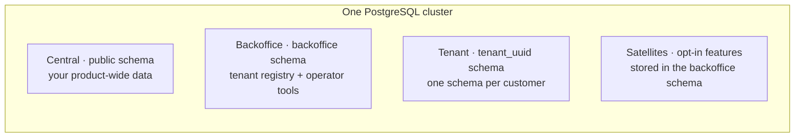
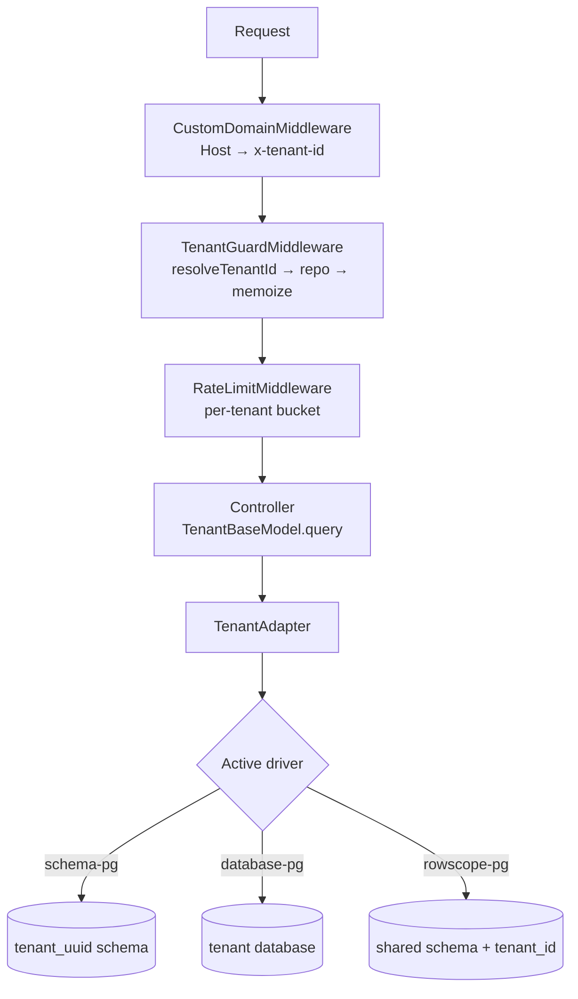

# Concepts

<Callout type="tip" title="Mental model">
A Lasagna app has four layers: <strong>Central</strong> (your app's
own data), <strong>Backoffice</strong> (operator tools and tenant
registry), <strong>Tenant</strong> (per-customer data), and
<strong>Satellites</strong> (opt-in features attached to tenants).
Each one has its own schema, its own lifecycle, and its own access
pattern.
</Callout>

## The four layers

### 1. Central

Your application's own data: countries, plans, anything cross-tenant
or product-wide. Lives on the `public` schema by default. Models
extend `CentralBaseModel`.

### 2. Backoffice

Where operators live. Holds the tenant registry, audit logs, webhook
subscriptions, feature flags, branding records, SSO configs, metrics;
everything Lasagna's satellites store. Lives on a dedicated
`backoffice` schema. Models extend `BackofficeBaseModel`.

### 3. Tenant

Per-customer data. Each tenant gets its own PostgreSQL schema named
`tenant_<uuid>`. Models extend `TenantBaseModel`. The package routes
queries to the right schema based on the active tenant context; no
manual `where('tenant_id', …)`, no global state.

### 4. Satellites

Opt-in features that ride alongside tenants:

- `audit`; every state change recorded with actor + payload.
- `feature_flags`; per-tenant boolean flags, cached.
- `webhooks`; outbound events with HMAC, retries, state machine.
- `branding`; logo, colors, custom domain.
- `sso`; per-tenant OIDC config, JWKS-backed verification.
- `metrics`; time-series counters per tenant.
- `quotas`; plan-bound limits, rolling and snapshot.
- `impersonation`; admin enters a tenant as a target user.

Each satellite ships its own backoffice migration; you opt in via
`node ace configure @adonisjs-lasagna/saas-tenancy --with=…`.

## How a request flows

A request is resolved to a tenant once, on the way in. From there the
active isolation driver decides which connection serves each query, so
your controllers only ever call `TenantBaseModel.query()`.

Three things happen at the seams:

1. The active **isolation driver** decides which Lucid connection
   serves a query (`tenant_<uuid>`, the per-tenant database, or the
   shared schema with a `tenant_id` filter).
2. The **bootstrapper registry** enters and leaves per-tenant
   contexts for cache, drive, mail, session, queue, broadcasts.
3. **`AsyncLocalStorage`** carries the active tenant id, so logs,
   queries, and queued jobs all see the same context without
   threading anything explicitly.

## What the package never does

- It never imports your `Tenant` model; it asks for a
  `TenantRepositoryContract` from the IoC container.
- It never hardcodes `tenant_id`; every routing decision goes through
  `IsolationDriver`, which you can swap or extend.
- It never assumes a queue, cache, or mailer; every bootstrapper is
  opt-in and auto-detected.

## Read next

- [Models](/docs/models); the hands-on reference for the three base classes and
  the row-scope mixin, and which schema each one hits.
- [Tenant identification](/docs/tenant-identification); how
  `resolveTenantId()` picks a UUID from the request.
- [Data isolation](/docs/data-isolation/); the three drivers in
  detail.
- [Bootstrappers](/docs/bootstrappers/); service-level scoping.
