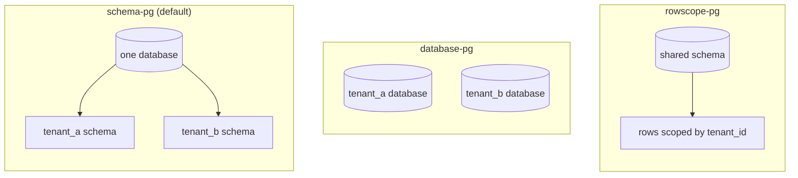

# Data isolation

<Callout type="tip" title="Pick once, swap later">
Lasagna ships four isolation drivers. The contract is the same; only
the storage shape differs. Switch between them by changing one config
line; your app code does not change.
</Callout>

## The contract

Every driver implements `IsolationDriver`:

| Method            | Purpose                                              |
| ----------------- | ---------------------------------------------------- |
| `provision`       | Create the tenant's storage (schema/database/rows)   |
| `destroy`         | Drop it cleanly (terminates active sessions first)   |
| `reset`           | Drop and recreate (used by `tenant:migrate:fresh`)   |
| `connect`         | Open the runtime Lucid connection                    |
| `disconnect`      | Close it                                             |
| `connectionName`  | Synchronous resolver for the active query's connection|
| `migrate`         | Run migrations against this tenant's storage         |

## The four drivers

| Driver | Best for | Notes |
|---|---|---|
| [`schema-pg`](/docs/data-isolation/schema-pg) | Default. Most SaaS workloads. | One PG schema per tenant. Strongest balance of isolation and operational cost. |
| [`database-pg`](/docs/data-isolation/database-pg) | Enterprise tenants needing OS-level isolation. | One PG database per tenant. Requires `CREATEDB`. `CREATE DATABASE` outside transactions. |
| [`rowscope-pg`](/docs/data-isolation/rowscope-pg) | Lightweight workloads, large tenant counts, central reporting. | Shared schema + `tenant_id` column. Strict scope by default. |
| [`sqlite-memory`](/docs/data-isolation/sqlite-memory) | Tests only. | In-process SQLite per tenant. Vanishes on process exit. |

## How each driver stores data

Same contract, three storage shapes. `schema-pg` gives every tenant its own
schema inside one database; `database-pg` gives every tenant a whole database;
`rowscope-pg` keeps everyone in one shared schema and scopes by a `tenant_id`
column. (`sqlite-memory` mirrors `schema-pg` but in-process, for tests.)



## Choosing a driver

- **Strict isolation, easy backups, easy per-tenant restore** →
  `schema-pg`. Nine out of ten cases.
- **Compliance-driven separation, cross-database `JOIN` not
  required** → `database-pg`. Higher operational cost: per-tenant
  pooling, backups, replication.
- **Hundreds of thousands of tiny tenants, central reporting
  required, write throughput matters** → `rowscope-pg`. Watch out
  for forgotten scope; the strict mode catches most cases.
- **CI / unit tests** → `sqlite-memory`. Don't ship to production.

## Switching drivers

```ts
// config/multitenancy.ts
export default defineConfig({
  isolation: {
    driver: 'schema-pg', // or 'database-pg' | 'rowscope-pg' | 'sqlite-memory'
    // schema-pg/database-pg clone this connection per tenant. rowscope-pg
    // ignores it and shares centralConnectionName (no per-tenant connection).
    templateConnectionName: 'tenant',
  },
})
```

If you omit the `isolation` block entirely, the package defaults to
`{ driver: 'schema-pg' }` for v1 compatibility.

## Read next

- [Schema-pg driver](/docs/data-isolation/schema-pg)
- [Database-pg driver](/docs/data-isolation/database-pg)
- [Row-scope driver](/docs/data-isolation/rowscope-pg)
- [SQLite memory driver](/docs/data-isolation/sqlite-memory)
