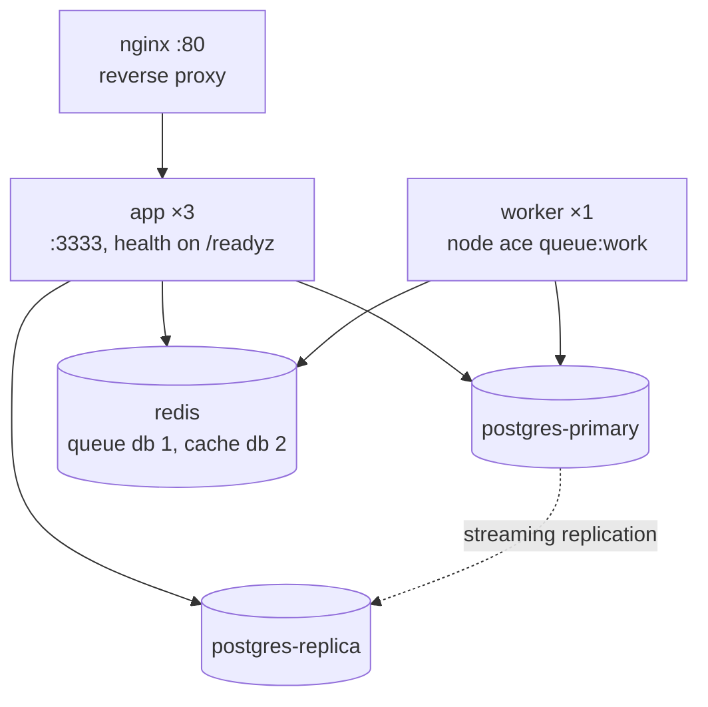

# Deployment

<Callout type="tip" title="Templates vs. CI-verified assets">

Everything under `deploy/` falls into one of two buckets. The Dockerfile,
`docker-compose.prod.yml` and the Helm chart are **templates**: you copy
them into your application repo and adapt them. The e2e compose file and
its smoke script are **CI-verified**: every pull request builds the demo
image, boots the full topology and drills it, so the topology you are
copying is proven to work, not just plausible.

</Callout>

This guide covers four targets:

1. **Docker Compose**: recommended for staging or low-volume production.
2. **Kubernetes via Helm**: recommended for multi-region or HA production.
3. **Troubleshooting**: replicas, readiness, cache coherency, stuck
   provisioning, backups.
4. **Security hardening**: what the package guarantees (with the test that
   proves each claim), and what you own.

All artifacts referenced live under `deploy/` in the repo:

| Artifact                         | Role                                                                   | Verified how                                      |
| -------------------------------- | ---------------------------------------------------------------------- | ------------------------------------------------- |
| `deploy/Dockerfile`              | Template image for your AdonisJS app                                   | Reference only, adapt to your app                 |
| `deploy/docker-compose.prod.yml` | Template topology (PG primary + replica, Redis, app ×3, worker, nginx) | `docker compose config` in CI                     |
| `deploy/charts/lasagna-app/`     | Helm chart                                                             | `helm lint` + `helm template` + kubeconform in CI |
| `deploy/docker-compose.e2e.yml`  | Same topology, built from the in-repo demo app                         | Booted and smoke-tested on every PR               |
| `deploy/scripts/deploy-smoke.sh` | The drill the CI runs against the stack                                | Is the verification                               |

---

## 1. Docker Compose

### What you get

`deploy/docker-compose.prod.yml` describes:

| Service            | Image                          | Notes                                              |
| ------------------ | ------------------------------ | -------------------------------------------------- |
| `postgres-primary` | `postgres:16-alpine`           | `wal_level=replica`, replication user              |
| `postgres-replica` | `postgres:16-alpine`           | Streaming replica, hot standby                     |
| `redis`            | `redis:7-alpine`               | Password-protected, AOF persistence                |
| `app` (×3)         | Built from `deploy/Dockerfile` | Health checks against `/readyz`                    |
| `worker`           | Same image as `app`            | `node ace queue:work`, processes provisioning jobs |
| `nginx`            | `nginx:1.27-alpine`            | Reverse proxy, JSON access logs                    |

Wired together, the deploy unit is the app replicas plus the worker; both
consume the same Postgres and Redis:



The `worker` service is not optional. Tenant provisioning is dispatched on
BullMQ: `tenant:create` and any HTTP flow that creates tenants return
immediately and enqueue an install job. Without a worker process, every new
tenant sits in `provisioning` forever. The CI smoke test provisions tenants
through the queue worker specifically to keep this path honest.

### This file is a template

The compose file builds the app with `context: ..` and `deploy/Dockerfile`,
which expects an AdonisJS application root (it runs `node ace build`). That
context only exists once you copy `deploy/` into **your application repo**.
Running the file from a checkout of this monorepo will not build, because
the monorepo root is not an AdonisJS app.

If you want to see the exact same topology running from this repo, use the
CI-verified variant instead:

```bash
docker compose -f deploy/docker-compose.e2e.yml up -d --build --wait
bash deploy/scripts/deploy-smoke.sh   # builds, boots, drills, tears down
```

### First boot (in your app repo)

```bash
# 0. Copy deploy/ into your application repository, next to package.json.

# 1. Copy and fill env vars
cp deploy/docker-compose.prod.example.env .env
$EDITOR .env  # populate APP_KEY, DB credentials, REDIS_PASSWORD

# 2. Bring everything up
docker compose -f deploy/docker-compose.prod.yml --env-file .env up -d

# 3. Run package migrations the first time
docker compose -f deploy/docker-compose.prod.yml exec app node ace backoffice:setup

# 4. Verify
curl -i http://localhost/healthz          # expect HTTP 200 with a JSON check report
docker compose -f deploy/docker-compose.prod.yml exec app node ace tenant:doctor
```

If `/healthz` answers 503, the JSON body names the failing check. See
[troubleshooting](#3-troubleshooting) below.

### Subsequent deploys

```bash
docker compose -f deploy/docker-compose.prod.yml build app
docker compose -f deploy/docker-compose.prod.yml up -d --no-deps app worker
```

Be honest with yourself about what this gives you: plain Docker Compose
recreates the replicas in parallel, so a redeploy briefly drops capacity
and can drop in-flight requests. Compose outside Swarm mode makes no
rolling-update promise. If a few seconds of degraded capacity during deploys
is unacceptable, run two compose projects behind the proxy and switch
upstreams, or use Kubernetes, whose rolling update is configured for zero
unavailable pods below.

---

## 2. Kubernetes (Helm)

### What you get

The chart at `deploy/charts/lasagna-app/` renders:

- `Deployment` with rolling updates (`maxSurge: 1`, `maxUnavailable: 0`)
- `Service` (ClusterIP)
- Optional `Ingress` with wildcard support for the subdomain resolver
- Optional `HorizontalPodAutoscaler` (CPU + memory)
- `PodDisruptionBudget` (default: `minAvailable: 1`)
- `Secret` (if not using `app.existingSecret`)
- Optional egress `NetworkPolicy` (DNS, database, Redis, HTTPS)

Values under `app.env` are rendered as inline env vars on the Deployment;
values under `app.secrets` become a `Secret` referenced via `envFrom`.
There is no ConfigMap in this chart.

The chart **does not** provision Postgres or Redis; wire those to managed
services (RDS, ElastiCache, Cloud SQL, Memorystore, etc.) via values. And
just like the compose stack, schedule at least one pod running
`node ace queue:work` (a second Deployment using the same image with a
different command), or tenant provisioning will never complete.

The chart is consumed from the repo path. It is not published to any chart
registry, so there are no historical chart versions to pin to; vendoring
the `deploy/charts/lasagna-app/` directory is the supported way to consume
it. Every PR runs `helm lint` plus `helm template` (default and production
values) validated against the upstream Kubernetes JSON schemas with
kubeconform, targeting `apps/v1`, `policy/v1`, `autoscaling/v2` and
`networking.k8s.io/v1` (Kubernetes 1.23 or newer).

### Quick install

```bash
helm install acme deploy/charts/lasagna-app \
  --namespace lasagna --create-namespace \
  -f deploy/charts/lasagna-app/values.production.yaml \
  --set image.tag=v2.0.0 \
  --set app.secrets.APP_KEY="$(openssl rand -hex 32)" \
  --set app.secrets.DB_HOST=pg.acme.internal \
  --set app.secrets.DB_USER=lasagna \
  --set app.secrets.DB_PASSWORD="$DB_PASSWORD" \
  --set app.secrets.DB_DATABASE=lasagna_prod \
  --set app.secrets.REDIS_HOST=redis.acme.internal \
  --set app.secrets.REDIS_PASSWORD="$REDIS_PASSWORD"
```

### Wildcard subdomains

When the package's `resolverStrategy` is `subdomain`, you need:

1. **Wildcard DNS:** an `A`/`AAAA` record for `*.app.example.com`
   pointing at the ingress controller's public IP.
2. **Wildcard cert:** request via `cert-manager` with a DNS-01
   issuer. HTTP-01 cannot validate wildcards.
3. **Ingress hosts:** include both apex and wildcard:

   ```yaml
   ingress:
     hosts:
       - host: app.example.com
       - host: '*.app.example.com'
     tls:
       - hosts: [app.example.com, '*.app.example.com']
         secretName: app-example-com-tls
   ```

### Existing secrets

In production, never inline secret values into Helm. Use
[external-secrets-operator](https://external-secrets.io/) or
[sealed-secrets](https://github.com/bitnami-labs/sealed-secrets) and
reference an existing `Secret`:

```yaml
app:
  existingSecret: lasagna-app-secrets
```

---

## 3. Troubleshooting

### "Deploy succeeds but `/readyz` returns 503"

First, know what `/readyz` actually runs. The provider registers three
checks at boot (unless you registered your own under the same names):
`backoffice_db` (critical), `redis` (critical) and `circuit_breakers`
(non-critical). Any check you add via `HealthService.addCheck()` joins
them. The aggregate rules:

- every check passes → `ok`, HTTP 200
- only non-critical checks fail → `degraded`, HTTP 200 (the pod keeps
  serving, dashboards show the problem)
- any **critical** check fails, or all checks fail → `fail`, HTTP 503 (the
  orchestrator pulls the pod)

These exact semantics are pinned over real HTTP in
`packages/core/tests/integration/health/readyz_http.spec.ts`. The 503 body
lists every check with its status and message, and flags the critical one
that pulled the pod, so start by reading the response body:

```bash
curl -s http://pod-ip:3333/readyz | jq '.checks'
```

Common causes: wrong DB credentials (`backoffice_db` fails), Redis
unreachable or wrong password (`redis` fails).

`node ace tenant:doctor --json` is the deeper second step. It runs a
**different, wider** check set than `/readyz` (registry-vs-schema drift,
migration state, stuck queues, stalled provisioning, replica lag,
connection pool, long-running queries), so use it when the probes are green
but tenants still misbehave. Do not expect the two to agree: a pod can be
ready while doctor still reports schema drift.

### "Tenants are stuck in `provisioning` after deploy"

You forgot the queue worker. Provisioning runs as a BullMQ job; the HTTP
pods only enqueue it. Check:

```bash
node ace tenant:queue:stats        # waiting jobs piling up?
docker compose ps worker           # is the worker service even running?
docker compose logs worker         # is it crashing on boot?
```

The fix is a process running `node ace queue:work` with the same env as the
app. The compose template ships a `worker` service; on Kubernetes run a
second Deployment with the same image and that command. The CI smoke test
provisions tenants through this exact path on every PR
(`deploy/scripts/deploy-smoke.sh`). The full command-to-worker sequence is
diagrammed in
[Background jobs](/docs/jobs#how-provisioning-flows-through-the-queue).

### "Cache invalidation drifts between pods"

The package cache is a memory L1 in each pod plus a shared Redis L2, with a
Redis bus that broadcasts invalidations so one pod's delete evicts the
other pods' L1 copies. This is not optional wiring; `config.cache.redis` is
required and the bus is always on. The cross-pod invalidation behavior is
covered by
`packages/core/tests/integration/services/cache_bus_invalidation.spec.ts`,
which runs two cache instances against one Redis and asserts a delete on
one evicts the other's hot L1.

So if pods serve stale tenant data, the realistic failure mode is **pods
pointing at different Redis instances** (or different logical DBs). Verify
every pod resolves the same `cache.redis` host, port and `db` in
`config/multitenancy.ts`, and check the Redis connection count matches your
pod count.

### "Subdomain requests come in with the wrong tenant after deploy"

The package resolves the tenant per request and holds no in-memory
per-tenant state, so it does not need sticky sessions. If your app added
such state, the load balancer must pin tenants to replicas: in nginx use
`hash $http_x_tenant_id consistent` when tenancy rides on the header, or
`ip_hash` when it does not (the same guidance is in `deploy/nginx.conf`).
The durable fix is removing the in-memory state.

### "Doctor reports `replica_lag_high` after deploy"

Streaming replication takes a few seconds to catch up after WAL writes. If
the lag persists for more than 30 s under steady traffic:

1. Check `pg_stat_replication` on the primary; is `state = streaming`?
2. Network: the replica needs a low-latency, high-bandwidth path to the
   primary.
3. The replica may not have enough RAM to apply WAL; check memory pressure
   on its host.

Thresholds are configurable in `config/multitenancy.ts` (defaults: warn at
30 s, error at 120 s):

```ts
doctor: {
  replicaLagWarnSeconds: 60,
  replicaLagErrorSeconds: 300,
}
```

Also remember what the package does **not** do: a lagging or dead replica
is still selected, there is no health check or failover on the replica
routing path. Use the `sticky` strategy and route read-after-write paths to
the primary. See [Read replicas](/docs/read-replicas).

### "Backups don't run / S3 uploads fail"

Backups live in the `@adonisjs-lasagna/backup` satellite; install and
configure it first, or there are no `tenant:backup` commands at all. The
runtime image must ship `pg_dump` (the reference Dockerfile installs
`postgresql-client`). Verify with `docker exec CONTAINER which pg_dump`.
For S3:

- AWS region + bucket must match.
- The pod's IAM role (or `AWS_ACCESS_KEY_ID` env) needs `s3:PutObject` on
  the bucket.
- Network: pods need NAT to `s3.<region>.amazonaws.com`.

### "Helm template renders but `kubectl apply` fails"

Run `helm lint` first. If lint passes but the apiserver rejects the
manifests, your cluster is probably older than the API versions the chart
targets:

- `apps/v1` Deployment
- `policy/v1` PodDisruptionBudget (Kubernetes 1.21+)
- `autoscaling/v2` HPA (Kubernetes 1.23+)
- `networking.k8s.io/v1` Ingress (Kubernetes 1.19+)

Clusters older than 1.23 are not supported by the chart; upgrade the
cluster or maintain your own manifests.

---

## 4. Security hardening

### What the package guarantees

Each invariant below is enforced inside the package and covered by the
named test, so you can rely on it without extra wiring. If a claim has no
test next to it, treat it as a description, not a guarantee.

#### Tenant identifier validation

Every code path that consumes a tenant id (SQL DDL, Drive prefix, cache
namespace, session key, mail header, broadcast channel) routes through
`assertSafeIdentifier()` before the value reaches a sensitive sink:

- Length ≤ 63 (PostgreSQL `NAMEDATALEN - 1`).
- Character class: `[a-zA-Z0-9_-]` only.
- UUID v4 always passes; the canonical id format the package generates is
  RFC-4122 v4 from `node:crypto.randomUUID()`.

Anything else (`..`, `/`, `\`, `;`, `"`, whitespace, shell metacharacters,
percent-encoded sequences) is rejected with a `Refusing to use unsafe …`
exception. There is no escape hatch and no per-tenant override.
`resolveTenantId()` additionally validates the canonical UUID v4 format
before any cache or DB access keyed by the resolved id.

#### SQL injection

Tenant ids are interpolated only into quoted identifier slots
(`"tenant_<uuid>"`) and only after passing `assertSafeIdentifier`. Tenant
metadata, names, emails, and other free-form fields are written via Lucid's
parameterized queries. Cross-tenant isolation is additionally asserted
under concurrent load on every PR by the benchmark correctness gate
(`.github/workflows/benchmark-correctness.yml`), which fails the build on a
single leaked row and self-tests its detector by planting a deliberate
leak.

#### Dependency outages fail closed

A resolved tenant whose database is unreachable gets a typed 503
(`E_DEPENDENCY_UNAVAILABLE`), never a silent fallback to the central
schema. Covered by
`packages/core/tests/integration/middleware/connection_failure_503.spec.ts`.
Lifecycle states map to typed responses, covered by
`packages/core/tests/integration/middleware/tenant_state_503.spec.ts`:

| Tenant state          | Response                                          |
| --------------------- | ------------------------------------------------- |
| suspended             | 403 `E_TENANT_SUSPENDED`                          |
| soft-deleted          | 403 `E_TENANT_SUSPENDED` (same path as suspended) |
| provisioning / failed | 503 `E_TENANT_NOT_READY`                          |
| maintenance           | 503 `E_TENANT_MAINTENANCE` + `Retry-After` header |
| circuit breaker open  | 503 `E_CIRCUIT_OPEN`                              |

One enumeration caveat to fold into your threat model: an unknown tenant id
answers 404 while a soft-deleted one answers 403, so the two are
distinguishable. If that distinction leaks information you care about, map
both to 404 in your exception handler.

#### HMAC-signed tokens

`ImpersonationService` and `WebhookService` both sign with HMAC-SHA256 over
a fixed-size payload, verify with `crypto.timingSafeEqual()`, and refuse to
issue when the configured secret is shorter than 32 chars. The
impersonation secret is validated at provider boot, so a misconfigured
deploy fails on startup, not on the first admin request. Covered by
`packages/core/tests/integration/services/impersonation_lifecycle.spec.ts`
and the impersonation middleware specs (including tenant binding: a token
issued for tenant A is rejected on a request resolved to tenant B).

#### Webhook delivery

Outbound webhooks include `x-webhook-signature: <hex>`, a plain hex
HMAC-SHA256 digest (no `sha256=` prefix) computed over the raw body using
the per-subscription secret. The secret is encrypted at rest with
AES-256-GCM keyed by `APP_KEY` (covered by the encryption group in
`packages/core/tests/integration/services/webhook_service.spec.ts`).
Outbound URLs are validated against private, loopback, link-local and cloud
metadata ranges; the loopback exemption is an explicit env opt-in
(`WEBHOOKS_ALLOW_LOOPBACK_TARGETS`) meant for test rigs only. The guard
validates the URL at dispatch time but does not pin the resolved IP, so
network egress controls remain yours (see the
[production checklist](/docs/production-checklist)).

#### SSO / OIDC

`SsoService.handleCallback()` performs full OIDC verification: single-use
state (600 s TTL), nonce bound to state, `id_token` required and verified
against the IdP's JWKS via discovery, `iss`/`aud`/`exp` checked with 60 s
clock tolerance, and a nonce match before any claims are surfaced. Any
mismatch aborts the callback. Exercised against a real wire-compliant OIDC
server (mock-oauth2-server) on every PR by
`packages/core/tests/integration/services/sso_oidc_real.spec.ts`.

#### Cache, Drive, session, mail prefixing

Every per-tenant key is namespaced with `tenants/<tenant.id>/` (Drive,
session) or a dedicated cache namespace. Identifiers pass
`assertSafeIdentifier` before forming the key, so a crafted id cannot
escape its prefix.

### What the host application owns

These surfaces are production-required and need to be configured at the
host level; the package neither does nor can.

#### Transport hardening

- **HSTS**: serve `Strict-Transport-Security: max-age=31536000;
includeSubDomains` from the AdonisJS server. Subdomain-based tenant
  resolution amplifies the cost of any single TLS lapse.
- **TLS termination**: terminate at the load balancer / Ingress, not the
  Node process. The chart's production values enable
  `nginx.ingress.kubernetes.io/ssl-redirect` via cert-manager annotations.

#### Response headers (recommended)

Add a small middleware in the host app that sets:

```ts
// app/middleware/security_headers_middleware.ts
export default class SecurityHeadersMiddleware {
  async handle(ctx, next) {
    ctx.response.header('x-content-type-options', 'nosniff')
    ctx.response.header('x-frame-options', 'DENY')
    ctx.response.header('referrer-policy', 'strict-origin-when-cross-origin')
    ctx.response.header('permissions-policy', 'geolocation=(), microphone=(), camera=()')
    ctx.response.header(
      'content-security-policy',
      "default-src 'self'; img-src 'self' data: https:; style-src 'self' 'unsafe-inline'"
    )
    await next()
  }
}
```

Register it as global in `start/kernel.ts`. The package itself does not
enforce CSP because content sources vary per tenant.

While you are in `start/kernel.ts`, double-check your exception handler is
actually registered (`server.errorHandler(() => import('#app/exceptions/handler'))`).
An unregistered handler fails silently: every error still gets a status
code from the fallback renderer, so nothing looks broken, but your response
shapes and headers (including `Retry-After` on maintenance 503s) never
ship. The demo app shipped with exactly this bug until the deploy e2e
caught it.

#### Webhook receivers

The package signs outbound webhooks; receivers must:

- Verify the signature with their configured secret using a constant-time
  comparison.
- Apply rate-limiting at the receiver; the package times out at 10 s but
  does not throttle per-endpoint outbound requests.
- Reject requests older than a small window (use the
  `x-webhook-delivery-id` plus a database log on the receiver to defeat
  replay).

#### Admin REST API

`multitenancyAdminRoutes(...)` is fail-closed: it throws at startup unless
you pass a `middleware` option, so the destructive routes can never mount
unauthenticated by accident. The package ships **no** built-in token check,
IP allow-listing, or mTLS; you bring the guard. In production:

- Pass your auth middleware (session, bearer, mTLS) via `middleware`.
- Restrict the route group to a private network where you can.
- To mount it public on purpose (behind a trusted network boundary), pass
  `middleware: false` explicitly.

#### Database credentials

Tenant DB credentials live in the host app's environment. The package does
not log them (spot-checked against `logger.*` and serialization call
sites, not formally proven). Keep them out of the repo; use a secret
manager (Vault, AWS Secrets Manager, GCP Secret Manager, k8s
sealed-secrets).

### What CI proves on every PR

`.github/workflows/ci.yml` and `benchmark-correctness.yml` gate every pull
request with:

- `npm run typecheck` (every workspace with a typecheck script: core,
  satellites, demo app, benchmarks) and `npm run lint`, both blocking.
- Unit suites (core + satellites) and the integration suite against real
  PostgreSQL, Redis and a wire-compliant OIDC server, blocking, with an
  aggregate coverage gate (lines 80, functions 78, branches 77).
- The demo app e2e suite (mail, queue, backups via real `pg_dump`)
  against real services, blocking.
- `npm audit --omit=dev --audit-level=high`, blocking.
- Deploy asset validation: `docker compose config` on both compose files,
  `helm lint`, and `helm template` (default + production values) validated
  with kubeconform, blocking.
- The deploy e2e: builds the demo image, boots the prod topology
  (primary + streaming replica, password-protected Redis, two app replicas,
  queue worker, nginx) and runs the smoke drill, including the
  primary-outage and recovery cycle, blocking.
- The isolation correctness gate: PASS/FAIL cross-tenant isolation checks
  per driver under concurrency, with a planted-leak self-test, blocking.
- `npm run knip` (unused exports / orphaned files) runs as an
  **informational report only**; it does not fail the build.

Mirror the equivalent gates in your downstream CI before publishing
container images.

### Recommended runtime monitoring

- **Prometheus**: scrape `/metrics`. Alert on
  `multitenancy_circuit_state{state="OPEN"}`,
  `multitenancy_provisioning_failures_total`, and replica lag exceeding
  your `doctor.replicaLagWarnSeconds`.
- **OpenTelemetry**: the package ships spans for tenant-scoped DB queries,
  queue dispatches, and bootstrapper enter/leave. Forward to your APM and
  alert on per-tenant latency outliers.
- **Audit log**: enable the `audit` satellite and ship the
  `tenant_audit_logs` table to a long-term store. The admin REST API
  exposes a `from`/`to` date-range query backed by an index on
  `(tenant_id, created_at)`.

### Backup and recovery

Backups require the `@adonisjs-lasagna/backup` satellite. `tenant:backup`
writes a `.dump` file plus a JSON sidecar with checksums; `tenant:backups:run`
is the cron-friendly scheduled variant. For production:

- Mirror to S3 with `config.backup.s3.enabled = true`. The bucket SHOULD
  have versioning enabled and a lifecycle policy that defers permanent
  delete behind your retention tier.
- Run `tenant:doctor --check=backup_recency` weekly; it flags tenants whose
  last successful backup is stale. The check registers only when the backup
  satellite is installed.
- Practice restore at least quarterly.
  `tenant:restore --tenant=ID --file=PATH` round-trips the schema; verify
  the row count matches the source. The demo e2e exercises backup, restore
  and corruption detection against real `pg_dump`/`pg_restore`
  (`examples/api/tests/e2e/backups_real.spec.ts`,
  `backups_corruption.spec.ts`).

### Reporting a vulnerability

Security issues should not be reported as public GitHub issues. Follow
`.github/SECURITY.md`: email the maintainer at the address listed in
`package.json` `author` with the affected version, reproduction steps and
an impact assessment. Reports are handled as coordinated disclosure;
acknowledged issues get a fix release and credit.

---

## Reference: env vars consumed by the deploy artifacts

| Var                                            | Source            | Purpose                                                                         |
| ---------------------------------------------- | ----------------- | ------------------------------------------------------------------------------- |
| `APP_KEY`                                      | secret            | Adonis app secret (signing/encryption)                                          |
| `DB_HOST` / `DB_PORT`                          | secret            | Postgres primary                                                                |
| `DB_USER` / `DB_PASSWORD` / `DB_DATABASE`      | secret            | Connection credentials                                                          |
| `DB_REPLICA_HOST`                              | secret (optional) | Read replica host; the demo falls back to `DB_HOST` when unset                  |
| `REDIS_HOST` / `REDIS_PORT` / `REDIS_PASSWORD` | secret            | Cache + queue + impersonation store                                             |
| `TENANT_HEADER_KEY`                            | env               | Header consulted by the `header` resolver                                       |
| `BASE_DOMAIN`                                  | env               | Apex used by the `subdomain` resolver                                           |
| `RESOLVER_STRATEGY`                            | env               | One of `subdomain` / `header` / `path` / `domain-or-subdomain` / `request-data` |
| `LOG_LEVEL`                                    | env               | Adonis pino level                                                               |

The exact mapping into your `config/multitenancy.ts` is up to your app;
these are the conventions used by the deploy artifacts here. Remember the
deploy unit list is **app pods + at least one queue worker**; both consume
the same variables.

## Read next

- [Production checklist](/docs/production-checklist): the pre-flight list and runbook.
- [Security](/security): what the package guarantees and what you own.
- [Health & monitoring](/docs/health): the probes, check semantics and metrics.
