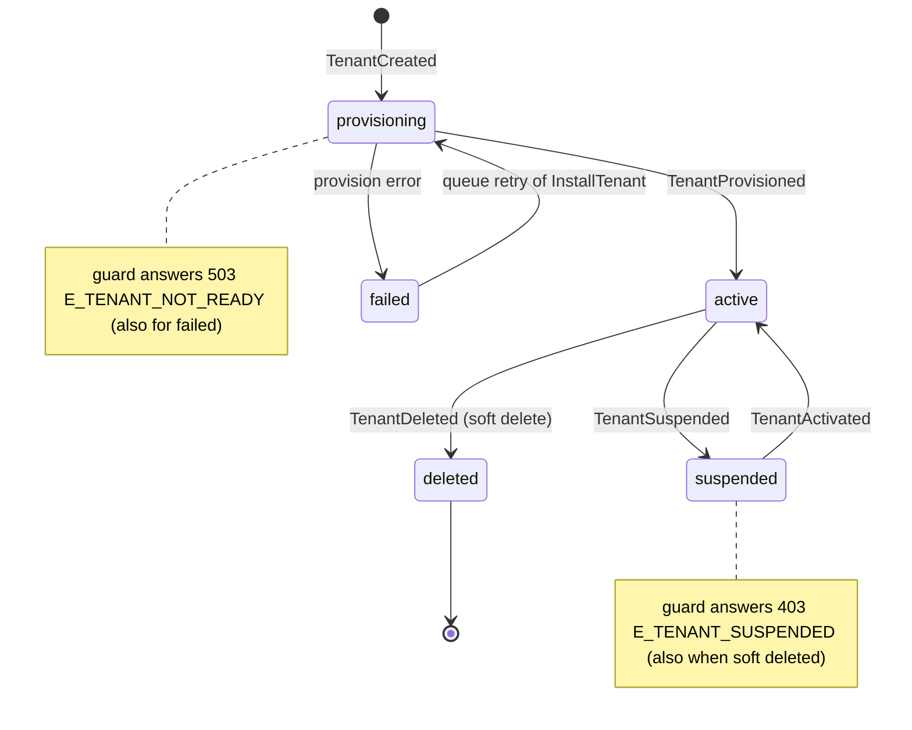

# Lifecycle events

Lasagna emits a typed event at every meaningful tenant state
transition. Each event is a class extending the AdonisJS `BaseEvent`,
so you subscribe with the standard `emitter.on(EventClass, listener)`
API and get full payload typing for free.

## Tenant lifecycle

The states behind these events, with the event each transition emits and
the HTTP answer the guard gives while a tenant sits in each state (the
canonical state-to-response table lives in
[Deployment](/docs/deployment#dependency-outages-fail-closed)). The
soft-delete transition is drawn from `active` for readability; destroy has
no state precondition, so it can leave from any state.
Maintenance is deliberately not a state: it is a separate flag that can
be set on an active tenant (`TenantEnteredMaintenance` /
`TenantExitedMaintenance`), and the guard answers
`503 E_TENANT_MAINTENANCE` with a `Retry-After` header while it is on.



| Event | Payload | Dispatched by |
|---|---|---|
| `TenantCreated` | `tenant` | `tenant:create` command, `POST /admin/.../tenants` |
| `TenantProvisioned` | `tenant` | `InstallTenant` job (after schema/database is ready) |
| `TenantActivated` | `tenant` | `tenant:activate` command, `POST .../activate` |
| `TenantSuspended` | `tenant` | `tenant:suspend` command, `POST .../suspend` |
| `TenantUpdated` | `tenant`, `changes` | Available for host code; not auto-dispatched |
| `TenantMigrated` | `tenant`, `direction: 'up' \| 'down'` | `tenant:migrate` and `tenant:migrate:rollback` |
| `TenantBackedUp` | `tenant`, `metadata: BackupMetadata` | `BackupTenant` job |
| `TenantRestored` | `tenant`, `fileName` | `RestoreTenant` job |
| `TenantCloned` | `source`, `destination`, `result: CloneResult` | `CloneTenant` job |
| `TenantQuotaExceeded` | `tenant`, `quota`, `limit`, `current`, `attempted` | `QuotaService.consume()` when an atomic check rejects the increment |
| `QuotaTracked` | `tenant`, `quota`, `amount`, `newTotal` | `QuotaService.track` / `consume` when `plans.emitTracked` is on (drives the Stripe metering bridge) |
| `TenantEnteredMaintenance` | `tenant`, `message: string \| null` | `tenant:maintenance` command, `POST .../maintenance` |
| `TenantExitedMaintenance` | `tenant` | `tenant:maintenance --off`, `DELETE .../maintenance` |
| `TenantDeleted` | `tenant` | `tenant:destroy` command, `UninstallTenant` job, `POST .../tenants/:id/destroy` |
| `TenantAnonymized` | `tenant`, `details: { reason?, affected? }` | `tenant:gdpr:anonymize` command, real run only (never on `--dry-run`) |

::: tip TenantUpdated
The class is exported and ready to dispatch from host code (e.g. an
admin controller mutating tenant metadata), but Lasagna does not emit
it on its own. If you maintain a typed audit trail, dispatch it from
the same writer that mutates the row.
:::

## Billing events

Available when `--with=billing` is configured. All ten are dispatched
from `ProcessStripeEventJob` in response to verified Stripe webhook
events. Full reference (and the dunning/ordering semantics) lives in
the [Billing satellite](/docs/satellites/billing#events).

| Event | Payload | Dispatched by |
|---|---|---|
| `SubscriptionActivated` | `tenantId`, `subscriptionId`, `planName` | `customer.subscription.created` (or `.updated` flipping to active) |
| `SubscriptionUpdated` | `tenantId`, `subscriptionId`, `previousPlan`, `newPlan` | `customer.subscription.updated` when plan changes |
| `SubscriptionCanceled` | `tenantId`, `subscriptionId`, `previousPlan`, `reason` | `customer.subscription.deleted` (`reason`: `user_canceled` \| `dunning_failed` \| `unknown`) |
| `SubscriptionPaused` | `tenantId`, `subscriptionId` | Stripe pause-collection or `customer.subscription.paused` |
| `SubscriptionResumed` | `tenantId`, `subscriptionId` | `customer.subscription.resumed` |
| `TrialEnding` | `tenantId`, `subscriptionId`, `daysLeft` | `customer.subscription.trial_will_end` |
| `PaymentSucceeded` | `tenantId`, `invoiceId`, `amount`, `currency` | `invoice.payment_succeeded` |
| `PaymentFailed` | `tenantId`, `invoiceId`, `amount`, `currency`, `attempts`, `final`, `nextRetry` | `invoice.payment_failed` (every attempt — match on `final: true` for the terminal step) |
| `BillingMisconfigured` | `subscriptionId`, `productId`, `priceId` | A Stripe product/price has no mapping in `config.billing.products`. |
| `BillingEventDeadLettered` | `eventId`, `errorCode`, `details` | Webhook event exhausted all queue retries. `errorCode` is a stable enum (`BillingErrorCode \| 'unhandled_error'`). |

::: tip Subscribe paging to BillingEventDeadLettered
This is the canary for "we permanently failed to process a Stripe
event". Wire PagerDuty / Slack / Sentry to it. The payload is
PII-safe: only the event id, an opaque code, and an optional
package-controlled detail string.
:::

## Resilience

Dispatched by `ResilienceService` when a wrapped backing-dependency call fails
and the configured degradation policy kicks in. Full detail on the
[Resilience](/docs/resilience) page.

| Event | Payload | Dispatched by |
|---|---|---|
| `DependencyDegraded` | `dependency`, `operation`, `tenantId`, `policy`, `errorCode` | A Redis/Postgres/Stripe call wrapped by `ResilienceService.run()` failed (for example `QuotaService` on a Redis outage). Gated by `config.resilience.observe`. |

::: tip Subscribe paging to DependencyDegraded
A burst of these means a backing service is down. The payload is alert-safe: a
dependency name, an operation label, an optional tenant id, the applied policy,
and a best-effort error code. No driver message, no PII.
:::

## Metrics

Exported from `@adonisjs-lasagna/saas-tenancy/events` for host code and satellites
that react to usage data. Unlike the lifecycle events, these carry a single
`payload` object (typed `MetricRecordedPayload` / `MetricsFlushedPayload`).

| Event | Payload | Dispatched by |
|---|---|---|
| `MetricRecorded` | `payload: { tenantId, name, value, period }` | `MetricsService.emitMetric()` after a custom named metric is written to Redis. Best-effort and fail-open, so it only fires when the value was actually recorded. |
| `MetricsFlushed` | `payload: { period, tenantCount? }` | The `tenant:metrics:flush` command after both the built-in and custom counters are flushed to the backoffice tables. `tenantCount` is reserved: the command currently dispatches `{ period }` only, so treat it as optional. The `reporting` satellite subscribes to clear its dashboard cache. |

::: tip MetricRecorded vs MetricsFlushed
`MetricRecorded` fires per custom-metric write (high frequency); `MetricsFlushed`
fires once per flush run. Use the former to mirror individual values, the latter
to invalidate read-side caches once a period's data has landed.
:::

## Subscribing

Register listeners during boot, usually inside a service provider's
`boot()` hook so they're attached before any tenant request hits the
container:

```ts
import emitter from '@adonisjs/core/services/emitter'
import {
  TenantProvisioned,
  TenantQuotaExceeded,
} from '@adonisjs-lasagna/saas-tenancy/events'

export default class AppProvider {
  async boot() {
    emitter.on(TenantProvisioned, async (event) => {
      // event.tenant is fully typed (TenantModelContract)
      await sendWelcomeEmail(event.tenant)
    })

    emitter.on(TenantQuotaExceeded, async (event) => {
      // payload arrived in the constructor order from src/events/
      logger.warn(
        { tenantId: event.tenant.id, quota: event.quota, attempted: event.attempted },
        'Quota threshold breached'
      )
    })
  }
}
```

## Dispatching from your own code

Every event class exposes the static `dispatch(...args)` helper. The
arguments mirror the constructor exactly, so TypeScript catches
payload mismatches at compile time:

```ts
import { TenantUpdated } from '@adonisjs-lasagna/saas-tenancy/events'

await tenant.merge({ name: newName }).save()
await TenantUpdated.dispatch(tenant, {
  name: { from: previousName, to: newName },
})
```

## Async semantics

`emitter.emit()` runs every listener in **parallel**. If a listener
throws, the rejection propagates to the awaited `emit()` call but
sibling listeners still run. If you need ordering or want one bad
listener to block the others, dispatch through a queue job instead of
listening inline.

For batch use cases (long-running mailers, webhook fan-out, large
DB writes), push the work onto a tenant queue from inside the
listener so the dispatch path stays cheap:

```ts
emitter.on(TenantBackedUp, async (event) => {
  await new TenantQueueService().dispatch(event.tenant.id, 'NotifyBackupReady', {
    file: event.metadata.file,
    size: event.metadata.size,
  })
})
```

## Testing

Use `emitter.fake([...EventClasses])` to capture dispatches in tests
without invoking real listeners. The returned buffer exposes
`assertEmitted` / `assertEmittedCount` / `assertNotEmitted`:

```ts
import emitter from '@adonisjs/core/services/emitter'
import { TenantSuspended } from '@adonisjs-lasagna/saas-tenancy/events'

test('suspending a tenant emits TenantSuspended', async ({ client }) => {
  const buffer = emitter.fake([TenantSuspended])
  await client.post(`/admin/multitenancy/tenants/${tenant.id}/suspend`)
  buffer.assertEmittedCount(TenantSuspended, 1)
  emitter.restore()
})
```

The integration suite covers every event in
[`tests/integration/events/lifecycle_dispatch.spec.ts`](https://github.com/Arcoders/Adonisjs-lasagna-saas-tenancy/blob/master/packages/core/tests/integration/events/lifecycle_dispatch.spec.ts).

## Related

- [Jobs](/docs/jobs); most events are dispatched from inside a job
- [Quotas](/docs/satellites/quotas); source of `TenantQuotaExceeded`
- [Contextual logging](/docs/contextual-logging); listener log lines
  inherit the active `tenantId`
