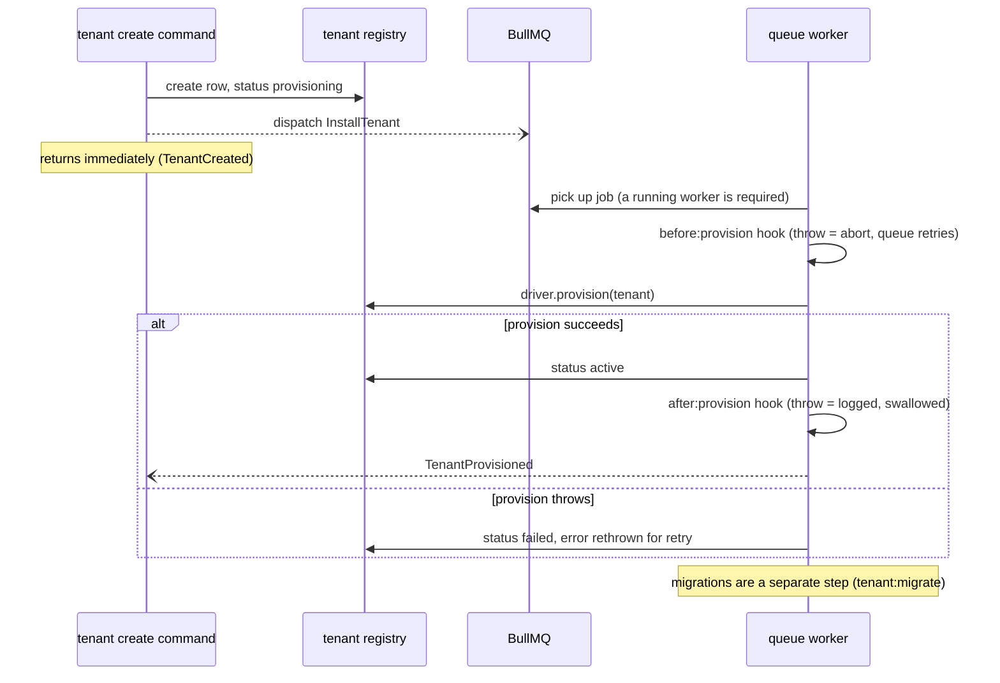

# Background jobs

Long-running tenant operations run on the AdonisJS queue so they can
be retried, observed, and parallelized without blocking the HTTP
request that triggered them. Eight jobs exist across the ecosystem:
two ship in the core, three with the
[backup satellite](/docs/satellites/index), and three with the
[Billing satellite](/docs/satellites/billing).

## What ships

| Job class | Package | Purpose | Triggered by |
|---|---|---|---|
| `InstallTenant` | core | Provision the tenant's schema/database and init its queue (migrations are the separate `tenant:migrate` step) | `tenant:create`, `POST /admin/.../tenants` |
| `UninstallTenant` | core | Tear down storage, destroy the tenant queue, soft-delete the row | `tenant:destroy` (when not `--keep-schema`) |
| `BackupTenant` | `@adonisjs-lasagna/backup` | Run `pg_dump` for a single tenant, mirror to S3 if configured | `tenant:backups:run` cron, ad-hoc dispatch |
| `RestoreTenant` | `@adonisjs-lasagna/backup` | Run `pg_restore` against a stored dump | `tenant:restore` |
| `CloneTenant` | `@adonisjs-lasagna/backup` | Provision a destination tenant + copy rows from source | `tenant:clone` |
| `ProcessStripeEventJob` | `@adonisjs-lasagna/billing` | Process a verified Stripe webhook event (retrieve from Stripe, ordering guard, syncSubscription/dispatch table, mark completed) | `StripeWebhookController` after the idempotent `INSERT ... ON CONFLICT DO NOTHING` |
| `ReportUsageBatchJob` | `@adonisjs-lasagna/billing` | Send aggregated meter events to Stripe in a single batch | `UsageAutoBridgeListener` flush (every `batchFlushMs`, default 10 s) |
| `BillingCleanupJob` | `@adonisjs-lasagna/billing` | Purge `stripe_processed_events` older than `webhook.idempotencyTtlDays` | `tenant:billing:cleanup` command (also exposes `runBillingCleanup()` for direct invocation) |

Import each job from the package that owns it:

```ts
import { InstallTenant, UninstallTenant } from '@adonisjs-lasagna/saas-tenancy/jobs'
import { BackupTenant, RestoreTenant, CloneTenant } from '@adonisjs-lasagna/backup'
import {
  ProcessStripeEventJob,
  ReportUsageBatchJob,
  BillingCleanupJob,
} from '@adonisjs-lasagna/billing'
```

## How provisioning flows through the queue

The command-to-event sequence for `InstallTenant`, the job `tenant:create`
dispatches behind every new tenant. The worker is the piece that actually
provisions; without a process running `node ace queue:work`, the job sits
in the queue and the tenant stays in `provisioning` forever.



## Dispatching

Every job is a standard `@adonisjs/queue` job. Dispatch with the
typed payload:

```ts
await InstallTenant.dispatch({ tenantId: tenant.id })

await BackupTenant.dispatch({ tenantId: tenant.id })

await RestoreTenant.dispatch({
  tenantId: tenant.id,
  fileName: 'tenant_xyz_2026-05-07T03-30-00-000Z.dump',
})

await CloneTenant.dispatch({
  sourceTenantId: source.id,
  destinationTenantId: destination.id,
  schemaOnly: false,
  clearSessions: true,
})
```

`CloneTenantPayload` is exported as a public type so you can build
typed wrappers in your host app:

```ts
import type { CloneTenantPayload } from '@adonisjs-lasagna/backup'
```

## Tenant context propagation

Every job binds an AsyncLocalStorage scope to the active tenant
*before* doing any work. Inside `execute()`:

```ts
const logCtx = await app.container.make(TenantLogContext)
return logCtx.run({ tenantId }, async () => {
  // tenancy.currentId() === tenantId
  // tenantLogger() emits { tenantId } on every line
  // ...
})
```

This means anything you call from a queue worker (services,
repositories, third-party clients that take a logger) sees the
tenant context without you threading it through manually. See
[Contextual logging](/docs/contextual-logging) for how the propagation
works.

## Lifecycle hooks

`InstallTenant`, `UninstallTenant`, `BackupTenant`, `RestoreTenant`,
and `CloneTenant` all run `before:` and `after:` hooks from the
[`HookRegistry`](https://github.com/Arcoders/Adonisjs-lasagna-saas-tenancy/blob/master/packages/core/src/services/hook_registry.ts):

```ts
// config/multitenancy.ts
import { defineConfig } from '@adonisjs-lasagna/saas-tenancy'

export default defineConfig({
  hooks: {
    afterProvision: async ({ tenant }) => {
      await new Mailer().sendWelcome(tenant.email)
    },
    beforeBackup: async ({ tenant }) => {
      await tenant.related('jobs').query().where('status', 'running').update({ status: 'paused' })
    },
    afterClone: async ({ source, destination, result }) => {
      logger.info(
        { sourceId: source.id, destId: destination.id, rows: result?.rowsCopied },
        'Tenant cloned'
      )
    },
  },
})
```

Hook semantics:

- **`before:` throwing aborts the job.** The lifecycle event is not
  emitted; the queue retries per the configured `attempts`.
- **`after:` throwing is logged and swallowed.** A failing post-hook
  must not undo work that has already committed.

After the `after:` hook runs, the job dispatches the matching event
(`TenantProvisioned`, `TenantBackedUp`, etc.). See
[Lifecycle events](/docs/events) for payloads.

## Failure handling

Each job overrides `failed(error)` to log a structured line keyed by
`tenantId` (and `sourceId` / `destId` for clone):

```
{
  "tenantId": "...",
  "error": "pg_dump exited with code 1: connection refused",
  "msg": "Failed to backup tenant"
}
```

The job stays on the queue's `failed` set per BullMQ's defaults
(`removeOnFail: 100`). The `tenant:doctor queueStuckCheck` flags any
tenant queue that accumulates failures faster than expected; see
[Health checks](/docs/health).

## Custom jobs that need tenant context

If you write your own job and want the same context propagation, wrap
the body in `tenancy.run()`:

```ts
// app/jobs/generate_invoice.ts
import { Job } from '@adonisjs/queue'
import { tenancy } from '@adonisjs-lasagna/saas-tenancy'
import { resolveTenantRepository } from '@adonisjs-lasagna/saas-tenancy/services'

export default class GenerateInvoice extends Job<{ tenantId: string; invoiceId: string }> {
  async execute() {
    const repo = await resolveTenantRepository()
    const tenant = await repo.findByIdOrFail(this.payload.tenantId)
    return tenancy.run(tenant, async () => {
      // Lucid tenant models, tenantLogger, AuditLogService, etc.
      // all see this tenant's context.
    })
  }
}
```

`resolveTenantRepository()` resolves the host's bound `TENANT_REPOSITORY` from
the container; it is the typed replacement for the old `make(… as any)` cast, so a
job no longer reaches for the container or the contract type directly.

The integration suite proves this propagates correctly under
contention with 30 jobs × 3 tenants concurrently:
[`tests/integration/jobs/tenant_context.spec.ts`](https://github.com/Arcoders/Adonisjs-lasagna-saas-tenancy/blob/master/packages/core/tests/integration/jobs/tenant_context.spec.ts).

## Related

- [Lifecycle events](/docs/events); what each job emits on success
- [Commands](/docs/commands); ace wrappers that dispatch these jobs
- [Contextual logging](/docs/contextual-logging); how the tenant id
  rides the AsyncLocalStorage frame into every log line
