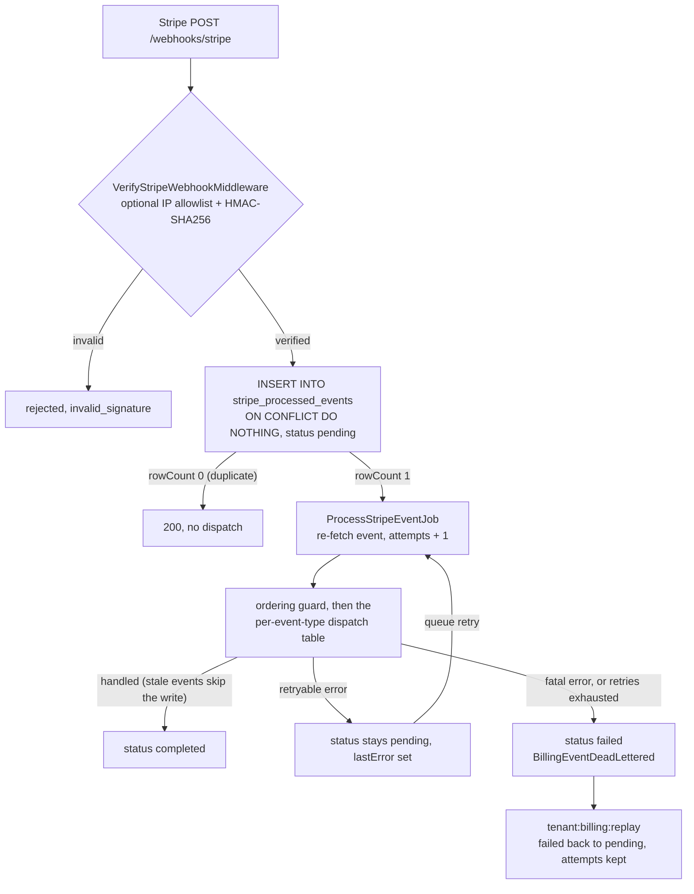
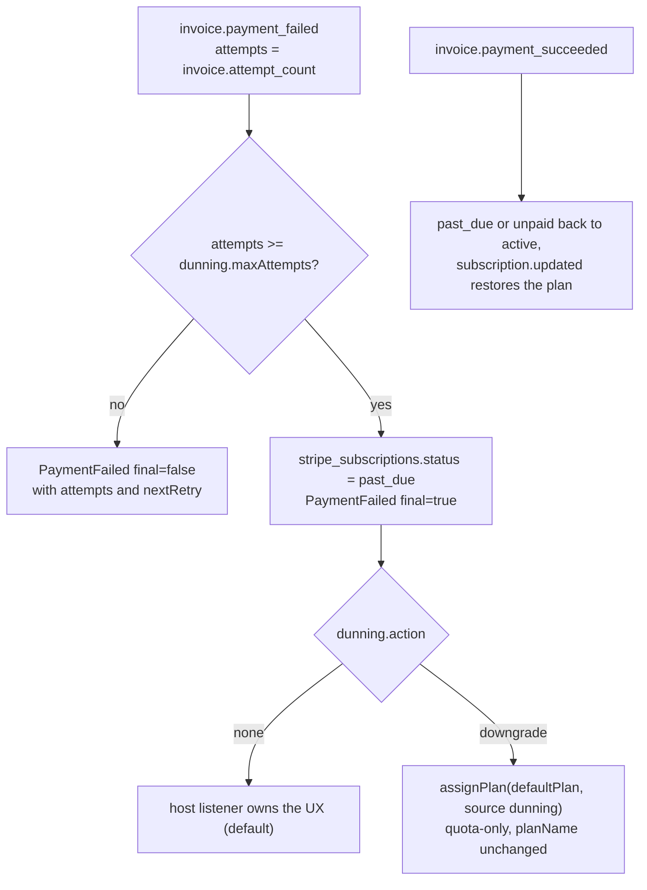

# Billing

Inbound Stripe integration. Subscriptions in Stripe drive plan
assignment in the [quotas satellite](/docs/satellites/quotas), backed
by an idempotent webhook receiver, a configurable dunning state
machine, optional metered billing via Stripe Meters, checkout and
billing-portal helpers, and a per-policy tenant-delete cleanup hook.

The journey-style recipe lives in
[Stripe + quotas (cookbook)](/docs/cookbook/stripe-quotas). This page
is the reference: every config field, every event, every command,
every storage table, the lifecycle policy, and the testing helpers.

## Configuration

```bash
node ace configure @adonisjs-lasagna/saas-tenancy --with=billing
npm install stripe@^18
```

The configure step publishes:

- 5 backoffice migrations: `tenant_plans`, `stripe_customers`,
  `stripe_subscriptions`, `stripe_processed_events`,
  `stripe_meter_events`.
- `app/mailers/quota_warning_mailer.ts` plus
  `resources/views/emails/quota_warning.edge` (the listener wired to
  `TenantQuotaExceeded` when `notifyOnQuotaExceeded: true`).
- A printed snippet for `config/multitenancy.ts` and
  `start/routes.ts`.

Run the migrations:

```bash
node ace migration:run --connection=backoffice
```

`stripe@^18` is a peer dep — declare it in your host
`package.json` so dependabot can bump it. The package never imports
the SDK statically; without billing enabled, it stays out of the
bundle.

### Environment variables

| Variable | Purpose |
|---|---|
| `STRIPE_API_KEY` | Secret key. Boot **rejects** `sk_live_*` when `NODE_ENV !== 'production'` (and `sk_test_*` when `NODE_ENV === 'production'`). |
| `STRIPE_WEBHOOK_SECRET` | Webhook signing secret from the Stripe dashboard endpoint. |
| `STRIPE_API_VERSION` | Optional pin. Defaults to `2025-08-27.basil`. Pinning is recommended in production. |
| `STRIPE_ALLOW_LIVE_IN_DEV` | Escape hatch — set to `'true'` to allow live keys outside production (rare; staging that legitimately uses live keys). |

> ⚠ **Env-mode boot guard**. The package refuses to boot when
> `STRIPE_API_KEY` and `NODE_ENV` disagree about test vs live mode,
> because a stray `.env` from prod into dev silently moves real
> money. If your CI or staging environment legitimately uses live
> keys, opt in explicitly with `STRIPE_ALLOW_LIVE_IN_DEV=true`. The
> boot also validates `STRIPE_WEBHOOK_SECRET` is non-empty and
> starts with `whsec_` so a misconfigured deploy fails fast rather
> than silently accepting any forged signature.
>
> See the [Stripe + quotas cookbook](../cookbook/stripe-quotas.md)
> for an end-to-end setup walkthrough.

The webhook path **must** appear in `config.ignorePaths` so
`TenantGuardMiddleware` doesn't try to resolve a tenant from the
Stripe request. The published `multitenancy.stub` already includes
`/webhooks/stripe`; if you change `webhook.path`, update both.

## Config fields

`config.billing.*`:

| Field | Type | Default | Purpose |
|---|---|---|---|
| `driver` | `'stripe'` | required | Reserved for future drivers. v1 only ships `'stripe'`. |
| `stripe.apiKey` | `string` | required | Read from `STRIPE_API_KEY`. |
| `stripe.webhookSecret` | `string` | required | Read from `STRIPE_WEBHOOK_SECRET`. |
| `stripe.apiVersion` | `string?` | `'2025-08-27.basil'` | Pin the Stripe API version. |
| `stripe.timeout` | `number?` | `10_000` | SDK request timeout in ms. |
| `stripe.maxNetworkRetries` | `number?` | `3` | SDK network-retry attempts. |
| `products` | `Record<string, string>` | required | Stripe product (or price) ID → plan name. Plan must exist in `plans.definitions`. |
| `defaultPlan` | `string` | required | Plan assigned on cancel or unmapped product. Must exist in `plans.definitions`. |
| `webhook.path` | `string?` | `'/webhooks/stripe'` | Mount path; must be in `ignorePaths`. |
| `webhook.queueName` | `string?` | `'billing-events'` | BullMQ queue for `ProcessStripeEventJob`. |
| `webhook.idempotencyTtlDays` | `number?` | `90` | Retention for `stripe_processed_events.completed` rows. Stripe's max retry window. |
| `webhook.enforceIpAllowlist` | `boolean?` | `false` | Hard-fail webhook delivery from non-listed IPs. |
| `webhook.allowedIps` | `string[]?` | `[]` | Literal IPs and/or CIDR ranges (`54.187.174.0/24`). Backed by `node:net.BlockList` — zero deps, IPv4 + IPv6 + 4-mapped-6 normalisation. |
| `dunning.maxAttempts` | `number?` | `3` | After this many failed invoice attempts, mark `past_due` and emit `PaymentFailed{final:true}`. Matches Stripe Smart Retries. |
| `dunning.action` | `'none' \| 'downgrade'` | `'none'` | Auto-action on the final failed attempt. `'downgrade'` reassigns the tenant's quota to `defaultPlan` (mirror `planName` is preserved; a successful retry restores it). `'none'` leaves all behaviour to the host's `PaymentFailed{final:true}` listener. |
| `dunning.gracePeriodDays` | `number?` | `0` | Days to wait after `past_due` before applying the action. |
| `notifyOnQuotaExceeded` | `boolean?` | `false` | Dispatch `QuotaWarningMailer` on `TenantQuotaExceeded`. Requires `@adonisjs/mail`. |
| `onTenantDelete` | `'cancel' \| 'detach' \| 'preserve'` | `'cancel'` | Tenant hard-delete policy (see below). |
| `usageMapping` | `Record<string, { meterEventName: string; batchFlushMs?: number }>?` | — | Auto-bridge `QuotaService.track` to Stripe Meters. Requires `plans.emitTracked = true`. |
| `observability.metrics` | `boolean?` | `true` if MetricsService active | Emit Prometheus metrics. |
| `observability.redactPii` | `boolean?` | `true` | Strip PII from logs and audit payloads. |

## Webhook receiver

```ts
// start/routes.ts
import { multitenancyBillingRoutes } from '@adonisjs-lasagna/billing'

multitenancyBillingRoutes()
```

Mounts `POST /webhooks/stripe` (or `webhook.path`), gated by
[VerifyStripeWebhookMiddleware](#middleware), behind a route name of
`billing.webhook`.

End-to-end flow, including what happens to the `stripe_processed_events`
row at each step. Rows stay `pending` while queue retries are in flight;
`failed` rows are the replayable dead-letter set (see the
[incident runbook](#incident-runbook)).



The `INSERT ... ON CONFLICT DO NOTHING` is the atomicity primitive —
duplicate event ids never dispatch the job a second time, even under
concurrent webhook delivery.

`tenant:billing:cleanup` purges `completed` rows older than
`webhook.idempotencyTtlDays`. Run daily on a cron.

### Middleware

`VerifyStripeWebhookMiddleware`:

1. Optional IP allowlist (cheap reject before HMAC). Accepts literal
   IPs and CIDR (`54.187.174.0/24`); `node:net.BlockList` handles IPv4
   + IPv6 + 4-mapped-6 normalisation natively, no extra deps.
2. Reads the raw request body (Adonis `BodyParser` preserves bytes
   for `application/json`).
3. Verifies `stripe-signature` via the Stripe SDK (HMAC-SHA256 over
   `<timestamp>.<rawBody>`).
4. Attaches the verified `Stripe.Event` to the request for the
   controller.

## Plan assignment

`QuotaService.assignPlan(tenantId, planName)` upserts a row in
`tenant_plans` and busts the `(tenant, plan)` cache key on every node
via the BentoCache redis bus.

`ProcessStripeEventJob` calls `assignPlan` automatically on every
`customer.subscription.{created,updated,deleted}`. Plan **definitions**
(the limit values) live in `config.plans.definitions`; only the
**assignment** (tenant → plan name) lives in the database. A Stripe
product that doesn't map to a declared plan falls back to
`defaultPlan` and emits a `BillingMisconfigured` event so ops can fix
the mapping without losing customer state.

Counter behaviour on plan change:

- Re-assigning to the same plan is a no-op (no cache bust, no quota
  reset).
- Upgrades surface a higher limit on the next `getLimit` call (≤ 60s,
  bounded by the cache TTL).
- Downgrades take effect immediately. Counters are NOT reset — a user
  mid-period over their new limit gets 402s until the rolling counter
  rolls. Use `dunning.gracePeriodDays` to delay enforcement.

## Dunning

```ts
billing: {
  dunning: {
    maxAttempts: 3,                  // matches Stripe Smart Retries
    action: 'none' | 'downgrade',    // 'block' was removed — host listeners do this
    gracePeriodDays: 0,
  },
}
```

On `invoice.payment_failed`:

- Every attempt emits `PaymentFailed{final:false}` with `attempts`
  and `nextRetry` so hosts can render in-app banners.
- The `attempts === maxAttempts` attempt marks
  `stripe_subscriptions.status = 'past_due'` and emits
  `PaymentFailed{final:true}`.
- `action` then runs:
  - `'none'`: no-op (default — host owns the UX via the
    `PaymentFailed{final:true}` listener).
  - `'downgrade'`: `assignPlan(tenant, defaultPlan, { source: 'dunning' })`.
    Note this is a quota-only side-effect — `stripe_subscriptions.planName`
    keeps the original plan, so a successful retry's
    `customer.subscription.updated(active)` restores the upgraded
    plan automatically.

The same flow drawn out, recovery path included. The downgrade touches
quotas only, so a later successful retry restores the paid plan without
operator action.



> `gracePeriodDays` is currently a no-op (the value is read but the
> action fires immediately). Listen for `PaymentFailed{final:true}`
> and defer your own enforcement if you need a grace window today.

For app-level blocking (refusing requests until billing is resolved),
listen for `PaymentFailed{final:true}` and gate at your middleware.
The package intentionally does not own that policy.

## Metered billing

Two ways to feed Stripe Meters:

### Manual

```ts
const billing = await app.container.make(BillingService)
await billing.reportUsage(tenant, { eventName: 'api_request' }, 1)
```

Each call writes an audit row in `stripe_meter_events` with a UNIQUE
`idempotency_key`, then forwards to Stripe with the same key.
Default key is deterministic per `(tenant, meter, minute-bucket)`:
`<tenantId>:<meterEventName>:<minuteBucket>`. Retries within the
same minute hit Stripe's idempotency cache and don't double-count.
Pass `opts.idempotencyKey` to scope dedupe to a request id instead.

### Auto-bridge

```ts
billing: {
  usageMapping: {
    apiRequests: { meterEventName: 'api_request' },
  },
},
plans: {
  emitTracked: true,
  // …
},
```

With both flags on, `QuotaService.track` (and the allowed branch of
`consume`) emits `QuotaTracked`. `UsageAutoBridgeListener`
aggregates events per `(tenant, meter)` in memory and flushes a
single `ReportUsageBatchJob` every `batchFlushMs` (default `10_000`)
per bucket. On `provider.shutdown()` the listener drains in-flight
buckets so a clean SIGTERM doesn't drop metering.

Unmapped quotas are silently ignored — only quotas listed in
`usageMapping` cross over to Stripe.

## Tenant hard-delete policy

`config.billing.onTenantDelete` controls cleanup when
`HookRegistry.beforeDestroy` fires for a tenant:

| Policy | Stripe API call | Local mapping | Audit rows |
|---|---|---|---|
| `'cancel'` (default) | `stripe.subscriptions.cancel(id, { invoice_now: false, prorate: false })` for every `active`/`past_due`/`trialing`/`paused` sub. | Drops `stripe_customers` row. | Sets `stripe_subscriptions.status='canceled'` (rows kept). |
| `'detach'` | No call. The Stripe subscription keeps billing the card on file. | Drops `stripe_customers` row. | Untouched. |
| `'preserve'` | No call. | Untouched. | Untouched. Operator handles cleanup manually. |

### What `'cancel'` actually does — and does NOT do

- **Cancellation timing**: **immediate**. The subscription stops billing
  the moment the API call returns. There is no `'at_period_end'` mode —
  if you want a grace period, pre-update the subscription's
  `cancel_at_period_end=true` from your own admin tooling before
  destroying the tenant.
- **Final invoice**: **none**. `invoice_now: false` means Stripe does
  not generate an out-of-cycle invoice for unbilled usage. If the
  tenant has unmetered usage between the last invoice and the destroy
  call, that usage is **lost** — Stripe will not bill it later.
  Hosts that need the final draw should call
  `stripe.invoices.create` themselves before the destroy.
- **Proration / refunds**: **none**. `prorate: false` means no
  proration credit is issued for the unused portion of the current
  period. Money already paid stays paid. To refund, the host must
  call `stripe.refunds.create` separately on the relevant
  `payment_intent`.
- **Already-paid invoices**: untouched. They remain visible in the
  Stripe dashboard. No automatic refund.
- **Payment methods**: detached automatically when the Stripe customer
  is later deleted by an operator. The package does NOT delete the
  customer itself — only the local mapping row. This preserves the
  audit trail in Stripe for compliance / forensics.

### Failure behaviour

The listener (`TenantDestroyBillingListener`) is wired automatically
when `config.billing` is set. Per-subscription cancellation failures
log a structured warning with `billing_code` but never block tenant
destroy — the audit trail is preserved for reconciliation, and a
manual `tenant:billing:sync` pass can finish the job once the
underlying issue is resolved.

## Events

10 events are dispatched from the billing pipeline. All exported
from `@adonisjs-lasagna/saas-tenancy/events`:

| Event | Payload | Dispatched by |
|---|---|---|
| `SubscriptionActivated` | `tenantId, stripeSubscriptionId, planName` | `customer.subscription.created` (or `.updated` flipping to active) |
| `SubscriptionUpdated` | `tenantId, stripeSubscriptionId, previousPlan, newPlan` | `customer.subscription.updated` when plan changes |
| `SubscriptionCanceled` | `tenantId, stripeSubscriptionId, previousPlan, reason` | `customer.subscription.deleted` (`reason`: `user_canceled` \| `dunning_failed` \| `unknown`) |
| `SubscriptionPaused` | `tenantId, stripeSubscriptionId` | Stripe pause-collection or `customer.subscription.paused` |
| `SubscriptionResumed` | `tenantId, stripeSubscriptionId` | `customer.subscription.resumed` |
| `TrialEnding` | `tenantId, stripeSubscriptionId, daysLeft` | `customer.subscription.trial_will_end` |
| `PaymentSucceeded` | `tenantId, invoiceId, amount, currency` | `invoice.payment_succeeded` |
| `PaymentFailed` | `tenantId, invoiceId, amount, currency, attempts, final, nextRetry` | `invoice.payment_failed` (every attempt + final) |
| `BillingMisconfigured` | `stripeSubscriptionId, productId, priceId` | A Stripe product/price has no mapping in `config.billing.products`. |
| `BillingEventDeadLettered` | `eventId, errorCode, details` | Webhook event exhausted all queue retries. `errorCode` is a stable `BillingErrorCode \| 'unhandled_error'` enum; `details` is null unless the source error was a `BillingException`. |

### Listening for events

Wire listeners in `start/events.ts`. The events are `BaseEvent`
subclasses so AdonisJS resolves the listener via `emitter.on(EventClass, fn)`.

```ts
// start/events.ts
import emitter from '@adonisjs/core/services/emitter'
import {
  TrialEnding,
  PaymentSucceeded,
  PaymentFailed,
  BillingEventDeadLettered,
} from '@adonisjs-lasagna/saas-tenancy/events'

// Notify the tenant 7 days before their trial converts.
emitter.on(TrialEnding, async (event) => {
  const { tenantId, stripeSubscriptionId, daysLeft } = event.payload
  await sendTrialEndingEmail(tenantId, { daysLeft, stripeSubscriptionId })
})

// Reset any in-app "your payment failed" banner when the customer recovers.
emitter.on(PaymentSucceeded, async (event) => {
  const { tenantId, invoiceId, amount, currency } = event.payload
  await clearBillingBanner(tenantId)
  await trackRevenue({ tenantId, invoiceId, amount, currency })
})

// React to dunning. `final:false` fires for each retry; `final:true`
// fires once after maxAttempts. Most hosts only act on `final:true`.
emitter.on(PaymentFailed, async (event) => {
  const { tenantId, attempts, final, nextRetry } = event.payload
  if (!final) {
    await showRetryBanner(tenantId, { attempts, nextRetry })
    return
  }
  // Final attempt: hard block, send an account-manager ping, etc.
  await onBillingExhausted(tenantId)
})

// Page on-call when a webhook can't be processed after all retries.
// The eventId can be replayed with `node ace tenant:billing:replay
// --event-id=<id>` once the underlying issue is fixed.
emitter.on(BillingEventDeadLettered, async (event) => {
  const { eventId, errorCode, details } = event.payload
  await alerts.page({
    severity: errorCode === 'authentication_failed' ? 'critical' : 'high',
    title: `Stripe webhook dead-lettered (${errorCode})`,
    runbook: 'docs/satellites/billing#incident-runbook',
    payload: { eventId, errorCode, details },
  })
})
```

Listeners run after the webhook has been ack'd to Stripe and the
mirror has been updated, so a slow listener never delays Stripe's
delivery loop. Listener exceptions are logged but never reverted
back to the dispatcher — keep them idempotent.

## Service surface

`BillingService` (singleton; lazy-loads the Stripe SDK on first
use):

| Method | Returns | Purpose |
|---|---|---|
| `verify()` | `Promise<void>` | Boot-time validation (peer dep installed; key mode matches `NODE_ENV`; `defaultPlan` and every product mapping point at declared plans). Idempotent. Called automatically from `MultitenancyProvider.boot()`. |
| `getClient()` | `Promise<Stripe>` | Returns the underlying SDK instance for advanced operations not yet covered. |
| `ensureCustomer(tenant)` | `Promise<StripeCustomer>` | Idempotent customer creation; race-safe under concurrency via Stripe's `Idempotency-Key`. |
| `createCheckoutSession(tenant, opts)` | `Promise<{ url, id }>` | Builds a Checkout session URL. Auto-creates the customer. `opts`: `priceId, successUrl, cancelUrl, mode?, trialDays?, allowPromotionCodes?, clientReferenceId?`. |
| `createBillingPortalSession(tenant, opts)` | `Promise<{ url }>` | Builds a Billing Portal session URL. Throws `customer_not_found` if the tenant has no Stripe customer yet. |
| `syncSubscription(sub, eventCreated, opts?)` | `Promise<{ tenant_id, plan, previousPlan } \| null>` | Reconciles a `Stripe.Subscription` into the local mirror + assigns the plan. Stale events (older than `last_event_at - 5s`) are rejected. |
| `reportUsage(tenant, meter, qty, opts?)` | `Promise<void>` | Reports a meter event to Stripe. Persists an audit row in `stripe_meter_events`. |
| `retrieveEvent(eventId)` | `Promise<Stripe.Event>` | Re-fetches a webhook event from Stripe. Used by the job rather than trusting the queue payload. When Stripe reports the event is gone (`resource_missing` / 404), falls back to the locally-persisted replayable `payload` and reconstructs it faithfully so plan mapping survives. Other Stripe errors surface unchanged. |

The host wires checkout and the portal as your own routes — apply
your auth + role middleware (`auth + activeTenant + role(owner|admin)`
is the recommended stack):

```ts
// app/controllers/billing_controller.ts
import { BillingService } from '@adonisjs-lasagna/billing'
import type { HttpContext } from '@adonisjs/core/http'
import app from '@adonisjs/core/services/app'

export default class BillingController {
  async checkout({ request, response }: HttpContext) {
    const tenant = await request.tenant()
    const billing = await app.container.make(BillingService)
    const { url } = await billing.createCheckoutSession(tenant, {
      priceId: request.input('priceId'),
      successUrl: 'https://app.example.com/dashboard?checkout=ok',
      cancelUrl: 'https://app.example.com/pricing',
    })
    return response.redirect(url)
  }

  async portal({ request, response }: HttpContext) {
    const tenant = await request.tenant()
    const billing = await app.container.make(BillingService)
    const { url } = await billing.createBillingPortalSession(tenant, {
      returnUrl: 'https://app.example.com/settings',
    })
    return response.redirect(url)
  }
}
```

## Ace commands

| Command | Args / flags | Purpose |
|---|---|---|
| `tenant:billing:sync` | `--dry-run`, `--tenant=<id>`, `--since=<iso>`, `--json` | Reconciles Stripe subscriptions with the local mirror; recovers from missed webhooks. **Suggested cron**: `0 4 * * *`. |
| `tenant:billing:backfill` | `--dry-run`, `--force`, `--plan=<name>` | Seeds `tenant_plans` rows with the default plan for every tenant that doesn't have one. `--force` overwrites existing rows. |
| `tenant:billing:replay` | `--event-id=<evt>`, `--all-failed` | Re-dispatches a failed webhook event after the underlying issue is fixed (e.g. missing product mapping). |
| `tenant:billing:cleanup` | `--batch-size=<n>` | Purges `stripe_processed_events` older than `webhook.idempotencyTtlDays`. **Suggested cron**: `0 4 * * *`. |
| `tenant:billing:doctor` | `--json` | Diagnoses Stripe config + recent webhook health. Exit 1 on any error. Pipeline-friendly. |
| `tenant:billing:test-webhook` | `<event>` (positional), `--url=<url>`, `--object=<file>` | Generates and POSTs a signed synthetic Stripe event. Useful in CI without `stripe listen`. |

## Storage

Four backoffice tables published by `--with=billing`:

### `stripe_customers`

One row per tenant. The mapping `tenant_id ↔ stripe_customer_id` is
the keystone of every webhook lookup.

| Column | Type | Notes |
|---|---|---|
| `tenant_id` | `uuid` | PK |
| `stripe_customer_id` | `string` | `UNIQUE NOT NULL` |
| `default_payment_method` | `string \| null` | |
| `currency` | `string \| null` | |
| `created_at`, `deleted_at` | `timestamptz` | |

### `stripe_subscriptions`

Local mirror of Stripe subscriptions. Reconciled by
`tenant:billing:sync`.

| Column | Type | Notes |
|---|---|---|
| `stripe_subscription_id` | `string` | PK |
| `tenant_id` | `uuid` | FK → `stripe_customers.tenant_id`, `ON DELETE RESTRICT` |
| `status` | `enum` | `incomplete \| incomplete_expired \| trialing \| active \| past_due \| canceled \| unpaid \| paused` |
| `current_period_start/end` | `timestamptz` | |
| `cancel_at_period_end` | `boolean` | |
| `cancel_at`, `canceled_at`, `trial_end` | `timestamptz \| null` | |
| `plan_name` | `string` | |
| `last_event_at` | `timestamptz` | Ordering guard for out-of-order webhook delivery. |
| `raw` | `jsonb` | Full Stripe payload so we can re-derive any field without re-fetching. |
| **Index** | | `(tenant_id, status)` |

### `stripe_processed_events`

Webhook idempotency ledger.

| Column | Type | Notes |
|---|---|---|
| `event_id` | `string` | PK — `INSERT ... ON CONFLICT (event_id) DO NOTHING`. |
| `event_type` | `string` | |
| `processed_at`, `completed_at` | `timestamptz` | |
| `tenant_id` | `uuid \| null` | Nullable because some events arrive before the tenant lookup completes. |
| `attempts` | `integer` | |
| `last_error` | `text \| null` | Redacted; never raw `error.message`. |
| `status` | `enum` | `pending \| completed \| failed` |
| `payload` | `jsonb \| null` | PII-stripped, structurally-faithful replayable copy (`toReplayablePayload`). Reconstructs an aged-out event for replay past Stripe's 30-day retrieval window. |
| **Indexes** | | `(status, processed_at)`, `(event_type)` |

### `stripe_meter_events`

Audit ledger for usage-based billing reports. Requires the `pgcrypto`
extension (created by the migration if absent).

| Column | Type | Notes |
|---|---|---|
| `id` | `uuid` | PK, `DEFAULT gen_random_uuid()`. The model is `selfAssignPrimaryKey` and the service explicitly sets a `randomUUID()` before save. |
| `tenant_id` | `uuid` | Indexed. |
| `meter_event_name` | `string` | |
| `quantity` | `bigint` | |
| `idempotency_key` | `string` | `UNIQUE NOT NULL`. Defense-in-depth at the DB layer; same key sent to Stripe so retries can't double-report. |
| `reported_at` | `timestamptz \| null` | |
| `status` | `enum` | `pending \| sent \| failed` |
| `last_error` | `text \| null` | |
| `attempts`, `created_at` | — | |
| **Index** | | `(tenant_id, meter_event_name, status)` |

## Health

The package exports `billingHealthCheck` from
`@adonisjs-lasagna/saas-tenancy/health`. Wire it into your
`HealthService`:

```ts
import { billingHealthCheck } from '@adonisjs-lasagna/billing'

health.addCheck('billing', billingHealthCheck)
```

Three states:

- **`pass`** — Stripe API responding under
  `SLOW_API_THRESHOLD_MS` (3 s), webhook secret present, and (when
  active subs exist) the latest webhook completed in the last 5 min.
- **`pass` with `meta.degraded = true`** — API > 3 s, OR last
  processed between 5 and 15 min ago.
- **`fail`** — webhook secret missing, Stripe API unreachable, or
  last processed > 15 min when active subs exist.

When `config.billing` is unset the check skips quietly (`pass` with
`meta.skipped: true`).

`SLOW_API_THRESHOLD_MS` is exported so tests can target the degraded
branch without race conditions on a magic number.

## Observability

- **PII redaction** is built in, through two strip-lists (allowlists)
  that never copy the raw Stripe object. Structured **logs** go through
  `redactStripeEvent()`. The webhook **payload** persisted in
  `stripe_processed_events.payload` goes through `toReplayablePayload()`,
  which keeps the nested `data.object` shape so an aged-out event can be
  reconstructed for replay. Adding a field to either requires deliberate
  review against the PII matrix: email, name, phone, address,
  `billing_details`, `last4`, `receipt_number`, `metadata`,
  `description`, and the like are never included.
- **Dead-letter events** carry `errorCode` (a stable enum) and
  `details: string | null`. `details` is `null` for unknown errors;
  populated only when the source error was a `BillingException`
  (whose message is package-controlled). Raw `error.message` from
  the Stripe SDK never reaches the event.
- **Prometheus metrics** are emitted automatically when
  `MetricsService` is active. Disable via
  `observability.metrics: false`.

### Error codes

`BillingErrorCode` is a stable enum surfaced via
`BillingException.billingCode` and `BillingEventDeadLettered.errorCode`.
Match on the code, not the message.

| Code | Status | Meaning |
|---|---|---|
| `peer_missing` | 500 | `stripe` peer dep not installed. |
| `config_missing` | 400 | `config.billing` unset, missing `defaultPlan`, or unmapped product. |
| `test_in_production` | 400 | `sk_test_*` key paired with `NODE_ENV=production`. |
| `live_key_outside_production` | 400 | `sk_live_*` key without `NODE_ENV=production` and without `STRIPE_ALLOW_LIVE_IN_DEV=true`. |
| `invalid_signature` | 401 | Webhook HMAC verification failed. |
| `webhook_body_unreadable` | 400 | Raw body could not be read (BodyParser misconfig). |
| `customer_not_found` | 404 | Tenant has no `stripe_customers` row. |
| `tenant_not_resolvable` | 404 | Webhook event cannot be mapped to a tenant. |
| `plan_unmapped` | 400 | Stripe product/price has no entry in `config.billing.products`. |
| `subscription_not_found` | 404 | |
| `card_declined` | 402 | `StripeCardError`. |
| `rate_limited` | 429 | `StripeRateLimitError`. |
| `api_error` | 500 | Generic Stripe SDK error. |
| `network_error` | 503 | `StripeConnectionError`. |
| `metering_failed` | 400 | Invalid meter inputs (negative quantity, etc.). |
| `idempotency_conflict` | 409 | Same idempotency key reused with different params. |
| `invalid_price` | 400 | `priceId` passed to `createCheckoutSession` is not in `config.billing.products`. Pass `allowUnknownPrices: true` if the host validates upstream. |
| `queue_unavailable` | 503 | Webhook controller could not enqueue the processing job. Stripe gets 5xx and retries the delivery; the next attempt re-dispatches. |
| `authentication_failed` | 401 | Stripe API key was rejected. Fatal — the job won't retry. |
| `invalid_stripe_request` | 400 | Stripe rejected the request shape (deleted resource, missing field). Fatal — the job won't retry. |
| `permission_denied` | 403 | API key lacks permission for the resource (Stripe Connect). Fatal — the job won't retry. |

`BillingException.isRetryable()` reports whether the queue should
keep retrying. Fatal codes short-circuit the BullMQ retry budget
and immediately fire `BillingEventDeadLettered` so on-call doesn't
wait ~30 s of exponential backoff before being paged on a problem
that retrying can't solve.

## Testing

`@adonisjs-lasagna/saas-tenancy/testing` exports two helpers:

```ts
import {
  MockStripe,
  signWebhookPayload,
} from '@adonisjs-lasagna/saas-tenancy/testing'

// Inject an in-memory Stripe SDK double:
const mock = new MockStripe('whsec_test_secret')
mock.injectEvent({
  id: 'evt_test',
  type: 'customer.subscription.created',
  data: { object: { /* … */ } },
})

const billing = await app.container.make(BillingService)
billing.__setStripeForTests(mock)

// Sign a synthetic webhook body for an end-to-end POST test:
const body = JSON.stringify(eventPayload)
const sig = signWebhookPayload(body, 'whsec_test_secret')

await client
  .post('/webhooks/stripe')
  .header('content-type', 'application/json')
  .header('stripe-signature', sig)
  .json(eventPayload)
```

`signWebhookPayload(body, secret, timestamp?)` returns the
`t=<unix>,v1=<hmac>` shape the Stripe SDK expects. The helper has
its own unit suite that re-computes the HMAC and exercises tamper
detection, so a refactor that breaks the format is caught even when
`MockStripe`'s lenient verification masks it in higher-level tests.

`BillingService.__setStripeForTests(mock)` and `__resetForTests()`
are explicitly internal — only use them from test code.

## Local development

```bash
# Forward Stripe webhooks to your local app
stripe listen --forward-to localhost:3333/webhooks/stripe

# Trigger an event without leaving the terminal
stripe trigger customer.subscription.created
```

For CI without `stripe listen` running, the package ships
`tenant:billing:test-webhook`:

```bash
node ace tenant:billing:test-webhook customer.subscription.created \
  --url=http://127.0.0.1:3333/webhooks/stripe
```

Replace customer/product IDs in the template (or pass
`--object=path/to/body.json`) for an end-to-end run.

## Production checklist

1. Live key in Stripe with a webhook endpoint pointing at
   `webhook.path`.
2. `STRIPE_API_KEY`, `STRIPE_WEBHOOK_SECRET`, `STRIPE_API_VERSION`
   set in env.
3. `tenant:billing:doctor --json` exits `0`.
4. Cron: daily `tenant:billing:sync` and `tenant:billing:cleanup`.
5. Subscribe a paging integration (PagerDuty, Slack, Sentry) to
   `BillingEventDeadLettered`.
6. (Optional) `webhook.enforceIpAllowlist: true` with
   `webhook.allowedIps` populated from
   <https://stripe.com/files/ips/ips_webhooks.json> for
   defence-in-depth on top of the HMAC check.
7. (Optional) Pre-load Grafana dashboards from the metrics
   `billing.webhook.processing_duration_seconds`,
   `billing.subscription.active_total`,
   `billing.stripe_api.errors_total`.

## Incident runbook

Designed to be the page on-call opens during a billing incident.
Symptoms first, then triage, then recovery — copy the relevant
commands as-is.

### 1. `BillingEventDeadLettered` fires

**Symptom**: pager alert; one or more webhook events exhausted all
queue retries.

**Triage**:

```bash
# Look at what failed and why
node ace tenant:billing:doctor --json | jq '.checks[] | select(.status != "ok")'

# Inspect the row directly
psql -c "SELECT event_id, event_type, status, attempts, last_error
         FROM backoffice.stripe_processed_events
         WHERE status = 'failed' ORDER BY processed_at DESC LIMIT 20;"
```

The `errorCode` from the dead-letter payload tells you the class:

- `authentication_failed` / `invalid_stripe_request` /
  `permission_denied` → fatal Stripe-side. Fix the underlying
  config or resource, then replay (below).
- `network_error` / `rate_limited` / `queue_unavailable` /
  `api_error` → transient. Already exhausted retries; replay to
  retry against a now-healthy dependency.
- `customer_not_found` / `tenant_not_resolvable` → resolution race
  or stale data. Usually the `checkout.session.completed` event
  never landed; check the ledger for that event_id.

**Recovery**:

```bash
# Replay a single event after fixing the root cause
node ace tenant:billing:replay --event-id=evt_XXX

# Or all currently-failed events at once
node ace tenant:billing:replay --all-failed
```

### 2. Stripe API outage

**Symptom**: spikes in `network_error` / `api_error` / `rate_limited`;
`tenant:billing:doctor` reports the Stripe ping as failing.

**Triage**: check <https://status.stripe.com>.

**Recovery**: the package does the right thing automatically. The
webhook controller returns 5xx so Stripe retries on its end,
`ProcessStripeEventJob` retries via BullMQ for transient errors,
and `tenant:billing:sync` reconciles any state that drifted while
Stripe was unreachable. Once Stripe is healthy:

```bash
# Reconcile in dry-run first to scope the damage
node ace tenant:billing:sync --dry-run --json

# Then apply (forward + reverse pass)
node ace tenant:billing:sync --json
```

### 3. Queue / Redis outage

**Symptom**: ledger rows pile up with `status='pending'` and
`attempts=0`. `BillingEventDeadLettered` may NOT fire (the job
never ran).

**Triage**:

```sql
SELECT count(*) FROM backoffice.stripe_processed_events
WHERE status='pending' AND attempts=0
  AND processed_at < now() - interval '5 minutes';
```

If non-zero and growing, BullMQ/Redis is unhealthy.

**Recovery**:

1. Fix Redis / BullMQ (out of scope for this runbook).
2. Stripe's own retry covers most of the gap — when it re-delivers,
   the controller's `INSERT ... ON CONFLICT` branch detects the
   pending-attempts-0 row and re-dispatches automatically (C-1
   recovery path).
3. For events Stripe has already given up on (>3 days), replay
   manually:

```bash
node ace tenant:billing:replay --all-failed
# pending rows that never advanced to 'failed' need a direct push:
node ace tenant:billing:replay --event-id=evt_XXX
```

### 4. Webhook signature failures

**Symptom**: spikes in 401 responses on `/webhooks/stripe`; no
ledger rows appearing.

**Triage**:

- `STRIPE_WEBHOOK_SECRET` matches the secret of the Stripe webhook
  endpoint that's sending events. A rotated secret without redeploy
  is the #1 cause.
- If `webhook.enforceIpAllowlist` is on, Stripe's IP ranges may have
  rotated since the allowlist was populated. Refresh from
  <https://stripe.com/files/ips/ips_webhooks.json>.
- A reverse proxy or BodyParser change may have rewritten the raw
  body. `request.raw()` must yield the unmodified bytes Stripe sent.

**Recovery**: rotate / republish the secret, redeploy, then replay
the lost window. Stripe retains deliveries for ~3 days so the
events list in the Stripe dashboard still has them; pull each
event_id and feed it to `tenant:billing:replay`.

### 5. Drift between Stripe and local mirror

**Symptom**: a tenant reports they cancelled but still have access,
or the doctor flags drifted subscriptions.

**Triage**:

```bash
# Dry-run shows what would change without writing.
node ace tenant:billing:sync --tenant=<uuid> --dry-run --json
```

**Recovery**:

```bash
# Forward pass aligns local with Stripe.
# Reverse pass downgrades orphan tenant_plans without an active sub.
node ace tenant:billing:sync --tenant=<uuid> --json
```

For a system-wide drift sweep (e.g., after a long outage), drop
`--tenant` and run for the entire account. Idempotent — safe to
re-run.

### 6. Configuration drift causing `plan_unmapped`

**Symptom**: `BillingMisconfigured` events firing; tenants on a
Stripe product fall back to `defaultPlan` silently.

**Triage**: the event payload carries `productId` / `priceId`. Look
those up in the Stripe dashboard.

**Recovery**: add the mapping to `config.billing.products`,
redeploy, then reconcile:

```bash
node ace tenant:billing:sync --json
```

The state machine warnings (`stripe.subscription.illegal_transition`,
`stripe.subscription.unknown_source_state`) in the log stream point
at API drift or unexpected admin actions — surface in your error
aggregator and investigate the specific tenant.

## Read next

- [Stripe + quotas (cookbook)](/docs/cookbook/stripe-quotas) — the
  end-to-end recipe.
- [Quotas satellite](/docs/satellites/quotas) — where the plan
  assignments land.
- [Lifecycle events](/docs/events): the 10 billing events plus the
  14 tenant-lifecycle events.
