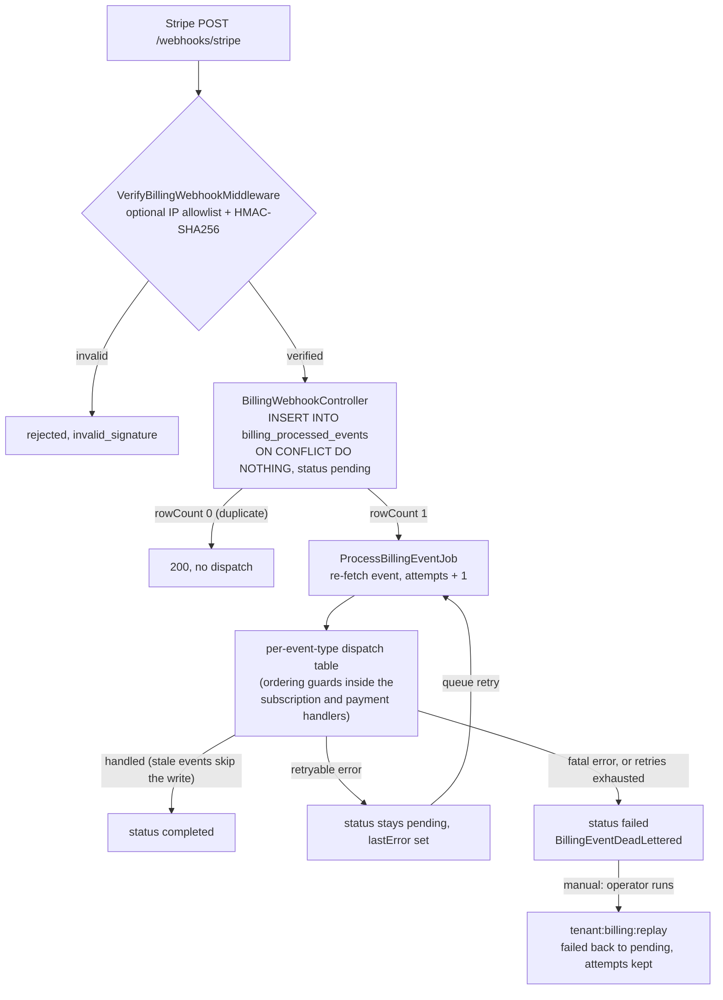
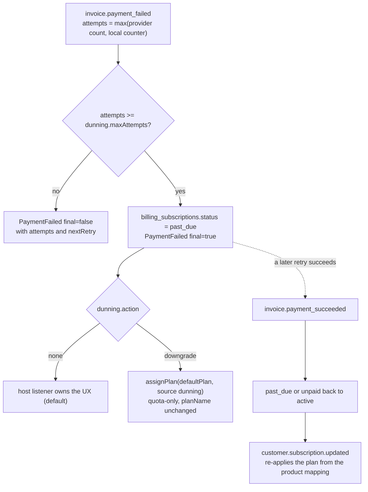

# Billing

Inbound billing integration. Subscriptions at your provider drive plan
assignment in the [quotas satellite](/docs/satellites/quotas), backed
by an idempotent webhook receiver, a configurable dunning state
machine, optional metered billing, checkout and billing-portal helpers,
and a per-policy tenant-delete cleanup hook.

The provider is pluggable: pick `config.billing.driver` and the package
core never imports a provider SDK. Three drivers ship: **Stripe**
(official SDK), plus **Paddle** and **Lemon Squeezy** (REST + native webhook
HMAC). You can also author your own against
[`BillingProviderContract`](#drivers). Stripe is the default and the
most fully-featured driver.

The journey-style recipe lives in
[Stripe + quotas (cookbook)](/docs/cookbook/stripe-quotas). This page
is the reference: every config field, the driver contract, every event,
every command, every storage table, the lifecycle policy, and the
testing helpers.

## Quick start

The four steps to a working Stripe integration; each links to its full reference
below. For the narrated walk-through that also wires checkout and the billing
portal, follow [Stripe + quotas](/docs/cookbook/stripe-quotas).

**1. Install, configure, migrate.**

```bash
node ace configure @adonisjs-lasagna/saas-tenancy --with=billing
npm install stripe@^22
node ace migration:run --connection=backoffice
```

**2. Set the environment.** The package refuses to boot on a `sk_test_*` key under
`NODE_ENV=production` (or a live key outside it), and on a `STRIPE_WEBHOOK_SECRET`
that doesn't start with `whsec_`. Full table: [Environment variables](#environment-variables).

```bash
STRIPE_API_KEY=sk_test_...
STRIPE_WEBHOOK_SECRET=whsec_...
```

**3. Add the starter config** to `config/multitenancy.ts`. Map your provider's
product ids to plan names; the limit values themselves live in
`plans.definitions`. Every field is documented under [Configuration](#configuration).

```ts
billing: {
  driver: 'stripe',
  stripe: {
    apiKey: env.get('STRIPE_API_KEY'),
    webhookSecret: env.get('STRIPE_WEBHOOK_SECRET'),
  },
  products: { prod_starter: 'starter', prod_pro: 'pro' },
  defaultPlan: 'starter',
},
```

**4. Mount the webhook receiver** in `start/routes.ts`. It registers
`POST /webhooks/stripe`, gated by signature verification; add that path to
`ignorePaths` so the tenant guard skips it.

```ts
import { multitenancyBillingRoutes } from '@adonisjs-lasagna/billing'

multitenancyBillingRoutes()
```

From there a verified `customer.subscription.*` webhook calls
`QuotaService.assignPlan` for you, and the [quotas satellite](/docs/satellites/quotas)
enforces the new limits. The rest of this page is the exhaustive reference.

## Configuration

Billing ships as its own package and carries its own migrations.
Install it, then run its configure hook:

```bash
npm install @adonisjs-lasagna/billing
node ace configure @adonisjs-lasagna/billing
# Stripe driver only — Paddle and Lemon Squeezy use REST (no SDK):
npm install stripe@^22
```

It is also reachable through core's configure, which recognises the
`billing` short name once the package is installed:

```bash
node ace configure @adonisjs-lasagna/saas-tenancy --with=@adonisjs-lasagna/billing
# or the short alias
node ace configure @adonisjs-lasagna/saas-tenancy --with=billing
```

The configure step publishes:

- 4 backoffice migrations owned by the billing package:
  `billing_customers`, `billing_subscriptions`,
  `billing_processed_events`, `billing_usage_events`. Each carries a
  `provider` column so the schema is provider-agnostic.
- `tenant_plans`: billing declares `requires: ['quotas']`, so the
  core `quotas` bundle is published alongside. Through core's
  `--with=` path this is automatic; running billing's own hook prints
  the prerequisite (`configure @adonisjs-lasagna/saas-tenancy
  --with=quotas`) if `tenant_plans` is not yet present.
- `app/mailers/quota_warning_mailer.ts` plus
  `resources/views/emails/quota_warning.edge` (the listener wired to
  `TenantQuotaExceeded` when `notifyOnQuotaExceeded: true`).
- The billing provider + commands are registered in `adonisrc.ts`,
  and a snippet for `config/multitenancy.ts` and `start/routes.ts` is
  printed.

Run the migrations:

```bash
node ace migration:run --connection=backoffice
```

`stripe` is an **optional** peer dep, used only by the Stripe driver;
declare it in your host `package.json` so dependabot can bump it. The
package never imports it statically (it lazy-loads on first use), so a
host on Paddle or Lemon Squeezy pays nothing for it. The Paddle and
Lemon Squeezy drivers talk to their REST APIs directly and need no SDK.

### Environment variables

| Variable | Purpose |
|---|---|
| `STRIPE_API_KEY` | Secret key. Boot **rejects** `sk_live_*` when `NODE_ENV !== 'production'` (and `sk_test_*` when `NODE_ENV === 'production'`). |
| `STRIPE_WEBHOOK_SECRET` | Webhook signing secret from the Stripe dashboard endpoint. |
| `STRIPE_API_VERSION` | Optional pin. Defaults to `2025-08-27.basil`. Pinning is recommended in production. |
| `STRIPE_ALLOW_LIVE_IN_DEV` | Escape hatch — set to `'true'` to allow live keys outside production (rare; staging that legitimately uses live keys). |

> ⚠ **Env-mode boot guard**. The package refuses to boot when
> `STRIPE_API_KEY` and `NODE_ENV` disagree about test vs live mode,
> because a stray `.env` from prod into dev silently moves real
> money. If your CI or staging environment legitimately uses live
> keys, opt in explicitly with `STRIPE_ALLOW_LIVE_IN_DEV=true`. The
> boot also validates `STRIPE_WEBHOOK_SECRET` is non-empty and
> starts with `whsec_` so a misconfigured deploy fails fast rather
> than silently accepting any forged signature.
>
> See the [Stripe + quotas cookbook](../cookbook/stripe-quotas.md)
> for an end-to-end setup walkthrough.

The webhook path **must** appear in `config.ignorePaths` so
`TenantGuardMiddleware` doesn't try to resolve a tenant from the
Stripe request. The published `multitenancy.stub` already includes
`/webhooks/stripe`; if you change `webhook.path`, update both.

## Config fields

`config.billing.*`:

| Field | Type | Default | Purpose |
|---|---|---|---|
| `driver` | `'stripe' \| 'paddle' \| 'lemonsqueezy' \| (string & {})` | required | Active provider. The matching config block below must be present; custom drivers register on `BillingDriverRegistry`. |
| `stripe` | `object?` | required when `driver: 'stripe'` | Stripe driver config. |
| `stripe.apiKey` | `string` | — | Read from `STRIPE_API_KEY`. |
| `stripe.webhookSecret` | `string` | — | Read from `STRIPE_WEBHOOK_SECRET`. |
| `stripe.apiVersion` | `string?` | `'2025-08-27.basil'` | Pin the Stripe API version. |
| `stripe.timeout` | `number?` | `10_000` | SDK request timeout in ms. |
| `stripe.maxNetworkRetries` | `number?` | `3` | SDK network-retry attempts. |
| `paddle` | `object?` | required when `driver: 'paddle'` | Paddle Billing driver config. |
| `paddle.apiKey` | `string` | — | Read from `PADDLE_API_KEY`. |
| `paddle.webhookSecret` | `string` | — | Read from `PADDLE_WEBHOOK_SECRET`. Verifies the `Paddle-Signature` (`ts;h1`) HMAC. |
| `paddle.environment` | `'sandbox' \| 'production'?` | `'sandbox'` | API host: `'production'` targets `api.paddle.com`; anything else (including unset) targets `sandbox-api.paddle.com`. |
| `lemonSqueezy` | `object?` | required when `driver: 'lemonsqueezy'` | Lemon Squeezy driver config. |
| `lemonSqueezy.apiKey` | `string` | — | Read from `LEMONSQUEEZY_API_KEY`. |
| `lemonSqueezy.webhookSecret` | `string` | — | Read from `LEMONSQUEEZY_WEBHOOK_SECRET`. Verifies the `X-Signature` HMAC-SHA256. |
| `lemonSqueezy.storeId` | `string` | — | Read from `LEMONSQUEEZY_STORE_ID`. Scopes checkout and API calls to your store; boot fails if empty. |
| `products` | `Record<string, string>` | required | Provider product / price / variant ID → plan name. Plan must exist in `plans.definitions`. |
| `defaultPlan` | `string` | required | Plan assigned on cancel or unmapped product. Must exist in `plans.definitions`. |
| `webhook.path` | `string?` | `'/webhooks/stripe'` | Mount path; must be in `ignorePaths`. |
| `webhook.queueName` | `string?` | `'billing-events'` | BullMQ queue for `ProcessBillingEventJob`. |
| `webhook.idempotencyTtlDays` | `number?` | `90` | Retention for `billing_processed_events.completed` rows. Stripe's max retry window. |
| `webhook.enforceIpAllowlist` | `boolean?` | `false` | Hard-fail webhook delivery from non-listed IPs. |
| `webhook.allowedIps` | `string[]?` | `[]` | Literal IPs and/or CIDR ranges (`54.187.174.0/24`). Backed by `node:net.BlockList` — zero deps, IPv4 + IPv6 + 4-mapped-6 normalisation. |
| `dunning.maxAttempts` | `number?` | `3` | After this many failed invoice attempts, mark `past_due` and emit `PaymentFailed{final:true}`. Matches Stripe Smart Retries. |
| `dunning.action` | `'none' \| 'downgrade'` | `'none'` | Auto-action on the final failed attempt. `'downgrade'` reassigns the tenant's quota to `defaultPlan` (mirror `planName` is preserved; a successful retry restores it). `'none'` leaves all behaviour to the host's `PaymentFailed{final:true}` listener. |
| `dunning.gracePeriodDays` | `number?` | `0` | Days to wait after `past_due` before applying the action. `0` applies it immediately; `> 0` schedules it (`dunning_downgrade_at`) and `tenant:billing:sweep` applies it once the window elapses, so run that command on a cron if you set a grace period. |
| `trialEndingLeadDays` | `number?` | `3` | Days before `trial_end` to emit `TrialEnding`. Stripe fires `trial_will_end` natively; for Paddle / Lemon Squeezy (no such webhook) `tenant:billing:sweep` synthesises the notice from this lead time. Each subscription is notified exactly once across providers. |
| `notifyOnQuotaExceeded` | `boolean?` | `false` | Dispatch `QuotaWarningMailer` on `TenantQuotaExceeded`. Requires `@adonisjs/mail`. |
| `onTenantDelete` | `'cancel' \| 'detach' \| 'preserve'` | `'cancel'` | Tenant hard-delete policy (see below). |
| `usageMapping` | `Record<string, { meterEventName: string; batchFlushMs?: number }>?` | — | Auto-bridge `QuotaService.track` to Stripe Meters. Requires `plans.emitTracked = true`. |
| `observability.metrics` | `boolean?` | `true` if MetricsService active | Emit Prometheus metrics. |
| `observability.redactPii` | `boolean?` | `true` | Strip PII from logs and audit payloads. |

## Drivers

A **driver** encapsulates one payment provider. `BillingService` owns the
database mirror, plan assignment, audit rows, and the checkout price
allowlist; it delegates every provider call to the active driver resolved
from `BillingDriverRegistry`. The provider seeds the active driver from
`config.billing.driver` in `BillingProvider.boot()`; switching providers is
a config change, not a code change.

This mirrors the [isolation driver](/docs/data-isolation/) seam: one
contract, a registry singleton, and a config-selected active driver.

### Capability matrix

Providers differ. A driver declares what it implements via `supports(cap)`;
calling an unsupported operation throws `unsupported_by_driver` rather than
faking it. What ships today:

| Capability | Stripe | Paddle | Lemon Squeezy |
|---|---|---|---|
| `checkout` (hosted session URL) | ✅ | ✅ | ✅ |
| `subscription_cancel` (tenant-delete cleanup) | ✅ | ✅ | ✅ |
| `subscription_cancel_immediate` (cancel now, not at period end) | ✅ | ✅ | — |
| `billing_portal` | ✅ | — | — |
| `usage_metering` (metered billing) | ✅ | — | — |
| `price_lookup` (checkout allowlist fallback) | ✅ | ✅ | — |
| `event_retrieval` (webhook tamper guard) | ✅ | — | — |

Where a driver lacks `event_retrieval`, the job replays the
signature-verified payload persisted at receive time instead of re-fetching;
the signature is the security boundary either way.

Two provider gaps are smoothed over by the framework rather than faked:

- **Trial-ending notices.** Only Stripe emits a native `trial_will_end`
  webhook. For Paddle and Lemon Squeezy, `tenant:billing:sweep` synthesises
  `TrialEnding` from the mirror's `trial_end` and `trialEndingLeadDays`, deduped
  against the native event so each subscription is notified exactly once.
- **Immediate cancellation.** Lemon Squeezy only cancels at period end (no
  `subscription_cancel_immediate`). When you request an immediate cancel,
  `BillingService.cancelSubscription(id, { atPeriodEnd: false })` emulates it by
  revoking access now (mirror → `canceled`, tenant reassigned to `defaultPlan`)
  while LS keeps billing through the period end; there is no automatic refund.
  Stripe and Paddle cancel immediately at the provider and let their deletion
  webhook finalise the downgrade.

The dunning escalation counter is provider-independent (persisted on the
subscription, guarded against job-retry double-counting), so `dunning.maxAttempts`
and `PaymentFailed{final:true}` work even though Lemon Squeezy reports no attempt
count; see [Dunning](#dunning).

The Stripe driver uses the official SDK. The Paddle and Lemon Squeezy drivers
call their REST APIs directly and verify webhooks natively (`Paddle-Signature`
`ts;h1` HMAC, and `X-Signature` HMAC-SHA256 respectively). Reconcile commands
(`tenant:billing:sync`) currently target the Stripe driver; Paddle / Lemon
Squeezy reconcile is a fast follow-up.

### Writing a billing driver

Implement [`BillingProviderContract`](https://github.com/Arcoders/Adonisjs-lasagna-saas-tenancy/blob/master/packages/billing/src/contracts/billing_provider_contract.ts)
and register it before boot. The contract works in neutral types; your driver
maps the provider's native shapes (in its mapper) so the dispatcher and service
never see provider-specific data.

```ts
// app/billing/acme_driver.ts
import type {
  BillingProviderContract,
  BillingCapability,
  BillingWebhookEvent,
  Customer,
} from '@adonisjs-lasagna/billing'
import type { TenantModelContract } from '@adonisjs-lasagna/saas-tenancy/types'

export default class AcmeDriver implements BillingProviderContract {
  readonly name = 'acme'

  supports(cap: BillingCapability) {
    return cap === 'checkout' || cap === 'subscription_cancel'
  }

  async verifyConfig() {/* validate keys at boot */}
  async ensureCustomer(tenant: TenantModelContract): Promise<Customer> {/* remote create */}
  async createCheckoutSession(tenant, providerCustomerId, opts) {/* hosted URL */}
  async parseWebhookEvent(rawBody: string, sig: string | null): Promise<BillingWebhookEvent> {
    // verify signature, then map native → canonical event type + neutral data
  }
  // capability-gated methods (reportUsage, createBillingPortalSession,
  // cancelSubscription, resolvePriceProduct, retrieveEvent) are optional.
}
```

```ts
// providers/app_provider.ts — register before BillingProvider.boot() runs
import { BillingDriverRegistry } from '@adonisjs-lasagna/billing'
import AcmeDriver from '#billing/acme_driver'

async boot() {
  const registry = await this.app.container.make(BillingDriverRegistry)
  registry.register(new AcmeDriver(), { activate: true })
}
```

Then set `config.billing.driver = 'acme'`. The registry keys on `driver.name`,
so the built-in switch is skipped for names it already holds. Persist your
provider's ids in the shared `billing_*` tables via the `provider` column,
or, if your provider's data shape diverges sharply, ship your own satellite
tables alongside.

## Webhook receiver

```ts
// start/routes.ts
import { multitenancyBillingRoutes } from '@adonisjs-lasagna/billing'

multitenancyBillingRoutes()
```

Mounts `POST /webhooks/stripe` (or `webhook.path`), gated by
[VerifyBillingWebhookMiddleware](#middleware), behind a route name of
`billing.webhook`.

End-to-end flow, including what happens to the `billing_processed_events`
row at each step. Rows stay `pending` while queue retries are in flight;
`failed` rows are the replayable dead-letter set (see the
[incident runbook](#incident-runbook)).



The `INSERT ... ON CONFLICT DO NOTHING` is the atomicity primitive;
duplicate event ids never dispatch the job a second time, even under
concurrent webhook delivery.

`tenant:billing:cleanup` purges `completed` rows older than
`webhook.idempotencyTtlDays`. Run daily on a cron.

### Middleware

`VerifyBillingWebhookMiddleware`:

1. Optional IP allowlist (cheap reject before HMAC). Accepts literal
   IPs and CIDR (`54.187.174.0/24`); `node:net.BlockList` handles IPv4
   + IPv6 + 4-mapped-6 normalisation natively, no extra deps.
2. Reads the raw request body (Adonis `BodyParser` preserves bytes
   for `application/json`).
3. Reads the active provider's signature header (`stripe-signature`,
   `Paddle-Signature`, or `X-Signature`) and calls
   `driver.parseWebhookEvent`, which verifies the signature and returns
   a neutral `BillingWebhookEvent`. A mismatch throws `invalid_signature`.
4. Attaches the verified `BillingWebhookEvent` to `request.billingEvent`
   for the controller.

## Plan assignment

`QuotaService.assignPlan(tenantId, planName)` upserts a row in
`tenant_plans` and busts the `(tenant, plan)` cache key on every node
via the BentoCache redis bus.

`ProcessBillingEventJob` calls `assignPlan` automatically on every
`customer.subscription.{created,updated,deleted}`. Plan **definitions**
(the limit values) live in `config.plans.definitions`; only the
**assignment** (tenant → plan name) lives in the database. A Stripe
product that doesn't map to a declared plan falls back to
`defaultPlan` and emits a `BillingMisconfigured` event so ops can fix
the mapping without losing customer state.

Counter behaviour on plan change:

- Re-assigning to the same plan is a no-op (no cache bust, no quota
  reset).
- Upgrades surface a higher limit on the next `getLimit` call (≤ 60s,
  bounded by the cache TTL).
- Downgrades take effect immediately. Counters are NOT reset; a user
  mid-period over their new limit gets 402s until the rolling counter
  rolls. Use `dunning.gracePeriodDays` to delay enforcement.

## Dunning

```ts
billing: {
  dunning: {
    maxAttempts: 3,                  // matches Stripe Smart Retries
    action: 'none' | 'downgrade',    // 'block' was removed — host listeners do this
    gracePeriodDays: 0,
  },
}
```

On a failed-payment event:

- Every attempt emits `PaymentFailed{final:false}` with `attempts`
  and `nextRetry` so hosts can render in-app banners.
- The `attempts >= maxAttempts` attempt marks
  `billing_subscriptions.status = 'past_due'` and emits
  `PaymentFailed{final:true}`.
- `action` then runs:
  - `'none'`: no-op (default; host owns the UX via the
    `PaymentFailed{final:true}` listener).
  - `'downgrade'`: `assignPlan(tenant, defaultPlan, { source: 'dunning' })`.
    Note this is a quota-only side-effect; `billing_subscriptions.planName`
    keeps the original plan, so a successful retry's
    `customer.subscription.updated(active)` restores the upgraded
    plan automatically.

The attempt count is **provider-independent**: it is `max(provider attempt
count, a counter persisted on the subscription)`. Stripe's real `attempt_count`
drives it directly; for Lemon Squeezy (which reports no count) the persisted
counter does, so dunning still escalates. The counter is guarded by
`dunning_last_event_id` so a queue retry of the same event can't double-count,
and a successful payment resets it.

The same flow drawn out, recovery path included. The downgrade touches
quotas only, so a later successful retry restores the paid plan without
operator action.



> With `gracePeriodDays: 0` (default) the `downgrade` action fires immediately.
> With `gracePeriodDays > 0` it is deferred: the subscription is stamped with a
> `dunning_downgrade_at` and `tenant:billing:sweep` applies the downgrade once
> the window elapses (a recovery in between clears it). Run that command on a
> cron if you use a grace period. The `PaymentFailed{final:true}` event still
> fires at `past_due` time regardless, so host listeners can act immediately.

For app-level blocking (refusing requests until billing is resolved),
listen for `PaymentFailed{final:true}` and gate at your middleware.
The package intentionally does not own that policy.

## Metered billing

Two ways to feed Stripe Meters:

### Manual

```ts
const billing = await app.container.make(BillingService)
await billing.reportUsage(tenant, { eventName: 'api_request' }, 1)
```

Each call writes an audit row in `billing_usage_events` with a UNIQUE
`idempotency_key`, then forwards to Stripe with the same key.
Default key is deterministic per `(tenant, meter, minute-bucket)`:
`<tenantId>:<meterEventName>:<minuteBucket>`. Retries within the
same minute hit Stripe's idempotency cache and don't double-count.
Pass `opts.idempotencyKey` to scope dedupe to a request id instead.

### Auto-bridge

```ts
billing: {
  usageMapping: {
    apiRequests: { meterEventName: 'api_request' },
  },
},
plans: {
  emitTracked: true,
  // …
},
```

With both flags on, `QuotaService.track` (and the allowed branch of
`consume`) emits `QuotaTracked`. `UsageAutoBridgeListener`
aggregates events per `(tenant, meter)` in memory and flushes a
single `ReportUsageBatchJob` every `batchFlushMs` (default `10_000`)
per bucket. On `provider.shutdown()` the listener drains in-flight
buckets so a clean SIGTERM doesn't drop metering.

Unmapped quotas are silently ignored; only quotas listed in
`usageMapping` cross over to Stripe.

## Tenant hard-delete policy

`config.billing.onTenantDelete` controls cleanup when
`HookRegistry.beforeDestroy` fires for a tenant:

| Policy | Stripe API call | Local mapping | Audit rows |
|---|---|---|---|
| `'cancel'` (default) | `stripe.subscriptions.cancel(id, { invoice_now: false, prorate: false })` for every `active`/`past_due`/`trialing`/`paused` sub. | Drops `billing_customers` row. | Sets `billing_subscriptions.status='canceled'` (rows kept). |
| `'detach'` | No call. The Stripe subscription keeps billing the card on file. | Drops `billing_customers` row. | Untouched. |
| `'preserve'` | No call. | Untouched. | Untouched. Operator handles cleanup manually. |

### What `'cancel'` actually does — and does NOT do

- **Cancellation timing**: **immediate**. The subscription stops billing
  the moment the API call returns. There is no `'at_period_end'` mode;
  if you want a grace period, pre-update the subscription's
  `cancel_at_period_end=true` from your own admin tooling before
  destroying the tenant.
- **Final invoice**: **none**. `invoice_now: false` means Stripe does
  not generate an out-of-cycle invoice for unbilled usage. If the
  tenant has unmetered usage between the last invoice and the destroy
  call, that usage is **lost**; Stripe will not bill it later.
  Hosts that need the final draw should call
  `stripe.invoices.create` themselves before the destroy.
- **Proration / refunds**: **none**. `prorate: false` means no
  proration credit is issued for the unused portion of the current
  period. Money already paid stays paid. To refund, the host must
  call `stripe.refunds.create` separately on the relevant
  `payment_intent`.
- **Already-paid invoices**: untouched. They remain visible in the
  Stripe dashboard. No automatic refund.
- **Payment methods**: detached automatically when the Stripe customer
  is later deleted by an operator. The package does NOT delete the
  customer itself, only the local mapping row. This preserves the
  audit trail in Stripe for compliance / forensics.

### Failure behaviour

The listener (`TenantDestroyBillingListener`) is wired automatically
when `config.billing` is set. Per-subscription cancellation failures
log a structured warning with `billing_code` but never block tenant
destroy; the audit trail is preserved for reconciliation, and a
manual `tenant:billing:sync` pass can finish the job once the
underlying issue is resolved.

## Events

10 events are dispatched from the billing pipeline. All exported
from `@adonisjs-lasagna/billing`. In practice most apps listen to just three:
`PaymentFailed` (drive the dunning UX), `PaymentSucceeded` (clear the banner and
track revenue), and `TrialEnding` (convert-or-remind). The rest are there when you
need them, and `BillingEventDeadLettered` is the one to alert on for operations.

| Event | Payload | Dispatched by |
|---|---|---|
| `SubscriptionActivated` | `tenantId, subscriptionId, planName` | `customer.subscription.created` (or `.updated` flipping to active) |
| `SubscriptionUpdated` | `tenantId, subscriptionId, previousPlan, newPlan` | `customer.subscription.updated` when plan changes |
| `SubscriptionCanceled` | `tenantId, subscriptionId, previousPlan, reason` | `customer.subscription.deleted` (`reason`: `user_canceled` \| `dunning_failed` \| `unknown`) |
| `SubscriptionPaused` | `tenantId, subscriptionId` | Stripe pause-collection or `customer.subscription.paused` |
| `SubscriptionResumed` | `tenantId, subscriptionId` | `customer.subscription.resumed` |
| `TrialEnding` | `tenantId, subscriptionId, daysLeft` | `customer.subscription.trial_will_end` (Stripe), or `tenant:billing:sweep` synthesising it from `trial_end` for Paddle / Lemon Squeezy |
| `PaymentSucceeded` | `tenantId, invoiceId, amount, currency` | `invoice.payment_succeeded` |
| `PaymentFailed` | `tenantId, invoiceId, amount, currency, attempts, final, nextRetry` | `invoice.payment_failed` (every attempt + final) |
| `BillingMisconfigured` | `subscriptionId, productId, priceId` | A Stripe product/price has no mapping in `config.billing.products`. |
| `BillingEventDeadLettered` | `eventId, errorCode, details` | Webhook event exhausted all queue retries. `errorCode` is a stable `BillingErrorCode \| 'unhandled_error'` enum; `details` is null unless the source error was a `BillingException`. |

### Listening for events

Wire listeners in `start/events.ts`. The events are `BaseEvent`
subclasses so AdonisJS resolves the listener via `emitter.on(EventClass, fn)`.

```ts
// start/events.ts
import emitter from '@adonisjs/core/services/emitter'
import {
  TrialEnding,
  PaymentSucceeded,
  PaymentFailed,
  BillingEventDeadLettered,
} from '@adonisjs-lasagna/saas-tenancy/events'

// Notify the tenant 7 days before their trial converts.
emitter.on(TrialEnding, async (event) => {
  const { tenantId, subscriptionId, daysLeft } = event.payload
  await sendTrialEndingEmail(tenantId, { daysLeft, subscriptionId })
})

// Reset any in-app "your payment failed" banner when the customer recovers.
emitter.on(PaymentSucceeded, async (event) => {
  const { tenantId, invoiceId, amount, currency } = event.payload
  await clearBillingBanner(tenantId)
  await trackRevenue({ tenantId, invoiceId, amount, currency })
})

// React to dunning. `final:false` fires for each retry; `final:true`
// fires once after maxAttempts. Most hosts only act on `final:true`.
emitter.on(PaymentFailed, async (event) => {
  const { tenantId, attempts, final, nextRetry } = event.payload
  if (!final) {
    await showRetryBanner(tenantId, { attempts, nextRetry })
    return
  }
  // Final attempt: hard block, send an account-manager ping, etc.
  await onBillingExhausted(tenantId)
})

// Page on-call when a webhook can't be processed after all retries.
// The eventId can be replayed with `node ace tenant:billing:replay
// --event-id=<id>` once the underlying issue is fixed.
emitter.on(BillingEventDeadLettered, async (event) => {
  const { eventId, errorCode, details } = event.payload
  await alerts.page({
    severity: errorCode === 'authentication_failed' ? 'critical' : 'high',
    title: `Stripe webhook dead-lettered (${errorCode})`,
    runbook: 'docs/satellites/billing#incident-runbook',
    payload: { eventId, errorCode, details },
  })
})
```

Listeners run after the webhook has been ack'd to Stripe and the
mirror has been updated, so a slow listener never delays Stripe's
delivery loop. Listener exceptions are logged but never reverted
back to the dispatcher; keep them idempotent.

### Retries, dead-lettering & alerting

The package and the queue split responsibility cleanly:

- **The package classifies the error.** `ProcessBillingEventJob`
  splits failures into *fatal* and *retryable*. A known-fatal
  `BillingException` (`authentication_failed`, `permission_denied`,
  `invalid_stripe_request`, a `plan_unmapped`-class config error) is
  short-circuited: the ledger row goes straight to `status='failed'`
  and `BillingEventDeadLettered` fires immediately — retrying a
  non-transient error only wastes attempts. A retryable error
  (`network_error`, `rate_limited`, `api_error`, `queue_unavailable`)
  is re-thrown so the queue retries it.
- **The queue backend owns max-attempts and backoff.** The package
  does not hard-code a retry count; that is your `@adonisjs/queue`
  configuration. Recommended for billing: **3 attempts with
  exponential backoff**, so a transient provider blip recovers
  without hammering the API.

  ```ts
  // config/queue.ts — recommended worker policy for the billing job
  // (BullMQ-style options; adapt to your queue transport).
  const billingJobOptions = {
    attempts: 3,
    backoff: { type: 'exponential', delay: 30_000 }, // 30s, 60s, 120s
  }
  ```

  When the retries are exhausted the job's `failed()` hook promotes
  the row to `status='failed'` and fires `BillingEventDeadLettered`.
  A fatal error reaches the dead-letter state on the **first** failure
  (no waiting through the retry budget).

Inspect the dead-letter queue and replay after a fix:

```bash
node ace tenant:billing:dlq:list --json   # read-only view of failed events
node ace tenant:billing:replay --all-failed
```

For alerting, subscribe to `BillingEventDeadLettered` (the package
ships the *signal*, you own the destination). A runnable demo listener
lives at `examples/api/app/listeners/billing_dead_letter_listener.ts`:
it enriches the PII-safe payload with provider / event type / tenant
from the ledger and pages "louder" for payment-related events. Swap
its `logger.error` for your PagerDuty / Slack / Sentry call.

## Service surface

`BillingService` (singleton; delegates every provider call to the active
driver):

| Method | Returns | Purpose |
|---|---|---|
| `verify()` | `Promise<void>` | Boot-time validation: runs the active driver's `verifyConfig()` (peer dep / key mode / secret shape) plus the driver-agnostic checks (`defaultPlan` and every product mapping point at declared plans). Idempotent. Called automatically from `BillingProvider.boot()`. |
| `getClient()` | `Promise<unknown>` | Stripe-only escape hatch — returns the underlying Stripe SDK. Throws `unsupported_by_driver` when the active driver isn't Stripe. |
| `ensureCustomer(tenant)` | `Promise<BillingCustomer>` | Idempotent customer creation; race-safe under concurrency (the driver uses a provider-side idempotency key where available). |
| `createCheckoutSession(tenant, opts)` | `Promise<{ url, id }>` | Builds a hosted checkout URL. Auto-creates the customer. `opts`: `priceId, successUrl, cancelUrl, mode?, trialDays?, allowPromotionCodes?, clientReferenceId?, allowUnknownPrices?, currency?`. When `currency` is supplied and the customer already has an established currency, a mismatch is rejected up front with `currency_mismatch` (a customer can't be billed in two currencies). |
| `createBillingPortalSession(tenant, opts)` | `Promise<{ url }>` | Builds a billing-portal URL. Requires a `billing_portal` driver (else `unsupported_by_driver`); throws `customer_not_found` if the tenant has no billing customer yet. |
| `syncSubscription(sub, eventCreated, opts?)` | `Promise<{ tenant_id, plan, previousPlan } \| null>` | Reconciles a neutral `Subscription` into the local mirror + assigns the plan. Stale events (older than `last_event_at - 5s`) are rejected. |
| `reportUsage(tenant, meter, qty, opts?)` | `Promise<void>` | Reports a meter event through the active driver (requires `usage_metering`). Persists an audit row in `billing_usage_events`. |
| `cancelSubscription(id, opts?)` | `Promise<void>` | Cancels through the active driver and reflects it in the mirror. `atPeriodEnd: false` (default) cancels immediately; for a driver without `subscription_cancel_immediate` (Lemon Squeezy) it emulates immediate by marking the mirror `canceled` and reassigning `defaultPlan` now (the provider bills through period end — no auto-refund). `atPeriodEnd: true` flags `cancelAtPeriodEnd` and leaves the status change to the provider's webhook. |
| `retrieveEvent(eventId)` | `Promise<BillingWebhookEvent>` | Re-fetches the event as the source of truth. Uses the active driver's tamper guard (`event_retrieval`) when supported; otherwise (and when the provider reports the event aged out) falls back to the locally-persisted, signature-verified replayable `payload`. Throws `api_error` when neither the provider nor a stored payload can supply it. |

The host wires checkout and the portal as your own routes; apply
your auth + role middleware (`auth + activeTenant + role(owner|admin)`
is the recommended stack):

```ts
// app/controllers/billing_controller.ts
import { BillingService } from '@adonisjs-lasagna/billing'
import type { HttpContext } from '@adonisjs/core/http'
import app from '@adonisjs/core/services/app'

export default class BillingController {
  async checkout({ request, response }: HttpContext) {
    const tenant = await request.tenant()
    const billing = await app.container.make(BillingService)
    const { url } = await billing.createCheckoutSession(tenant, {
      priceId: request.input('priceId'),
      successUrl: 'https://app.example.com/dashboard?checkout=ok',
      cancelUrl: 'https://app.example.com/pricing',
    })
    return response.redirect(url)
  }

  async portal({ request, response }: HttpContext) {
    const tenant = await request.tenant()
    const billing = await app.container.make(BillingService)
    const { url } = await billing.createBillingPortalSession(tenant, {
      returnUrl: 'https://app.example.com/settings',
    })
    return response.redirect(url)
  }
}
```

## Ace commands

| Command | Args / flags | Purpose |
|---|---|---|
| `tenant:billing:sync` | `--dry-run`, `--tenant=<id>`, `--since=<iso>`, `--json` | Reconciles provider subscriptions with the local mirror; recovers from missed webhooks. Driver-neutral: the forward pass works for **Stripe, Paddle and Lemon Squeezy** (any driver with the `subscription_list` capability); the reverse pass (orphaned plans) runs for every driver. **Suggested cron**: `0 4 * * *`. |
| `tenant:billing:backfill` | `--dry-run`, `--force`, `--plan=<name>` | Seeds `tenant_plans` rows with the default plan for every tenant that doesn't have one. `--force` overwrites existing rows. Provider-agnostic. |
| `tenant:billing:replay` | `--event-id=<evt>`, `--all-failed` | Re-dispatches a failed webhook event after the underlying issue is fixed (e.g. missing product mapping). |
| `tenant:billing:dlq:list` | `--json`, `--limit=<n>` | **Read-only** view of dead-lettered (`status='failed'`) webhook events: `event_id`, `provider`, `event_type`, `attempts`, `last_error`, age. Pairs with `replay`. |
| `tenant:billing:cleanup` | `--batch-size=<n>` | Purges `billing_processed_events` older than `webhook.idempotencyTtlDays`. **Suggested cron**: `0 4 * * *`. |
| `tenant:billing:sweep` | `--batch-size=<n>` | Emits due `TrialEnding` notices (the Paddle / Lemon Squeezy fallback for Stripe's native `trial_will_end`) and applies due grace-period dunning downgrades (`dunning.gracePeriodDays > 0`). Idempotent. **Suggested cron**: `0 * * * *` (hourly). |
| `tenant:billing:doctor` | `--json` | Diagnoses driver config + recent webhook health, and reports whether the active driver supports `subscription_list` reconciliation. Exit 1 on any error. Pipeline-friendly. |
| `tenant:billing:pricing:validate` | `--json` | Validates the plan/price config before a deploy: every mapped plan + every active tenant's plan is defined, and the provider key is valid. **Exit 1** on a real misconfiguration; provider price resolution is warn-only (config keys are usually product ids). Run it in CI against the provider test environment (see below). |
| `tenant:billing:test-webhook` | `<event>` (positional), `--url=<url>`, `--object=<file>` | Generates and POSTs a signed synthetic Stripe event. Useful in CI without `stripe listen`. |

### Validating pricing in CI

`tenant:billing:pricing:validate` is built to gate a deploy. Run it against the
provider **test** environment, self-skipping when no test key is configured
(the same opt-in shape as the `*_real_smoke` specs):

```yaml
# .github/workflows — gate a deploy on a consistent, reachable billing config
- name: Billing pricing validation (gated, provider test mode)
  if: ${{ env.STRIPE_TEST_API_KEY != '' }}
  working-directory: examples/api
  env:
    STRIPE_API_KEY: ${{ env.STRIPE_TEST_API_KEY }}
  run: node ace tenant:billing:pricing:validate --json
```

It exits non-zero on a product mapped to an undefined plan, a tenant stranded on
a removed plan, or an invalid/unreachable key — so a bad config fails the
pipeline rather than the first live webhook. Provider price resolution is
warn-only (Lemon Squeezy has no `price_lookup` capability, and `products` keys
are usually product ids), so it never produces a false failure.

## Storage

Four backoffice tables published by `--with=billing`:

### `billing_customers`

One row per tenant. The mapping `tenant_id ↔ provider_customer_id` is
the keystone of every webhook lookup.

| Column | Type | Notes |
|---|---|---|
| `tenant_id` | `uuid` | PK |
| `provider` | `string` | Which driver owns `provider_customer_id`. |
| `provider_customer_id` | `string` | `UNIQUE (provider, provider_customer_id)` |
| `default_payment_method` | `string \| null` | |
| `currency` | `string \| null` | |
| `country_code` | `string \| null` | ISO 3166-1 alpha-2. **Fiscal opt-in** — column ships with the fiscal migration; written only when `config.billing.fiscal.enabled`. |
| `created_at`, `deleted_at` | `timestamptz` | |

### `billing_subscriptions`

Provider-agnostic mirror of subscriptions. Reconciled by
`tenant:billing:sync`.

| Column | Type | Notes |
|---|---|---|
| `provider_subscription_id` | `string` | PK (the provider's subscription id). |
| `provider` | `string` | Which driver owns the row. |
| `tenant_id` | `uuid \| null` | FK → `billing_customers.tenant_id`, `ON DELETE SET NULL` (the audit row survives a customer delete). |
| `status` | `enum` | `incomplete \| incomplete_expired \| trialing \| active \| past_due \| canceled \| unpaid \| paused` |
| `current_period_start/end` | `timestamptz` | |
| `cancel_at_period_end` | `boolean` | |
| `cancel_at`, `canceled_at`, `trial_end` | `timestamptz \| null` | |
| `dunning_attempts` | `integer` | Provider-independent failed-payment counter (default 0; reset on recovery). |
| `dunning_last_event_id` | `string \| null` | Last counted `payment.failed` event id — the per-event idempotency guard against queue-retry double-counting. |
| `dunning_downgrade_at` | `timestamptz \| null` | Set when `dunning.gracePeriodDays > 0`: the moment `tenant:billing:sweep` should apply the downgrade. |
| `trial_ending_notified_at` | `timestamptz \| null` | Stamped once `TrialEnding` has been emitted (native webhook or sweep), so each sub is notified once. |
| `plan_name` | `string` | |
| `last_event_at` | `timestamptz` | Ordering guard for out-of-order webhook delivery. |
| `raw` | `jsonb` | Full provider payload so we can re-derive any field without re-fetching. |
| **Index** | | `(tenant_id, status)` |

### `billing_processed_events`

Webhook idempotency ledger.

| Column | Type | Notes |
|---|---|---|
| `event_id` | `string` | PK — `INSERT ... ON CONFLICT (event_id) DO NOTHING`. Providers without a native event id (Lemon Squeezy) get a deterministic synthetic id from the body hash. |
| `provider` | `string` | Source driver. |
| `event_type` | `string` | The canonical event type (`subscription.upsert`, `payment.failed`, …). |
| `processed_at`, `completed_at` | `timestamptz` | |
| `tenant_id` | `uuid \| null` | Nullable because some events arrive before the tenant lookup completes. |
| `attempts` | `integer` | |
| `last_error` | `text \| null` | Redacted; never raw `error.message`. |
| `status` | `enum` | `pending \| completed \| failed` |
| `payload` | `jsonb \| null` | PII-stripped, replayable copy of the neutral event (`toReplayablePayload`, which strips the provider `raw` blob). Replays an aged-out event past the provider's retention window. |
| **Indexes** | | `(status, processed_at)`, `(event_type)` |

### `billing_usage_events`

Audit ledger for usage-based billing reports. Requires the `pgcrypto`
extension (created by the migration if absent).

| Column | Type | Notes |
|---|---|---|
| `id` | `uuid` | PK, `DEFAULT gen_random_uuid()`. The model is `selfAssignPrimaryKey` and the service explicitly sets a `randomUUID()` before save. |
| `provider` | `string` | Driver the report was sent through. |
| `tenant_id` | `uuid` | Indexed. |
| `meter_event_name` | `string` | |
| `quantity` | `bigint` | |
| `idempotency_key` | `string` | `UNIQUE NOT NULL`. Defense-in-depth at the DB layer; same key sent to the provider so retries can't double-report. |
| `reported_at` | `timestamptz \| null` | |
| `status` | `enum` | `pending \| sent \| failed` |
| `last_error` | `text \| null` | |
| `attempts`, `created_at` | — | |
| **Index** | | `(tenant_id, meter_event_name, status)` |

## Fiscal features (opt-in)

Multi-country tax snapshots and an append-only invoice read model, for reporting
and reconciliation. **The provider stays the system of record** — there is no
local invoice numbering and no tax engine. We only record what the provider
charged. Everything here is opt-in, in two steps:

1. **Publish the DDL (configure time).** The fiscal migrations live in a separate
   stub dir, so the core `--with=billing` path and the base `configure` never
   publish them. Opt in explicitly:

   ```bash
   # interactive: answer yes to the fiscal prompt (default is no)
   node ace configure @adonisjs-lasagna/billing
   # non-interactive / CI:
   LASAGNA_BILLING_FISCAL=1 node ace configure @adonisjs-lasagna/billing
   ```

   This publishes two reversible migrations: `add_country_code_to_billing_customers`
   and `create_billing_invoice_snapshots_table`.

2. **Enable the runtime behaviour (config).**

   ```ts
   // config/multitenancy.ts
   billing: {
     // ...
     fiscal: {
       enabled: true,        // capture tax + write the invoice read model
       automaticTax: true,   // pass Stripe `automatic_tax` at checkout (Stripe Tax)
     },
   }
   ```

When `fiscal.enabled` is false (the default), none of the below runs and the
extra column/table are never written — so installs that don't opt in pay nothing.

**What you get:**

- `billing_customers.country_code` (ISO 3166-1 alpha-2), populated from the
  provider customer.
- Tax breakdown on the neutral `Invoice` (`subtotal` / `tax` / `total`, integer
  minor units) and on `PaymentSucceeded` (`tax` / `total`), mapped from whatever
  the provider supplies (Stripe Tax / Paddle / Lemon Squeezy). Never computed
  locally.
- `billing_invoice_snapshots` — an append-only row per paid invoice
  (`invoice.payment_succeeded`), idempotent on `(provider, provider_invoice_id)`.

### `billing_invoice_snapshots`

Append-only read model. Written only when `fiscal.enabled`.

| Column | Type | Notes |
|---|---|---|
| `id` | `uuid` | PK (self-assigned). |
| `provider` | `string` | Source driver. |
| `provider_invoice_id` | `string` | `UNIQUE (provider, provider_invoice_id)` — idempotent on redelivery. |
| `tenant_id` | `uuid \| null` | |
| `currency` | `string` | |
| `subtotal_cents`, `tax_cents`, `total_cents` | `bigint` | Integer minor units, as the provider charged. |
| `status` | `string` | e.g. `paid`. |
| `pdf_url` | `string \| null` | Provider-hosted PDF, for read-through. |
| `issued_at`, `created_at` | `timestamptz` | |
| **Index** | | `(tenant_id, issued_at)` |

### Read-through invoice endpoints

The package exports `BillingInvoiceController` (`index` + `pdf`). Mount it behind
your own auth + tenant middleware — the package never auto-registers
unauthenticated tenant-data routes. Both actions scope every query to
`request.tenant()`.

```ts
// start/routes.ts
import { BillingInvoiceController } from '@adonisjs-lasagna/billing'
router
  .group(() => {
    router.get('/billing/invoices', (ctx) => new BillingInvoiceController().index(ctx))
    router.get('/billing/invoices/:id/pdf', (ctx) => new BillingInvoiceController().pdf(ctx))
  })
  .use([middleware.auth(), middleware.activeTenant()])
```

`GET /billing/invoices` lists the tenant's snapshots; `GET /billing/invoices/:id/pdf`
redirects to the provider-hosted PDF (404 when none is recorded).

## Health

The package exports `billingHealthCheck` from
`@adonisjs-lasagna/saas-tenancy/health`. Wire it into your
`HealthService`:

```ts
import { billingHealthCheck } from '@adonisjs-lasagna/billing'

health.addCheck('billing', billingHealthCheck)
```

Three states:

- **`pass`**: the active driver's health probe responding under
  `SLOW_API_THRESHOLD_MS` (3 s) (or no probe available), and (when
  active subs exist) the latest webhook completed in the last 5 min.
- **`pass` with `meta.degraded = true`**: probe > 3 s, OR last
  processed between 5 and 15 min ago.
- **`fail`**: the driver probe failed, or last processed > 15 min when
  active subs exist. (Config/secret validity is checked at boot by the
  driver's `verifyConfig`, not here.)

When `config.billing` is unset the check skips quietly (`pass` with
`meta.skipped: true`).

`SLOW_API_THRESHOLD_MS` is exported so tests can target the degraded
branch without race conditions on a magic number.

## Observability

- **PII redaction** is built in. Neutral events carry no card data; the
  one PII vector is the provider `raw` blob, which `toReplayablePayload`
  strips before the event is persisted. Structured **logs** go through
  `redactBillingEvent()` (a flat, log-safe projection). The webhook
  **payload** persisted in `billing_processed_events.payload` goes through
  `toReplayablePayload()`, which keeps the neutral event's structural
  fields (ids, amounts, status, period bounds) but drops the provider
  `raw` blob, so an aged-out event can be replayed without leaking PII.
- **Dead-letter events** carry `errorCode` (a stable enum) and
  `details: string | null`. `details` is `null` for unknown errors;
  populated only when the source error was a `BillingException`
  (whose message is package-controlled). Raw `error.message` from the
  provider SDK never reaches the event.
- **Prometheus metrics** are emitted automatically when
  `MetricsService` is active. Disable via
  `observability.metrics: false`.

### Error codes

`BillingErrorCode` is a stable enum surfaced via
`BillingException.billingCode` and `BillingEventDeadLettered.errorCode`.
Match on the code, not the message.

| Code | Status | Meaning |
|---|---|---|
| `peer_missing` | 500 | `stripe` peer dep not installed. |
| `config_missing` | 400 | `config.billing` unset, missing `defaultPlan`, or unmapped product. |
| `test_in_production` | 400 | `sk_test_*` key paired with `NODE_ENV=production`. |
| `live_key_outside_production` | 400 | `sk_live_*` key without `NODE_ENV=production` and without `STRIPE_ALLOW_LIVE_IN_DEV=true`. |
| `invalid_signature` | 401 | Webhook HMAC verification failed. |
| `webhook_body_unreadable` | 400 | Raw body could not be read (BodyParser misconfig). |
| `customer_not_found` | 404 | Tenant has no `billing_customers` row. |
| `tenant_not_resolvable` | 404 | Webhook event cannot be mapped to a tenant. |
| `plan_unmapped` | 400 | Stripe product/price has no entry in `config.billing.products`. |
| `subscription_not_found` | 404 | |
| `card_declined` | 402 | `StripeCardError`. |
| `rate_limited` | 429 | `StripeRateLimitError`. |
| `api_error` | 500 | Generic Stripe SDK error. |
| `network_error` | 503 | `StripeConnectionError`. |
| `metering_failed` | 400 | Invalid meter inputs (negative quantity, etc.). |
| `idempotency_conflict` | 409 | Same idempotency key reused with different params. |
| `invalid_price` | 400 | `priceId` passed to `createCheckoutSession` is not in `config.billing.products`. Pass `allowUnknownPrices: true` if the host validates upstream. |
| `queue_unavailable` | 503 | Webhook controller could not enqueue the processing job. Stripe gets 5xx and retries the delivery; the next attempt re-dispatches. |
| `authentication_failed` | 401 | Stripe API key was rejected. Fatal — the job won't retry. |
| `invalid_stripe_request` | 400 | Stripe rejected the request shape (deleted resource, missing field). Fatal — the job won't retry. |
| `permission_denied` | 403 | API key lacks permission for the resource (Stripe Connect). Fatal — the job won't retry. |
| `unsupported_by_driver` | 400 | The active driver doesn't implement the requested capability (e.g. `billing_portal` / `usage_metering` on a driver that lacks it). Fatal. |

`BillingException.isRetryable()` reports whether the queue should
keep retrying. Fatal codes short-circuit the BullMQ retry budget
and immediately fire `BillingEventDeadLettered` so on-call doesn't
wait ~30 s of exponential backoff before being paged on a problem
that retrying can't solve.

## Testing

The package ships two layers of test double:

- **`MockBillingDriver`**: an in-memory implementation of the full
  `BillingProviderContract`. Register it as the active driver to exercise
  `BillingService`, the dispatcher, and your own code provider-agnostically,
  with zero SDK or network. `signMockWebhook()` + `parseWebhookEvent()`
  round-trip a signed body; `injectEvent()` feeds the tamper-guard path.
- **`MockStripe`**: an in-memory Stripe SDK double, for tests that target the
  Stripe driver specifically. Inject it into the active Stripe driver via
  `BillingService.__setStripeForTests` (async; it forwards to the driver).

```ts
import {
  MockBillingDriver,
  BillingDriverRegistry,
  MockStripe,
  signWebhookPayload,
} from '@adonisjs-lasagna/billing'
import { __setActiveBillingDriverRegistryForTests } from '@adonisjs-lasagna/billing'

// Provider-agnostic: drive BillingService through an in-memory driver.
const registry = new BillingDriverRegistry()
registry.register(new MockBillingDriver(), { activate: true })
__setActiveBillingDriverRegistryForTests(registry)

// Stripe-driver path: inject MockStripe and POST a signed webhook.
const mock = new MockStripe('whsec_test_secret')
const billing = await app.container.make(BillingService)
await billing.__setStripeForTests(mock) // async — forwards to the Stripe driver

const body = JSON.stringify(eventPayload)
const sig = signWebhookPayload(body, 'whsec_test_secret')

await client
  .post('/webhooks/stripe')
  .header('content-type', 'application/json')
  .header('stripe-signature', sig)
  .json(eventPayload)
```

`signWebhookPayload(body, secret, timestamp?)` returns the
`t=<unix>,v1=<hmac>` shape the Stripe SDK expects. The helper has its own unit
suite that re-computes the HMAC and exercises tamper detection.

`BillingService.__setStripeForTests(mock)` and `__resetForTests()` are async,
explicitly internal, and only for test code.

## Local development

```bash
# Forward Stripe webhooks to your local app
stripe listen --forward-to localhost:3333/webhooks/stripe

# Trigger an event without leaving the terminal
stripe trigger customer.subscription.created
```

For CI without `stripe listen` running, the package ships
`tenant:billing:test-webhook`:

```bash
node ace tenant:billing:test-webhook customer.subscription.created \
  --url=http://127.0.0.1:3333/webhooks/stripe
```

Replace customer/product IDs in the template (or pass
`--object=path/to/body.json`) for an end-to-end run.

## Production checklist

1. Live key in Stripe with a webhook endpoint pointing at
   `webhook.path`.
2. `STRIPE_API_KEY`, `STRIPE_WEBHOOK_SECRET`, `STRIPE_API_VERSION`
   set in env.
3. `tenant:billing:doctor --json` exits `0`.
4. Cron: daily `tenant:billing:sync` and `tenant:billing:cleanup`; hourly `tenant:billing:sweep` (required if you use Paddle/Lemon Squeezy trial notices or `dunning.gracePeriodDays > 0`).
5. Subscribe a paging integration (PagerDuty, Slack, Sentry) to
   `BillingEventDeadLettered`.
6. (Optional) `webhook.enforceIpAllowlist: true` with
   `webhook.allowedIps` populated from
   <https://stripe.com/files/ips/ips_webhooks.json> for
   defence-in-depth on top of the HMAC check.
7. (Optional) Pre-load Grafana dashboards from the metrics
   `billing.webhook.processing_duration_seconds`,
   `billing.subscription.active_total`,
   `billing.stripe_api.errors_total`.

## Incident runbook

Designed to be the page on-call opens during a billing incident.
Symptoms first, then triage, then recovery; copy the relevant
commands as-is.

### 1. `BillingEventDeadLettered` fires

**Symptom**: pager alert; one or more webhook events exhausted all
queue retries.

**Triage**:

```bash
# Look at what failed and why
node ace tenant:billing:doctor --json | jq '.checks[] | select(.status != "ok")'

# Inspect the dead-letter queue (read-only; no raw SQL needed)
node ace tenant:billing:dlq:list --json
```

The `errorCode` from the dead-letter payload tells you the class:

- `authentication_failed` / `invalid_stripe_request` /
  `permission_denied` → fatal Stripe-side. Fix the underlying
  config or resource, then replay (below).
- `network_error` / `rate_limited` / `queue_unavailable` /
  `api_error` → transient. Already exhausted retries; replay to
  retry against a now-healthy dependency.
- `customer_not_found` / `tenant_not_resolvable` → resolution race
  or stale data. Usually the `checkout.session.completed` event
  never landed; check the ledger for that event_id.

**Recovery**:

```bash
# Replay a single event after fixing the root cause
node ace tenant:billing:replay --event-id=evt_XXX

# Or all currently-failed events at once
node ace tenant:billing:replay --all-failed
```

### 2. Stripe API outage

**Symptom**: spikes in `network_error` / `api_error` / `rate_limited`;
`tenant:billing:doctor` reports the Stripe ping as failing.

**Triage**: check <https://status.stripe.com>.

**Recovery**: the package does the right thing automatically. The
webhook controller returns 5xx so Stripe retries on its end,
`ProcessBillingEventJob` retries via BullMQ for transient errors,
and `tenant:billing:sync` reconciles any state that drifted while
Stripe was unreachable. Once Stripe is healthy:

```bash
# Reconcile in dry-run first to scope the damage
node ace tenant:billing:sync --dry-run --json

# Then apply (forward + reverse pass)
node ace tenant:billing:sync --json
```

### 3. Queue / Redis outage

**Symptom**: ledger rows pile up with `status='pending'` and
`attempts=0`. `BillingEventDeadLettered` may NOT fire (the job
never ran).

**Triage**:

```sql
SELECT count(*) FROM backoffice.billing_processed_events
WHERE status='pending' AND attempts=0
  AND processed_at < now() - interval '5 minutes';
```

If non-zero and growing, BullMQ/Redis is unhealthy.

**Recovery**:

1. Fix Redis / BullMQ (out of scope for this runbook).
2. Stripe's own retry covers most of the gap; when it re-delivers,
   the controller's `INSERT ... ON CONFLICT` branch detects the
   pending-attempts-0 row and re-dispatches automatically (C-1
   recovery path).
3. For events Stripe has already given up on (>3 days), replay
   manually:

```bash
node ace tenant:billing:replay --all-failed
# pending rows that never advanced to 'failed' need a direct push:
node ace tenant:billing:replay --event-id=evt_XXX
```

### 4. Webhook signature failures

**Symptom**: spikes in 401 responses on `/webhooks/stripe`; no
ledger rows appearing.

**Triage**:

- `STRIPE_WEBHOOK_SECRET` matches the secret of the Stripe webhook
  endpoint that's sending events. A rotated secret without redeploy
  is the #1 cause.
- If `webhook.enforceIpAllowlist` is on, Stripe's IP ranges may have
  rotated since the allowlist was populated. Refresh from
  <https://stripe.com/files/ips/ips_webhooks.json>.
- A reverse proxy or BodyParser change may have rewritten the raw
  body. `request.raw()` must yield the unmodified bytes Stripe sent.

**Recovery**: rotate / republish the secret, redeploy, then replay
the lost window. Stripe retains deliveries for ~3 days so the
events list in the Stripe dashboard still has them; pull each
event_id and feed it to `tenant:billing:replay`.

### 5. Drift between the provider and local mirror

**Symptom**: a tenant reports they cancelled but still have access,
or the doctor flags drifted subscriptions.

**Triage**:

```bash
# Dry-run shows what would change without writing.
node ace tenant:billing:sync --tenant=<uuid> --dry-run --json
```

**Recovery**:

```bash
# Forward pass aligns local with the provider.
# Reverse pass downgrades orphan tenant_plans without an active sub.
node ace tenant:billing:sync --tenant=<uuid> --json
```

For a system-wide drift sweep (e.g., after a long outage), drop
`--tenant` and run for the entire account. Idempotent; safe to
re-run.

The forward pass needs the active driver's `subscription_list`
capability (Stripe, Paddle and Lemon Squeezy all have it; a custom
driver may not). `tenant:billing:doctor` reports a `reconciliation`
check that warns when the active driver can't enumerate
subscriptions — in that case only the reverse pass runs and provider
→ mirror drift must be recovered from the provider dashboard.

### 6. Configuration drift causing `plan_unmapped`

**Symptom**: `BillingMisconfigured` events firing; tenants on a
Stripe product fall back to `defaultPlan` silently.

**Triage**: the event payload carries `productId` / `priceId`. Look
those up in the Stripe dashboard.

**Recovery**: add the mapping to `config.billing.products`,
redeploy, then reconcile:

```bash
node ace tenant:billing:sync --json
```

The state machine warnings (`stripe.subscription.illegal_transition`,
`stripe.subscription.unknown_source_state`) in the log stream point
at API drift or unexpected admin actions; surface in your error
aggregator and investigate the specific tenant.

## Read next

- [Stripe + quotas (cookbook)](/docs/cookbook/stripe-quotas); the
  end-to-end recipe.
- [Quotas satellite](/docs/satellites/quotas); where the plan
  assignments land.
- [Lifecycle events](/docs/events): the 10 billing events plus the
  14 tenant-lifecycle events.
- [Resilience → billing failure modes](/docs/resilience#billing-satellite-failure-modes-and-recovery); the failure/recovery map for the webhook pipeline.
- [Production checklist](/docs/production-checklist); the hardening runbook before you ship.
