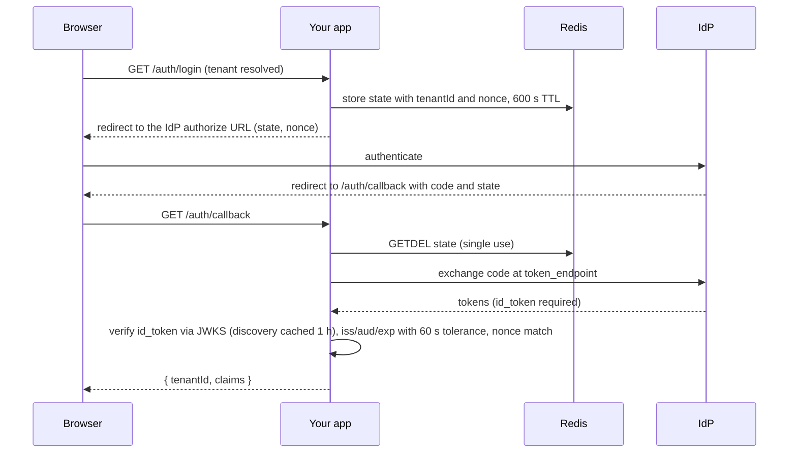

# SSO

Per-tenant OpenID Connect configuration. The package handles
discovery, JWKS-backed `id_token` verification, nonce/state binding,
and SSRF guards on the issuer URL.

## Configuration

SSO ships as its own package and carries its own migration. Install
it, then run its configure hook:

```bash
npm install @adonisjs-lasagna/sso
node ace configure @adonisjs-lasagna/sso     # publishes the tenant_sso_configs migration
npm install jose                             # optional peer, only for JWKS id_token verification
```

Once installed it is also reachable through core's configure, which
recognises the `sso` short name:

```bash
node ace configure @adonisjs-lasagna/saas-tenancy --with=sso
```

`jose` is an optional peer dependency; only required when SSO is
enabled.

## What gets verified

Every callback hits `SsoService.handleCallback()`, which:

1. Generates state with `randomBytes(16)`, single-use, 600 s TTL.
2. Generates nonce with `randomBytes(16)`, bound to state, included
   on the auth URL.
3. Verifies the token endpoint returns an `id_token`.
4. Verifies the `id_token` against the IdP's JWKS (cached 1 h via
   discovery).
5. Checks `iss`, `aud`, `exp` via `jose.jwtVerify` (60 s clock
   tolerance).
6. Confirms the `nonce` in the `id_token` payload matches the value
   bound to state.

Any mismatch throws and aborts the callback before claims surface.

## Discovery hardening

The `discover()` method:

- Verifies the discovery doc's `issuer` matches the requested issuer
  (OIDC Discovery 1.0 §4.3).
- Applies `validateExternalHttpsUrl` to the discovered
  `token_endpoint` and `jwks_uri`; defends against SSRF (loopback,
  RFC 1918, link-local, cloud metadata, IPv6 brackets).

## Storing config

Per-tenant OIDC settings live in the `tenant_sso_configs` row (the
migration stub ships with the core):

```ts
import { TenantSsoConfig } from '@adonisjs-lasagna/sso'

await TenantSsoConfig.updateOrCreate(
  { tenantId: tenant.id },
  {
    issuerUrl: 'https://login.acme.com',
    clientId: env.get('ACME_OIDC_CLIENT_ID'),
    clientSecret: env.get('ACME_OIDC_CLIENT_SECRET'),
    redirectUri: 'https://app.example.com/auth/callback',
    scopes: ['openid', 'profile', 'email'],
    enabled: true,
  }
)
```

The admin REST endpoint that wires this also runs `issuerUrl`
through the SSRF guard, and discovery re-checks the document's
`token_endpoint` / `jwks_uri` with the resolving variant, so a
mis-configured tenant cannot make the server reach a private
network.

## Login flow

The whole round trip, from login to verified claims. The tenant id rides
inside the Redis-stored state, which is why the callback route needs no
tenant header of its own.



```ts
import { SsoService } from '@adonisjs-lasagna/sso'

router
  .get('/auth/login', async ({ request, response }) => {
    const sso = await app.container.make(SsoService)
    const tenant = await request.tenant()
    const config = await sso.getConfig(tenant.id)
    if (!config) return response.notFound({ error: 'sso_not_configured' })

    // Generates + stores the single-use state (600 s TTL) and the
    // nonce bound to it, then returns the IdP authorization URL.
    const authUrl = await sso.buildAuthUrl(config)
    return response.redirect(authUrl)
  })
  .as('auth.login')

router
  .get('/auth/callback', async ({ request }) => {
    const sso = await app.container.make(SsoService)
    const { tenantId, claims } = await sso.handleCallback(
      request.input('state'),
      request.input('code')
    )
    // claims.sub, claims.email, claims.name, … — tenantId comes back
    // from the state payload, so the callback route needs no tenant
    // header of its own.
  })
  .as('auth.callback')
```


## Read next

- [Authentication](/docs/authentication); how SSO composes with tenant auth.
- [Security](/security); the replay and state guarantees.
- [Satellites](/docs/satellites/); the rest of the opt-in features.
