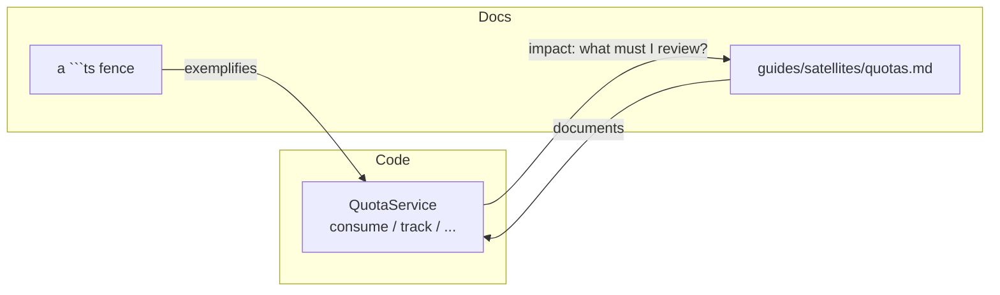

# Documentation coverage

The most dangerous page in your docs is not the one you never wrote. It is the
one that was true last release, that a reader still trusts, and that now
describes a tenant boundary that has moved.

Lasagna has a lot of hand-written documentation, and hand-written documentation
drifts. A method gains a parameter, an exception is renamed, a guard moves, and
somewhere a paragraph that used to be true quietly is not. This page explains the
system that catches that drift mechanically: a **bidirectional code-to-docs
graph**, a **gate that blocks and a report that informs**, and a **coverage
metric**, all deterministic, with no model and no network. If you learn one
thing here, learn this: **only the deterministic gate blocks; everything else
informs.** A tool that cries wolf gets muted, and a muted tool is worse than
none.

<Callout type="info" title="Two docs, two audiences">
This is the learning page. The full design contract lives in the dev-facing RFC
([<code>docs/dev/doc-coverage-rfc.md</code>](https://github.com/Arcoders/Adonisjs-lasagna-saas-tenancy/blob/master/docs/dev/doc-coverage-rfc.md)),
which is the engineering spec for the private
<code>@adonisjs-lasagna/doc-coverage</code> workspace that implements it. It is a
dev-facing design document rather than a published page, so it lives in the
repository, not on this site. This page is the "what it is and how I use it"; the
RFC is the "how it is built".
</Callout>

## The problem: the un-generatable surface

Documentation has three layers, and they do not drift the same way.

Code examples drift loudly the moment a signature changes, as long as something
compiles them. Lasagna already does that: every ` ```ts ` fence in these docs is
type-checked against the real built types, so a renamed export breaks CI, not
your copy-paste.

API reference drifts mechanically and is fixed mechanically, by generating it.
Reference that is generated cannot drift, because nobody writes it by hand.

The third layer is the one that matters here: the **hand-written narrative**. The
"why", the mental model, the security reasoning, the tempting-wrong-answer
teaching that is Lasagna's actual value. It **cannot be generated**, and that is
exactly the layer no off-the-shelf tool watches. It drifts in silence.

## The tempting wrong answer

The tempting answer is a human process: a checklist in the PR template, a "did
you update the docs?" reviewer habit, a reminder in your own head. It works right
up until the day it does not, because the one thing a large doc surface
guarantees is that you cannot hold all of it in your head. The drift is silent by
construction, so a process that depends on someone noticing is a process that
fails quietly.

The other tempting answer is to generate everything from one source, the way
Stripe and Kubernetes do. That removes drift by removing the hand-written layer.
But the hand-written layer is the product here, so deleting it is not an option.

## The design: a graph, a gate, and a report

The core object is a directed graph. Code symbols and doc fragments are both
nodes; an edge means "this page explains, references, or exemplifies this
symbol." Because the graph is bidirectional, two questions become the same
lookup from opposite ends:

- **code to docs:** "I changed `QuotaService.consume`; which pages must I review?"
- **docs to code:** "this page names a parameter that no longer exists", or "this
  public symbol has no page at all."



On top of the graph sit two tiers, and the boundary between them is the whole
point.

**Tier 1 is the gate, and only the gate blocks a merge.** Its checks are facts,
not opinions: a fence stopped compiling, a method named in linked prose no longer
exists, a public symbol of a documentable kind has no page. Facts can block.

**Tier 2 is the report, and it never blocks.** It is the impact analysis: changed
symbols mapped to the pages that explain them, prose that is missing a term the
code uses, a page that is older than the symbol it documents. Every item is a
review prompt with an action and an escape valve, surfaced in the report and
never in the gate.

<Callout type="tip" title="The one-line law">
Only the deterministic gate blocks; everything else informs. Advisory noise that
blocks merges trains people to bypass the tool, and a bypassed tool catches
nothing.
</Callout>

## The four signals, and why no AI

Detection is a compiler problem, not a language problem, so the engine is fully
deterministic: the TypeScript compiler, git, and the AST. That choice is not a
compromise, it is the stronger design. It costs nothing, needs no API key, never
hallucinates, and runs in any fork. An LLM would only help *rewrite* prose, which
is dangerous for a security-critical tone, so it is deliberately out of scope.

- **D1, fences as edges (gate).** Every fence importing a public symbol is a
  documentation edge. Change the signature, break the fence, fail CI.
- **D2, JSDoc and prose alignment.** The hard half is a gate: prose that calls
  `Symbol.method()` where the method no longer exists fails. The soft half is
  advisory: a token-set diff between the symbol's vocabulary and the linked
  prose, reporting the **exact missing words, never a percentage**.
- **D3, freshness (advisory).** A page is flagged only when the symbol's
  **contract** changed since the page was last edited, where the contract is the
  signature plus the thrown exceptions, never the comments. A body-only change is
  suppressed, so this is far quieter than a raw "the file is newer" check.
- **D4, reachability (advisory).** A changed symbol's new one-hop static reach
  over the public boundary, so a security note can be re-checked when the path it
  describes changes.

<Callout type="warning" title="An honest limit, stated up front">
The static call graph cannot see services resolved through
<code>container.make</code> (dependency injection), so those edges rely on a
declared anchor rather than on D4. The tool is honest about what it cannot see
rather than guessing.
</Callout>

## How you use it

Run the doctor locally before you push:

```bash
npm run docs:doctor   # a root npm script that runs the private @adonisjs-lasagna/doc-coverage workspace
```

You get the Tier-1 gate result, the Tier-2 review items, and the coverage line.
This is a root npm script, not an `ace` command: the `docs:doctor` name only
echoes `tenant:doctor` and `billing:doctor`, but the tool is a standalone CLI in
the private dev-only workspace, run through `tsx`. Flags pass through after the
npm `--` separator, for example `npm run docs:doctor -- --since origin/master...HEAD`.
On a pull request the same run is published in CI; see [What happens in CI](#what-happens-in-ci)
below.

### Debug an edge with `--explain`

When a finding is surprising, ask the graph why an edge exists. `--explain`
prints a symbol's node and every doc that links to it, with the provenance and
the source location of each link:

```bash
npm run docs:doctor -- --explain QuotaService
```

```
@adonisjs-lasagna/saas-tenancy/services#QuotaService
  kind:     service
  source:   packages/core/src/services/quota_service.ts:24
  contract: 9f2a1c7b4e0d6a83
  members:  consume, reserve, settle, release
  throws:   QuotaExceededError
  documented by 2 edge(s):
  declared:manual documents    <- docs/guides/satellites/quotas.md  (docs/guides/satellites/quotas.md:1)
  derived:auto    exemplifies  <- docs/architecture.md  (docs/architecture.md:341)
```

The provenance column is the whole point: `declared:manual` is the front-matter
or `<!-- doc:ref -->` link the gate trusts, `derived:auto` is a fence the tool
inferred. The reverse lookup, `--why docs/architecture.md#cost-governor`, starts
from a page and lists the symbols it links to, so you can answer "why is this
page tied to this symbol?" from either end.

**Declare an edge** when you want the strongest, gate-trusted link between a page
and a symbol. Any one of these works:

- front-matter on the page:

```md
---
title: Quotas
code:
  - "@adonisjs-lasagna/saas-tenancy/services#QuotaService"
---
```

- a JSDoc tag on the symbol: `@doc docs/guides/satellites/quotas.md#middleware`
- an inline marker in the prose: `<!-- doc:ref @adonisjs-lasagna/saas-tenancy/services#QuotaService -->`

**Suppress a false positive** with a reason, the same auditable pattern as the
existing `<!-- compile: skip -->` directive:

```md
<!-- doc:freshness-ignore reason="internal refactor, no user-facing change" -->
```

**Read the coverage** as three buckets, not one number:

```
Coverage: explained 39%, exemplified-only 28%, uncovered 33%
```

*Explained* means a symbol has real prose or a substantial JSDoc description.
*Exemplified-only* means it appears in a code sample but is never explained in
words. *Uncovered* means neither. The split is deliberate: a fence is not an
explanation, and counting it as one would let checkbox docs hide a real gap.

## What happens in CI

The same engine runs on every pull request, and it honours the one-line law: the
deterministic gate blocks, the report informs.

**One check blocks today: the API-report golden diff.** Each opted-in package
commits an `etc/<pkg>.api.md` snapshot of its public surface. CI regenerates that
snapshot and fails if a public-API change did not update the committed file, so a
renamed export or a changed signature cannot merge without the reference moving
with it. The fix is a single command, printed in the failure message, so keeping
the snapshot current is never manual editing. It is per-package opt-in: a package
without an api-extractor config is skipped, not failed.

**The `docs:doctor` run is advisory today, and posts a job summary.** It runs with
conservative day-one defaults, dead-member is a warning and the coverage floor is
zero, so it never blocks a merge yet. It publishes the Tier-1 gate result, the
Tier-2 review items, and the coverage line to the CI job summary, where you read
them on the run. On a pull request from a branch in this repository it also
upserts a single marked comment on the PR, so the report sits with the diff and a
re-run edits that comment in place rather than stacking a new one. A pull request
from a fork keeps the job-summary form, because a fork's token is read-only by
design and the comment step is deliberately scoped to same-repository branches.
It is promoted toward blocking the same way the repository's coverage floors are:
per-check severity is raised and a baseline is captured, so existing debt does not
block while new drift does.

**A separate matrix job proves the engine is cross-OS deterministic.** The tool's
own test suite runs on Linux and Windows, because the contract hash is
path-free and every document is normalized to LF on read, so the graph and the
hashes come out byte-identical regardless of the runner's filesystem.

The whole run needs no network and no secret, which is the practical payoff of the
zero-LLM design: the gate runs the same on a fork as it does on the main
repository.

## Honest limits

- It detects drift, not writing quality. "This paragraph is confusing" is a human
  judgement the deterministic engine has no opinion on.
- It does not write the missing section. A new uncovered symbol lowers coverage
  and is flagged, but what to write is your work.
- The soft signals need JSDoc to fire, and that is fine: coverage is the backstop,
  so a symbol with no JSDoc and no page still surfaces as uncovered.
- Freshness is a prompt, not a proof. You can reset the clock by touching a file,
  and the report says so.

## Read next

- [Architecture](/architecture); the same teaching style applied to the isolation core.
- [Testing](/guides/testing); the other half of keeping Lasagna honest.
- [Contributing](/reference/contributing); how the gates fit the contribution flow.
