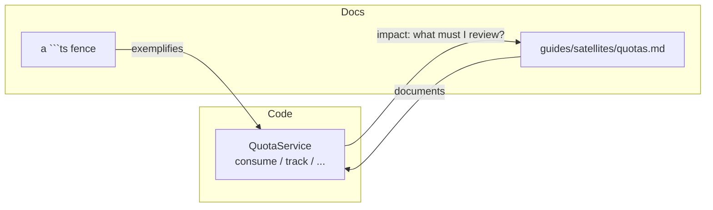

# Documentation coverage

Lasagna has a lot of hand-written documentation, and hand-written documentation
drifts. A method gains a parameter, an exception is renamed, a guard moves, and
somewhere a paragraph that used to be true quietly is not. This page explains the
system that catches that drift mechanically: a **bidirectional code-to-docs
graph**, a **gate that blocks and a report that informs**, and a **coverage
metric**, all deterministic, with no model and no network. If you learn one
thing here, learn this: **only the deterministic gate blocks; everything else
informs.** A tool that cries wolf gets muted, and a muted tool is worse than
none.

<Callout type="info" title="Two docs, two audiences">
This is the learning page. The full design contract lives in the dev-facing RFC
(<code>docs/dev/doc-coverage-rfc.md</code> in the repo), which is the engineering
spec for the <code>packages/doc-coverage</code> tool. This page is the "what it is
and how I use it"; the RFC is the "how it is built".
</Callout>

## The problem: the un-generatable surface

Documentation has three layers, and they do not drift the same way.

Code examples drift loudly the moment a signature changes, as long as something
compiles them. Lasagna already does that: every ` ```ts ` fence in these docs is
type-checked against the real built types, so a renamed export breaks CI, not
your copy-paste.

API reference drifts mechanically and is fixed mechanically, by generating it.
Reference that is generated cannot drift, because nobody writes it by hand.

The third layer is the one that matters here: the **hand-written narrative**. The
"why", the mental model, the security reasoning, the tempting-wrong-answer
teaching that is Lasagna's actual value. It **cannot be generated**, and that is
exactly the layer no off-the-shelf tool watches. It drifts in silence.

## The tempting wrong answer

The tempting answer is a human process: a checklist in the PR template, a "did
you update the docs?" reviewer habit, a reminder in your own head. It works right
up until the day it does not, because the one thing a large doc surface
guarantees is that you cannot hold all of it in your head. The drift is silent by
construction, so a process that depends on someone noticing is a process that
fails quietly.

The other tempting answer is to generate everything from one source, the way
Stripe and Kubernetes do. That removes drift by removing the hand-written layer.
But the hand-written layer is the product here, so deleting it is not an option.

## The design: a graph, a gate, and a report

The core object is a directed graph. Code symbols and doc fragments are both
nodes; an edge means "this page explains, references, or exemplifies this
symbol." Because the graph is bidirectional, two questions become the same
lookup from opposite ends:

- **code to docs:** "I changed `QuotaService.consume`; which pages must I review?"
- **docs to code:** "this page names a parameter that no longer exists", or "this
  public symbol has no page at all."



On top of the graph sit two tiers, and the boundary between them is the whole
point.

**Tier 1 is the gate, and only the gate blocks a merge.** Its checks are facts,
not opinions: a fence stopped compiling, a method named in linked prose no longer
exists, a public symbol of a documentable kind has no page. Facts can block.

**Tier 2 is the report, and it never blocks.** It is the impact analysis: changed
symbols mapped to the pages that explain them, prose that is missing a term the
code uses, a page that is older than the symbol it documents. Every item is a
review prompt with an action and an escape valve, posted as a PR comment.

<Callout type="tip" title="The one-line law">
Only the deterministic gate blocks; everything else informs. Advisory noise that
blocks merges trains people to bypass the tool, and a bypassed tool catches
nothing.
</Callout>

## The four signals, and why no AI

Detection is a compiler problem, not a language problem, so the engine is fully
deterministic: the TypeScript compiler, git, and the AST. That choice is not a
compromise, it is the stronger design. It costs nothing, needs no API key, never
hallucinates, and runs in any fork. An LLM would only help *rewrite* prose, which
is dangerous for a security-critical tone, so it is deliberately out of scope.

- **D1, fences as edges (gate).** Every fence importing a public symbol is a
  documentation edge. Change the signature, break the fence, fail CI.
- **D2, JSDoc and prose alignment.** The hard half is a gate: prose that calls
  `Symbol.method()` where the method no longer exists fails. The soft half is
  advisory: a token-set diff between the symbol's vocabulary and the linked
  prose, reporting the **exact missing words, never a percentage**.
- **D3, freshness (advisory).** A page is flagged only when the symbol's
  **contract** changed since the page was last edited, where the contract is the
  signature plus the thrown exceptions, never the comments. A body-only change is
  suppressed, so this is far quieter than a raw "the file is newer" check.
- **D4, reachability (advisory).** A changed symbol's new one-hop static reach
  over the public boundary, so a security note can be re-checked when the path it
  describes changes.

<Callout type="warning" title="An honest limit, stated up front">
The static call graph cannot see services resolved through
<code>container.make</code> (dependency injection), so those edges rely on a
declared anchor rather than on D4. The tool is honest about what it cannot see
rather than guessing.
</Callout>

## How you use it

Run the doctor locally before you push:

```bash
npm run docs:doctor
```

You get the Tier-1 gate result, the Tier-2 review items, and the coverage line.
On a pull request the same report is posted as a comment.

**Declare an edge** when you want the strongest, gate-trusted link between a page
and a symbol. Any one of these works:

- front-matter on the page:

```md
---
title: Quotas
code:
  - "@adonisjs-lasagna/saas-tenancy/services#QuotaService"
---
```

- a JSDoc tag on the symbol: `@doc docs/guides/satellites/quotas.md#middleware`
- an inline marker in the prose: `<!-- doc:ref @adonisjs-lasagna/saas-tenancy/services#QuotaService -->`

**Suppress a false positive** with a reason, the same auditable pattern as the
existing `<!-- compile: skip -->` directive:

```md
<!-- doc:freshness-ignore reason="internal refactor, no user-facing change" -->
```

**Read the coverage** as three buckets, not one number:

```
Coverage: explained 39%, exemplified-only 28%, uncovered 33%
```

*Explained* means a symbol has real prose or a substantial JSDoc description.
*Exemplified-only* means it appears in a code sample but is never explained in
words. *Uncovered* means neither. The split is deliberate: a fence is not an
explanation, and counting it as one would let checkbox docs hide a real gap.

## Honest limits

- It detects drift, not writing quality. "This paragraph is confusing" is a human
  judgement the deterministic engine has no opinion on.
- It does not write the missing section. A new uncovered symbol lowers coverage
  and is flagged, but what to write is your work.
- The soft signals need JSDoc to fire, and that is fine: coverage is the backstop,
  so a symbol with no JSDoc and no page still surfaces as uncovered.
- Freshness is a prompt, not a proof. You can reset the clock by touching a file,
  and the report says so.

## Read next

- [Architecture](/architecture); the same teaching style applied to the isolation core.
- [Testing](/guides/testing); the other half of keeping Lasagna honest.
- [Contributing](/reference/contributing); how the gates fit the contribution flow.
