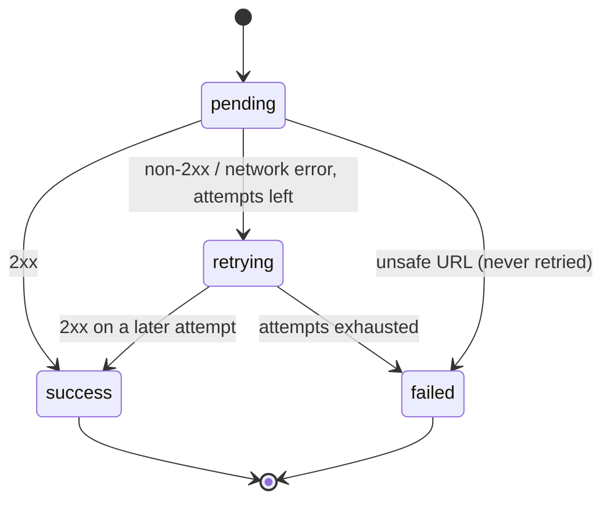

# Webhooks

Outbound webhooks for tenant events, with HMAC-SHA256 signatures,
explicit delivery state machine, and exponential-backoff retries.

## Configuration

```bash
node ace configure @adonisjs-lasagna/saas-tenancy --with=webhooks
```

## Subscribing

```ts
import { WebhookService } from '@adonisjs-lasagna/saas-tenancy/services'

const webhooks = await app.container.make(WebhookService)

const { hook, generatedSecret } = await webhooks.registerWebhook(
  tenant.id,
  'https://acme.com/hooks/lasagna',
  ['tenant.activated', 'subscription.upgraded']
  // 4th argument: the signing secret. Generated when omitted and
  // encrypted at rest with APP_KEY (AES-256-GCM).
)

// `generatedSecret` is set only when the service generated it, and this
// is the ONLY time the plaintext is available — hand it to the
// subscriber now; it cannot be read back later.
```

The URL is validated against the SSRF guard at registration AND again
at delivery time: loopback, private ranges, cloud-metadata IPs, and
every numeric encoding of them are refused.

::: warning Stored secrets are read fail-closed and domain-separated
`registerWebhook()` encrypts the signing secret for you, under the webhook
secret class. Delivery reads it back with a strict, per-class decrypt, so a
plaintext, corrupted, wrong-key, or wrong-class value marks the delivery failed
(no retry) instead of signing with raw bytes. Do not write
`tenant_webhooks.secret` directly with a raw value or a default-context
`encrypt()` call: a value that is not ciphertext for the webhook secret class
fails closed at delivery. Let `registerWebhook()` write it.

Upgrading? Run `node ace tenant:secrets:reencrypt` **before** deploying. This is
the full, idempotent migration: it re-encrypts every stored webhook and SSO
secret under its per-class context, covering both plaintext-era values and
values already encrypted under the older shared context. It is mandatory for
every host that stores webhook or SSO secrets, not only those that once stored
plaintext, because a legacy shared-context value now also fails closed until it
is migrated. Set `OLD_APP_KEY` if you are also rotating the key. The narrower
`tenant:webhooks:encrypt-secrets` only encrypts plaintext rows and is superseded
by `tenant:secrets:reencrypt`.
:::

## Sending

```ts
await webhooks.dispatch(tenant.id, 'subscription.upgraded', {
  fromPlan: 'starter',
  toPlan: 'pro',
})
```

The dispatch enqueues a job that POSTs the payload with:

- `content-type: application/json`
- `x-webhook-signature: <hex>` is HMAC-SHA256 over the raw body using
  the per-subscription secret. Plain hex digest, no `sha256=` prefix.
- `x-webhook-event: <event>`
- `x-delivery-id: <uuid>`

## Verifying on the receiver

The package exports a constant-time helper. Use this rather than
rolling your own; naive `===` comparisons leak timing, and
re-serializing the body before hashing produces a different digest:

```ts
import { verifyWebhookSignature } from '@adonisjs-lasagna/saas-tenancy/services'

router.post('/webhooks/inbound', async ({ request, response }) => {
  const rawBody = request.raw() ?? ''
  const signature = request.header('x-webhook-signature')
  if (!verifyWebhookSignature(rawBody, signature, RECEIVER_SECRET)) {
    return response.unauthorized({ error: 'bad signature' })
  }
  // ... handle the event
})
```

Pass the EXACT bytes your framework received, not a re-serialized
object. Re-stringifying through `JSON.parse` + `JSON.stringify`
changes the digest.

To defeat replay, log `x-delivery-id` on the receiver and reject
duplicates within a small TTL window.

## Delivery state machine



A delivery is `pending` until its first send, `retrying` while
attempts remain (with `next_retry_at` set), and ends as `success` or
`failed`. These four states are the exported `DeliveryStatus` type
(`'pending' | 'success' | 'failed' | 'retrying'`, from
`@adonisjs-lasagna/saas-tenancy/models/satellites`). Retries follow a
5-attempt schedule with `±20%` jitter:

| Attempt | Base delay |
|---|---|
| 1 → 2 | 10 s |
| 2 → 3 | 1 m |
| 3 → 4 | 5 m |
| 4 → 5 | 30 m |
| 5 → 6 | 2 h |

After the 5th attempt, the delivery transitions to `failed` and is
no longer retried by `processRetries()`. Failed deliveries are
surfaced via the admin REST API for inspection or manual replay.

## Cron

```bash
* * * * * node ace tenant:webhooks:retry
```

Picks up `retrying` deliveries whose `next_retry_at` has elapsed.
Idempotent.

## Admin REST

```http
GET    /admin/multitenancy/tenants/{id}/webhooks
POST   /admin/multitenancy/tenants/{id}/webhooks
PUT    /admin/multitenancy/tenants/{id}/webhooks/{webhookId}
DELETE /admin/multitenancy/tenants/{id}/webhooks/{webhookId}
GET    /admin/multitenancy/tenants/{id}/webhooks/{webhookId}/deliveries
POST   /admin/multitenancy/tenants/{id}/webhooks/deliveries/{deliveryId}/retry
```

The `retry` route is the manual-replay action referenced above: it re-validates
the stored URL against the SSRF guard and re-sends the delivery immediately,
returning the updated row. Use it for a one-off replay; the
`tenant:webhooks:retry` cron handles the automatic backoff schedule.

## Extensibility: payload transformers

Register a `WebhookPayloadTransformer` on `WebhookTransformerRegistry` (a
container singleton) to rewrite a payload before it is signed and delivered. The
transform runs **once, in `dispatch()`, before the delivery row is persisted**,
so the stored payload is exactly what gets signed and what retries re-send. It
must return a plain JSON object; a transformer that throws records a failed,
no-retry delivery and never sends an untransformed payload. With none registered,
behavior and signatures are unchanged. Versioned via `WEBHOOKS_CONTRACT_VERSION`;
see the [Extensibility standard](/guides/extensibility).

## Read next

- [Lifecycle events](/reference/events); the events that drive deliveries.
- [Admin REST API](/guides/satellites/admin-rest-api); managing subscriptions over HTTP.
- [Production checklist](/reference/production-checklist); the hardening runbook before you ship.
- [Satellites](/guides/satellites/); the rest of the opt-in features.
