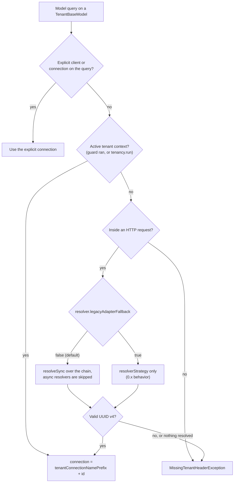

# Tenant identification

<Callout type="tip" title="One mental model">
Extract a UUID from the request, look it up via your tenant
repository, route the connection to the corresponding schema.
Resolvers only differ in <em>where</em> they extract the UUID from.
</Callout>

## Strategies

Configure via `resolverStrategy` in `config/multitenancy.ts`:

| Strategy                | How it works                                            | Best for              |
| ----------------------- | ------------------------------------------------------- | --------------------- |
| `header` (default)      | Reads `x-tenant-id` from request headers                | Internal APIs, mobile |
| `subdomain`             | Extracts UUID from `<uuid>.yourdomain.com`              | SaaS web apps         |
| `path`                  | Reads the first path segment `/<uuid>/...`              | API versioning, embeds|
| `request-data`          | Reads from query string or body                         | Webhook receivers     |
| `domain-or-subdomain`   | Custom domain wins, falls back to subdomain             | Mixed deployments     |

## Header

The default. Read from the configurable `tenantHeaderKey` (defaults
to `x-tenant-id`).

```ts
// config/multitenancy.ts
export default defineConfig({
  resolverStrategy: 'header',
  tenantHeaderKey: 'x-tenant-id',
})
```

Reach for this when the caller is a client you control: a mobile app, an internal
service, a gateway that injects the header. Avoid it as the sole strategy for raw
browser traffic, where the user can set `x-tenant-id` themselves; use `subdomain`
or an authenticated chain there.

## Subdomain

Extracts the leading subdomain from the `Host` header and treats it
as the tenant identifier. Set `baseDomain`:

```ts
export default defineConfig({
  resolverStrategy: 'subdomain',
  baseDomain: env.get('APP_DOMAIN'),
})
```

Best for customer-facing SaaS where every tenant gets `acme.yourapp.com`. It
needs wildcard DNS and TLS, and it can't express a tenant's own vanity domain on
its own, so if customers bring their own domains reach for `domain-or-subdomain`
instead. For wildcard TLS, see [Deployment](/guides/deployment#wildcard-subdomains).

## Path

First URL segment. `/abc-123/posts` resolves to tenant `abc-123`.

```ts
export default defineConfig({
  resolverStrategy: 'path',
})
```

Handy for embeds and cross-origin clients where a subdomain won't work. Skip it
when your URLs already open with a meaningful segment (an API version prefix, a
locale) that would collide with the tenant id.

## Request data

Reads from query string or request body. Both default to the key
`tenant_id`; override per source if needed.

```ts
export default defineConfig({
  resolverStrategy: 'request-data',
  requestData: {
    queryKey: 'tenant_id',  // ?tenant_id=<uuid>
    bodyKey: 'tenant_id',   // { "tenant_id": "<uuid>" } in JSON / form / multipart
  },
})
```

<Callout type="warning" title="Trust boundary">
This strategy lets the <em>caller</em> declare which tenant to operate
against. Only use it on routes where the caller is already
authenticated by another mechanism (HMAC for webhook receivers, signed
URLs, server-to-server tokens). Never use <code>request-data</code> as
the only strategy for end-user traffic; an attacker who can shape any
request body field named <code>tenant_id</code> would hop tenants. For
mixed traffic, prefer <code>resolverChain: ['header', 'subdomain']</code>
and reserve <code>request-data</code> for explicit webhook routes.
</Callout>

## Domain or subdomain

Custom domains win, falling back to subdomain. Pair with
`CustomDomainMiddleware` for mapping `acme.com` → tenant UUID.

## `request.tenant()`

The macro added to the AdonisJS request object. Memoized per request:

```ts
async show({ request }: HttpContext) {
  const tenant = await request.tenant()
}
```

Always call this helper rather than reading the header directly. The
strategy can be any of the five, and bypassing the helper introduces
subtle bugs.

The macro is fail-closed on lifecycle: a soft-deleted or suspended tenant
throws a 403 (`E_TENANT_SUSPENDED`) before any tenant connection is opened,
even on routes that never ran the guard middleware; forgetting the guard on a
route group cannot serve a suspended tenant. The guard still adds the richer
checks (provisioning/failed, maintenance with bypass, circuit breaker). An
admin or recovery flow that legitimately needs an inactive tenant opts in
explicitly:

```ts
const tenant = await request.tenant({ allowInactive: true })
```

## Custom resolvers

Implement the `TenantResolver` contract and register it in your
provider:

```ts
import { TenantResolver, TenantResolverRegistry } from '@adonisjs-lasagna/saas-tenancy/services'

class GeoIpResolver implements TenantResolver {
  resolve(ctx) {
    const country = ctx.request.header('cf-ipcountry')
    return country?.toLowerCase() ?? null
  }
}

// In your app provider
const registry = await this.app.container.make(TenantResolverRegistry)
registry.register('geoip', new GeoIpResolver())
```

## Chained resolvers

Set `resolverChain` to try multiple strategies in order; first one to
return a non-null tenant id wins:

```ts
export default defineConfig({
  resolverChain: ['header', 'subdomain', 'request-data'],
})
```

Useful when the same app serves both human web traffic and machine
APIs.

## Resolvers and model-query routing

`request.tenant()` always runs the full resolver chain (it can await, so a
custom or domain-based resolver works). But `TenantAdapter` (the layer that
picks the schema connection for a raw model query) runs synchronously, so it
needs a synchronous id. When a query happens inside an active tenant context
(after the guard's `request.tenant()` ran, or inside `tenancy.run()`), the
adapter uses that context's id and everything is consistent.

When a model query runs with **no** active context, the adapter falls back to
resolving the id from the request, and `config.resolver.legacyAdapterFallback`
controls how:

```ts
export default defineConfig({
  resolverChain: ['my-jwt-resolver', 'header'],
  resolver: {
    // false (default): the adapter consults the resolver chain synchronously,
    //   so a custom resolver routes model queries too.
    // true: restores the 0.x behavior — the adapter uses only `resolverStrategy`
    //   on this fallback; custom chain resolvers are not consulted there.
    legacyAdapterFallback: false,
  },
})
```

The diagram below traces the full branch order the adapter follows for a model
query, including the escape hatches that bypass resolution entirely. An id taken
from the active context routes straight to a connection; an id recovered from the
request fallback is validated as a UUID v4 first.



<Callout type="tip" title="When this matters">
If you rely on a <em>custom</em> resolver (or a chain) and you query tenant
models outside the request guard, the default already routes those fallback
queries through the same chain as <code>request.tenant()</code>. Set
<code>legacyAdapterFallback: true</code> only to restore the 0.x behavior, where
those fallback queries used only <code>resolverStrategy</code>. A domain-based
resolver still needs an async repository lookup, so route those flows through
<code>request.tenant()</code> first.
</Callout>

## Read next

- [Routing](/guides/routing). The `tenant()`, `central()`, and
  `universal()` route-group macros and custom-domain mapping.
- [Bootstrappers](/guides/bootstrappers/); what happens once the
  tenant is identified.
